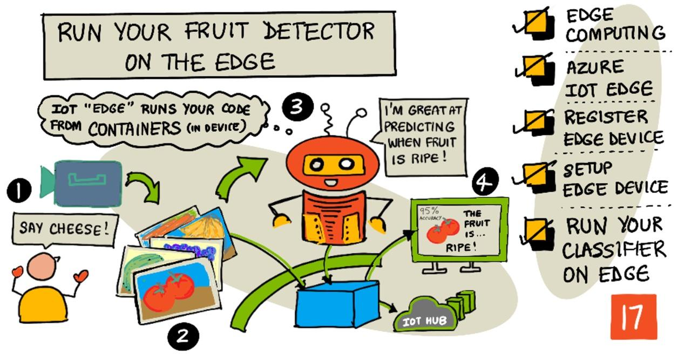

<!--
CO_OP_TRANSLATOR_METADATA:
{
  "original_hash": "2625af24587465c5547ae33d6cc000a5",
  "translation_date": "2025-08-28T15:57:19+00:00",
  "source_file": "4-manufacturing/lessons/3-run-fruit-detector-edge/README.md",
  "language_code": "uk"
}
-->
# Запустіть свій детектор фруктів на пристрої Edge



> Скетчнот від [Nitya Narasimhan](https://github.com/nitya). Натисніть на зображення, щоб переглянути його у більшому розмірі.

Це відео дає огляд запуску класифікаторів зображень на IoT-пристроях, що є темою цього уроку.

[](https://www.youtube.com/watch?v=_K5fqGLO8us)

## Тест перед лекцією

[Тест перед лекцією](https://black-meadow-040d15503.1.azurestaticapps.net/quiz/33)

## Вступ

У попередньому уроці ви використовували свій класифікатор зображень для визначення стиглих і нестиглих фруктів, надсилаючи зображення, зроблене камерою вашого IoT-пристрою, через інтернет до хмарного сервісу. Такі виклики займають час, коштують грошей і, залежно від типу даних зображення, можуть мати наслідки для конфіденційності.

У цьому уроці ви дізнаєтеся, як запускати моделі машинного навчання (ML) на пристроях Edge — IoT-пристроях, що працюють у вашій локальній мережі, а не в хмарі. Ви дізнаєтеся про переваги та недоліки обчислень на пристроях Edge у порівнянні з хмарними обчисленнями, як розгортати вашу AI-модель на пристрої Edge і як отримувати до неї доступ із вашого IoT-пристрою.

У цьому уроці ми розглянемо:

* [Обчислення на пристроях Edge](../../../../../4-manufacturing/lessons/3-run-fruit-detector-edge)
* [Azure IoT Edge](../../../../../4-manufacturing/lessons/3-run-fruit-detector-edge)
* [Реєстрація пристрою IoT Edge](../../../../../4-manufacturing/lessons/3-run-fruit-detector-edge)
* [Налаштування пристрою IoT Edge](../../../../../4-manufacturing/lessons/3-run-fruit-detector-edge)
* [Експорт вашої моделі](../../../../../4-manufacturing/lessons/3-run-fruit-detector-edge)
* [Підготовка контейнера для розгортання](../../../../../4-manufacturing/lessons/3-run-fruit-detector-edge)
* [Розгортання контейнера](../../../../../4-manufacturing/lessons/3-run-fruit-detector-edge)
* [Використання вашого пристрою IoT Edge](../../../../../4-manufacturing/lessons/3-run-fruit-detector-edge)

## Обчислення на пристроях Edge

Обчислення на пристроях Edge передбачає обробку даних IoT якомога ближче до місця їх створення. Замість того, щоб виконувати цю обробку в хмарі, вона переноситься на край хмари — вашу внутрішню мережу.


У попередніх уроках ваші пристрої збирали дані та надсилали їх у хмару для аналізу, виконуючи безсерверні функції або AI-моделі в хмарі.


Обчислення на пристроях Edge передбачає перенесення деяких хмарних сервісів із хмари на комп’ютери, що працюють у тій самій мережі, що й IoT-пристрої, і лише за потреби спілкуються з хмарою. Наприклад, ви можете запускати AI-моделі на пристроях Edge для аналізу стиглості фруктів і надсилати в хмару лише аналітичні дані, такі як кількість стиглих і нестиглих фруктів.

✅ Подумайте про IoT-додатки, які ви створили до цього. Які їхні частини можна було б перенести на пристрої Edge?

### Переваги

Переваги обчислень на пристроях Edge:

1. **Швидкість** — обчислення на пристроях Edge ідеально підходять для обробки даних, чутливих до часу, оскільки дії виконуються в тій самій мережі, що й пристрій, а не через інтернет. Це забезпечує вищу швидкість, оскільки внутрішні мережі можуть працювати значно швидше, ніж інтернет-з’єднання, а дані долають значно меншу відстань.

    > 💁 Незважаючи на те, що для інтернет-з’єднань використовуються оптичні кабелі, які дозволяють даним подорожувати зі швидкістю світла, передача даних по всьому світу до хмарних провайдерів може займати час. Наприклад, якщо ви надсилаєте дані з Європи до хмарних сервісів у США, це займає щонайменше 28 мс, щоб дані перетнули Атлантику через оптичний кабель, не враховуючи часу на передачу даних до кабелю, перетворення електричних сигналів у світлові та назад, а також передачу даних до хмарного провайдера.

    Обчислення на пристроях Edge також зменшує мережевий трафік, знижуючи ризик уповільнення даних через перевантаження обмеженої пропускної здатності інтернет-з’єднання.

1. **Доступність у віддалених місцях** — обчислення на пристроях Edge працюють, коли у вас обмежене або відсутнє з’єднання, або коли з’єднання занадто дороге для постійного використання. Наприклад, у гуманітарних зонах лиха, де інфраструктура обмежена, або в країнах, що розвиваються.

1. **Зниження витрат** — збір, зберігання, аналіз даних і виконання дій на пристрої Edge зменшує використання хмарних сервісів, що може знизити загальну вартість вашого IoT-додатка. Останнім часом з’явилося багато пристроїв, розроблених для обчислень на пристроях Edge, таких як AI-акселератори, наприклад [Jetson Nano від NVIDIA](https://developer.nvidia.com/embedded/jetson-nano-developer-kit), які можуть виконувати AI-навантаження за допомогою апаратного забезпечення на основі GPU на пристроях вартістю менше 100 доларів США.

1. **Конфіденційність і безпека** — з обчисленнями на пристроях Edge дані залишаються у вашій мережі та не завантажуються в хмару. Це часто є кращим варіантом для чутливої та персонально ідентифікованої інформації, особливо тому, що дані не потрібно зберігати після аналізу, що значно знижує ризик витоку даних. Приклади включають медичні дані та записи з камер спостереження.

1. **Робота з небезпечними пристроями** — якщо у вас є пристрої з відомими вразливостями безпеки, які ви не хочете підключати безпосередньо до вашої мережі або інтернету, ви можете підключити їх до окремої мережі через шлюзовий пристрій IoT Edge. Цей пристрій Edge може також мати з’єднання з вашою ширшою мережею або інтернетом і керувати потоками даних.

1. **Підтримка несумісних пристроїв** — якщо у вас є пристрої, які не можуть підключатися до IoT Hub, наприклад, пристрої, які можуть підключатися лише через HTTP-з’єднання або мають лише Bluetooth, ви можете використовувати пристрій IoT Edge як шлюзовий пристрій, який пересилає повідомлення до IoT Hub.

✅ Проведіть дослідження: Які ще переваги можуть бути у обчислень на пристроях Edge?

### Недоліки

Недоліки обчислень на пристроях Edge, коли хмара може бути кращим варіантом:

1. **Масштабованість і гнучкість** — хмарні обчислення можуть адаптуватися до потреб мережі та даних у реальному часі, додаючи або зменшуючи кількість серверів та інших ресурсів. Щоб додати більше пристроїв Edge, потрібно вручну додавати нові пристрої.

1. **Надійність і стійкість** — хмарні обчислення забезпечують кілька серверів, часто в різних місцях, для резервування та відновлення після аварій. Щоб забезпечити такий самий рівень резервування на пристроях Edge, потрібні великі інвестиції та багато роботи з налаштування.

1. **Обслуговування** — постачальники хмарних сервісів забезпечують обслуговування системи та оновлення.

✅ Проведіть дослідження: Які ще недоліки можуть бути у обчислень на пристроях Edge?

Недоліки насправді є протилежністю переваг використання хмари — вам доведеться самостійно створювати та керувати цими пристроями, а не покладатися на експертизу та масштаб хмарних провайдерів.

Деякі ризики зменшуються завдяки самій природі обчислень на пристроях Edge. Наприклад, якщо у вас є пристрій Edge, що працює на заводі та збирає дані з обладнання, вам не потрібно думати про деякі сценарії відновлення після аварій. Якщо на заводі вимкнеться електроенергія, вам не потрібен резервний пристрій Edge, оскільки машини, які генерують дані, також залишаться без живлення.

Для IoT-систем часто потрібна комбінація хмарних і Edge-обчислень, використовуючи кожен сервіс залежно від потреб системи, її клієнтів і обслуговуючого персоналу.

## Azure IoT Edge


Azure IoT Edge — це сервіс, який допомагає перенести робочі навантаження з хмари на пристрої Edge. Ви налаштовуєте пристрій як пристрій Edge, і з хмари можете розгортати код на цьому пристрої Edge. Це дозволяє поєднувати можливості хмари та пристроїв Edge.

> 🎓 *Робочі навантаження* — це термін для будь-якого сервісу, який виконує певну роботу, наприклад, AI-моделі, додатки або безсерверні функції.

Наприклад, ви можете навчити класифікатор зображень у хмарі, а потім розгорнути його на пристрої Edge. Ваш IoT-пристрій надсилатиме зображення на пристрій Edge для класифікації, а не через інтернет. Якщо вам потрібно розгорнути нову ітерацію моделі, ви можете навчити її в хмарі та використати IoT Edge для оновлення моделі на пристрої Edge.

> 🎓 Програмне забезпечення, яке розгортається на IoT Edge, називається *модулями*. За замовчуванням IoT Edge запускає модулі, які взаємодіють із IoT Hub, такі як модулі `edgeAgent` і `edgeHub`. Коли ви розгортаєте класифікатор зображень, він розгортається як додатковий модуль.

IoT Edge вбудований у IoT Hub, тому ви можете керувати пристроями Edge за допомогою того самого сервісу, який використовується для керування IoT-пристроями, із таким самим рівнем безпеки.

IoT Edge запускає код із *контейнерів* — автономних додатків, які працюють ізольовано від решти додатків на вашому комп’ютері. Коли ви запускаєте контейнер, він діє як окремий комп’ютер, що працює всередині вашого комп’ютера, зі своїм власним програмним забезпеченням, сервісами та додатками. Зазвичай контейнери не можуть отримати доступ до чогось на вашому комп’ютері, якщо ви не вирішите поділитися, наприклад, папкою. Контейнер потім відкриває сервіси через відкритий порт, до якого ви можете підключитися або зробити доступним для вашої мережі.


Наприклад, ви можете мати контейнер із веб-сайтом, що працює на порту 80, стандартному порту HTTP, і потім зробити його доступним із вашого комп’ютера також на порту 80.

✅ Проведіть дослідження: Ознайомтеся з контейнерами та сервісами, такими як Docker або Moby.

Ви можете використовувати Custom Vision для завантаження класифікаторів зображень і розгортання їх як контейнерів, які працюють безпосередньо на пристрої або розгортаються через IoT Edge. Після запуску в контейнері вони можуть бути доступні через той самий REST API, що й хмарна версія, але з кінцевою точкою, яка вказує на пристрій Edge, що запускає контейнер.

## Реєстрація пристрою IoT Edge

Щоб використовувати пристрій IoT Edge, його потрібно зареєструвати в IoT Hub.

### Завдання — реєстрація пристрою IoT Edge

1. Створіть IoT Hub у групі ресурсів `fruit-quality-detector`. Дайте йому унікальну назву на основі `fruit-quality-detector`.

1. Зареєструйте пристрій IoT Edge під назвою `fruit-quality-detector-edge` у вашому IoT Hub. Команда для цього схожа на ту, що використовується для реєстрації звичайного пристрою, але з прапором `--edge-enabled`.

    ```sh
    az iot hub device-identity create --edge-enabled \
                                      --device-id fruit-quality-detector-edge \
                                      --hub-name <hub_name>
    ```

    Замініть `<hub_name>` на назву вашого IoT Hub.

1. Отримайте рядок підключення для вашого пристрою за допомогою наступної команди:

    ```sh
    az iot hub device-identity connection-string show --device-id fruit-quality-detector-edge \
                                                      --output table \
                                                      --hub-name <hub_name>
    ```

    Замініть `<hub_name>` на назву вашого IoT Hub.

    Скопіюйте рядок підключення, який буде показано у виводі.

## Налаштування пристрою IoT Edge

Після створення реєстрації пристрою Edge у вашому IoT Hub ви можете налаштувати пристрій Edge.

### Завдання — Встановлення та запуск IoT Edge Runtime

**IoT Edge Runtime працює лише з контейнерами Linux.** Його можна запускати на Linux або на Windows із використанням віртуальних машин Linux.

* Якщо ви використовуєте Raspberry Pi як ваш IoT-пристрій, то він працює на підтримуваній версії Linux і може хостити IoT Edge Runtime. Дотримуйтесь [інструкції з встановлення Azure IoT Edge для Linux на Microsoft Docs](https://docs.microsoft.com/azure/iot-edge/how-to-install-iot-edge?WT.mc_id=academic-17441-jabenn), щоб встановити IoT Edge і налаштувати рядок підключення.

    > 💁 Пам’ятайте, що Raspberry Pi OS є варіантом Debian Linux.

* Якщо ви не використовуєте Raspberry Pi, але маєте комп’ютер із Linux, ви можете запустити IoT Edge Runtime. Дотримуйтесь [інструкції з встановлення Azure IoT Edge для Linux на Microsoft Docs](https://docs.microsoft.com/azure/iot-edge/how-to-install-iot-edge?WT.mc_id=academic-17441-jabenn), щоб встановити IoT Edge і налаштувати рядок підключення.

* Якщо ви використовуєте Windows, ви можете встановити IoT Edge Runtime у віртуальній машині Linux, дотримуючись [розділу про встановлення та запуск IoT Edge Runtime у швидкому старті розгортання першого модуля IoT Edge на пристрої Windows на Microsoft Docs](https://docs.microsoft.com/azure/iot-edge/quickstart?WT.mc_id=academic-17441-jabenn#install-and-start-the-iot-edge-runtime). Ви можете зупинитися, коли дійдете до розділу *Deploy a module*.

* Якщо ви використовуєте macOS, ви можете створити віртуальну машину (VM) у хмарі для використання як вашого пристрою IoT Edge. Це комп’ютери, які ви можете створити в хмарі та отримати до них доступ через інтернет. Ви можете створити Linux VM із встановленим IoT Edge. Дотримуйтесь [інструкції зі створення віртуальної машини з IoT Edge](vm-iotedge.md), щоб дізнатися, як це зробити.

## Експорт вашої моделі

Щоб запуст
1. Відкрийте портал Custom Vision за адресою [CustomVision.ai](https://customvision.ai) і увійдіть у систему, якщо ви ще цього не зробили. Потім відкрийте ваш проєкт `fruit-quality-detector`.

1. Натисніть кнопку **Settings** (значок ⚙).

1. У списку *Domains* виберіть *Food (compact)*.

1. У розділі *Export Capabilities* переконайтеся, що вибрано *Basic platforms (Tensorflow, CoreML, ONNX, ...)*.

1. У нижній частині сторінки налаштувань натисніть **Save Changes**.

1. Перенавчіть модель, натиснувши кнопку **Train**, вибравши *Quick training*.

### Завдання - експорт моделі

Після навчання моделі її потрібно експортувати як контейнер.

1. Виберіть вкладку **Performance** і знайдіть останню ітерацію, яка була навчена з використанням компактного домену.

1. Натисніть кнопку **Export** у верхній частині.

1. Виберіть **DockerFile**, а потім виберіть версію, яка відповідає вашому пристрою на краю мережі:

    * Якщо ви використовуєте IoT Edge на комп'ютері з Linux, Windows або віртуальній машині, виберіть версію *Linux*.
    * Якщо ви використовуєте IoT Edge на Raspberry Pi, виберіть версію *ARM (Raspberry Pi 3)*.

    
> 🎓 Docker — це один із найпопулярніших інструментів для управління контейнерами, а DockerFile — це набір інструкцій для налаштування контейнера.

1. Натисніть **Export**, щоб Custom Vision створив відповідні файли, а потім **Download**, щоб завантажити їх у zip-архіві.

1. Збережіть файли на своєму комп'ютері, а потім розпакуйте папку.

## Підготовка контейнера до розгортання


Після завантаження моделі її потрібно зібрати в контейнер, а потім завантажити в реєстр контейнерів — онлайн-сховище для контейнерів. IoT Edge може завантажити контейнер із реєстру та передати його на ваш пристрій.


Реєстр контейнерів, який ви будете використовувати для цього уроку, — це Azure Container Registry. Це не безкоштовна послуга, тому, щоб заощадити гроші, переконайтеся, що ви [очистили свій проєкт](../../../clean-up.md) після завершення.

> 💁 Ви можете переглянути вартість використання Azure Container Registry на сторінці [ціноутворення Azure Container Registry](https://azure.microsoft.com/pricing/details/container-registry/?WT.mc_id=academic-17441-jabenn).

### Завдання - встановлення Docker

Щоб створити та розгорнути класифікатор, можливо, вам потрібно буде встановити [Docker](https://www.docker.com/).

Вам потрібно буде це зробити лише в тому випадку, якщо ви плануєте створювати контейнер на іншому пристрої, ніж той, на якому ви встановили IoT Edge. Під час встановлення IoT Edge Docker встановлюється автоматично.

1. Якщо ви створюєте контейнер Docker на іншому пристрої, ніж ваш пристрій IoT Edge, дотримуйтесь інструкцій із встановлення Docker на сторінці [Docker install page](https://www.docker.com/products/docker-desktop), щоб встановити Docker Desktop або Docker engine. Переконайтеся, що після встановлення Docker працює.

### Завдання - створення ресурсу реєстру контейнерів

1. Виконайте наступну команду в терміналі або командному рядку, щоб створити ресурс Azure Container Registry:

    ```sh
    az acr create --resource-group fruit-quality-detector \
                  --sku Basic \
                  --name <Container registry name>
    ```

    Замініть `<Container registry name>` унікальною назвою для вашого реєстру контейнерів, використовуючи лише літери та цифри. Базуйте її на `fruitqualitydetector`. Ця назва стане частиною URL-адреси для доступу до реєстру контейнерів, тому вона має бути глобально унікальною.

1. Увійдіть у Azure Container Registry за допомогою наступної команди:

    ```sh
    az acr login --name <Container registry name>
    ```

    Замініть `<Container registry name>` на назву, яку ви використали для вашого реєстру контейнерів.

1. Увімкніть режим адміністратора для реєстру контейнерів, щоб ви могли згенерувати пароль, за допомогою наступної команди:

    ```sh
    az acr update --admin-enabled true \
                 --name <Container registry name>
    ```

    Замініть `<Container registry name>` на назву, яку ви використали для вашого реєстру контейнерів.

1. Згенеруйте паролі для вашого реєстру контейнерів за допомогою наступної команди:

    ```sh
     az acr credential renew --password-name password \
                             --output table \
                             --name <Container registry name>
    ```

    Замініть `<Container registry name>` на назву, яку ви використали для вашого реєстру контейнерів.

    Скопіюйте значення `PASSWORD`, оскільки воно знадобиться вам пізніше.

### Завдання - створення контейнера

Те, що ви завантажили з Custom Vision, — це DockerFile з інструкціями про те, як має бути створений контейнер, разом із кодом програми, який буде виконуватися всередині контейнера для розміщення вашої моделі Custom Vision, а також REST API для її виклику. Ви можете використовувати Docker для створення контейнера з тегом із DockerFile, а потім завантажити його в реєстр контейнерів.

> 🎓 Контейнерам присвоюється тег, який визначає їх назву та версію. Коли вам потрібно оновити контейнер, ви можете створити його з тим самим тегом, але з новішою версією.

1. Відкрийте термінал або командний рядок і перейдіть до розпакованої моделі, яку ви завантажили з Custom Vision.

1. Виконайте наступну команду для створення та позначення образу:

    ```sh
    docker build --platform <platform> -t <Container registry name>.azurecr.io/classifier:v1 .
    ```

    Замініть `<platform>` на платформу, на якій буде працювати цей контейнер. Якщо ви використовуєте IoT Edge на Raspberry Pi, встановіть значення `linux/armhf`, інакше встановіть значення `linux/amd64`.

    > 💁 Якщо ви виконуєте цю команду з пристрою, на якому працює IoT Edge, наприклад, з вашого Raspberry Pi, ви можете пропустити частину `--platform <platform>`, оскільки за замовчуванням використовується поточна платформа.

    Замініть `<Container registry name>` на назву, яку ви використали для вашого реєстру контейнерів.

    > 💁 Якщо ви працюєте на Linux або Raspberry Pi OS, можливо, вам доведеться використовувати `sudo` для виконання цієї команди.

    Docker створить образ, налаштувавши все необхідне програмне забезпечення. Образ буде позначено як `classifier:v1`.

    ```output
    ➜  d4ccc45da0bb478bad287128e1274c3c.DockerFile.Linux docker build --platform linux/amd64 -t  fruitqualitydetectorjimb.azurecr.io/classifier:v1 .
    [+] Building 102.4s (11/11) FINISHED
     => [internal] load build definition from Dockerfile
     => => transferring dockerfile: 131B
     => [internal] load .dockerignore
     => => transferring context: 2B
     => [internal] load metadata for docker.io/library/python:3.7-slim
     => [internal] load build context
     => => transferring context: 905B
     => [1/6] FROM docker.io/library/python:3.7-slim@sha256:b21b91c9618e951a8cbca5b696424fa5e820800a88b7e7afd66bba0441a764d6
     => => resolve docker.io/library/python:3.7-slim@sha256:b21b91c9618e951a8cbca5b696424fa5e820800a88b7e7afd66bba0441a764d6
     => => sha256:b4d181a07f8025e00e0cb28f1cc14613da2ce26450b80c54aea537fa93cf3bda 27.15MB / 27.15MB
     => => sha256:de8ecf497b753094723ccf9cea8a46076e7cb845f333df99a6f4f397c93c6ea9 2.77MB / 2.77MB
     => => sha256:707b80804672b7c5d8f21e37c8396f319151e1298d976186b4f3b76ead9f10c8 10.06MB / 10.06MB
     => => sha256:b21b91c9618e951a8cbca5b696424fa5e820800a88b7e7afd66bba0441a764d6 1.86kB / 1.86kB
     => => sha256:44073386687709c437586676b572ff45128ff1f1570153c2f727140d4a9accad 1.37kB / 1.37kB
     => => sha256:3d94f0f2ca798607808b771a7766f47ae62a26f820e871dd488baeccc69838d1 8.31kB / 8.31kB
     => => sha256:283715715396fd56d0e90355125fd4ec57b4f0773f306fcd5fa353b998beeb41 233B / 233B
     => => sha256:8353afd48f6b84c3603ea49d204bdcf2a1daada15f5d6cad9cc916e186610a9f 2.64MB / 2.64MB
     => => extracting sha256:b4d181a07f8025e00e0cb28f1cc14613da2ce26450b80c54aea537fa93cf3bda
     => => extracting sha256:de8ecf497b753094723ccf9cea8a46076e7cb845f333df99a6f4f397c93c6ea9
     => => extracting sha256:707b80804672b7c5d8f21e37c8396f319151e1298d976186b4f3b76ead9f10c8
     => => extracting sha256:283715715396fd56d0e90355125fd4ec57b4f0773f306fcd5fa353b998beeb41
     => => extracting sha256:8353afd48f6b84c3603ea49d204bdcf2a1daada15f5d6cad9cc916e186610a9f
     => [2/6] RUN pip install -U pip
     => [3/6] RUN pip install --no-cache-dir numpy~=1.17.5 tensorflow~=2.0.2 flask~=1.1.2 pillow~=7.2.0
     => [4/6] RUN pip install --no-cache-dir mscviplib==2.200731.16
     => [5/6] COPY app /app
     => [6/6] WORKDIR /app
     => exporting to image
     => => exporting layers
     => => writing image sha256:1846b6f134431f78507ba7c079358ed66d944c0e185ab53428276bd822400386
     => => naming to fruitqualitydetectorjimb.azurecr.io/classifier:v1
    ```

### Завдання - завантаження контейнера в реєстр контейнерів

1. Використовуйте наступну команду, щоб завантажити ваш контейнер у реєстр контейнерів:

    ```sh
    docker push <Container registry name>.azurecr.io/classifier:v1
    ```

    Замініть `<Container registry name>` на назву, яку ви використали для вашого реєстру контейнерів.

    > 💁 Якщо ви працюєте на Linux, можливо, вам доведеться використовувати `sudo` для виконання цієї команди.

    Контейнер буде завантажено в реєстр контейнерів.

    ```output
    ➜  d4ccc45da0bb478bad287128e1274c3c.DockerFile.Linux docker push fruitqualitydetectorjimb.azurecr.io/classifier:v1
    The push refers to repository [fruitqualitydetectorjimb.azurecr.io/classifier]
    5f70bf18a086: Pushed 
    8a1ba9294a22: Pushed 
    56cf27184a76: Pushed 
    b32154f3f5dd: Pushed 
    36103e9a3104: Pushed 
    e2abb3cacca0: Pushed 
    4213fd357bbe: Pushed 
    7ea163ba4dce: Pushed 
    537313a13d90: Pushed 
    764055ebc9a7: Pushed 
    v1: digest: sha256:ea7894652e610de83a5a9e429618e763b8904284253f4fa0c9f65f0df3a5ded8 size: 2423
    ```

1. Щоб перевірити завантаження, ви можете перелічити контейнери у вашому реєстрі за допомогою наступної команди:

    ```sh
    az acr repository list --output table \
                           --name <Container registry name> 
    ```

    Замініть `<Container registry name>` на назву, яку ви використали для вашого реєстру контейнерів.

    ```output
    ➜  d4ccc45da0bb478bad287128e1274c3c.DockerFile.Linux az acr repository list --name fruitqualitydetectorjimb --output table
    Result
    ----------
    classifier
    ```

    Ви побачите ваш класифікатор у списку.

## Розгортання контейнера

Тепер ваш контейнер можна розгорнути на пристрої IoT Edge. Для розгортання потрібно створити маніфест розгортання — JSON-документ, який містить список модулів, що будуть розгорнуті на пристрої.

### Завдання - створення маніфесту розгортання

1. Створіть новий файл під назвою `deployment.json` десь на вашому комп'ютері.

1. Додайте до цього файлу наступне:

    ```json
    {
        "content": {
            "modulesContent": {
                "$edgeAgent": {
                    "properties.desired": {
                        "schemaVersion": "1.1",
                        "runtime": {
                            "type": "docker",
                            "settings": {
                                "minDockerVersion": "v1.25",
                                "loggingOptions": "",
                                "registryCredentials": {
                                    "ClassifierRegistry": {
                                        "username": "<Container registry name>",
                                        "password": "<Container registry password>",
                                        "address": "<Container registry name>.azurecr.io"
                                      }
                                }
                            }
                        },
                        "systemModules": {
                            "edgeAgent": {
                                "type": "docker",
                                "settings": {
                                    "image": "mcr.microsoft.com/azureiotedge-agent:1.1",
                                    "createOptions": "{}"
                                }
                            },
                            "edgeHub": {
                                "type": "docker",
                                "status": "running",
                                "restartPolicy": "always",
                                "settings": {
                                    "image": "mcr.microsoft.com/azureiotedge-hub:1.1",
                                    "createOptions": "{\"HostConfig\":{\"PortBindings\":{\"5671/tcp\":[{\"HostPort\":\"5671\"}],\"8883/tcp\":[{\"HostPort\":\"8883\"}],\"443/tcp\":[{\"HostPort\":\"443\"}]}}}"
                                }
                            }
                        },
                        "modules": {
                            "ImageClassifier": {
                                "version": "1.0",
                                "type": "docker",
                                "status": "running",
                                "restartPolicy": "always",
                                "settings": {
                                    "image": "<Container registry name>.azurecr.io/classifier:v1",
                                    "createOptions": "{\"ExposedPorts\": {\"80/tcp\": {}},\"HostConfig\": {\"PortBindings\": {\"80/tcp\": [{\"HostPort\": \"80\"}]}}}"
                                }
                            }
                        }
                    }
                },
                "$edgeHub": {
                    "properties.desired": {
                        "schemaVersion": "1.1",
                        "routes": {
                            "upstream": "FROM /messages/* INTO $upstream"
                        },
                        "storeAndForwardConfiguration": {
                            "timeToLiveSecs": 7200
                        }
                    }
                }
            }
        }
    }
    ```

    > 💁 Ви можете знайти цей файл у папці [code-deployment/deployment](../../../../../4-manufacturing/lessons/3-run-fruit-detector-edge/code-deployment/deployment).

    Замініть три випадки `<Container registry name>` на назву, яку ви використали для вашого реєстру контейнерів. Один знаходиться в секції модуля `ImageClassifier`, інші два — в секції `registryCredentials`.

    Замініть `<Container registry password>` у секції `registryCredentials` на ваш пароль реєстру контейнерів.

1. З папки, що містить ваш маніфест розгортання, виконайте наступну команду:

    ```sh
    az iot edge set-modules --device-id fruit-quality-detector-edge \
                            --content deployment.json \
                            --hub-name <hub_name>
    ```

    Замініть `<hub_name>` на назву вашого IoT Hub.

    Модуль класифікатора зображень буде розгорнуто на вашому пристрої IoT Edge.

### Завдання - перевірка роботи класифікатора

1. Підключіться до пристрою IoT Edge:

    * Якщо ви використовуєте Raspberry Pi для запуску IoT Edge, підключіться через ssh з вашого терміналу або через віддалену сесію SSH у VS Code.
    * Якщо ви запускаєте IoT Edge у контейнері Linux на Windows, дотримуйтесь кроків у [посібнику з перевірки успішної конфігурації](https://docs.microsoft.com/azure/iot-edge/how-to-install-iot-edge-on-windows?WT.mc_id=academic-17441-jabenn&view=iotedge-2018-06&tabs=powershell#verify-successful-configuration), щоб підключитися до пристрою IoT Edge.
    * Якщо ви запускаєте IoT Edge на віртуальній машині, ви можете підключитися до машини через SSH, використовуючи `adminUsername` і `password`, які ви встановили під час створення VM, і використовуючи IP-адресу або DNS-ім'я:

        ```sh
        ssh <adminUsername>@<IP address>
        ```

        Або:

        ```sh
        ssh <adminUsername>@<DNS Name>
        ```

        Введіть ваш пароль, коли буде запропоновано.

1. Після підключення виконайте наступну команду, щоб отримати список модулів IoT Edge:

    ```sh
    iotedge list
    ```

    > 💁 Можливо, вам доведеться виконати цю команду з `sudo`.

    Ви побачите запущені модулі:

    ```output
    jim@fruit-quality-detector-jimb:~$ iotedge list
    NAME             STATUS           DESCRIPTION      CONFIG
    ImageClassifier  running          Up 42 minutes    fruitqualitydetectorjimb.azurecr.io/classifier:v1
    edgeAgent        running          Up 42 minutes    mcr.microsoft.com/azureiotedge-agent:1.1
    edgeHub          running          Up 42 minutes    mcr.microsoft.com/azureiotedge-hub:1.1
    ```

1. Перевірте журнали модуля класифікатора зображень за допомогою наступної команди:

    ```sh
    iotedge logs ImageClassifier
    ```

    > 💁 Можливо, вам доведеться виконати цю команду з `sudo`.

    ```output
    jim@fruit-quality-detector-jimb:~$ iotedge logs ImageClassifier
    2021-07-05 20:30:15.387144: I tensorflow/core/platform/cpu_feature_guard.cc:142] Your CPU supports instructions that this TensorFlow binary was not compiled to use: AVX2 FMA
    2021-07-05 20:30:15.392185: I tensorflow/core/platform/profile_utils/cpu_utils.cc:94] CPU Frequency: 2394450000 Hz
    2021-07-05 20:30:15.392712: I tensorflow/compiler/xla/service/service.cc:168] XLA service 0x55ed9ac83470 executing computations on platform Host. Devices:
    2021-07-05 20:30:15.392806: I tensorflow/compiler/xla/service/service.cc:175]   StreamExecutor device (0): Host, Default Version
    Loading model...Success!
    Loading labels...2 found. Success!
     * Serving Flask app "app" (lazy loading)
     * Environment: production
       WARNING: This is a development server. Do not use it in a production deployment.
       Use a production WSGI server instead.
     * Debug mode: off
     * Running on http://0.0.0.0:80/ (Press CTRL+C to quit)
    ```

### Завдання - тестування класифікатора зображень

1. Ви можете використовувати CURL для тестування класифікатора зображень, використовуючи IP-адресу або ім'я хоста комп'ютера, на якому працює агент IoT Edge. Знайдіть IP-адресу:

    * Якщо ви на тому ж пристрої, де працює IoT Edge, ви можете використовувати `localhost` як ім'я хоста.
    * Якщо ви використовуєте VM, ви можете використовувати IP-адресу або DNS-ім'я VM.
    * В іншому випадку ви можете отримати IP-адресу пристрою, на якому працює IoT Edge:
      * На Windows 10 дотримуйтесь [посібника з пошуку IP-адреси](https://support.microsoft.com/windows/find-your-ip-address-f21a9bbc-c582-55cd-35e0-73431160a1b9?WT.mc_id=academic-17441-jabenn).
      * На macOS дотримуйтесь [посібника з пошуку IP-адреси на Mac](https://www.hellotech.com/guide/for/how-to-find-ip-address-on-mac).
      * На Linux дотримуйтесь розділу про пошук приватної IP-адреси в [посібнику з пошуку IP-адреси в Linux](https://opensource.com/article/18/5/how-find-ip-address-linux).

1. Ви можете протестувати контейнер із локальним файлом, виконавши наступну команду CURL:

    ```sh
    curl --location \
         --request POST 'http://<IP address or name>/image' \
         --header 'Content-Type: image/png' \
         --data-binary '@<file_Name>' 
    ```

    Замініть `<IP address or name>` на IP-адресу або ім'я хоста комп'ютера, на якому працює IoT Edge. Замініть `<file_Name>` на назву файлу для тестування.

    Ви побачите результати прогнозу у виводі:

    ```output
    {
        "created": "2021-07-05T21:44:39.573181",
        "id": "",
        "iteration": "",
        "predictions": [
            {
                "boundingBox": null,
                "probability": 0.9995615482330322,
                "tagId": "",
                "tagName": "ripe"
            },
            {
                "boundingBox": null,
                "probability": 0.0004384400090202689,
                "tagId": "",
                "tagName": "unripe"
            }
        ],
        "project": ""
    }
    ```

    > 💁 Тут немає необхідності надавати ключ прогнозу, оскільки це не використовує ресурс Azure. Натомість безпека буде налаштована у внутрішній мережі на основі внутрішніх потреб безпеки, а не покладатися на публічну кінцеву точку та API-ключ.

## Використання вашого пристрою IoT Edge

Тепер, коли ваш класифікатор зображень розгорнуто на пристрої IoT Edge, ви можете використовувати його з вашого IoT-пристрою.

### Завдання - використання вашого пристрою IoT Edge

Пройдіть відповідний посібник, щоб класифікувати зображення за допомогою класифікатора IoT Edge:

* [Arduino - Wio Terminal](wio-terminal.md)
* [Одноплатний комп'ютер - Raspberry Pi/Віртуальний IoT-пристрій](single-board-computer.md)

### Перенавчання моделі

Одним із недоліків запуску класифікаторів зображень на IoT Edge є те, що вони не підключені до вашого проєкту Custom Vision. Якщо ви подивитеся на вкладку **Predictions** у Custom Vision, ви не побачите зображень, які були класифіковані за допомогою класифікатора на основі Edge.

Це очікувана поведінка — зображення не надсилаються в хмару для класифікації, тому вони не будуть доступні в хмарі. Однією з переваг використання IoT Edge є конфіденційність, що гарантує, що зображення не залишають вашу мережу, іншою — можливість працювати офлайн, без необхідності завантажувати зображення, коли пристрій не має підключення до Інтернету. Недоліком є покращення вашої моделі — вам потрібно буде реалізувати інший спосіб зберігання зображень, які можна вручну перекласифікувати для покращення та перенавчання класифікатора зображень.

✅ Подумайте про способи завантаження зображень для перенавчання класифікатора.

---

## 🚀 Виклик

Запуск моделей штучного інтелекту на пристроях на краю мережі може бути швидшим, ніж у хмарі — мережевий хоп коротший. Вони також можуть бути повільнішими, оскільки апаратне забезпечення, яке запускає модель, може бути менш потужним, ніж у хмарі.

Виконайте вимірювання часу та порівняйте, чи виклик до вашого пристрою на краю мережі швидший або повільніший, ніж виклик до хмари? Подумайте про причини, які пояснюють різницю або її відсутність. Дослідіть способи швидшого запуску моделей штучного інтелекту на краю мережі за допомогою спеціалізованого апаратного забезпечення.

## Післялекційна вікторина

[Післялекційна вікторина](https://black-meadow-040d15503.1.azurestaticapps.net/quiz/34)

## Огляд і самостійне навчання

* Читайте більше про контейнери на сторінці [OS-level virtualization на Wikipedia](https://wikipedia.org/wiki/OS-level_virtualization).
* Дізнайтеся більше про обчислення на периферії, з акцентом на те, як 5G може допомогти розширити можливості обчислення на периферії, у [статті "Що таке обчислення на периферії і чому це важливо?" на NetworkWorld](https://www.networkworld.com/article/3224893/what-is-edge-computing-and-how-its-changing-the-network.html)
* Дізнайтеся більше про запуск AI-сервісів на IoT Edge, переглянувши [епізод "Дізнайтеся, як використовувати Azure IoT Edge на попередньо створеному AI-сервісі на периферії для визначення мови" з Learn Live на Microsoft Channel9](https://channel9.msdn.com/Shows/Learn-Live/Sharpen-Your-AI-Edge-Skills-Episode-4-Learn-How-to-Use-Azure-IoT-Edge-on-a-Pre-Built-AI-Service-on-t?WT.mc_id=academic-17441-jabenn)

## Завдання

[Запустіть інші сервіси на периферії](assignment.md)

---

**Відмова від відповідальності**:  
Цей документ було перекладено за допомогою сервісу автоматичного перекладу [Co-op Translator](https://github.com/Azure/co-op-translator). Хоча ми прагнемо до точності, звертаємо вашу увагу, що автоматичні переклади можуть містити помилки або неточності. Оригінальний документ мовою оригіналу слід вважати авторитетним джерелом. Для критично важливої інформації рекомендується професійний переклад людиною. Ми не несемо відповідальності за будь-які непорозуміння або неправильні тлумачення, що виникли внаслідок використання цього перекладу.