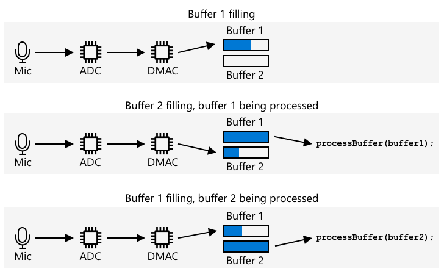

<!--
CO_OP_TRANSLATOR_METADATA:
{
  "original_hash": "2f336726b9410e97c3aaed76cc89b0d8",
  "translation_date": "2025-08-28T16:31:03+00:00",
  "source_file": "6-consumer/lessons/1-speech-recognition/wio-terminal-audio.md",
  "language_code": "uk"
}
-->
# Захоплення аудіо - Wio Terminal

У цій частині уроку ви напишете код для захоплення аудіо на вашому Wio Terminal. Захоплення аудіо буде керуватися однією з кнопок на верхній частині Wio Terminal.

## Програмування пристрою для захоплення аудіо

Ви можете захоплювати аудіо з мікрофона за допомогою коду на C++. Wio Terminal має лише 192KB оперативної пам'яті, чого недостатньо для захоплення більше кількох секунд аудіо. Однак він також має 4MB флеш-пам'яті, яку можна використовувати для збереження захопленого аудіо.

Вбудований мікрофон захоплює аналоговий сигнал, який перетворюється на цифровий сигнал, що може використовувати Wio Terminal. Під час захоплення аудіо дані потрібно захоплювати у правильний момент - наприклад, щоб захопити аудіо на частоті 16KHz, аудіо потрібно захоплювати точно 16,000 разів на секунду з рівними інтервалами між кожним зразком. Замість того, щоб використовувати ваш код для цього, ви можете скористатися контролером прямого доступу до пам'яті (DMAC). Це апаратна схема, яка може захоплювати сигнал з певного джерела і записувати його в пам'ять без переривання виконання вашого коду на процесорі.

✅ Дізнайтеся більше про DMA на [сторінці прямого доступу до пам'яті у Вікіпедії](https://wikipedia.org/wiki/Direct_memory_access).



DMAC може захоплювати аудіо з ADC на фіксованих інтервалах, наприклад, 16,000 разів на секунду для аудіо 16KHz. Він може записувати ці дані у попередньо виділений буфер пам'яті, і коли цей буфер заповнений, він стає доступним для вашого коду для обробки. Використання цієї пам'яті може затримати захоплення аудіо, але ви можете налаштувати кілька буферів. DMAC записує дані в буфер 1, потім, коли він заповнений, повідомляє ваш код для обробки буфера 1, поки DMAC записує дані в буфер 2. Коли буфер 2 заповнений, він повідомляє ваш код і повертається до запису в буфер 1. Таким чином, якщо ви обробляєте кожен буфер швидше, ніж час, необхідний для його заповнення, ви не втратите жодних даних.

Після захоплення кожного буфера його можна записати у флеш-пам'ять. Флеш-пам'ять потрібно записувати, використовуючи визначені адреси, вказуючи, куди записувати і якого розміру записувати, подібно до оновлення масиву байтів у пам'яті. Флеш-пам'ять має гранулярність, тобто операції стирання і запису залежать не лише від фіксованого розміру, але й від вирівнювання до цього розміру. Наприклад, якщо гранулярність становить 4096 байтів, і ви запитуєте стирання за адресою 4200, це може стерти всі дані з адреси 4096 до 8192. Це означає, що коли ви записуєте аудіо дані у флеш-пам'ять, це має бути у шматках правильного розміру.

### Завдання - налаштування флеш-пам'яті

1. Створіть новий проект Wio Terminal за допомогою PlatformIO. Назвіть цей проект `smart-timer`. Додайте код у функцію `setup` для налаштування послідовного порту.

1. Додайте наступні залежності бібліотеки до файлу `platformio.ini`, щоб отримати доступ до флеш-пам'яті:

    ```ini
    lib_deps =
        seeed-studio/Seeed Arduino FS @ 2.1.1
        seeed-studio/Seeed Arduino SFUD @ 2.0.2
    ```

1. Відкрийте файл `main.cpp` і додайте наступну директиву включення для бібліотеки флеш-пам'яті у верхній частині файлу:

    ```cpp
    #include <sfud.h>
    #include <SPI.h>
    ```

    > 🎓 SFUD означає Serial Flash Universal Driver, і це бібліотека, розроблена для роботи з усіма чіпами флеш-пам'яті.

1. У функції `setup` додайте наступний код для налаштування бібліотеки флеш-пам'яті:

    ```cpp
    while (!(sfud_init() == SFUD_SUCCESS))
        ;

    sfud_qspi_fast_read_enable(sfud_get_device(SFUD_W25Q32_DEVICE_INDEX), 2);
    ```

    Цей код циклічно виконується, поки бібліотека SFUD не буде ініціалізована, а потім увімкнено швидке читання. Вбудована флеш-пам'ять може бути доступна за допомогою Queued Serial Peripheral Interface (QSPI), типу SPI-контролера, який дозволяє безперервний доступ через чергу з мінімальним використанням процесора. Це робить читання і запис у флеш-пам'ять швидшими.

1. Створіть новий файл у папці `src` під назвою `flash_writer.h`.

1. Додайте наступне у верхній частині цього файлу:

    ```cpp
    #pragma once

    #include <Arduino.h>
    #include <sfud.h>
    ```

    Це включає необхідні заголовкові файли, включаючи заголовковий файл бібліотеки SFUD для взаємодії з флеш-пам'яттю.

1. Визначте клас у цьому новому заголовковому файлі під назвою `FlashWriter`:

    ```cpp
    class FlashWriter
    {
    public:
    
    private:
    };
    ```

1. У секції `private` додайте наступний код:

    ```cpp
    byte *_sfudBuffer;
    size_t _sfudBufferSize;
    size_t _sfudBufferPos;
    size_t _sfudBufferWritePos;

    const sfud_flash *_flash;
    ```

    Це визначає деякі поля для буфера, який використовується для зберігання даних перед записом у флеш-пам'ять. Є масив байтів `_sfudBuffer` для запису даних, і коли він заповнений, дані записуються у флеш-пам'ять. Поле `_sfudBufferPos` зберігає поточне місце для запису в цьому буфері, а `_sfudBufferWritePos` зберігає місце у флеш-пам'яті для запису. `_flash` - це вказівник на флеш-пам'ять для запису - деякі мікроконтролери мають кілька чіпів флеш-пам'яті.

1. Додайте наступний метод до секції `public` для ініціалізації цього класу:

    ```cpp
    void init()
    {
        _flash = sfud_get_device_table() + 0;
        _sfudBufferSize = _flash->chip.erase_gran;
        _sfudBuffer = new byte[_sfudBufferSize];
        _sfudBufferPos = 0;
        _sfudBufferWritePos = 0;
    }
    ```

    Це налаштовує флеш-пам'ять на Wio Terminal для запису і встановлює буфери на основі розміру зерна флеш-пам'яті. Це знаходиться в методі `init`, а не в конструкторі, оскільки це потрібно викликати після налаштування флеш-пам'яті у функції `setup`.

1. Додайте наступний код до секції `public`:

    ```cpp
    void writeSfudBuffer(byte b)
    {
        _sfudBuffer[_sfudBufferPos++] = b;
        if (_sfudBufferPos == _sfudBufferSize)
        {
            sfud_erase_write(_flash, _sfudBufferWritePos, _sfudBufferSize, _sfudBuffer);
            _sfudBufferWritePos += _sfudBufferSize;
            _sfudBufferPos = 0;
        }
    }

    void writeSfudBuffer(byte *b, size_t len)
    {
        for (size_t i = 0; i < len; ++i)
        {
            writeSfudBuffer(b[i]);
        }
    }

    void flushSfudBuffer()
    {
        if (_sfudBufferPos > 0)
        {
            sfud_erase_write(_flash, _sfudBufferWritePos, _sfudBufferSize, _sfudBuffer);
            _sfudBufferWritePos += _sfudBufferSize;
            _sfudBufferPos = 0;
        }
    }
    ```

    Цей код визначає методи для запису байтів у систему зберігання флеш-пам'яті. Він працює, записуючи у буфер пам'яті, який має правильний розмір для флеш-пам'яті, і коли цей буфер заповнений, він записується у флеш-пам'ять, стираючи будь-які існуючі дані у цьому місці. Також є метод `flushSfudBuffer` для запису неповного буфера, оскільки дані, що захоплюються, не будуть точними кратними розміру зерна, тому кінцева частина даних повинна бути записана.

    > 💁 Кінцева частина даних запише додаткові небажані дані, але це нормально, оскільки буде читатися лише потрібні дані.

### Завдання - налаштування захоплення аудіо

1. Створіть новий файл у папці `src` під назвою `config.h`.

1. Додайте наступне у верхній частині цього файлу:

    ```cpp
    #pragma once

    #define RATE 16000
    #define SAMPLE_LENGTH_SECONDS 4
    #define SAMPLES RATE * SAMPLE_LENGTH_SECONDS
    #define BUFFER_SIZE (SAMPLES * 2) + 44
    #define ADC_BUF_LEN 1600
    ```

    Цей код налаштовує деякі константи для захоплення аудіо.

    | Константа             | Значення | Опис |
    | --------------------- | -------: | - |
    | RATE                  | 16000    | Частота вибірки для аудіо. 16,000 - це 16KHz |
    | SAMPLE_LENGTH_SECONDS | 4        | Тривалість аудіо для захоплення. Встановлено на 4 секунди. Щоб записати довше аудіо, збільшіть це значення. |
    | SAMPLES               | 64000    | Загальна кількість аудіо зразків, які будуть захоплені. Встановлено як частота вибірки * кількість секунд |
    | BUFFER_SIZE           | 128044   | Розмір буфера аудіо для захоплення. Аудіо буде захоплено як WAV-файл, який має 44 байти заголовка, потім 128,000 байтів аудіо даних (кожен зразок - 2 байти) |
    | ADC_BUF_LEN           | 1600     | Розмір буферів для використання при захопленні аудіо з DMAC |

    > 💁 Якщо ви вважаєте, що 4 секунди занадто короткий час для запиту таймера, ви можете збільшити значення `SAMPLE_LENGTH_SECONDS`, і всі інші значення будуть перераховані.

1. Створіть новий файл у папці `src` під назвою `mic.h`.

1. Додайте наступне у верхній частині цього файлу:

    ```cpp
    #pragma once

    #include <Arduino.h>

    #include "config.h"
    #include "flash_writer.h"
    ```

    Це включає необхідні заголовкові файли, включаючи заголовкові файли `config.h` і `FlashWriter`.

1. Додайте наступне для визначення класу `Mic`, який може захоплювати дані з мікрофона:

    ```cpp
    class Mic
    {
    public:
        Mic()
        {
            _isRecording = false;
            _isRecordingReady = false;
        }
    
        void startRecording()
        {
            _isRecording = true;
            _isRecordingReady = false;
        }
    
        bool isRecording()
        {
            return _isRecording;
        }
    
        bool isRecordingReady()
        {
            return _isRecordingReady;
        }
    
    private:
        volatile bool _isRecording;
        volatile bool _isRecordingReady;
        FlashWriter _writer;
    };
    
    Mic mic;
    ```

    Цей клас наразі має лише кілька полів для відстеження, чи розпочато запис, і чи готовий запис для використання. Коли DMAC налаштований, він безперервно записує дані у буфери пам'яті, тому прапорець `_isRecording` визначає, чи ці дані повинні оброблятися чи ігноруватися. Прапорець `_isRecordingReady` буде встановлений, коли необхідні 4 секунди аудіо будуть захоплені. Поле `_writer` використовується для збереження аудіо даних у флеш-пам'ять.

    Потім оголошується глобальна змінна для екземпляра класу `Mic`.

1. Додайте наступний код до секції `private` класу `Mic`:

    ```cpp
    typedef struct
    {
        uint16_t btctrl;
        uint16_t btcnt;
        uint32_t srcaddr;
        uint32_t dstaddr;
        uint32_t descaddr;
    } dmacdescriptor;

    // Globals - DMA and ADC
    volatile dmacdescriptor _wrb[DMAC_CH_NUM] __attribute__((aligned(16)));
    dmacdescriptor _descriptor_section[DMAC_CH_NUM] __attribute__((aligned(16)));
    dmacdescriptor _descriptor __attribute__((aligned(16)));

    void configureDmaAdc()
    {
        // Configure DMA to sample from ADC at a regular interval (triggered by timer/counter)
        DMAC->BASEADDR.reg = (uint32_t)_descriptor_section;                    // Specify the location of the descriptors
        DMAC->WRBADDR.reg = (uint32_t)_wrb;                                    // Specify the location of the write back descriptors
        DMAC->CTRL.reg = DMAC_CTRL_DMAENABLE | DMAC_CTRL_LVLEN(0xf);           // Enable the DMAC peripheral
        DMAC->Channel[1].CHCTRLA.reg = DMAC_CHCTRLA_TRIGSRC(TC5_DMAC_ID_OVF) | // Set DMAC to trigger on TC5 timer overflow
                                        DMAC_CHCTRLA_TRIGACT_BURST;             // DMAC burst transfer

        _descriptor.descaddr = (uint32_t)&_descriptor_section[1];                    // Set up a circular descriptor
        _descriptor.srcaddr = (uint32_t)&ADC1->RESULT.reg;                           // Take the result from the ADC0 RESULT register
        _descriptor.dstaddr = (uint32_t)_adc_buf_0 + sizeof(uint16_t) * ADC_BUF_LEN; // Place it in the adc_buf_0 array
        _descriptor.btcnt = ADC_BUF_LEN;                                             // Beat count
        _descriptor.btctrl = DMAC_BTCTRL_BEATSIZE_HWORD |                            // Beat size is HWORD (16-bits)
                                DMAC_BTCTRL_DSTINC |                                    // Increment the destination address
                                DMAC_BTCTRL_VALID |                                     // Descriptor is valid
                                DMAC_BTCTRL_BLOCKACT_SUSPEND;                           // Suspend DMAC channel 0 after block transfer
        memcpy(&_descriptor_section[0], &_descriptor, sizeof(_descriptor));          // Copy the descriptor to the descriptor section

        _descriptor.descaddr = (uint32_t)&_descriptor_section[0];                    // Set up a circular descriptor
        _descriptor.srcaddr = (uint32_t)&ADC1->RESULT.reg;                           // Take the result from the ADC0 RESULT register
        _descriptor.dstaddr = (uint32_t)_adc_buf_1 + sizeof(uint16_t) * ADC_BUF_LEN; // Place it in the adc_buf_1 array
        _descriptor.btcnt = ADC_BUF_LEN;                                             // Beat count
        _descriptor.btctrl = DMAC_BTCTRL_BEATSIZE_HWORD |                            // Beat size is HWORD (16-bits)
                                DMAC_BTCTRL_DSTINC |                                    // Increment the destination address
                                DMAC_BTCTRL_VALID |                                     // Descriptor is valid
                                DMAC_BTCTRL_BLOCKACT_SUSPEND;                           // Suspend DMAC channel 0 after block transfer
        memcpy(&_descriptor_section[1], &_descriptor, sizeof(_descriptor));          // Copy the descriptor to the descriptor section

        // Configure NVIC
        NVIC_SetPriority(DMAC_1_IRQn, 0); // Set the Nested Vector Interrupt Controller (NVIC) priority for DMAC1 to 0 (highest)
        NVIC_EnableIRQ(DMAC_1_IRQn);      // Connect DMAC1 to Nested Vector Interrupt Controller (NVIC)

        // Activate the suspend (SUSP) interrupt on DMAC channel 1
        DMAC->Channel[1].CHINTENSET.reg = DMAC_CHINTENSET_SUSP;

        // Configure ADC
        ADC1->INPUTCTRL.bit.MUXPOS = ADC_INPUTCTRL_MUXPOS_AIN12_Val; // Set the analog input to ADC0/AIN2 (PB08 - A4 on Metro M4)
        while (ADC1->SYNCBUSY.bit.INPUTCTRL)
            ;                              // Wait for synchronization
        ADC1->SAMPCTRL.bit.SAMPLEN = 0x00; // Set max Sampling Time Length to half divided ADC clock pulse (2.66us)
        while (ADC1->SYNCBUSY.bit.SAMPCTRL)
            ;                                         // Wait for synchronization
        ADC1->CTRLA.reg = ADC_CTRLA_PRESCALER_DIV128; // Divide Clock ADC GCLK by 128 (48MHz/128 = 375kHz)
        ADC1->CTRLB.reg = ADC_CTRLB_RESSEL_12BIT |    // Set ADC resolution to 12 bits
                            ADC_CTRLB_FREERUN;          // Set ADC to free run mode
        while (ADC1->SYNCBUSY.bit.CTRLB)
            ;                       // Wait for synchronization
        ADC1->CTRLA.bit.ENABLE = 1; // Enable the ADC
        while (ADC1->SYNCBUSY.bit.ENABLE)
            ;                       // Wait for synchronization
        ADC1->SWTRIG.bit.START = 1; // Initiate a software trigger to start an ADC conversion
        while (ADC1->SYNCBUSY.bit.SWTRIG)
            ; // Wait for synchronization

        // Enable DMA channel 1
        DMAC->Channel[1].CHCTRLA.bit.ENABLE = 1;

        // Configure Timer/Counter 5
        GCLK->PCHCTRL[TC5_GCLK_ID].reg = GCLK_PCHCTRL_CHEN |     // Enable peripheral channel for TC5
                                            GCLK_PCHCTRL_GEN_GCLK1; // Connect generic clock 0 at 48MHz

        TC5->COUNT16.WAVE.reg = TC_WAVE_WAVEGEN_MFRQ; // Set TC5 to Match Frequency (MFRQ) mode
        TC5->COUNT16.CC[0].reg = 3000 - 1;            // Set the trigger to 16 kHz: (4Mhz / 16000) - 1
        while (TC5->COUNT16.SYNCBUSY.bit.CC0)
            ; // Wait for synchronization

        // Start Timer/Counter 5
        TC5->COUNT16.CTRLA.bit.ENABLE = 1; // Enable the TC5 timer
        while (TC5->COUNT16.SYNCBUSY.bit.ENABLE)
            ; // Wait for synchronization
    }

    uint16_t _adc_buf_0[ADC_BUF_LEN];
    uint16_t _adc_buf_1[ADC_BUF_LEN];
    ```

    Цей код визначає метод `configureDmaAdc`, який налаштовує DMAC, підключаючи його до ADC і встановлюючи його для заповнення двох різних чергуючих буферів, `_adc_buf_0` і `_adc_buf_1`.

    > 💁 Одним із недоліків розробки для мікроконтролерів є складність коду, необхідного для взаємодії з апаратним забезпеченням, оскільки ваш код працює на дуже низькому рівні, безпосередньо взаємодіючи з апаратним забезпеченням. Цей код складніший, ніж той, який ви б написали для одноплатного комп'ютера або настільного комп'ютера, оскільки немає операційної системи, яка б допомагала. Деякі бібліотеки доступні, які можуть спростити це, але все одно залишається багато складності.

1. Нижче цього додайте наступний код:

    ```cpp
    // WAV files have a header. This struct defines that header
    struct wavFileHeader
    {
        char riff[4];         /* "RIFF"                                  */
        long flength;         /* file length in bytes                    */
        char wave[4];         /* "WAVE"                                  */
        char fmt[4];          /* "fmt "                                  */
        long chunk_size;      /* size of FMT chunk in bytes (usually 16) */
        short format_tag;     /* 1=PCM, 257=Mu-Law, 258=A-Law, 259=ADPCM */
        short num_chans;      /* 1=mono, 2=stereo                        */
        long srate;           /* Sampling rate in samples per second     */
        long bytes_per_sec;   /* bytes per second = srate*bytes_per_samp */
        short bytes_per_samp; /* 2=16-bit mono, 4=16-bit stereo          */
        short bits_per_samp;  /* Number of bits per sample               */
        char data[4];         /* "data"                                  */
        long dlength;         /* data length in bytes (filelength - 44)  */
    };

    void initBufferHeader()
    {
        wavFileHeader wavh;

        strncpy(wavh.riff, "RIFF", 4);
        strncpy(wavh.wave, "WAVE", 4);
        strncpy(wavh.fmt, "fmt ", 4);
        strncpy(wavh.data, "data", 4);

        wavh.chunk_size = 16;
        wavh.format_tag = 1; // PCM
        wavh.num_chans = 1;  // mono
        wavh.srate = RATE;
        wavh.bytes_per_sec = (RATE * 1 * 16 * 1) / 8;
        wavh.bytes_per_samp = 2;
        wavh.bits_per_samp = 16;
        wavh.dlength = RATE * 2 * 1 * 16 / 2;
        wavh.flength = wavh.dlength + 44;

        _writer.writeSfudBuffer((byte *)&wavh, 44);
    }
    ```

    Цей код визначає заголовок WAV як структуру, яка займає 44 байти пам'яті. Він записує деталі про частоту, розмір і кількість каналів аудіофайлу. Цей заголовок потім записується у флеш-пам'ять.

1. Нижче цього коду додайте наступне для оголошення методу, який буде викликаний, коли буфери аудіо готові до обробки:

    ```cpp
    void audioCallback(uint16_t *buf, uint32_t buf_len)
    {
        static uint32_t idx = 44;

        if (_isRecording)
        {
            for (uint32_t i = 0; i < buf_len; i++)
            {
                int16_t audio_value = ((int16_t)buf[i] - 2048) * 16;

                _writer.writeSfudBuffer(audio_value & 0xFF);
                _writer.writeSfudBuffer((audio_value >> 8) & 0xFF);
            }

            idx += buf_len;
                
            if (idx >= BUFFER_SIZE)
            {
                _writer.flushSfudBuffer();
                idx = 44;
                _isRecording = false;
                _isRecordingReady = true;
            }
        }
    }
    ```

    Буфери аудіо - це масиви 16-бітних цілих чисел, що містять аудіо з ADC. ADC повертає 12-бітні беззнакові значення (0-1023), тому їх потрібно перетворити на 16-бітні знакові значення, а потім перетворити на 2 байти для збереження як сирих бінарних даних.

    Ці байти записуються у буфери флеш-пам'яті. Запис починається з індексу 44 - це зміщення від 44 байтів, записаних як заголовок WAV-файлу. Після того, як всі байти, необхідні для потрібної тривалості аудіо, захоплені, залишкові дані записуються у флеш-пам'ять.

1. У секції `public` класу `Mic` додайте наступний код:

    ```cpp
    void dmaHandler()
    {
        static uint8_t count = 0;

        if (DMAC->Channel[1].CHINTFLAG.bit.SUSP)
        {
            DMAC->Channel[1].CHCTRLB.reg = DMAC_CHCTRLB_CMD_RESUME;
            DMAC->Channel[1].CHINTFLAG.bit.SUSP = 1;

            if (count)
            {
                audioCallback(_adc_buf_0, ADC_BUF_LEN);
            }
            else
            {
                audioCallback(_adc_buf_1, ADC_BUF_LEN);
            }

            count = (count + 1) % 2;
        }
    }
    ```

    Цей код буде викликаний DMAC, щоб повідомити ваш код про готовність буферів до обробки. Він перевіряє, чи є дані для обробки, і викликає метод `audioCallback` з відповідним буфером.

1. Зовні класу, після оголошення `Mic mic;`, додайте наступний код:

    ```cpp
    void DMAC_1_Handler()
    {
        mic.dmaHandler();
    }
    ```

    `DMAC_1_Handler` буде викликаний DMAC, коли буфери готові до обробки. Ця функція знаходиться за назвою, тому просто повинна існувати, щоб бути викликаною.

1. Додайте наступні два методи до секції `public` класу `Mic`:

    ```cpp
    void init()
    {
        analogReference(AR_INTERNAL2V23);

        _writer.init();

        initBufferHeader();
        configureDmaAdc();
    }

    void reset()
    {
        _isRecordingReady = false;
        _isRecording = false;

        _writer.reset();

        initBufferHeader();
    }
    ```

    Метод `init` містить код для ініціалізації класу `Mic`. Цей метод встановлює правильну напругу для піну мікрофона, налаштовує записувач флеш-пам'яті, записує заголовок WAV-файлу і налаштовує DMAC. Метод `reset` скидає флеш-пам'ять і повторно записує заголовок після того, як аудіо було захоплено і використано.

### Завдання - захоплення аудіо

1. У файлі `main.cpp` додайте директиву включення для заголовкового файлу `mic.h`:

    ```cpp
    #include "mic.h"
    ```

1. У функції `setup` ініціалізуйте кнопку C. Захоплення аудіо почнеться, коли ця кнопка буде натиснута, і триватиме 4 секунди:

    ```cpp
    pinMode(WIO_KEY_C, INPUT_PULLUP);
    ```

1. Нижче цього ініціалізуйте мікрофон, а потім виведіть у консоль повідомлення про готовність до захоплення аудіо:

    ```cpp
    mic.init();

    Serial.println("Ready.");
    ```

1. Над функцією `loop` визначте функцію для обробки захопленого аудіо. Наразі вона нічого не робить, але пізніше в цьому уроці вона буде використовуватися для перетворення мовлення у текст:

    ```cpp
    void processAudio()
    {
    
    }
    ```

1. Додайте наступне до функції `loop`:

    ```cpp
    void loop()
    {
        if (digitalRead(WIO_KEY_C) == LOW && !mic.isRecording())
        {
            Serial.println("Starting recording...");
            mic.startRecording();
        }
    
        if (!mic.isRecording() && mic.isRecordingReady())
        {
            Serial.println("Finished recording");
    
            processAudio();
    
            mic.reset();
        }
    }
    ```

    Цей код перевіряє кнопку C, і якщо вона натиснута і запис ще не розпочато, то поле `_isRecording` класу `Mic` встановлюється у true. Це призведе до того, що метод `audioCallback` класу `Mic` буде зберігати аудіо, поки не буде захоплено 4 секунди. Після того, як 4 секунди аудіо були захоплені, поле `_isRecording` встановлюється у false, а поле `_isRecordingReady` встановлюється у true. Це потім перевіряється у функції `loop`, і коли значення true, викликається функція `processAudio`, а потім клас мікрофона скидається.

1. Зберіть цей код, завантажте його на ваш Wio Terminal і протестуйте через серійний монітор. Натисніть кнопку C (ту, що зліва, найближче до перемикача живлення) і говоріть. Буде захоплено 4 секунди аудіо.

    ```output
    --- Available filters and text transformations: colorize, debug, default, direct, hexlify, log2file, nocontrol, printable, send_on_enter, time
    --- More details at http://bit.ly/pio-monitor-filters
    --- Miniterm on /dev/cu.usbmodem1101  9600,8,N,1 ---
    --- Quit: Ctrl+C | Menu: Ctrl+T | Help: Ctrl+T followed by Ctrl+H ---
    Ready.
    Starting recording...
    Finished recording
    ```
💁 Ви можете знайти цей код у папці [code-record/wio-terminal](../../../../../6-consumer/lessons/1-speech-recognition/code-record/wio-terminal).
Ваш додаток для запису аудіо став успішним!

---

**Відмова від відповідальності**:  
Цей документ був перекладений за допомогою сервісу автоматичного перекладу [Co-op Translator](https://github.com/Azure/co-op-translator). Хоча ми прагнемо до точності, будь ласка, майте на увазі, що автоматичні переклади можуть містити помилки або неточності. Оригінальний документ на його рідній мові слід вважати авторитетним джерелом. Для критичної інформації рекомендується професійний людський переклад. Ми не несемо відповідальності за будь-які непорозуміння або неправильні тлумачення, що виникають внаслідок використання цього перекладу.