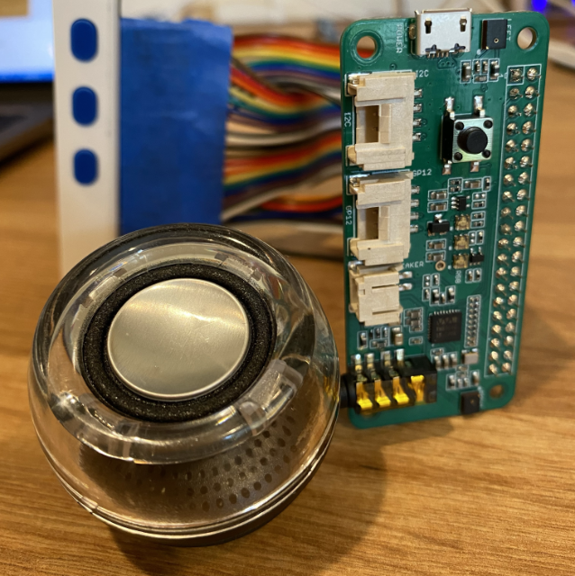

<!--
CO_OP_TRANSLATOR_METADATA:
{
  "original_hash": "93d352de36526b8990e41dd538100324",
  "translation_date": "2025-08-28T16:28:02+00:00",
  "source_file": "6-consumer/lessons/1-speech-recognition/wio-terminal-microphone.md",
  "language_code": "uk"
}
-->
# Налаштуйте мікрофон і динаміки - Wio Terminal

У цій частині уроку ви додасте динаміки до вашого Wio Terminal. Wio Terminal вже має вбудований мікрофон, який можна використовувати для запису мови.

## Апаратне забезпечення

Wio Terminal вже має вбудований мікрофон, який можна використовувати для запису звуку для розпізнавання мови.

Щоб додати динамік, ви можете використовувати [ReSpeaker 2-Mics Pi Hat](https://www.seeedstudio.com/ReSpeaker-2-Mics-Pi-HAT.html). Це зовнішня плата, яка містить 2 MEMS-мікрофони, а також роз'єм для динаміка і гніздо для навушників.

Вам знадобляться або навушники, або динамік із роз'ємом 3.5 мм, або динамік із підключенням JST, наприклад, [Mono Enclosed Speaker - 2W 6 Ohm](https://www.seeedstudio.com/Mono-Enclosed-Speaker-2W-6-Ohm-p-2832.html).

Для підключення ReSpeaker 2-Mics Pi Hat вам знадобляться 40-контактні дроти (також відомі як "male-to-male" джампери).

> 💁 Якщо ви вмієте паяти, ви можете використовувати [40 Pin Raspberry Pi Hat Adapter Board For Wio Terminal](https://www.seeedstudio.com/40-Pin-Raspberry-Pi-Hat-Adapter-Board-For-Wio-Terminal-p-4730.html) для підключення ReSpeaker.

Вам також знадобиться SD-карта для завантаження та відтворення аудіо. Wio Terminal підтримує лише SD-карти об'ємом до 16 ГБ, і вони мають бути відформатовані у формат FAT32 або exFAT.

### Завдання - підключення ReSpeaker Pi Hat

1. Вимкнувши Wio Terminal, підключіть ReSpeaker 2-Mics Pi Hat до Wio Terminal за допомогою джамперів і GPIO-роз'ємів на задній панелі Wio Terminal:

    Піни потрібно підключити таким чином:

    

1. Розташуйте ReSpeaker і Wio Terminal так, щоб GPIO-роз'єми були спрямовані вгору і знаходилися з лівого боку.

1. Почніть із роз'єму у верхньому лівому куті GPIO-роз'єму на ReSpeaker. Підключіть джампер від верхнього лівого роз'єму ReSpeaker до верхнього лівого роз'єму Wio Terminal.

1. Повторіть це для всіх роз'ємів на лівій стороні GPIO. Переконайтеся, що піни надійно закріплені.

    

    

    > 💁 Якщо ваші джампери з'єднані у стрічки, залиште їх разом — це полегшить підключення всіх кабелів у правильному порядку.

1. Повторіть процес для правих GPIO-роз'ємів на ReSpeaker і Wio Terminal. Ці кабелі потрібно прокласти навколо вже підключених кабелів.

    

    

    > 💁 Якщо ваші джампери з'єднані у стрічки, розділіть їх на дві стрічки. Пропустіть кожну з боків існуючих кабелів.

    > 💁 Ви можете використовувати клейку стрічку, щоб зафіксувати піни у блоці, щоб вони не випадали під час підключення.
    >
    > 

1. Вам потрібно буде додати динамік.

    * Якщо ви використовуєте динамік із кабелем JST, підключіть його до порту JST на ReSpeaker.

      

    * Якщо ви використовуєте динамік із роз'ємом 3.5 мм або навушники, вставте їх у гніздо 3.5 мм.

      

### Завдання - налаштування SD-карти

1. Підключіть SD-карту до комп'ютера, використовуючи зовнішній рідер, якщо у вас немає слота для SD-карт.

1. Відформатуйте SD-карту за допомогою відповідного інструменту на вашому комп'ютері, переконавшись, що використовується файлова система FAT32 або exFAT.

1. Вставте SD-карту у слот для SD-карт на лівій стороні Wio Terminal, трохи нижче кнопки живлення. Переконайтеся, що карта вставлена до кінця і клацнула — можливо, вам знадобиться тонкий інструмент або інша SD-карта, щоб допомогти її вставити.

    

    > 💁 Щоб вийняти SD-карту, потрібно трохи натиснути на неї, і вона вийде. Для цього вам знадобиться тонкий інструмент, наприклад, плоска викрутка або інша SD-карта.

---

**Відмова від відповідальності**:  
Цей документ було перекладено за допомогою сервісу автоматичного перекладу [Co-op Translator](https://github.com/Azure/co-op-translator). Хоча ми прагнемо до точності, звертаємо вашу увагу, що автоматичні переклади можуть містити помилки або неточності. Оригінальний документ мовою оригіналу слід вважати авторитетним джерелом. Для критично важливої інформації рекомендується професійний переклад людиною. Ми не несемо відповідальності за будь-які непорозуміння або неправильні тлумачення, що виникли внаслідок використання цього перекладу.