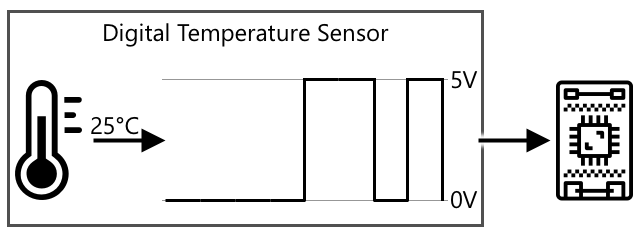

<!--
CO_OP_TRANSLATOR_METADATA:
{
  "original_hash": "e9ee00eb5fc55922a73762acc542166b",
  "translation_date": "2025-08-26T23:24:00+00:00",
  "source_file": "1-getting-started/lessons/3-sensors-and-actuators/README.md",
  "language_code": "ur"
}
-->
# سینسرز اور ایکچوایٹرز کے ذریعے جسمانی دنیا کے ساتھ تعامل کریں


> خاکہ [نیتیا نرسمہن](https://github.com/nitya) کی طرف سے۔ بڑی تصویر دیکھنے کے لیے تصویر پر کلک کریں۔

یہ سبق [ہیلو IoT سیریز](https://youtube.com/playlist?list=PLmsFUfdnGr3xRts0TIwyaHyQuHaNQcb6-) کے حصے کے طور پر [مائیکروسافٹ ری ایکٹر](https://developer.microsoft.com/reactor/?WT.mc_id=academic-17441-jabenn) سے پڑھایا گیا تھا۔ یہ سبق دو ویڈیوز میں پڑھایا گیا - ایک گھنٹے کا سبق اور ایک گھنٹے کا دفتر وقت جس میں سبق کے مختلف حصوں پر مزید تفصیل سے بات کی گئی اور سوالات کے جوابات دیے گئے۔

[](https://youtu.be/Lqalu1v6aF4)

[](https://youtu.be/qR3ekcMlLWA)

> 🎥 ویڈیوز دیکھنے کے لیے اوپر دی گئی تصاویر پر کلک کریں

## لیکچر سے پہلے کا کوئز

[لیکچر سے پہلے کا کوئز](https://black-meadow-040d15503.1.azurestaticapps.net/quiz/5)

## تعارف

یہ سبق آپ کے IoT ڈیوائس کے لیے دو اہم تصورات - سینسرز اور ایکچوایٹرز - کا تعارف کراتا ہے۔ آپ ان دونوں کے ساتھ عملی کام کریں گے، اپنے IoT پروجیکٹ میں ایک لائٹ سینسر شامل کریں گے، پھر روشنی کی سطحوں کے ذریعے کنٹرول ہونے والی LED شامل کریں گے، اور مؤثر طریقے سے ایک نائٹ لائٹ بنائیں گے۔

اس سبق میں ہم درج ذیل موضوعات کا احاطہ کریں گے:

* [سینسرز کیا ہیں؟](../../../../../1-getting-started/lessons/3-sensors-and-actuators)
* [سینسر کا استعمال کریں](../../../../../1-getting-started/lessons/3-sensors-and-actuators)
* [سینسر کی اقسام](../../../../../1-getting-started/lessons/3-sensors-and-actuators)
* [ایکچوایٹرز کیا ہیں؟](../../../../../1-getting-started/lessons/3-sensors-and-actuators)
* [ایکچوایٹر کا استعمال کریں](../../../../../1-getting-started/lessons/3-sensors-and-actuators)
* [ایکچوایٹر کی اقسام](../../../../../1-getting-started/lessons/3-sensors-and-actuators)

## سینسرز کیا ہیں؟

سینسرز وہ ہارڈویئر ڈیوائسز ہیں جو جسمانی دنیا کو محسوس کرتے ہیں - یعنی وہ اپنے ارد گرد کی ایک یا زیادہ خصوصیات کو ماپتے ہیں اور معلومات IoT ڈیوائس کو بھیجتے ہیں۔ سینسرز کی ایک وسیع رینج ہوتی ہے کیونکہ بہت سی چیزیں ماپی جا سکتی ہیں، قدرتی خصوصیات جیسے ہوا کا درجہ حرارت سے لے کر جسمانی تعاملات جیسے حرکت۔

کچھ عام سینسرز میں شامل ہیں:

* درجہ حرارت کے سینسرز - یہ ہوا کے درجہ حرارت یا جس چیز میں یہ ڈوبے ہوئے ہیں اس کے درجہ حرارت کو محسوس کرتے ہیں۔ شوقیہ افراد اور ڈویلپرز کے لیے، یہ اکثر ہوا کے دباؤ اور نمی کے ساتھ ایک ہی سینسر میں شامل ہوتے ہیں۔
* بٹن - یہ محسوس کرتے ہیں کہ کب دبایا گیا ہے۔
* روشنی کے سینسرز - یہ روشنی کی سطحوں کا پتہ لگاتے ہیں اور مخصوص رنگوں، UV روشنی، IR روشنی، یا عمومی نظر آنے والی روشنی کے لیے ہو سکتے ہیں۔
* کیمرے - یہ دنیا کی بصری نمائندگی کو محسوس کرتے ہیں، تصویر لینے یا ویڈیو اسٹریم کرنے کے ذریعے۔
* ایکسیلرومیٹرز - یہ کئی سمتوں میں حرکت کو محسوس کرتے ہیں۔
* مائیکروفونز - یہ آواز کو محسوس کرتے ہیں، یا تو عمومی آواز کی سطح یا سمت والی آواز۔

✅ تحقیق کریں۔ آپ کے فون میں کون سے سینسرز ہیں؟

تمام سینسرز میں ایک چیز مشترک ہے - وہ جو کچھ بھی محسوس کرتے ہیں اسے ایک برقی سگنل میں تبدیل کرتے ہیں جسے IoT ڈیوائس کے ذریعے سمجھا جا سکتا ہے۔ اس برقی سگنل کی تشریح سینسر اور IoT ڈیوائس کے ساتھ بات چیت کرنے کے لیے استعمال ہونے والے پروٹوکول پر منحصر ہے۔

## سینسر کا استعمال کریں

اپنے IoT ڈیوائس میں سینسر شامل کرنے کے لیے نیچے دی گئی متعلقہ گائیڈ پر عمل کریں:

* [Arduino - Wio Terminal](wio-terminal-sensor.md)
* [سنگل بورڈ کمپیوٹر - Raspberry Pi](pi-sensor.md)
* [سنگل بورڈ کمپیوٹر - ورچوئل ڈیوائس](virtual-device-sensor.md)

## سینسر کی اقسام

سینسرز یا تو اینالاگ ہوتے ہیں یا ڈیجیٹل۔

### اینالاگ سینسرز

کچھ سب سے بنیادی سینسرز اینالاگ سینسرز ہوتے ہیں۔ یہ سینسرز IoT ڈیوائس سے وولٹیج وصول کرتے ہیں، سینسر کے اجزاء اس وولٹیج کو ایڈجسٹ کرتے ہیں، اور سینسر سے واپس آنے والے وولٹیج کو سینسر ویلیو دینے کے لیے ماپا جاتا ہے۔

> 🎓 وولٹیج اس بات کا پیمانہ ہے کہ بجلی کو ایک جگہ سے دوسری جگہ منتقل کرنے کے لیے کتنا زور دیا جا رہا ہے، جیسے بیٹری کے مثبت ٹرمینل سے منفی ٹرمینل تک۔ مثال کے طور پر، ایک معیاری AA بیٹری 1.5V (V وولٹس کے لیے علامت ہے) ہے اور 1.5V کے زور سے بجلی کو اپنے مثبت ٹرمینل سے منفی ٹرمینل تک دھکیل سکتی ہے۔ مختلف برقی ہارڈویئر کو کام کرنے کے لیے مختلف وولٹیجز کی ضرورت ہوتی ہے، مثال کے طور پر، ایک LED 2-3V کے درمیان روشنی دے سکتا ہے، لیکن ایک 100W فلمنٹ بلب کو 240V کی ضرورت ہوگی۔ آپ وولٹیج کے بارے میں مزید معلومات [وولٹیج کے صفحے پر ویکیپیڈیا](https://wikipedia.org/wiki/Voltage) پر پڑھ سکتے ہیں۔

ایک مثال پوٹینشیومیٹر ہے۔ یہ ایک ڈائل ہے جسے آپ دو پوزیشنوں کے درمیان گھما سکتے ہیں اور سینسر گردش کو ماپتا ہے۔


IoT ڈیوائس پوٹینشیومیٹر کو ایک برقی سگنل ایک وولٹیج پر بھیجے گا، جیسے 5 وولٹ (5V)۔ جیسے جیسے پوٹینشیومیٹر ایڈجسٹ ہوتا ہے، یہ دوسری طرف سے نکلنے والے وولٹیج کو تبدیل کرتا ہے۔ تصور کریں کہ آپ کے پاس ایک پوٹینشیومیٹر ہے جو ایک ڈائل کے طور پر لیبل کیا گیا ہے جو 0 سے [11](https://wikipedia.org/wiki/Up_to_eleven) تک جاتا ہے، جیسے ایمپلیفائر پر والیوم نوب۔ جب پوٹینشیومیٹر مکمل آف پوزیشن (0) میں ہوتا ہے تو 0V (0 وولٹ) باہر نکلے گا۔ جب یہ مکمل آن پوزیشن (11) میں ہوتا ہے تو 5V (5 وولٹ) باہر نکلے گا۔

> 🎓 یہ ایک سادہ وضاحت ہے، اور آپ پوٹینشیومیٹرز اور متغیر ریزسٹرس کے بارے میں مزید معلومات [پوٹینشیومیٹر کے ویکیپیڈیا صفحے](https://wikipedia.org/wiki/Potentiometer) پر پڑھ سکتے ہیں۔

سینسر سے نکلنے والے وولٹیج کو IoT ڈیوائس کے ذریعے پڑھا جاتا ہے، اور ڈیوائس اس پر ردعمل دے سکتی ہے۔ سینسر پر منحصر ہے، یہ وولٹیج ایک من مانی قدر ہو سکتی ہے یا ایک معیاری یونٹ سے مطابقت رکھ سکتی ہے۔ مثال کے طور پر، ایک اینالاگ درجہ حرارت سینسر جو [تھرمیسٹر](https://wikipedia.org/wiki/Thermistor) پر مبنی ہے، درجہ حرارت کے لحاظ سے اپنی مزاحمت کو تبدیل کرتا ہے۔ آؤٹ پٹ وولٹیج کو پھر کوڈ میں حسابات کے ذریعے کیلون میں درجہ حرارت میں تبدیل کیا جا سکتا ہے، اور اسی طرح °C یا °F میں۔

✅ آپ کے خیال میں کیا ہوتا ہے اگر سینسر بھیجے گئے وولٹیج سے زیادہ وولٹیج واپس کرے (مثال کے طور پر کسی بیرونی پاور سپلائی سے)؟ ⛔️ اس کا تجربہ نہ کریں۔

#### اینالاگ سے ڈیجیٹل تبدیلی

IoT ڈیوائسز ڈیجیٹل ہوتی ہیں - وہ اینالاگ قدروں کے ساتھ کام نہیں کر سکتیں، وہ صرف 0s اور 1s کے ساتھ کام کرتی ہیں۔ اس کا مطلب ہے کہ اینالاگ سینسر کی قدروں کو ڈیجیٹل سگنل میں تبدیل کرنے کی ضرورت ہوتی ہے اس سے پہلے کہ وہ پروسیس ہو سکیں۔ بہت سے IoT ڈیوائسز میں اینالاگ سے ڈیجیٹل کنورٹرز (ADCs) ہوتے ہیں جو اینالاگ ان پٹس کو ان کی قدر کی ڈیجیٹل نمائندگی میں تبدیل کرتے ہیں۔ سینسرز کنیکٹر بورڈ کے ذریعے ADCs کے ساتھ بھی کام کر سکتے ہیں۔ مثال کے طور پر، Raspberry Pi کے ساتھ Seeed Grove ایکو سسٹم میں، اینالاگ سینسرز Pi کے GPIO پنز سے جڑے 'ہیٹ' کے مخصوص پورٹس سے جڑتے ہیں، اور یہ ہیٹ ایک ADC رکھتا ہے جو وولٹیج کو ڈیجیٹل سگنل میں تبدیل کرتا ہے جو Pi کے GPIO پنز سے بھیجا جا سکتا ہے۔

تصور کریں کہ آپ کے پاس ایک اینالاگ لائٹ سینسر ہے جو 3.3V پر کام کر رہا ہے اور 1V کی قدر واپس کر رہا ہے۔ یہ 1V ڈیجیٹل دنیا میں کچھ معنی نہیں رکھتا، اس لیے اسے تبدیل کرنے کی ضرورت ہے۔ وولٹیج کو ایک پیمانے کا استعمال کرتے ہوئے اینالاگ قدر میں تبدیل کیا جائے گا جو ڈیوائس اور سینسر پر منحصر ہے۔ ایک مثال Seeed Grove لائٹ سینسر ہے جو 0 سے 1,023 تک قدریں دیتا ہے۔ اس سینسر کے لیے جو 3.3V پر چل رہا ہے، 1V آؤٹ پٹ 300 کی قدر ہوگی۔ ایک IoT ڈیوائس 300 کو اینالاگ قدر کے طور پر ہینڈل نہیں کر سکتی، اس لیے قدر کو `0000000100101100` میں تبدیل کیا جائے گا، Grove ہیٹ کے ذریعے 300 کی بائنری نمائندگی۔ یہ پھر IoT ڈیوائس کے ذریعے پروسیس کیا جائے گا۔

✅ اگر آپ بائنری نہیں جانتے، تو تھوڑی تحقیق کریں کہ 0s اور 1s کے ذریعے نمبرز کیسے ظاہر کیے جاتے ہیں۔ [BBC Bitesize کا بائنری سبق](https://www.bbc.co.uk/bitesize/guides/zwsbwmn/revision/1) شروع کرنے کے لیے ایک بہترین جگہ ہے۔

کوڈنگ کے نقطہ نظر سے، یہ سب عام طور پر سینسرز کے ساتھ آنے والی لائبریریوں کے ذریعے ہینڈل کیا جاتا ہے، اس لیے آپ کو خود اس تبدیلی کی فکر کرنے کی ضرورت نہیں ہوتی۔ Grove لائٹ سینسر کے لیے آپ Python لائبریری استعمال کریں گے اور `light` پراپرٹی کو کال کریں گے، یا Arduino لائبریری استعمال کریں گے اور `analogRead` کو کال کریں گے تاکہ 300 کی قدر حاصل کی جا سکے۔

### ڈیجیٹل سینسرز

ڈیجیٹل سینسرز، اینالاگ سینسرز کی طرح، برقی وولٹیج میں تبدیلیوں کے ذریعے اپنے ارد گرد کی دنیا کا پتہ لگاتے ہیں۔ فرق یہ ہے کہ وہ ڈیجیٹل سگنل آؤٹ پٹ کرتے ہیں، یا تو صرف دو حالتوں کو ماپ کر یا ایک بلٹ ان ADC کا استعمال کرتے ہوئے۔ ڈیجیٹل سینسرز زیادہ سے زیادہ عام ہو رہے ہیں تاکہ کنیکٹر بورڈ یا خود IoT ڈیوائس میں ADC استعمال کرنے کی ضرورت سے بچا جا سکے۔

سب سے آسان ڈیجیٹل سینسر ایک بٹن یا سوئچ ہے۔ یہ ایک سینسر ہے جس کی دو حالتیں ہیں، آن یا آف۔


IoT ڈیوائسز کے پنز جیسے GPIO پنز اس سگنل کو براہ راست 0 یا 1 کے طور پر ماپ سکتے ہیں۔ اگر بھیجا گیا وولٹیج واپس آنے والے وولٹیج کے برابر ہے، تو پڑھی گئی قدر 1 ہے، ورنہ پڑھی گئی قدر 0 ہے۔ سگنل کو تبدیل کرنے کی ضرورت نہیں ہے، یہ صرف 1 یا 0 ہو سکتا ہے۔

> 💁 وولٹیجز کبھی بھی بالکل درست نہیں ہوتے خاص طور پر کیونکہ سینسر کے اجزاء میں کچھ مزاحمت ہوتی ہے، اس لیے عام طور پر ایک رواداری ہوتی ہے۔ مثال کے طور پر، Raspberry Pi کے GPIO پنز 3.3V پر کام کرتے ہیں، اور 1.8V سے اوپر کے ریٹرن سگنل کو 1 کے طور پر پڑھتے ہیں، 1.8V سے نیچے کے سگنل کو 0 کے طور پر۔

* 3.3V بٹن میں جاتا ہے۔ بٹن آف ہے اس لیے 0V باہر آتا ہے، قدر 0 دیتی ہے۔
* 3.3V بٹن میں جاتا ہے۔ بٹن آن ہے اس لیے 3.3V باہر آتا ہے، قدر 1 دیتی ہے۔

زیادہ جدید ڈیجیٹل سینسرز اینالاگ قدروں کو پڑھتے ہیں، پھر انہیں بلٹ ان ADCs کے ذریعے ڈیجیٹل سگنلز میں تبدیل کرتے ہیں۔ مثال کے طور پر، ایک ڈیجیٹل درجہ حرارت سینسر اب بھی تھرموکوپل کا استعمال کرے گا جیسے اینالاگ سینسر، اور اب بھی موجودہ درجہ حرارت پر تھرموکوپل کی مزاحمت کی وجہ سے وولٹیج میں تبدیلی کو ماپے گا۔ اینالاگ قدر واپس کرنے اور ڈیوائس یا کنیکٹر بورڈ پر ڈیجیٹل سگنل میں تبدیل ہونے پر انحصار کرنے کے بجائے، سینسر میں بلٹ ان ADC قدر کو تبدیل کرے گا اور اسے 0s اور 1s کی سیریز کے طور پر IoT ڈیوائس کو بھیجے گا۔ یہ 0s اور 1s اسی طرح بھیجے جاتے ہیں جیسے بٹن کے ڈیجیٹل سگنل کے لیے، جہاں 1 مکمل وولٹیج ہے اور 0 0V ہے۔



ڈیجیٹل ڈیٹا بھیجنے سے سینسرز زیادہ پیچیدہ ہو سکتے ہیں اور زیادہ تفصیلی ڈیٹا بھیج سکتے ہیں، یہاں تک کہ محفوظ سینسرز کے لیے انکرپٹڈ ڈیٹا بھی۔ ایک مثال کیمرہ ہے۔ یہ ایک سینسر ہے جو ایک تصویر کو کیپچر کرتا ہے اور اسے ڈیجیٹل ڈیٹا کے طور پر بھیجتا ہے جس میں وہ تصویر شامل ہوتی ہے، عام طور پر JPEG جیسے کمپریسڈ فارمیٹ میں، تاکہ IoT ڈیوائس کے ذریعے پڑھا جا سکے۔ یہ ویڈیو کو اسٹریم بھی کر سکتا ہے، تصاویر کو کیپچر کر کے اور یا تو مکمل تصویر فریم بہ فریم بھیج کر یا کمپریسڈ ویڈیو اسٹریم بھیج کر۔

## ایکچوایٹرز کیا ہیں؟

ایکچوایٹرز سینسرز کے برعکس ہیں - وہ آپ کے IoT ڈیوائس سے برقی سگنل کو جسمانی دنیا کے ساتھ تعامل میں تبدیل کرتے ہیں جیسے روشنی یا آواز کا اخراج، یا موٹر کو حرکت دینا۔

کچھ عام ایکچوایٹرز میں شامل ہیں:

* LED - یہ آن ہونے پر روشنی خارج کرتے ہیں۔
* اسپیکر - یہ سگنل کے مطابق آواز خارج کرتے ہیں، ایک بنیادی بززر سے لے کر ایک آڈیو اسپیکر تک جو موسیقی بجا سکتا ہے۔
* اسٹیپر موٹر - یہ سگنل کو ایک مقررہ مقدار میں گردش میں تبدیل کرتے ہیں، جیسے ڈائل کو 90° گھمانا۔
* ریلے - یہ سوئچز ہیں جو برقی سگنل کے ذریعے آن یا آف کیے جا سکتے ہیں۔ یہ IoT ڈیوائس سے چھوٹے وولٹیج کو بڑے وولٹیجز کو آن کرنے کی اجازت دیتے ہیں۔
* اسکرینز - یہ زیادہ پیچیدہ ایکچوایٹرز ہیں اور ایک ملٹی-سیگمنٹ ڈسپلے پر معلومات دکھاتے ہیں۔ اسکرینز سادہ LED ڈسپلے سے لے کر ہائی ریزولوشن ویڈیو مانیٹرز تک مختلف ہوتی ہیں۔

✅ تحقیق کریں۔ آپ کے فون میں کون سے ایکچوایٹرز ہیں؟

## ایکچوایٹر کا استعمال کریں

اپنے IoT ڈیوائس میں ایکچوایٹر شامل کرنے کے لیے نیچے دی گئی متعلقہ گائیڈ پر عمل کریں، جو سینسر کے ذریعے کنٹرول کیا جائے گا، تاکہ IoT نائٹ لائٹ بنائی جا سکے۔ یہ لائٹ سینسر سے روشنی کی سطحوں کو جمع کرے گا، اور ایکچوایٹر کے طور پر LED کا استعمال کرے گا تاکہ جب پتہ لگائی گئی روشنی کی سطح بہت کم ہو تو روشنی خارج کرے۔


* [Arduino - Wio Terminal](wio-terminal-actuator.md)
* [سنگل بورڈ کمپیوٹر - Raspberry Pi](pi-actuator.md)
* [سنگل بورڈ کمپیوٹر - ورچوئل


جیسے سینسرز کے ساتھ ہوتا ہے، اصل IoT ڈیوائس ڈیجیٹل سگنلز پر کام کرتی ہے، نہ کہ اینالاگ پر۔ اس کا مطلب ہے کہ اینالاگ سگنل بھیجنے کے لیے، IoT ڈیوائس کو ڈیجیٹل سے اینالاگ کنورٹر (DAC) کی ضرورت ہوتی ہے، یا تو براہ راست IoT ڈیوائس پر یا کنیکٹر بورڈ پر۔ یہ IoT ڈیوائس کے 0s اور 1s کو اینالاگ وولٹیج میں تبدیل کرے گا جسے ایکچوایٹر استعمال کر سکتا ہے۔

✅ آپ کے خیال میں کیا ہوگا اگر IoT ڈیوائس ایکچوایٹر کی برداشت سے زیادہ وولٹیج بھیجے؟
⛔️ اس کو آزمانے کی کوشش نہ کریں۔

#### پلس وِڈتھ موڈیولیشن

IoT ڈیوائس سے ڈیجیٹل سگنلز کو اینالاگ سگنل میں تبدیل کرنے کا ایک اور طریقہ پلس وِڈتھ موڈیولیشن ہے۔ اس میں بہت سے چھوٹے ڈیجیٹل پلسز بھیجنا شامل ہوتا ہے جو اینالاگ سگنل کی طرح کام کرتے ہیں۔

مثال کے طور پر، آپ PWM کا استعمال کر کے موٹر کی رفتار کو کنٹرول کر سکتے ہیں۔

تصور کریں کہ آپ 5V سپلائی کے ساتھ ایک موٹر کو کنٹرول کر رہے ہیں۔ آپ اپنی موٹر کو ایک مختصر پلس بھیجتے ہیں، وولٹیج کو 0.02 سیکنڈ (0.02s) کے لیے 5V پر سوئچ کرتے ہیں۔ اس وقت میں آپ کی موٹر ایک دسویں گردش، یا 36° گھوم سکتی ہے۔ سگنل پھر 0.02 سیکنڈ (0.02s) کے لیے رک جاتا ہے، اور 0V کا کم سگنل بھیجتا ہے۔ ہر آن اور آف سائیکل 0.04 سیکنڈ تک جاری رہتا ہے۔ سائیکل پھر دہرایا جاتا ہے۔


اس کا مطلب ہے کہ ایک سیکنڈ میں آپ کے پاس 25 5V پلسز ہیں، ہر ایک 0.02s کا، جو موٹر کو گھماتے ہیں، اور ہر ایک کے بعد 0.02s کا وقفہ ہوتا ہے جس میں موٹر نہیں گھومتی۔ ہر پلس موٹر کو ایک دسویں گردش گھماتا ہے، یعنی موٹر ایک سیکنڈ میں 2.5 گردش مکمل کرتی ہے۔ آپ نے ڈیجیٹل سگنل کا استعمال کر کے موٹر کو 2.5 گردش فی سیکنڈ، یا 150 [ریوولوشنز پر منٹ](https://wikipedia.org/wiki/Revolutions_per_minute) (RPM) پر گھمایا۔

```output
25 pulses per second x 0.1 rotations per pulse = 2.5 rotations per second
2.5 rotations per second x 60 seconds in a minute = 150rpm
```

> 🎓 جب PWM سگنل آدھے وقت کے لیے آن ہو اور آدھے وقت کے لیے آف ہو، تو اسے [50% ڈیوٹی سائیکل](https://wikipedia.org/wiki/Duty_cycle) کہا جاتا ہے۔ ڈیوٹی سائیکل اس وقت کی فیصد کے طور پر ماپا جاتا ہے جب سگنل آن حالت میں ہو، آف حالت کے مقابلے۔


آپ پلسز کے سائز کو تبدیل کر کے موٹر کی رفتار کو تبدیل کر سکتے ہیں۔ مثال کے طور پر، اسی موٹر کے ساتھ آپ 0.04s کے سائیکل وقت کو برقرار رکھ سکتے ہیں، آن پلس کو آدھا کر کے 0.01s کر سکتے ہیں، اور آف پلس کو بڑھا کر 0.03s کر سکتے ہیں۔ آپ کے پاس فی سیکنڈ وہی تعداد میں پلسز (25) ہیں، لیکن ہر آن پلس کی لمبائی آدھی ہے۔ آدھی لمبائی کا پلس موٹر کو ایک بیسویں گردش گھماتا ہے، اور 25 پلسز فی سیکنڈ پر موٹر 1.25 گردش فی سیکنڈ یا 75 RPM مکمل کرے گی۔ ڈیجیٹل سگنل کی پلس رفتار کو تبدیل کر کے آپ نے اینالاگ موٹر کی رفتار کو آدھا کر دیا۔

```output
25 pulses per second x 0.05 rotations per pulse = 1.25 rotations per second
1.25 rotations per second x 60 seconds in a minute = 75rpm
```

✅ آپ موٹر کی گردش کو ہموار کیسے رکھیں گے، خاص طور پر کم رفتار پر؟ کیا آپ لمبے وقفوں کے ساتھ کم تعداد میں لمبے پلسز استعمال کریں گے یا بہت مختصر وقفوں کے ساتھ بہت مختصر پلسز؟

> 💁 کچھ سینسرز بھی اینالاگ سگنلز کو ڈیجیٹل سگنلز میں تبدیل کرنے کے لیے PWM استعمال کرتے ہیں۔

> 🎓 آپ پلس وِڈتھ موڈیولیشن کے بارے میں مزید معلومات [ویکیپیڈیا کے پلس وِڈتھ موڈیولیشن صفحے](https://wikipedia.org/wiki/Pulse-width_modulation) پر پڑھ سکتے ہیں۔

### ڈیجیٹل ایکچوایٹرز

ڈیجیٹل ایکچوایٹرز، جیسے ڈیجیٹل سینسرز، یا تو دو حالتوں میں ہوتے ہیں جو ہائی یا لو وولٹیج کے ذریعے کنٹرول کیے جاتے ہیں یا ان میں DAC شامل ہوتا ہے جو ڈیجیٹل سگنل کو اینالاگ میں تبدیل کر سکتا ہے۔

ایک سادہ ڈیجیٹل ایکچوایٹر LED ہے۔ جب ایک ڈیوائس 1 کا ڈیجیٹل سگنل بھیجتی ہے، تو ایک ہائی وولٹیج بھیجا جاتا ہے جو LED کو روشن کرتا ہے۔ جب 0 کا ڈیجیٹل سگنل بھیجا جاتا ہے، تو وولٹیج 0V پر گر جاتا ہے اور LED بند ہو جاتا ہے۔


✅ آپ کون سے دوسرے سادہ 2-اسٹیٹ ایکچوایٹرز کے بارے میں سوچ سکتے ہیں؟ ایک مثال سولینائیڈ ہے، جو ایک الیکٹرو میگنیٹ ہے جو دروازے کی چٹخنی کو حرکت دے کر دروازے کو لاک/انلاک کرنے جیسے کام انجام دے سکتا ہے۔

زیادہ جدید ڈیجیٹل ایکچوایٹرز، جیسے اسکرینز، ڈیجیٹل ڈیٹا کو مخصوص فارمیٹس میں بھیجنے کی ضرورت ہوتی ہے۔ وہ عام طور پر لائبریریوں کے ساتھ آتے ہیں جو انہیں کنٹرول کرنے کے لیے درست ڈیٹا بھیجنا آسان بناتی ہیں۔

---

## 🚀 چیلنج

پچھلے دو اسباق میں چیلنج یہ تھا کہ آپ اپنے گھر، اسکول یا کام کی جگہ میں موجود زیادہ سے زیادہ IoT ڈیوائسز کی فہرست بنائیں اور فیصلہ کریں کہ آیا وہ مائیکرو کنٹرولرز یا سنگل بورڈ کمپیوٹرز پر مبنی ہیں، یا دونوں کا مرکب۔

آپ نے جو بھی ڈیوائسز درج کی ہیں، ان سے کون سے سینسرز اور ایکچوایٹرز جڑے ہوئے ہیں؟ ان ڈیوائسز سے جڑے ہر سینسر اور ایکچوایٹر کا مقصد کیا ہے؟

## لیکچر کے بعد کوئز

[لیکچر کے بعد کوئز](https://black-meadow-040d15503.1.azurestaticapps.net/quiz/6)

## جائزہ اور خود مطالعہ

* [ThingLearn](http://thinglearn.jenlooper.com/curriculum/) پر بجلی اور سرکٹس کے بارے میں پڑھیں۔
* [Seeed Studios Temperature Sensors guide](https://www.seeedstudio.com/blog/2019/10/14/temperature-sensors-for-arduino-projects/) پر مختلف قسم کے درجہ حرارت سینسرز کے بارے میں پڑھیں۔
* [ویکیپیڈیا LED صفحہ](https://wikipedia.org/wiki/Light-emitting_diode) پر LEDs کے بارے میں پڑھیں۔

## اسائنمنٹ

[سینسرز اور ایکچوایٹرز پر تحقیق کریں](assignment.md)

---

**ڈسکلیمر**:  
یہ دستاویز AI ترجمہ سروس [Co-op Translator](https://github.com/Azure/co-op-translator) کا استعمال کرتے ہوئے ترجمہ کی گئی ہے۔ ہم درستگی کے لیے کوشش کرتے ہیں، لیکن براہ کرم آگاہ رہیں کہ خودکار ترجمے میں غلطیاں یا غیر درستیاں ہو سکتی ہیں۔ اصل دستاویز کو اس کی اصل زبان میں مستند ذریعہ سمجھا جانا چاہیے۔ اہم معلومات کے لیے، پیشہ ور انسانی ترجمہ کی سفارش کی جاتی ہے۔ ہم اس ترجمے کے استعمال سے پیدا ہونے والی کسی بھی غلط فہمی یا غلط تشریح کے ذمہ دار نہیں ہیں۔