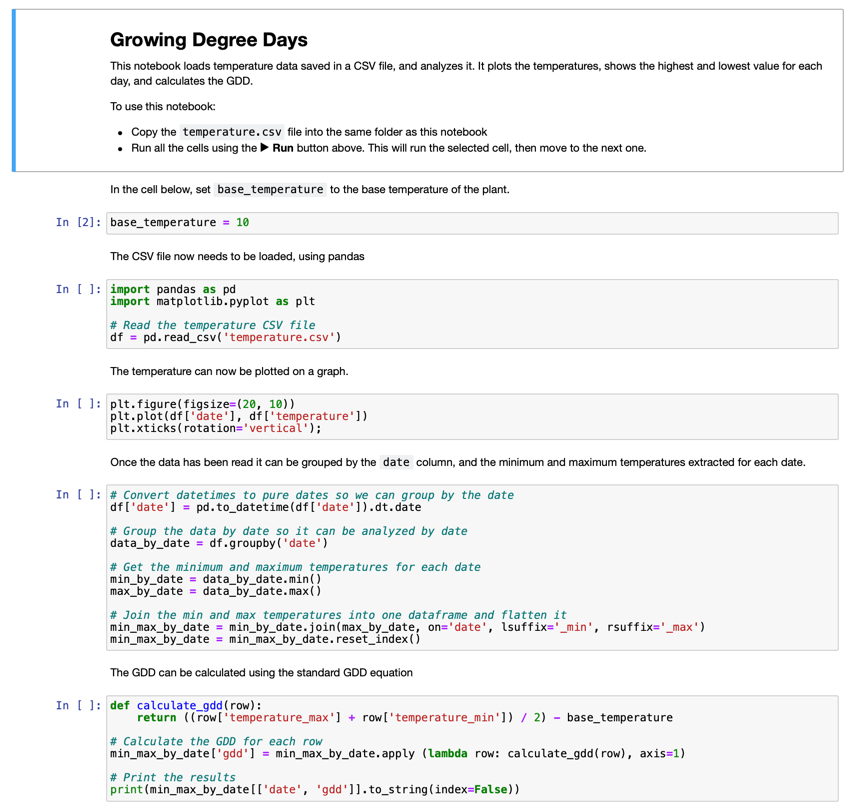

<!--
CO_OP_TRANSLATOR_METADATA:
{
  "original_hash": "1e21b012c6685f8bf73e0e76cdca3347",
  "translation_date": "2025-08-26T22:16:53+00:00",
  "source_file": "2-farm/lessons/1-predict-plant-growth/assignment.md",
  "language_code": "ur"
}
-->
# جے یوپیٹر نوٹ بک کے ذریعے GDD ڈیٹا کو بصری بنائیں

## ہدایات

اس سبق میں آپ نے IoT سینسر کے ذریعے GDD ڈیٹا جمع کیا۔ اچھے GDD ڈیٹا حاصل کرنے کے لیے، آپ کو کئی دنوں کا ڈیٹا جمع کرنا ہوگا۔ درجہ حرارت کے ڈیٹا کو بصری بنانے اور GDD کا حساب لگانے کے لیے آپ [جے یوپیٹر نوٹ بکس](https://jupyter.org) جیسے ٹولز استعمال کر سکتے ہیں۔

شروع کریں چند دنوں کا ڈیٹا جمع کرکے۔ آپ کو یہ یقینی بنانا ہوگا کہ آپ کا سرور کوڈ ہر وقت چل رہا ہو جب آپ کا IoT ڈیوائس چل رہا ہو، یا تو پاور مینجمنٹ کی ترتیبات کو ایڈجسٹ کرکے یا کچھ ایسا چلانے سے جیسے [یہ سسٹم کو فعال رکھنے والا Python اسکرپٹ](https://github.com/jaqsparow/keep-system-active)۔

جب آپ کے پاس درجہ حرارت کا ڈیٹا ہو، تو آپ اس ریپو میں موجود جے یوپیٹر نوٹ بک استعمال کر سکتے ہیں تاکہ اسے بصری بنایا جا سکے اور GDD کا حساب لگایا جا سکے۔ جے یوپیٹر نوٹ بکس کوڈ اور ہدایات کو *سیلز* نامی بلاکس میں مکس کرتے ہیں، اکثر Python میں کوڈ۔ آپ ہدایات پڑھ سکتے ہیں، پھر ہر کوڈ بلاک کو ایک ایک کرکے چلا سکتے ہیں۔ آپ کوڈ میں ترمیم بھی کر سکتے ہیں۔ اس نوٹ بک میں، مثال کے طور پر، آپ اپنے پودے کے لیے GDD کا حساب لگانے کے لیے استعمال ہونے والے بنیادی درجہ حرارت میں ترمیم کر سکتے ہیں۔

1. ایک فولڈر بنائیں جس کا نام `gdd-calculation` ہو۔

1. [gdd.ipynb](./code-notebook/gdd.ipynb) فائل ڈاؤن لوڈ کریں اور اسے `gdd-calculation` فولڈر میں کاپی کریں۔

1. `temperature.csv` فائل کو MQTT سرور سے کاپی کریں۔

1. `gdd-calculation` فولڈر میں ایک نیا Python ورچوئل ماحول بنائیں۔

1. جے یوپیٹر نوٹ بکس کے لیے کچھ pip پیکجز انسٹال کریں، ساتھ ہی ڈیٹا کو منظم اور بصری بنانے کے لیے درکار لائبریریاں:

    ```sh
    pip install --upgrade pip
    pip install pandas
    pip install matplotlib
    pip install jupyter
    ```

1. جے یوپیٹر میں نوٹ بک چلائیں:

    ```sh
    jupyter notebook gdd.ipynb
    ```

    جے یوپیٹر شروع ہوگا اور نوٹ بک کو آپ کے براؤزر میں کھولے گا۔ نوٹ بک میں موجود ہدایات پر عمل کریں تاکہ ماپے گئے درجہ حرارت کو بصری بنایا جا سکے اور بڑھتے ہوئے ڈگری دنوں کا حساب لگایا جا سکے۔

    

## معیار

| معیار | بہترین | مناسب | بہتری کی ضرورت |
| ------ | ------- | ------ | --------------- |
| ڈیٹا جمع کریں | کم از کم 2 مکمل دنوں کا ڈیٹا جمع کریں | کم از کم 1 مکمل دن کا ڈیٹا جمع کریں | کچھ ڈیٹا جمع کریں |
| GDD کا حساب لگائیں | نوٹ بک کو کامیابی سے چلائیں اور GDD کا حساب لگائیں | نوٹ بک کو کامیابی سے چلائیں | نوٹ بک کو چلانے میں ناکام |

---

**ڈسکلیمر**:  
یہ دستاویز AI ترجمہ سروس [Co-op Translator](https://github.com/Azure/co-op-translator) کا استعمال کرتے ہوئے ترجمہ کی گئی ہے۔ ہم درستگی کے لیے کوشش کرتے ہیں، لیکن براہ کرم آگاہ رہیں کہ خودکار ترجمے میں غلطیاں یا غیر درستیاں ہو سکتی ہیں۔ اصل دستاویز کو اس کی اصل زبان میں مستند ذریعہ سمجھا جانا چاہیے۔ اہم معلومات کے لیے، پیشہ ور انسانی ترجمہ کی سفارش کی جاتی ہے۔ ہم اس ترجمے کے استعمال سے پیدا ہونے والی کسی بھی غلط فہمی یا غلط تشریح کے ذمہ دار نہیں ہیں۔