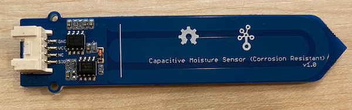

<!--
CO_OP_TRANSLATOR_METADATA:
{
  "original_hash": "0d55caa8c23d73635b7559102cd17b8a",
  "translation_date": "2025-08-26T22:49:16+00:00",
  "source_file": "2-farm/lessons/2-detect-soil-moisture/wio-terminal-soil-moisture.md",
  "language_code": "ur"
}
-->
# مٹی کی نمی کی پیمائش - Wio Terminal

اس سبق کے اس حصے میں، آپ اپنے Wio Terminal میں ایک capacitive soil moisture sensor شامل کریں گے اور اس سے اقدار پڑھیں گے۔

## ہارڈویئر

Wio Terminal کو ایک capacitive soil moisture sensor کی ضرورت ہے۔

جو سینسر آپ استعمال کریں گے وہ [Capacitive Soil Moisture Sensor](https://www.seeedstudio.com/Grove-Capacitive-Moisture-Sensor-Corrosion-Resistant.html) ہے، جو مٹی کی نمی کو مٹی کی capacitance کا پتہ لگا کر ماپتا ہے، جو ایک خاصیت ہے جو مٹی کی نمی کے بدلنے پر تبدیل ہوتی ہے۔ جیسے جیسے مٹی کی نمی بڑھتی ہے، وولٹیج کم ہو جاتا ہے۔

یہ ایک اینالاگ سینسر ہے، جو Wio Terminal کے اینالاگ پنز سے جڑتا ہے، اور ایک onboard ADC کا استعمال کرتے ہوئے 0-1,023 کی قدر پیدا کرتا ہے۔

### مٹی کی نمی کے سینسر کو جوڑیں

Grove soil moisture sensor کو Wio Terminal کے قابل ترتیب اینالاگ/ڈیجیٹل پورٹ سے جوڑا جا سکتا ہے۔

#### کام - مٹی کی نمی کے سینسر کو جوڑیں

مٹی کی نمی کے سینسر کو جوڑیں۔



1. Grove کیبل کے ایک سرے کو مٹی کی نمی کے سینسر کے ساکٹ میں ڈالیں۔ یہ صرف ایک ہی سمت میں جائے گا۔

1. Wio Terminal کو اپنے کمپیوٹر یا کسی اور پاور سپلائی سے منقطع کریں، اور Grove کیبل کے دوسرے سرے کو Wio Terminal کے دائیں جانب Grove ساکٹ سے جوڑیں جب آپ اسکرین کو دیکھ رہے ہوں۔ یہ پاور بٹن سے سب سے دور ساکٹ ہے۔


1. مٹی کی نمی کے سینسر کو مٹی میں ڈالیں۔ اس پر ایک 'سب سے اونچی پوزیشن لائن' ہے - سینسر کے پار ایک سفید لائن۔ سینسر کو اس لائن تک ڈالیں لیکن اس سے آگے نہ جائیں۔


1. اب آپ Wio Terminal کو اپنے کمپیوٹر سے جوڑ سکتے ہیں۔

## مٹی کی نمی کے سینسر کو پروگرام کریں

اب Wio Terminal کو منسلک مٹی کی نمی کے سینسر کو استعمال کرنے کے لیے پروگرام کیا جا سکتا ہے۔

### کام - مٹی کی نمی کے سینسر کو پروگرام کریں

ڈیوائس کو پروگرام کریں۔

1. PlatformIO کا استعمال کرتے ہوئے ایک نیا Wio Terminal پروجیکٹ بنائیں۔ اس پروجیکٹ کا نام `soil-moisture-sensor` رکھیں۔ `setup` فنکشن میں سیریل پورٹ کو ترتیب دینے کے لیے کوڈ شامل کریں۔

    > ⚠️ آپ [پروجیکٹ 1، سبق 1 میں PlatformIO پروجیکٹ بنانے کے لیے ہدایات](../../../1-getting-started/lessons/1-introduction-to-iot/wio-terminal.md#create-a-platformio-project) کا حوالہ دے سکتے ہیں اگر ضرورت ہو۔

1. اس سینسر کے لیے کوئی لائبریری موجود نہیں ہے، اس کے بجائے آپ اینالاگ پن سے Arduino کے بلٹ ان [`analogRead`](https://www.arduino.cc/reference/en/language/functions/analog-io/analogread/) فنکشن کا استعمال کرتے ہوئے پڑھ سکتے ہیں۔ پہلے اینالاگ پن کو ان پٹ کے لیے ترتیب دیں تاکہ اس سے اقدار پڑھی جا سکیں، `setup` فنکشن میں درج ذیل کو شامل کریں:

    ```cpp
    pinMode(A0, INPUT);
    ```

    یہ `A0` پن، جو مشترکہ اینالاگ/ڈیجیٹل پن ہے، کو ایک ان پٹ پن کے طور پر ترتیب دیتا ہے جس سے وولٹیج پڑھا جا سکتا ہے۔

1. `loop` فنکشن میں درج ذیل کو شامل کریں تاکہ اس پن سے وولٹیج پڑھا جا سکے:

    ```cpp
    int soil_moisture = analogRead(A0);
    ```

1. اس کوڈ کے نیچے درج ذیل کوڈ شامل کریں تاکہ قدر کو سیریل پورٹ پر پرنٹ کیا جا سکے:

    ```cpp
    Serial.print("Soil Moisture: ");
    Serial.println(soil_moisture);
    ```

1. آخر میں 10 سیکنڈ کی تاخیر شامل کریں:

    ```cpp
    delay(10000);
    ```

1. کوڈ کو Wio Terminal پر بنائیں اور اپلوڈ کریں۔

    > ⚠️ آپ [پروجیکٹ 1، سبق 1 میں PlatformIO پروجیکٹ بنانے کے لیے ہدایات](../../../1-getting-started/lessons/1-introduction-to-iot/wio-terminal.md#write-the-hello-world-app) کا حوالہ دے سکتے ہیں اگر ضرورت ہو۔

1. اپلوڈ ہونے کے بعد، آپ سیریل مانیٹر کا استعمال کرتے ہوئے مٹی کی نمی کی نگرانی کر سکتے ہیں۔ مٹی میں پانی شامل کریں، یا سینسر کو مٹی سے ہٹا دیں، اور قدر کو تبدیل ہوتے دیکھیں۔

    ```output
    > Executing task: platformio device monitor <
    
    --- Available filters and text transformations: colorize, debug, default, direct, hexlify, log2file, nocontrol, printable, send_on_enter, time
    --- More details at http://bit.ly/pio-monitor-filters
    --- Miniterm on /dev/cu.usbmodem1201  9600,8,N,1 ---
    --- Quit: Ctrl+C | Menu: Ctrl+T | Help: Ctrl+T followed by Ctrl+H ---
    Soil Moisture: 526
    Soil Moisture: 529
    Soil Moisture: 521
    Soil Moisture: 494
    Soil Moisture: 454
    Soil Moisture: 456
    Soil Moisture: 395
    Soil Moisture: 388
    Soil Moisture: 394
    Soil Moisture: 391
    ```

    اوپر دیے گئے مثال کے آؤٹ پٹ میں، آپ دیکھ سکتے ہیں کہ پانی شامل کرنے پر وولٹیج کم ہو جاتا ہے۔

> 💁 آپ اس کوڈ کو [code/wio-terminal](../../../../../2-farm/lessons/2-detect-soil-moisture/code/wio-terminal) فولڈر میں تلاش کر سکتے ہیں۔

😀 آپ کا مٹی کی نمی کے سینسر کا پروگرام کامیاب رہا!

---

**ڈسکلیمر**:  
یہ دستاویز AI ترجمہ سروس [Co-op Translator](https://github.com/Azure/co-op-translator) کا استعمال کرتے ہوئے ترجمہ کی گئی ہے۔ ہم درستگی کے لیے کوشش کرتے ہیں، لیکن براہ کرم آگاہ رہیں کہ خودکار ترجمے میں غلطیاں یا غیر درستیاں ہو سکتی ہیں۔ اصل دستاویز کو اس کی اصل زبان میں مستند ذریعہ سمجھا جانا چاہیے۔ اہم معلومات کے لیے، پیشہ ور انسانی ترجمہ کی سفارش کی جاتی ہے۔ ہم اس ترجمے کے استعمال سے پیدا ہونے والی کسی بھی غلط فہمی یا غلط تشریح کے ذمہ دار نہیں ہیں۔