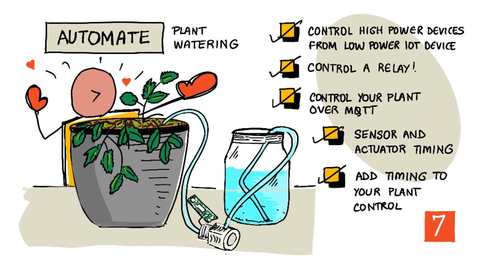

<!--
CO_OP_TRANSLATOR_METADATA:
{
  "original_hash": "f7bb24ba53fb627ddb38a8b24a05e594",
  "translation_date": "2025-08-26T22:24:01+00:00",
  "source_file": "2-farm/lessons/3-automated-plant-watering/README.md",
  "language_code": "ur"
}
-->
# خودکار پودوں کو پانی دینا



> خاکہ نگاری: [نیتیا نرسمہن](https://github.com/nitya)۔ بڑی تصویر دیکھنے کے لیے تصویر پر کلک کریں۔

یہ سبق [IoT for Beginners Project 2 - Digital Agriculture series](https://youtube.com/playlist?list=PLmsFUfdnGr3yCutmcVg6eAUEfsGiFXgcx) کے حصے کے طور پر [Microsoft Reactor](https://developer.microsoft.com/reactor/?WT.mc_id=academic-17441-jabenn) میں پڑھایا گیا۔

[](https://youtu.be/g9FfZwv9R58)

## لیکچر سے پہلے کا کوئز

[لیکچر سے پہلے کا کوئز](https://black-meadow-040d15503.1.azurestaticapps.net/quiz/13)

## تعارف

پچھلے سبق میں آپ نے مٹی کی نمی کو مانیٹر کرنا سیکھا۔ اس سبق میں آپ ایک خودکار پانی دینے کے نظام کے بنیادی اجزاء بنانا سیکھیں گے جو مٹی کی نمی کے مطابق کام کرے گا۔ آپ وقت کے بارے میں بھی سیکھیں گے - کہ سینسرز کو تبدیلیوں کا جواب دینے میں وقت لگ سکتا ہے، اور ایکچوئیٹرز کو ان خصوصیات کو تبدیل کرنے میں وقت لگ سکتا ہے جنہیں سینسرز ماپتے ہیں۔

اس سبق میں ہم درج ذیل موضوعات کا احاطہ کریں گے:

* [کم پاور IoT ڈیوائس سے ہائی پاور ڈیوائسز کو کنٹرول کریں](../../../../../2-farm/lessons/3-automated-plant-watering)
* [ریلے کو کنٹرول کریں](../../../../../2-farm/lessons/3-automated-plant-watering)
* [MQTT کے ذریعے اپنے پودے کو کنٹرول کریں](../../../../../2-farm/lessons/3-automated-plant-watering)
* [سینسر اور ایکچوئیٹر کا وقت](../../../../../2-farm/lessons/3-automated-plant-watering)
* [اپنے پودے کے کنٹرول سرور میں وقت شامل کریں](../../../../../2-farm/lessons/3-automated-plant-watering)

## کم پاور IoT ڈیوائس سے ہائی پاور ڈیوائسز کو کنٹرول کریں

IoT ڈیوائسز کم وولٹیج استعمال کرتی ہیں۔ یہ سینسرز اور کم پاور ایکچوئیٹرز جیسے LEDs کے لیے کافی ہے، لیکن بڑے ہارڈویئر جیسے کہ آبپاشی کے لیے استعمال ہونے والے واٹر پمپ کو کنٹرول کرنے کے لیے ناکافی ہے۔ یہاں تک کہ چھوٹے پمپ جو آپ گھریلو پودوں کے لیے استعمال کر سکتے ہیں، IoT ڈیوائس کے لیے بہت زیادہ کرنٹ کھینچتے ہیں اور بورڈ کو نقصان پہنچا سکتے ہیں۔

> 🎓 کرنٹ، جو ایمپئرز (A) میں ماپا جاتا ہے، وہ مقدار ہے جو بجلی ایک سرکٹ میں حرکت کرتی ہے۔ وولٹیج دھکا فراہم کرتا ہے، جبکہ کرنٹ دھکے کی مقدار کو ظاہر کرتا ہے۔ کرنٹ کے بارے میں مزید جاننے کے لیے [ویکیپیڈیا پر الیکٹرک کرنٹ کا صفحہ](https://wikipedia.org/wiki/Electric_current) دیکھیں۔

اس مسئلے کا حل یہ ہے کہ پمپ کو ایک بیرونی پاور سپلائی سے جوڑا جائے، اور ایک ایکچوئیٹر کے ذریعے پمپ کو آن کیا جائے، بالکل اسی طرح جیسے آپ ایک لائٹ کو آن کرتے ہیں۔ آپ کی انگلی کے ذریعے سوئچ کو پلٹنے کے لیے تھوڑی سی توانائی درکار ہوتی ہے، اور یہ لائٹ کو مین بجلی سے جوڑ دیتا ہے جو 110v/240v پر چلتی ہے۔


> 🎓 [مینز بجلی](https://wikipedia.org/wiki/Mains_electricity) وہ بجلی ہے جو گھروں اور کاروباروں کو قومی انفراسٹرکچر کے ذریعے فراہم کی جاتی ہے۔

✅ IoT ڈیوائسز عام طور پر 3.3V یا 5V فراہم کر سکتی ہیں، جو 1 ایمپئر (1A) سے کم کرنٹ کے ساتھ ہوتی ہیں۔ اس کا موازنہ مینز بجلی سے کریں جو اکثر 230V (شمالی امریکہ میں 120V اور جاپان میں 100V) پر ہوتی ہے، اور 30A تک کے کرنٹ کے ساتھ ڈیوائسز کو پاور فراہم کر سکتی ہے۔

ایسے کئی ایکچوئیٹرز موجود ہیں جو یہ کام کر سکتے ہیں، بشمول مکینیکل ڈیوائسز جو موجودہ سوئچز کے ساتھ منسلک ہو کر انہیں آن کرنے کے لیے انگلی کی نقل کرتے ہیں۔ سب سے زیادہ مقبول ایکچوئیٹر ریلے ہے۔

### ریلے

ریلے ایک الیکٹرو مکینیکل سوئچ ہے جو ایک برقی سگنل کو مکینیکل حرکت میں تبدیل کرتا ہے جو ایک سوئچ کو آن کرتا ہے۔ ریلے کا بنیادی حصہ ایک الیکٹرو میگنیٹ ہے۔

> 🎓 [الیکٹرو میگنیٹس](https://wikipedia.org/wiki/Electromagnet) وہ میگنیٹس ہیں جو تار کے کوائل میں بجلی گزار کر بنائے جاتے ہیں۔ جب بجلی آن ہوتی ہے، تو کوائل مقناطیسی ہو جاتا ہے۔ جب بجلی بند ہوتی ہے، تو کوائل اپنی مقناطیسیت کھو دیتا ہے۔


ریلے میں، کنٹرول سرکٹ الیکٹرو میگنیٹ کو پاور فراہم کرتا ہے۔ جب الیکٹرو میگنیٹ آن ہوتا ہے، تو یہ ایک لیور کو کھینچتا ہے جو ایک سوئچ کو حرکت دیتا ہے، رابطے بند کرتا ہے اور آؤٹ پٹ سرکٹ کو مکمل کرتا ہے۔


جب کنٹرول سرکٹ بند ہوتا ہے، تو الیکٹرو میگنیٹ بند ہو جاتا ہے، لیور کو چھوڑ دیتا ہے اور رابطے کھول دیتا ہے، آؤٹ پٹ سرکٹ کو بند کر دیتا ہے۔ ریلے ڈیجیٹل ایکچوئیٹرز ہیں - ریلے کو آن کرنے کے لیے ایک ہائی سگنل دیا جاتا ہے، اور اسے بند کرنے کے لیے ایک لو سگنل۔

آؤٹ پٹ سرکٹ اضافی ہارڈویئر کو پاور فراہم کرنے کے لیے استعمال کیا جا سکتا ہے، جیسے کہ آبپاشی کا نظام۔ IoT ڈیوائس ریلے کو آن کر سکتی ہے، آؤٹ پٹ سرکٹ کو مکمل کر سکتی ہے جو آبپاشی کے نظام کو پاور فراہم کرتا ہے، اور پودوں کو پانی ملتا ہے۔ پھر IoT ڈیوائس ریلے کو بند کر سکتی ہے، آبپاشی کے نظام کی پاور کاٹ سکتی ہے، اور پانی بند کر سکتی ہے۔


اوپر دی گئی ویڈیو میں، ایک ریلے آن ہو رہا ہے۔ ریلے پر ایک LED روشن ہو رہا ہے جو ظاہر کرتا ہے کہ یہ آن ہے (کچھ ریلے بورڈز پر یہ ظاہر کرنے کے لیے LEDs ہوتے ہیں کہ ریلے آن ہے یا آف)، اور پمپ کو پاور فراہم کی جا رہی ہے، جو پانی کو پودے میں پمپ کر رہا ہے۔

> 💁 ریلے کو اس طرح بھی استعمال کیا جا سکتا ہے کہ یہ دو آؤٹ پٹ سرکٹس کے درمیان سوئچ کرے، بجائے اس کے کہ ایک کو آن یا آف کرے۔ جیسے ہی لیور حرکت کرتا ہے، یہ ایک آؤٹ پٹ سرکٹ کو مکمل کرنے سے دوسرے آؤٹ پٹ سرکٹ کو مکمل کرنے کی طرف منتقل ہو جاتا ہے، عام طور پر ایک مشترکہ پاور کنکشن یا مشترکہ گراؤنڈ کنکشن کا اشتراک کرتے ہوئے۔

✅ تحقیق کریں: ریلے کی کئی اقسام ہیں، جن میں فرق یہ ہے کہ کنٹرول سرکٹ پاور فراہم کرنے پر ریلے کو آن کرتا ہے یا آف، یا متعدد آؤٹ پٹ سرکٹس۔ ان مختلف اقسام کے بارے میں جانیں۔

جب لیور حرکت کرتا ہے، تو آپ عام طور پر اسے الیکٹرو میگنیٹ کے ساتھ رابطہ کرتے ہوئے ایک واضح کلک کی آواز سن سکتے ہیں۔

> 💁 ایک ریلے کو اس طرح وائر کیا جا سکتا ہے کہ کنکشن بنانے سے اصل میں ریلے کی پاور ختم ہو جائے، جس سے ریلے بند ہو جائے، جو پھر ریلے کو دوبارہ آن کرنے کے لیے پاور بھیجتا ہے، اور یہ عمل جاری رہتا ہے۔ اس کا مطلب ہے کہ ریلے بہت تیزی سے کلک کرے گا، ایک بھنبھناہٹ کی آواز پیدا کرے گا۔ یہ وہ طریقہ ہے جس سے ابتدائی بجلی کے دروازے کی گھنٹیاں کام کرتی تھیں۔

### ریلے کی پاور

الیکٹرو میگنیٹ کو لیور کو کھینچنے اور فعال کرنے کے لیے زیادہ پاور کی ضرورت نہیں ہوتی، اسے 3.3V یا 5V آؤٹ پٹ کے ذریعے IoT ڈیوائس سے کنٹرول کیا جا سکتا ہے۔ آؤٹ پٹ سرکٹ زیادہ پاور لے جا سکتا ہے، ریلے پر منحصر ہے، بشمول مینز وولٹیج یا صنعتی استعمال کے لیے اس سے بھی زیادہ پاور لیولز۔ اس طرح ایک IoT ڈیوائس ایک آبپاشی کے نظام کو کنٹرول کر سکتی ہے، چاہے وہ ایک پودے کے لیے چھوٹا پمپ ہو یا ایک بڑے تجارتی فارم کے لیے ایک وسیع صنعتی نظام۔


اوپر دی گئی تصویر میں ایک گروو ریلے دکھایا گیا ہے۔ کنٹرول سرکٹ IoT ڈیوائس سے جڑتا ہے اور 3.3V یا 5V کا استعمال کرتے ہوئے ریلے کو آن یا آف کرتا ہے۔ آؤٹ پٹ سرکٹ میں دو ٹرمینلز ہیں، جن میں سے کوئی بھی پاور یا گراؤنڈ ہو سکتا ہے۔ آؤٹ پٹ سرکٹ 250V تک 10A کو ہینڈل کر سکتا ہے، جو مختلف مینز پاورڈ ڈیوائسز کے لیے کافی ہے۔ آپ ایسے ریلے بھی حاصل کر سکتے ہیں جو اس سے بھی زیادہ پاور لیولز کو ہینڈل کر سکتے ہیں۔


اوپر دی گئی تصویر میں، ایک پمپ کو ریلے کے ذریعے پاور فراہم کی جا رہی ہے۔ ایک سرخ تار USB پاور سپلائی کے +5V ٹرمینل کو ریلے کے آؤٹ پٹ سرکٹ کے ایک ٹرمینل سے جوڑ رہا ہے، اور دوسرا سرخ تار آؤٹ پٹ سرکٹ کے دوسرے ٹرمینل کو پمپ سے جوڑ رہا ہے۔ ایک کالا تار پمپ کو USB پاور سپلائی کے گراؤنڈ سے جوڑ رہا ہے۔ جب ریلے آن ہوتا ہے، تو یہ سرکٹ کو مکمل کرتا ہے، پمپ کو 5V بھیجتا ہے، اور پمپ کو آن کر دیتا ہے۔

## ریلے کو کنٹرول کریں

آپ اپنے IoT ڈیوائس سے ایک ریلے کو کنٹرول کر سکتے ہیں۔

### کام - ریلے کو کنٹرول کریں

اپنے IoT ڈیوائس کا استعمال کرتے ہوئے ریلے کو کنٹرول کرنے کے لیے متعلقہ گائیڈ پر عمل کریں:

* [Arduino - Wio Terminal](wio-terminal-relay.md)
* [سنگل بورڈ کمپیوٹر - Raspberry Pi](pi-relay.md)
* [سنگل بورڈ کمپیوٹر - ورچوئل ڈیوائس](virtual-device-relay.md)

## MQTT کے ذریعے اپنے پودے کو کنٹرول کریں

اب تک آپ کا ریلے IoT ڈیوائس کے ذریعے براہ راست ایک واحد مٹی کی نمی کی ریڈنگ پر مبنی کنٹرول ہو رہا تھا۔ ایک تجارتی آبپاشی کے نظام میں، کنٹرول لاجک کو مرکزی بنایا جاتا ہے، تاکہ یہ متعدد سینسرز کے ڈیٹا کی بنیاد پر پانی دینے کے فیصلے کر سکے، اور کسی بھی کنفیگریشن کو ایک ہی جگہ پر تبدیل کرنے کی اجازت دے۔ اس کی نقل کرنے کے لیے، آپ MQTT کے ذریعے ریلے کو کنٹرول کر سکتے ہیں۔

### کام - MQTT کے ذریعے ریلے کو کنٹرول کریں

1. اپنے `soil-moisture-sensor` پروجیکٹ میں MQTT سے جڑنے کے لیے متعلقہ MQTT لائبریریاں/پائپ پیکجز اور کوڈ شامل کریں۔ کلائنٹ ID کو `soilmoisturesensor_client` کے طور پر اپنے ID کے ساتھ پیش کریں۔

    > ⚠️ اگر ضرورت ہو تو [پروجیکٹ 1، سبق 4 میں MQTT سے جڑنے کے لیے ہدایات](../../../1-getting-started/lessons/4-connect-internet/README.md#connect-your-iot-device-to-mqtt) دیکھیں۔

1. مٹی کی نمی کی ترتیبات کے ساتھ ٹیلیمیٹری بھیجنے کے لیے متعلقہ ڈیوائس کوڈ شامل کریں۔ ٹیلیمیٹری میسج کے لیے پراپرٹی کا نام `soil_moisture` رکھیں۔

    > ⚠️ اگر ضرورت ہو تو [پروجیکٹ 1، سبق 4 میں MQTT کو ٹیلیمیٹری بھیجنے کے لیے ہدایات](../../../1-getting-started/lessons/4-connect-internet/README.md#send-telemetry-from-your-iot-device) دیکھیں۔

1. `soil-moisture-sensor-server` نامی فولڈر میں ٹیلیمیٹری کو سبسکرائب کرنے اور ریلے کو کنٹرول کرنے کے لیے کمانڈ بھیجنے کے لیے کچھ لوکل سرور کوڈ بنائیں۔ کمانڈ میسج میں پراپرٹی کا نام `relay_on` رکھیں، اور کلائنٹ ID کو `soilmoisturesensor_server` کے طور پر اپنے ID کے ساتھ پیش کریں۔ اس کوڈ کو اسی ساخت میں رکھیں جو آپ نے پروجیکٹ 1، سبق 4 کے لیے لکھا تھا کیونکہ آپ اس سبق میں اس کوڈ میں مزید اضافہ کریں گے۔

    > ⚠️ اگر ضرورت ہو تو [پروجیکٹ 1، سبق 4 میں MQTT کو ٹیلیمیٹری بھیجنے](../../../1-getting-started/lessons/4-connect-internet/README.md#write-the-server-code) اور [MQTT کے ذریعے کمانڈ بھیجنے](../../../1-getting-started/lessons/4-connect-internet/README.md#send-commands-to-the-mqtt-broker) کے لیے ہدایات دیکھیں۔

1. موصولہ کمانڈز سے ریلے کو کنٹرول کرنے کے لیے متعلقہ ڈیوائس کوڈ شامل کریں، میسج سے `relay_on` پراپرٹی کا استعمال کرتے ہوئے۔ اگر `soil_moisture` 450 سے زیادہ ہو تو `relay_on` کے لیے true بھیجیں، ورنہ false بھیجیں، بالکل اسی طرح جیسے آپ نے پہلے IoT ڈیوائس کے لیے لاجک شامل کیا تھا۔

    > ⚠️ اگر ضرورت ہو تو [پروجیکٹ 1، سبق 4 میں MQTT سے کمانڈز کا جواب دینے کے لیے ہدایات](../../../1-getting-started/lessons/4-connect-internet/README.md#handle-commands-on-the-iot-device) دیکھیں۔

> 💁 آپ اس کوڈ کو [code-mqtt](../../../../../2-farm/lessons/3-automated-plant-watering/code-mqtt) فولڈر میں تلاش کر سکتے ہیں۔

یقینی بنائیں کہ کوڈ آپ کے ڈیوائس اور لوکل سرور پر چل رہا ہے، اور مٹی کی نمی کی سطح کو تبدیل کر کے اسے آزمائیں، چاہے ورچوئل سینسر کے ذریعے بھیجے گئے اقدار کو تبدیل کر کے، یا مٹی میں پانی شامل کر کے یا سینسر کو مٹی سے ہٹا کر۔

## سینسر اور ایکچوئیٹر کا وقت

سبق 3 میں آپ نے ایک نائٹ لائٹ بنائی تھی - ایک LED جو کم روشنی کی سطح کا پتہ لگاتے ہی آن ہو جاتی ہے۔ روشنی کے سینسر نے روشنی کی سطح میں تبدیلی کو فوراً محسوس کیا، اور ڈیوائس جلدی سے جواب دے سکتی تھی، صرف `loop` فنکشن یا `while True:` لوپ کی تاخیر کی لمبائی سے محدود۔ ایک IoT ڈویلپر کے طور پر، آپ ہمیشہ اتنی تیز فیڈبیک لوپ پر انحصار نہیں کر سکتے۔

### مٹی کی نمی کے لیے وقت

اگر آپ نے پچھلے سبق میں مٹی کی نمی کے لیے ایک فزیکل سینسر استعمال کیا، تو آپ نے محسوس کیا ہوگا کہ جب آپ نے اپنے پودے کو پانی دیا تو مٹی کی نمی کی ریڈنگ کو کم ہونے میں چند سیکنڈ لگے۔ یہ اس لیے نہیں کہ سینسر سست ہے، بلکہ اس لیے کہ پانی کو مٹی میں جذب ہونے میں وقت لگتا ہے۔
💁 اگر آپ نے سینسر کے بہت قریب پانی دیا ہو تو آپ نے دیکھا ہوگا کہ ریڈنگ تیزی سے کم ہوئی اور پھر دوبارہ بڑھ گئی - یہ اس وجہ سے ہوتا ہے کہ سینسر کے قریب پانی باقی مٹی میں پھیل جاتا ہے، جس سے سینسر کے قریب مٹی کی نمی کم ہو جاتی ہے۔


اوپر دیے گئے خاکے میں، مٹی کی نمی کی پیمائش 658 دکھا رہی ہے۔ پودے کو پانی دیا جاتا ہے، لیکن یہ پیمائش فوراً تبدیل نہیں ہوتی کیونکہ پانی ابھی تک سینسر تک نہیں پہنچا۔ پانی دینے کا عمل ختم بھی ہو سکتا ہے اس سے پہلے کہ پانی سینسر تک پہنچے اور نمی کی نئی سطح کو ظاہر کرنے کے لیے قدر کم ہو۔

اگر آپ مٹی کی نمی کی سطح کی بنیاد پر ایک ریلے کے ذریعے آبپاشی کے نظام کو کنٹرول کرنے کے لیے کوڈ لکھ رہے ہیں، تو آپ کو اس تاخیر کو مدنظر رکھنا ہوگا اور اپنے IoT ڈیوائس میں زیادہ ذہین وقت بندی شامل کرنی ہوگی۔

✅ ایک لمحہ نکال کر سوچیں کہ آپ یہ کیسے کر سکتے ہیں۔

### سینسر اور ایکچیویٹر کی وقت بندی کو کنٹرول کریں

تصور کریں کہ آپ کو ایک کھیت کے لیے آبپاشی کا نظام بنانے کا کام دیا گیا ہے۔ مٹی کی قسم کی بنیاد پر، پودوں کے لیے مثالی مٹی کی نمی کی سطح ایک اینالاگ وولٹیج ریڈنگ 400-450 کے برابر پائی گئی ہے۔

آپ ڈیوائس کو اسی طرح پروگرام کر سکتے ہیں جیسے نائٹ لائٹ کو کیا جاتا ہے - جب تک سینسر 450 سے اوپر پڑھتا ہے، ایک ریلے کو آن کریں تاکہ پمپ کو آن کیا جا سکے۔ مسئلہ یہ ہے کہ پانی کو پمپ سے مٹی کے ذریعے سینسر تک پہنچنے میں وقت لگتا ہے۔ سینسر پانی کو اس وقت روک دے گا جب وہ 450 کی سطح کا پتہ لگائے گا، لیکن پانی کی سطح کم ہوتی رہے گی کیونکہ پمپ کیا گیا پانی مٹی میں جذب ہوتا رہے گا۔ نتیجہ ضائع شدہ پانی اور جڑوں کو نقصان پہنچنے کا خطرہ ہوگا۔

✅ یاد رکھیں - بہت زیادہ پانی پودوں کے لیے اتنا ہی نقصان دہ ہو سکتا ہے جتنا کہ بہت کم پانی، اور یہ ایک قیمتی وسیلہ بھی ضائع کرتا ہے۔

بہتر حل یہ ہے کہ یہ سمجھا جائے کہ ایکچیویٹر کے آن ہونے اور سینسر کی پڑھی جانے والی پراپرٹی کے تبدیل ہونے کے درمیان ایک تاخیر ہے۔ اس کا مطلب یہ ہے کہ نہ صرف سینسر کو قدر کی پیمائش کرنے سے پہلے کچھ دیر انتظار کرنا چاہیے، بلکہ ایکچیویٹر کو اگلی سینسر پیمائش سے پہلے کچھ دیر کے لیے بند رہنا چاہیے۔

ہر بار ریلے کو کتنی دیر تک آن رہنا چاہیے؟ بہتر ہے کہ احتیاط سے کام لیا جائے اور ریلے کو صرف تھوڑی دیر کے لیے آن کیا جائے، پھر پانی کو جذب ہونے کے لیے انتظار کریں، پھر نمی کی سطح دوبارہ چیک کریں۔ آخرکار، آپ ہمیشہ مزید پانی شامل کرنے کے لیے پمپ کو دوبارہ آن کر سکتے ہیں، لیکن آپ مٹی سے پانی نہیں نکال سکتے۔

> 💁 اس قسم کی وقت بندی کا کنٹرول خاص طور پر اس IoT ڈیوائس، پراپرٹی، اور سینسرز و ایکچیویٹرز پر منحصر ہے جو آپ استعمال کر رہے ہیں۔


مثال کے طور پر، میرے پاس ایک اسٹرابیری کا پودا ہے جس میں مٹی کی نمی کا سینسر اور ایک پمپ ہے جو ایک ریلے کے ذریعے کنٹرول ہوتا ہے۔ میں نے مشاہدہ کیا ہے کہ جب میں پانی شامل کرتا ہوں تو مٹی کی نمی کی پیمائش کو مستحکم ہونے میں تقریباً 20 سیکنڈ لگتے ہیں۔ اس کا مطلب ہے کہ مجھے ریلے کو بند کرنا ہوگا اور نمی کی سطح چیک کرنے سے پہلے 20 سیکنڈ انتظار کرنا ہوگا۔ میں کم پانی کو زیادہ پانی پر ترجیح دیتا ہوں - میں ہمیشہ پمپ کو دوبارہ آن کر سکتا ہوں، لیکن میں پودے سے پانی نہیں نکال سکتا۔


اس کا مطلب ہے کہ بہترین عمل ایک پانی دینے کا چکر ہوگا جو کچھ اس طرح ہو:

* پمپ کو 5 سیکنڈ کے لیے آن کریں
* 20 سیکنڈ انتظار کریں
* مٹی کی نمی چیک کریں
* اگر سطح اب بھی مطلوبہ سطح سے اوپر ہے، تو اوپر دیے گئے اقدامات کو دہرائیں

5 سیکنڈ پمپ کے لیے بہت زیادہ ہو سکتے ہیں، خاص طور پر اگر نمی کی سطح مطلوبہ سطح سے صرف تھوڑی سی اوپر ہو۔ بہترین طریقہ یہ ہے کہ اسے آزمائیں، پھر سینسر ڈیٹا کے ساتھ ایڈجسٹ کریں، ایک مستقل فیڈبیک لوپ کے ساتھ۔ یہ مزید تفصیلی وقت بندی کی طرف بھی لے جا سکتا ہے، جیسے کہ ہر 100 مطلوبہ مٹی کی نمی سے اوپر کے لیے پمپ کو 1 سیکنڈ کے لیے آن کرنا، بجائے ایک مقررہ 5 سیکنڈ کے۔

✅ تحقیق کریں: کیا دیگر وقت بندی کے عوامل ہیں؟ کیا پودے کو کسی بھی وقت پانی دیا جا سکتا ہے جب مٹی کی نمی بہت کم ہو، یا دن کے مخصوص اوقات ایسے ہیں جو پودوں کو پانی دینے کے لیے اچھے یا برے ہیں؟

> 💁 موسمی پیش گوئیوں کو بھی بیرونی کاشت کے لیے خودکار آبپاشی کے نظام کو کنٹرول کرتے وقت مدنظر رکھا جا سکتا ہے۔ اگر بارش کی توقع ہو، تو پانی دینے کو بارش کے ختم ہونے تک ملتوی کیا جا سکتا ہے۔ اس وقت مٹی اتنی نم ہو سکتی ہے کہ اسے پانی دینے کی ضرورت نہ ہو، جو بارش سے پہلے پانی دینے کے مقابلے میں زیادہ مؤثر ہے۔

## اپنے پودے کے کنٹرول سرور میں وقت بندی شامل کریں

سرور کوڈ کو پانی دینے کے چکر کی وقت بندی اور مٹی کی نمی کی سطح کے تبدیل ہونے کے انتظار کے ارد گرد کنٹرول شامل کرنے کے لیے ترمیم کی جا سکتی ہے۔ ریلے کی وقت بندی کو کنٹرول کرنے کے لیے سرور کی منطق یہ ہے:

1. ٹیلی میٹری پیغام موصول ہوا
1. مٹی کی نمی کی سطح چیک کریں
1. اگر سطح ٹھیک ہے، تو کچھ نہ کریں۔ اگر ریڈنگ بہت زیادہ ہے (یعنی مٹی کی نمی بہت کم ہے) تو:
    1. ریلے کو آن کرنے کا کمانڈ بھیجیں
    1. 5 سیکنڈ انتظار کریں
    1. ریلے کو بند کرنے کا کمانڈ بھیجیں
    1. مٹی کی نمی کی سطح کو مستحکم ہونے کے لیے 20 سیکنڈ انتظار کریں

پانی دینے کا چکر، ٹیلی میٹری پیغام موصول ہونے سے لے کر مٹی کی نمی کی سطح کو دوبارہ پروسیس کرنے کے لیے تیار ہونے تک، تقریباً 25 سیکنڈ لیتا ہے۔ ہم ہر 10 سیکنڈ میں مٹی کی نمی کی سطح بھیج رہے ہیں، لہذا ایک اوورلیپ ہے جہاں ایک پیغام موصول ہوتا ہے جبکہ سرور مٹی کی نمی کی سطح کو مستحکم ہونے کے لیے انتظار کر رہا ہوتا ہے، جو ایک اور پانی دینے کے چکر کو شروع کر سکتا ہے۔

اس کے حل کے دو اختیارات ہیں:

* IoT ڈیوائس کوڈ کو تبدیل کریں تاکہ ٹیلی میٹری صرف ہر منٹ میں بھیجی جائے، اس طرح پانی دینے کا چکر مکمل ہو جائے گا اس سے پہلے کہ اگلا پیغام بھیجا جائے
* پانی دینے کے چکر کے دوران ٹیلی میٹری سے ان سبسکرائب کریں

پہلا آپشن بڑے کھیتوں کے لیے ہمیشہ اچھا حل نہیں ہوتا۔ کسان مٹی کی نمی کی سطح کو اس وقت ریکارڈ کرنا چاہ سکتا ہے جب مٹی کو پانی دیا جا رہا ہو تاکہ بعد میں تجزیہ کے لیے، مثال کے طور پر، کھیت کے مختلف علاقوں میں پانی کے بہاؤ سے آگاہ ہونے کے لیے زیادہ ہدف شدہ آبپاشی کی رہنمائی کی جا سکے۔ دوسرا آپشن بہتر ہے - کوڈ صرف اس وقت ٹیلی میٹری کو نظر انداز کر رہا ہے جب وہ اسے استعمال نہیں کر سکتا، لیکن ٹیلی میٹری اب بھی موجود ہے دیگر سروسز کے لیے جو اسے سبسکرائب کر سکتی ہیں۔

> 💁 IoT ڈیٹا صرف ایک ڈیوائس سے ایک سروس تک نہیں بھیجا جاتا، بلکہ کئی ڈیوائسز ڈیٹا کو ایک بروکر کو بھیج سکتی ہیں، اور کئی سروسز بروکر سے ڈیٹا سن سکتی ہیں۔ مثال کے طور پر، ایک سروس مٹی کی نمی کے ڈیٹا کو سن سکتی ہے اور اسے بعد میں تجزیہ کے لیے ایک ڈیٹا بیس میں اسٹور کر سکتی ہے۔ ایک اور سروس اسی ٹیلی میٹری کو آبپاشی کے نظام کو کنٹرول کرنے کے لیے سن سکتی ہے۔

### کام - اپنے پودے کے کنٹرول سرور میں وقت بندی شامل کریں

اپنے سرور کوڈ کو اپ ڈیٹ کریں تاکہ ریلے کو 5 سیکنڈ کے لیے چلایا جا سکے، پھر 20 سیکنڈ انتظار کریں۔

1. اگر `soil-moisture-sensor-server` فولڈر VS Code میں پہلے سے کھلا نہیں ہے تو اسے کھولیں۔ یقینی بنائیں کہ ورچوئل ماحول فعال ہے۔

1. `app.py` فائل کھولیں

1. موجودہ امپورٹس کے نیچے `app.py` فائل میں درج ذیل کوڈ شامل کریں:

    ```python
    import threading
    ```

    یہ بیان Python لائبریریوں سے `threading` کو امپورٹ کرتا ہے، جو Python کو انتظار کے دوران دیگر کوڈ کو چلانے کی اجازت دیتا ہے۔

1. `handle_telemetry` فنکشن سے پہلے درج ذیل کوڈ شامل کریں جو سرور کوڈ کے ذریعے موصول ہونے والے ٹیلی میٹری پیغامات کو ہینڈل کرتا ہے:

    ```python
    water_time = 5
    wait_time = 20
    ```

    یہ بیان کرتا ہے کہ ریلے کو کتنی دیر تک چلانا ہے (`water_time`)، اور اس کے بعد مٹی کی نمی کو چیک کرنے کے لیے کتنی دیر تک انتظار کرنا ہے (`wait_time`)۔

1. اس کوڈ کے نیچے درج ذیل شامل کریں:

    ```python
    def send_relay_command(client, state):
        command = { 'relay_on' : state }
        print("Sending message:", command)
        client.publish(server_command_topic, json.dumps(command))
    ```

    یہ کوڈ ایک فنکشن `send_relay_command` کی وضاحت کرتا ہے جو MQTT کے ذریعے ریلے کو کنٹرول کرنے کے لیے کمانڈ بھیجتا ہے۔ ٹیلی میٹری کو ایک ڈکشنری کے طور پر بنایا جاتا ہے، پھر JSON سٹرنگ میں تبدیل کیا جاتا ہے۔ `state` میں پاس کی گئی ویلیو یہ طے کرتی ہے کہ ریلے آن ہونا چاہیے یا آف۔

1. `send_relay_code` فنکشن کے بعد درج ذیل کوڈ شامل کریں:

    ```python
    def control_relay(client):
        print("Unsubscribing from telemetry")
        mqtt_client.unsubscribe(client_telemetry_topic)
    
        send_relay_command(client, True)
        time.sleep(water_time)
        send_relay_command(client, False)
    
        time.sleep(wait_time)
    
        print("Subscribing to telemetry")
        mqtt_client.subscribe(client_telemetry_topic)
    ```

    یہ ایک فنکشن کی وضاحت کرتا ہے جو مطلوبہ وقت بندی کی بنیاد پر ریلے کو کنٹرول کرتا ہے۔ یہ ٹیلی میٹری سے ان سبسکرائب کرنے سے شروع ہوتا ہے تاکہ پانی دینے کے دوران مٹی کی نمی کے پیغامات پروسیس نہ ہوں۔ اس کے بعد یہ ریلے کو آن کرنے کا کمانڈ بھیجتا ہے۔ پھر یہ `water_time` کے لیے انتظار کرتا ہے اس سے پہلے کہ ریلے کو بند کرنے کا کمانڈ بھیجے۔ آخر میں یہ مٹی کی نمی کی سطح کو مستحکم ہونے کے لیے `wait_time` سیکنڈ انتظار کرتا ہے۔ اس کے بعد یہ دوبارہ ٹیلی میٹری کو سبسکرائب کرتا ہے۔

1. `handle_telemetry` فنکشن کو درج ذیل میں تبدیل کریں:

    ```python
    def handle_telemetry(client, userdata, message):
        payload = json.loads(message.payload.decode())
        print("Message received:", payload)
    
        if payload['soil_moisture'] > 450:
            threading.Thread(target=control_relay, args=(client,)).start()
    ```

    یہ کوڈ مٹی کی نمی کی سطح کو چیک کرتا ہے۔ اگر یہ 450 سے زیادہ ہے، تو مٹی کو پانی دینے کی ضرورت ہے، لہذا یہ `control_relay` فنکشن کو کال کرتا ہے۔ یہ فنکشن ایک علیحدہ تھریڈ پر چلتا ہے، جو بیک گراؤنڈ میں چل رہا ہوتا ہے۔

1. یقینی بنائیں کہ آپ کا IoT ڈیوائس چل رہا ہے، پھر اس کوڈ کو چلائیں۔ مٹی کی نمی کی سطح کو تبدیل کریں اور دیکھیں کہ ریلے کے ساتھ کیا ہوتا ہے - یہ 5 سیکنڈ کے لیے آن ہونا چاہیے پھر کم از کم 20 سیکنڈ کے لیے بند رہنا چاہیے، صرف اس وقت آن ہونا چاہیے جب مٹی کی نمی کی سطح کافی نہ ہو۔

    ```output
    (.venv) ➜  soil-moisture-sensor-server ✗ python app.py
    Message received: {'soil_moisture': 457}
    Unsubscribing from telemetry
    Sending message: {'relay_on': True}
    Sending message: {'relay_on': False}
    Subscribing to telemetry
    Message received: {'soil_moisture': 302}
    ```

    ایک نقلی آبپاشی کے نظام میں اس کی جانچ کرنے کا ایک اچھا طریقہ یہ ہے کہ خشک مٹی استعمال کریں، پھر ریلے کے آن ہونے کے دوران دستی طور پر پانی ڈالیں، اور جب ریلے بند ہو جائے تو پانی ڈالنا بند کریں۔

> 💁 آپ اس کوڈ کو [code-timing](../../../../../2-farm/lessons/3-automated-plant-watering/code-timing) فولڈر میں تلاش کر سکتے ہیں۔

> 💁 اگر آپ ایک حقیقی آبپاشی کا نظام بنانے کے لیے پمپ استعمال کرنا چاہتے ہیں، تو آپ ایک [6V واٹر پمپ](https://www.seeedstudio.com/6V-Mini-Water-Pump-p-1945.html) کے ساتھ ایک [USB ٹرمینل پاور سپلائی](https://www.adafruit.com/product/3628) استعمال کر سکتے ہیں۔ یقینی بنائیں کہ پمپ کو یا تو پاور یا آؤٹ پٹ ریلے کے ذریعے جڑا ہوا ہے۔

---

## 🚀 چیلنج

کیا آپ کسی اور IoT یا دیگر برقی آلات کے بارے میں سوچ سکتے ہیں جن میں ایسا مسئلہ ہو جہاں ایکچیویٹر کے نتائج سینسر تک پہنچنے میں وقت لیتے ہوں؟ آپ کے گھر یا اسکول میں شاید کچھ ایسے آلات ہوں۔

* وہ کون سی پراپرٹیز ماپتے ہیں؟
* ایکچیویٹر کے استعمال کے بعد پراپرٹی کو تبدیل ہونے میں کتنا وقت لگتا ہے؟
* کیا یہ ٹھیک ہے کہ پراپرٹی مطلوبہ قدر سے آگے بڑھ جائے؟
* اگر ضرورت ہو تو اسے مطلوبہ قدر پر کیسے واپس لایا جا سکتا ہے؟

## لیکچر کے بعد کا کوئز

[لیکچر کے بعد کا کوئز](https://black-meadow-040d15503.1.azurestaticapps.net/quiz/14)

## جائزہ اور خود مطالعہ

* ریلے کے بارے میں مزید پڑھیں، بشمول ان کے تاریخی استعمال ٹیلیفون ایکسچینجز میں، [ریلے ویکیپیڈیا صفحہ](https://wikipedia.org/wiki/Relay) پر۔

## اسائنمنٹ

[زیادہ مؤثر پانی دینے کا چکر بنائیں](assignment.md)

---

**ڈسکلیمر**:  
یہ دستاویز AI ترجمہ سروس [Co-op Translator](https://github.com/Azure/co-op-translator) کا استعمال کرتے ہوئے ترجمہ کی گئی ہے۔ ہم درستگی کے لیے کوشش کرتے ہیں، لیکن براہ کرم آگاہ رہیں کہ خودکار ترجمے میں غلطیاں یا غیر درستیاں ہو سکتی ہیں۔ اصل دستاویز کو اس کی اصل زبان میں مستند ذریعہ سمجھا جانا چاہیے۔ اہم معلومات کے لیے، پیشہ ور انسانی ترجمہ کی سفارش کی جاتی ہے۔ ہم اس ترجمے کے استعمال سے پیدا ہونے والی کسی بھی غلط فہمی یا غلط تشریح کے ذمہ دار نہیں ہیں۔