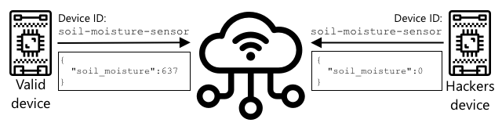

<!--
CO_OP_TRANSLATOR_METADATA:
{
  "original_hash": "81c437c568eee1b0dda1f04e88150d37",
  "translation_date": "2025-08-26T23:04:10+00:00",
  "source_file": "2-farm/lessons/6-keep-your-plant-secure/README.md",
  "language_code": "ur"
}
-->
# اپنے پودے کو محفوظ رکھیں


> خاکہ [نیتیا نرسمہن](https://github.com/nitya) کی طرف سے۔ بڑی تصویر دیکھنے کے لیے تصویر پر کلک کریں۔

## لیکچر سے پہلے کا کوئز

[لیکچر سے پہلے کا کوئز](https://black-meadow-040d15503.1.azurestaticapps.net/quiz/19)

## تعارف

پچھلے چند اسباق میں آپ نے ایک مٹی کی نگرانی کرنے والا IoT آلہ بنایا اور اسے کلاؤڈ سے منسلک کیا۔ لیکن اگر حریف کسان کے لیے کام کرنے والے ہیکرز آپ کے IoT آلات پر قابو پا لیں تو کیا ہوگا؟ اگر وہ مٹی کی نمی کی زیادہ ریڈنگز بھیجیں تاکہ آپ کے پودوں کو کبھی پانی نہ ملے، یا آپ کے پانی کے نظام کو مسلسل چلنے پر مجبور کر دیں، جس سے آپ کے پودے زیادہ پانی کی وجہ سے مر جائیں اور آپ کو پانی کے بل میں بھاری نقصان ہو؟

اس سبق میں آپ IoT آلات کو محفوظ بنانے کے بارے میں سیکھیں گے۔ چونکہ یہ اس پروجیکٹ کا آخری سبق ہے، آپ یہ بھی سیکھیں گے کہ اپنے کلاؤڈ وسائل کو کیسے صاف کریں تاکہ ممکنہ اخراجات کم کیے جا سکیں۔

اس سبق میں ہم درج ذیل موضوعات کا احاطہ کریں گے:

* [آپ کو IoT آلات کو محفوظ بنانے کی ضرورت کیوں ہے؟](../../../../../2-farm/lessons/6-keep-your-plant-secure)
* [کرپٹوگرافی](../../../../../2-farm/lessons/6-keep-your-plant-secure)
* [اپنے IoT آلات کو محفوظ بنائیں](../../../../../2-farm/lessons/6-keep-your-plant-secure)
* [X.509 سرٹیفکیٹ بنائیں اور استعمال کریں](../../../../../2-farm/lessons/6-keep-your-plant-secure)

> 🗑 یہ اس پروجیکٹ کا آخری سبق ہے، لہذا سبق اور اسائنمنٹ مکمل کرنے کے بعد، اپنے کلاؤڈ سروسز کو صاف کرنا نہ بھولیں۔ آپ کو اسائنمنٹ مکمل کرنے کے لیے ان سروسز کی ضرورت ہوگی، لہذا پہلے اسائنمنٹ مکمل کریں۔
>
> اگر ضرورت ہو تو [اپنے پروجیکٹ کو صاف کرنے کی گائیڈ](../../../clean-up.md) سے ہدایات حاصل کریں۔

## آپ کو IoT آلات کو محفوظ بنانے کی ضرورت کیوں ہے؟

IoT سیکیورٹی کا مطلب یہ ہے کہ صرف متوقع آلات آپ کے کلاؤڈ IoT سروس سے جڑ سکیں اور ٹیلی میٹری بھیج سکیں، اور صرف آپ کی کلاؤڈ سروس آپ کے آلات کو کمانڈ بھیج سکے۔ IoT ڈیٹا ذاتی بھی ہو سکتا ہے، جیسے طبی یا نجی ڈیٹا، اس لیے آپ کی پوری ایپلیکیشن کو سیکیورٹی کو مدنظر رکھنا ہوگا تاکہ یہ ڈیٹا لیک نہ ہو۔

اگر آپ کی IoT ایپلیکیشن محفوظ نہیں ہے، تو کئی خطرات ہو سکتے ہیں:

* ایک جعلی آلہ غلط ڈیٹا بھیج سکتا ہے، جس کی وجہ سے آپ کی ایپلیکیشن غلط ردعمل دے سکتی ہے۔ مثال کے طور پر، وہ مسلسل مٹی کی زیادہ نمی کی ریڈنگز بھیج سکتے ہیں، جس کی وجہ سے آپ کا آبپاشی نظام کبھی آن نہ ہو اور آپ کے پودے پانی کی کمی سے مر جائیں۔
* غیر مجاز صارفین IoT آلات سے ڈیٹا پڑھ سکتے ہیں، جس میں ذاتی یا کاروباری اہم ڈیٹا شامل ہو سکتا ہے۔
* ہیکرز آلات کو ایسے طریقے سے کنٹرول کرنے کے لیے کمانڈ بھیج سکتے ہیں جو آلے یا منسلک ہارڈویئر کو نقصان پہنچا سکتا ہے۔
* IoT آلے سے جڑ کر، ہیکرز اضافی نیٹ ورکس تک رسائی حاصل کر سکتے ہیں اور نجی سسٹمز تک پہنچ سکتے ہیں۔
* بدنیتی پر مبنی صارفین ذاتی ڈیٹا تک رسائی حاصل کر سکتے ہیں اور اسے بلیک میل کے لیے استعمال کر سکتے ہیں۔

یہ حقیقی دنیا کے منظرنامے ہیں، اور یہ اکثر ہوتے ہیں۔ کچھ مثالیں پہلے کے اسباق میں دی گئی تھیں، لیکن یہاں کچھ اور ہیں:

* 2018 میں، ہیکرز نے ایک مچھلی کے ٹینک کے تھرموسٹیٹ پر کھلے وائی فائی ایکسیس پوائنٹ کا استعمال کرتے ہوئے ایک کیسینو کے نیٹ ورک تک رسائی حاصل کی اور ڈیٹا چوری کیا۔ [The Hacker News - Casino Gets Hacked Through Its Internet-Connected Fish Tank Thermometer](https://thehackernews.com/2018/04/iot-hacking-thermometer.html)
* 2016 میں، میرائی بوٹ نیٹ نے Dyn، ایک انٹرنیٹ سروس پرووائیڈر، پر ڈینائل آف سروس حملہ کیا، جس سے انٹرنیٹ کے بڑے حصے بند ہو گئے۔ اس بوٹ نیٹ نے DVRs اور کیمروں جیسے IoT آلات کو استعمال کیا جو ڈیفالٹ یوزر نیم اور پاس ورڈ استعمال کرتے تھے، اور وہاں سے حملہ کیا۔ [The Guardian - DDoS attack that disrupted internet was largest of its kind in history, experts say](https://www.theguardian.com/technology/2016/oct/26/ddos-attack-dyn-mirai-botnet)
* Spiral Toys نے اپنے CloudPets کنیکٹڈ کھلونوں کے صارفین کا ڈیٹا انٹرنیٹ پر عوامی طور پر دستیاب رکھا۔ [Troy Hunt - Data from connected CloudPets teddy bears leaked and ransomed, exposing kids' voice messages](https://www.troyhunt.com/data-from-connected-cloudpets-teddy-bears-leaked-and-ransomed-exposing-kids-voice-messages/).
* Strava نے دوڑنے والوں کو ٹیگ کیا جن کے پاس سے آپ گزرے اور ان کے راستے دکھائے، جس سے اجنبیوں کو مؤثر طریقے سے یہ معلوم ہو سکتا تھا کہ آپ کہاں رہتے ہیں۔ [Kim Komndo - Fitness app could lead a stranger right to your home — change this setting](https://www.komando.com/security-privacy/strava-fitness-app-privacy/755349/).

✅ تحقیق کریں: مزید IoT ہیکس اور IoT ڈیٹا کی خلاف ورزیوں کی مثالیں تلاش کریں، خاص طور پر ذاتی اشیاء جیسے انٹرنیٹ سے جڑے ٹوتھ برش یا اسکیلز کے ساتھ۔ ان ہیکس کے متاثرین یا صارفین پر کیا اثرات ہو سکتے ہیں، اس پر غور کریں۔

> 💁 سیکیورٹی ایک بہت بڑا موضوع ہے، اور یہ سبق صرف بنیادی باتوں پر روشنی ڈالے گا، خاص طور پر آپ کے آلے کو کلاؤڈ سے منسلک کرنے کے حوالے سے۔ دیگر موضوعات جیسے ڈیٹا کی منتقلی کے دوران تبدیلیوں کی نگرانی، آلات کو براہ راست ہیک کرنا، یا آلات کی کنفیگریشن میں تبدیلیاں شامل نہیں ہوں گی۔ IoT ہیکنگ اتنا بڑا خطرہ ہے کہ [Azure Defender for IoT](https://azure.microsoft.com/services/azure-defender-for-iot/?WT.mc_id=academic-17441-jabenn) جیسے ٹولز تیار کیے گئے ہیں۔ یہ ٹولز آپ کے کمپیوٹر پر موجود اینٹی وائرس اور سیکیورٹی ٹولز کی طرح ہیں، لیکن چھوٹے، کم طاقت والے IoT آلات کے لیے ڈیزائن کیے گئے ہیں۔

## کرپٹوگرافی

جب کوئی آلہ IoT سروس سے جڑتا ہے، تو یہ اپنی شناخت کے لیے ایک ID استعمال کرتا ہے۔ مسئلہ یہ ہے کہ اس ID کو کلون کیا جا سکتا ہے - ایک ہیکر ایک بدنیتی پر مبنی آلہ سیٹ کر سکتا ہے جو ایک حقیقی آلے کی طرح ID استعمال کرتا ہے لیکن جعلی ڈیٹا بھیجتا ہے۔



اس کا حل یہ ہے کہ بھیجے جانے والے ڈیٹا کو ایک خفیہ شکل میں تبدیل کیا جائے، جس کے لیے ایک ایسی ویلیو استعمال کی جائے جو صرف آلے اور کلاؤڈ کو معلوم ہو۔ اس عمل کو *انکرپشن* کہا جاتا ہے، اور ڈیٹا کو انکرپٹ کرنے کے لیے استعمال ہونے والی ویلیو کو *انکرپشن کی* کہا جاتا ہے۔


کلاؤڈ سروس پھر ڈیٹا کو ایک قابلِ پڑھائی شکل میں تبدیل کر سکتی ہے، جسے *ڈی کرپشن* کہا جاتا ہے، اور یہ یا تو وہی انکرپشن کی استعمال کر کے یا ایک *ڈی کرپشن کی* کے ذریعے کیا جاتا ہے۔ اگر انکرپٹڈ پیغام کو کی کے ذریعے ڈی کرپٹ نہ کیا جا سکے، تو آلہ ہیک ہو چکا ہے اور پیغام مسترد کر دیا جاتا ہے۔

ڈیٹا کو انکرپٹ اور ڈی کرپٹ کرنے کی تکنیک کو *کرپٹوگرافی* کہا جاتا ہے۔

### ابتدائی کرپٹوگرافی

کرپٹوگرافی کی ابتدائی اقسام سبسٹیٹیوشن سائفرز تھیں، جو 3,500 سال پرانی ہیں۔ سبسٹیٹیوشن سائفرز میں ایک حرف کو دوسرے سے تبدیل کیا جاتا ہے۔ مثال کے طور پر، [سیزر سائفر](https://wikipedia.org/wiki/Caesar_cipher) میں حروف تہجی کو ایک مقررہ مقدار سے شفٹ کیا جاتا ہے، اور صرف پیغام بھیجنے والے اور وصول کنندہ کو معلوم ہوتا ہے کہ کتنے حروف شفٹ کیے گئے ہیں۔

[ویجینیر سائفر](https://wikipedia.org/wiki/Vigenère_cipher) نے اس کو مزید آگے بڑھایا، جہاں الفاظ کو متن انکرپٹ کرنے کے لیے استعمال کیا گیا، تاکہ اصل متن کے ہر حرف کو مختلف مقدار سے شفٹ کیا جائے، بجائے اس کے کہ ہمیشہ ایک ہی تعداد میں شفٹ کیا جائے۔

کرپٹوگرافی کو مختلف مقاصد کے لیے استعمال کیا گیا، جیسے قدیم میسوپوٹامیا میں برتن کے گلیز کے نسخے کی حفاظت، بھارت میں خفیہ محبت کے خطوط لکھنے، یا قدیم مصری جادوئی منتر کو خفیہ رکھنے کے لیے۔

### جدید کرپٹوگرافی

جدید کرپٹوگرافی بہت زیادہ ترقی یافتہ ہے، اور ابتدائی طریقوں کے مقابلے میں اسے توڑنا زیادہ مشکل ہے۔ جدید کرپٹوگرافی پیچیدہ ریاضی کا استعمال کرتی ہے تاکہ ڈیٹا کو انکرپٹ کیا جا سکے، اور اس میں اتنے زیادہ ممکنہ کیز ہوتے ہیں کہ برٹ فورس حملے ممکن نہیں رہتے۔

کرپٹوگرافی کو محفوظ مواصلات کے لیے مختلف طریقوں سے استعمال کیا جاتا ہے۔ اگر آپ یہ صفحہ GitHub پر پڑھ رہے ہیں، تو آپ نے دیکھا ہوگا کہ ویب سائٹ کا پتہ *HTTPS* سے شروع ہوتا ہے، جس کا مطلب ہے کہ آپ کے براؤزر اور GitHub کے ویب سرورز کے درمیان مواصلات انکرپٹڈ ہیں۔ اگر کوئی آپ کے براؤزر اور GitHub کے درمیان بہنے والے انٹرنیٹ ٹریفک کو پڑھنے کی کوشش کرے، تو وہ ڈیٹا نہیں پڑھ سکے گا کیونکہ یہ انکرپٹڈ ہے۔ آپ کا کمپیوٹر آپ کی ہارڈ ڈرائیو پر موجود تمام ڈیٹا کو بھی انکرپٹ کر سکتا ہے تاکہ اگر کوئی اسے چرا لے، تو وہ آپ کے ڈیٹا کو آپ کے پاس ورڈ کے بغیر نہ پڑھ سکے۔

> 🎓 HTTPS کا مطلب ہے HyperText Transfer Protocol **Secure**

بدقسمتی سے، سب کچھ محفوظ نہیں ہے۔ کچھ آلات میں کوئی سیکیورٹی نہیں ہوتی، کچھ آسانی سے توڑنے والی کیز استعمال کرتے ہیں، یا کبھی کبھی ایک ہی قسم کے تمام آلات ایک ہی کی استعمال کرتے ہیں۔ بہت ذاتی IoT آلات کے ایسے واقعات سامنے آئے ہیں جن میں تمام آلات کے پاس وائی فائی یا بلوٹوتھ کے ذریعے جڑنے کے لیے ایک ہی پاس ورڈ ہوتا ہے۔ اگر آپ اپنے آلے سے جڑ سکتے ہیں، تو آپ کسی اور کے آلے سے بھی جڑ سکتے ہیں۔ ایک بار جڑنے کے بعد آپ بہت نجی ڈیٹا تک رسائی حاصل کر سکتے ہیں، یا ان کے آلے پر کنٹرول حاصل کر سکتے ہیں۔

> 💁 جدید کرپٹوگرافی کی پیچیدگیوں اور اس دعوے کے باوجود کہ انکرپشن کو توڑنے میں اربوں سال لگ سکتے ہیں، کوانٹم کمپیوٹنگ کے عروج نے یہ امکان پیدا کر دیا ہے کہ تمام معلوم انکرپشن کو بہت کم وقت میں توڑا جا سکتا ہے!

### سمِیٹرک اور اسِمِیٹرک کیز

انکرپشن دو اقسام کی ہوتی ہے - سمِیٹرک اور اسِمِیٹرک۔

**سمِیٹرک** انکرپشن ایک ہی کی کو ڈیٹا انکرپٹ اور ڈی کرپٹ کرنے کے لیے استعمال کرتی ہے۔ بھیجنے والے اور وصول کنندہ دونوں کو ایک ہی کی معلوم ہونی چاہیے۔ یہ کم محفوظ قسم ہے، کیونکہ کی کو کسی نہ کسی طرح شیئر کرنا پڑتا ہے۔ بھیجنے والے کو پیغام انکرپٹ کرنے سے پہلے وصول کنندہ کو کی بھیجنی پڑ سکتی ہے۔


اگر کی ٹرانزٹ میں چوری ہو جائے، یا بھیجنے والے یا وصول کنندہ کو ہیک کر لیا جائے اور کی معلوم ہو جائے، تو انکرپشن کو توڑا جا سکتا ہے۔


**اسِمِیٹرک** انکرپشن دو کیز استعمال کرتی ہے - ایک انکرپشن کی اور ایک ڈی کرپشن کی، جنہیں پبلک/پرائیویٹ کی جوڑا کہا جاتا ہے۔ پبلک کی پیغام انکرپٹ کرنے کے لیے استعمال ہوتی ہے، لیکن اسے ڈی کرپٹ کرنے کے لیے استعمال نہیں کیا جا سکتا، جبکہ پرائیویٹ کی پیغام کو ڈی کرپٹ کرنے کے لیے استعمال ہوتی ہے لیکن اسے انکرپٹ کرنے کے لیے استعمال نہیں کیا جا سکتا۔


وصول کنندہ اپنی پبلک کی شیئر کرتا ہے، اور بھیجنے والا اسے پیغام انکرپٹ کرنے کے لیے استعمال کرتا ہے۔ ایک بار پیغام بھیج دیا جائے، تو وصول کنندہ اسے اپنی پرائیویٹ کی کے ذریعے ڈی کرپٹ کرتا ہے۔ اسِمِیٹرک انکرپشن زیادہ محفوظ ہے کیونکہ پرائیویٹ کی وصول کنندہ کے پاس نجی رہتی ہے اور کبھی شیئر نہیں کی جاتی۔ پبلک کی کسی کے پاس بھی ہو سکتی ہے کیونکہ یہ صرف پیغامات انکرپٹ کرنے کے لیے استعمال ہوتی ہے۔

سمِیٹرک انکرپشن اسِمِیٹرک انکرپشن سے تیز ہے، لیکن اسِمِیٹرک زیادہ محفوظ ہے۔ کچھ سسٹمز دونوں کا استعمال کرتے ہیں - اسِمِیٹرک انکرپشن کو سمِیٹرک کی انکرپٹ اور شیئر کرنے کے لیے استعمال کرتے ہیں، اور پھر سمِیٹرک کی کو تمام ڈیٹا انکرپٹ کرنے کے لیے استعمال کرتے ہیں۔ یہ بھیجنے والے اور وصول کنندہ کے درمیان سمِیٹرک کی کو شیئر کرنے کو زیادہ محفوظ بناتا ہے، اور ڈیٹا انکرپٹ اور ڈی کرپٹ کرنے میں تیزی لاتا ہے۔

## اپنے IoT آلات کو محفوظ بنائیں

IoT آلات کو سمِیٹرک یا اسِمِیٹرک انکرپشن کے ذریعے محفوظ بنایا جا سکتا ہے۔ سمِیٹرک آسان ہے، لیکن کم محفوظ۔

### سمِیٹرک کیز

جب آپ نے اپنے IoT آلے کو IoT Hub کے ساتھ تعامل کرنے کے لیے سیٹ اپ کیا، تو آپ نے ایک کنکشن اسٹرنگ استعمال کی۔ ایک مثال کنکشن اسٹرنگ یہ ہے:

```output
HostName=soil-moisture-sensor.azure-devices.net;DeviceId=soil-moisture-sensor;SharedAccessKey=Bhry+ind7kKEIDxubK61RiEHHRTrPl7HUow8cEm/mU0=
```

یہ کنکشن اسٹرنگ تین حصوں پر مشتمل ہے، جو سیمی کولنز کے ذریعے الگ کیے گئے ہیں، اور ہر حصہ ایک کی اور ایک ویلیو پر مشتمل ہے:

| کی | ویلیو | وضاحت |
| --- | ----- | ----------- |
| HostName | `soil-moisture-sensor.azure-devices.net` | IoT Hub کا URL |
| DeviceId | `soil-moisture-sensor` | آلے کا منفرد ID |
| SharedAccessKey | `Bhry+ind7kKEIDxubK61RiEHHRTrPl7HUow8cEm/mU0=` | ایک سمِیٹرک کی جو آلے اور IoT Hub کو معلوم ہے |

کنکشن اسٹرنگ کا آخری حصہ، `SharedAccessKey`، وہ سمِیٹرک کی ہے جو آلے اور IoT Hub دونوں کو معلوم ہے۔ یہ کی کبھی آلے سے کلاؤڈ یا کلاؤڈ سے آلے تک نہیں بھیجی جاتی۔ اس کے بجائے، یہ بھیجے یا وصول کیے گئے ڈیٹا کو انکرپٹ کرنے کے لیے استعمال ہوتی ہے۔

✅ ایک تجربہ کریں۔ آپ کے خیال میں کیا ہوگا اگر آپ اپنے IoT آلے کو کنیکٹ کرتے وقت کنکشن اسٹرنگ کے `SharedAccessKey` حصے کو تبدیل کر دیں؟ اسے آزما کر دیکھیں۔

جب آلہ پہلی بار کنیکٹ کرنے کی کوشش کرتا ہے، تو یہ ایک شیئرڈ ایکسیس سگنیچر (SAS) ٹوکن بھیجتا ہے، جس میں IoT Hub کا URL، ایک ٹائم اسٹیمپ جس پر ایکسیس سگنیچر ختم ہو جائے گا (عام طور پر موجودہ وقت سے 1 دن)، اور ایک سگنیچر شامل ہوتا ہے۔ یہ سگنیچر URL اور ایکسپائری وقت پر مشتمل ہوتا ہے، جو کنکشن اسٹرنگ کے شیئرڈ ایکسیس کی کے ذریعے انکرپٹ کیا جاتا ہے۔

IoT Hub اس سگنیچر کو شیئرڈ ایکسیس کی کے ذریعے ڈی کرپ
💁 چونکہ آپ کے IoT ڈیوائس کی میعاد ختم ہونے کا وقت مقرر ہے، اس لیے اسے درست وقت معلوم ہونا ضروری ہے، جو عام طور پر ایک [NTP](https://wikipedia.org/wiki/Network_Time_Protocol) سرور سے حاصل کیا جاتا ہے۔ اگر وقت درست نہ ہو تو کنکشن ناکام ہو جائے گا۔
کنکشن کے بعد، تمام ڈیٹا جو IoT Hub سے ڈیوائس کو یا ڈیوائس سے IoT Hub کو بھیجا جائے گا، مشترکہ ایکسیس کی کے کے ذریعے انکرپٹ کیا جائے گا۔

✅ آپ کے خیال میں کیا ہوگا اگر متعدد ڈیوائسز ایک ہی کنکشن اسٹرنگ شیئر کریں؟

> 💁 کوڈ میں اس کی کو اسٹور کرنا ایک خراب سیکیورٹی عمل ہے۔ اگر کوئی ہیکر آپ کا سورس کوڈ حاصل کر لے، تو وہ آپ کی کی بھی حاصل کر سکتا ہے۔ اس کے علاوہ، کوڈ ریلیز کرتے وقت یہ مشکل ہو جاتا ہے کیونکہ ہر ڈیوائس کے لیے اپڈیٹڈ کی کے ساتھ دوبارہ کمپائل کرنا پڑتا ہے۔ بہتر یہ ہے کہ اس کی کو ہارڈویئر سیکیورٹی ماڈیول سے لوڈ کریں - IoT ڈیوائس پر ایک چپ جو انکرپٹڈ ویلیوز کو اسٹور کرتی ہے اور آپ کے کوڈ کے ذریعے پڑھی جا سکتی ہے۔
>
> IoT سیکھتے وقت، جیسا کہ آپ نے پہلے سبق میں کیا، کوڈ میں کی ڈالنا آسان ہوتا ہے، لیکن آپ کو یہ یقینی بنانا ہوگا کہ یہ کی پبلک سورس کوڈ کنٹرول میں چیک نہ ہو۔

ڈیوائسز کے پاس 2 کیز اور 2 متعلقہ کنکشن اسٹرنگز ہوتی ہیں۔ اس سے آپ کو کیز کو گھمانے کی سہولت ملتی ہے - یعنی اگر پہلی کی کمپرو مائز ہو جائے تو دوسری کی پر سوئچ کریں اور پہلی کی کو دوبارہ جنریٹ کریں۔

### X.509 سرٹیفکیٹس

جب آپ پبلک/پرائیویٹ کی پیئر کے ساتھ اسمیٹرک انکرپشن استعمال کر رہے ہوں، تو آپ کو اپنا پبلک کی ان لوگوں کو فراہم کرنا ہوگا جو آپ کو ڈیٹا بھیجنا چاہتے ہیں۔ مسئلہ یہ ہے کہ آپ کے کی کا وصول کنندہ کیسے یقین کرے کہ یہ واقعی آپ کا پبلک کی ہے، نہ کہ کوئی اور جو آپ ہونے کا دعویٰ کر رہا ہو؟ کی فراہم کرنے کے بجائے، آپ اپنا پبلک کی ایک سرٹیفکیٹ کے اندر فراہم کر سکتے ہیں جسے ایک قابل اعتماد تیسرے فریق نے تصدیق کیا ہو، جسے X.509 سرٹیفکیٹ کہا جاتا ہے۔

X.509 سرٹیفکیٹس ڈیجیٹل دستاویزات ہیں جو پبلک/پرائیویٹ کی پیئر کے پبلک کی حصے پر مشتمل ہوتی ہیں۔ یہ عام طور پر ایک قابل اعتماد تنظیم، جسے [سرٹیفکیٹ اتھارٹیز](https://wikipedia.org/wiki/Certificate_authority) (CAs) کہا جاتا ہے، کے ذریعے جاری کیے جاتے ہیں اور CA کے ذریعے ڈیجیٹل طور پر سائن کیے جاتے ہیں تاکہ یہ ظاہر ہو کہ کی درست ہے اور آپ کی طرف سے ہے۔ آپ سرٹیفکیٹ پر اعتماد کرتے ہیں اور یہ کہ پبلک کی اس شخص کا ہے جس کا سرٹیفکیٹ کہتا ہے، کیونکہ آپ CA پر اعتماد کرتے ہیں، بالکل اسی طرح جیسے آپ پاسپورٹ یا ڈرائیونگ لائسنس پر اعتماد کرتے ہیں کیونکہ آپ اس ملک پر اعتماد کرتے ہیں جو اسے جاری کرتا ہے۔ سرٹیفکیٹس کی قیمت ہوتی ہے، لہذا آپ 'سیلف سائن' بھی کر سکتے ہیں، یعنی ایک سرٹیفکیٹ خود بنائیں جو آپ کے ذریعے سائن کیا گیا ہو، ٹیسٹنگ کے مقاصد کے لیے۔

> 💁 پروڈکشن ریلیز کے لیے کبھی بھی سیلف سائنڈ سرٹیفکیٹ استعمال نہ کریں۔

ان سرٹیفکیٹس میں کئی فیلڈز ہوتی ہیں، جن میں شامل ہیں کہ پبلک کی کس کا ہے، CA کی تفصیلات جس نے اسے جاری کیا، یہ کتنے عرصے کے لیے درست ہے، اور خود پبلک کی۔ سرٹیفکیٹ استعمال کرنے سے پہلے، یہ تصدیق کرنا اچھا عمل ہے کہ یہ اصل CA کے ذریعے سائن کیا گیا تھا۔

✅ آپ سرٹیفکیٹ میں موجود فیلڈز کی مکمل فہرست [Microsoft Understanding X.509 Public Key Certificates tutorial](https://docs.microsoft.com/azure/iot-hub/tutorial-x509-certificates?WT.mc_id=academic-17441-jabenn#certificate-fields) میں پڑھ سکتے ہیں۔

جب X.509 سرٹیفکیٹس استعمال کیے جاتے ہیں، تو بھیجنے والے اور وصول کرنے والے دونوں کے پاس اپنے پبلک اور پرائیویٹ کیز ہوتے ہیں، اور دونوں کے پاس X.509 سرٹیفکیٹس ہوتے ہیں جن میں پبلک کی شامل ہوتا ہے۔ وہ کسی طرح ایک دوسرے کے X.509 سرٹیفکیٹس کا تبادلہ کرتے ہیں، ایک دوسرے کے پبلک کیز کو ڈیٹا انکرپٹ کرنے کے لیے استعمال کرتے ہیں جو وہ بھیجتے ہیں، اور اپنے پرائیویٹ کی کو ڈیٹا ڈی کرپٹ کرنے کے لیے استعمال کرتے ہیں جو وہ وصول کرتے ہیں۔


X.509 سرٹیفکیٹس کا ایک بڑا فائدہ یہ ہے کہ انہیں ڈیوائسز کے درمیان شیئر کیا جا سکتا ہے۔ آپ ایک سرٹیفکیٹ بنا سکتے ہیں، اسے IoT Hub پر اپلوڈ کر سکتے ہیں، اور اسے اپنی تمام ڈیوائسز کے لیے استعمال کر سکتے ہیں۔ ہر ڈیوائس کو صرف پرائیویٹ کی جاننے کی ضرورت ہوتی ہے تاکہ وہ پیغامات کو ڈی کرپٹ کر سکے جو اسے IoT Hub سے موصول ہوتے ہیں۔

آپ کی ڈیوائس کے ذریعے IoT Hub کو بھیجے گئے پیغامات کو انکرپٹ کرنے کے لیے استعمال ہونے والا سرٹیفکیٹ مائیکروسافٹ کے ذریعے شائع کیا جاتا ہے۔ یہ وہی سرٹیفکیٹ ہے جو Azure کی بہت سی سروسز استعمال کرتی ہیں، اور بعض اوقات SDKs میں شامل ہوتا ہے۔

> 💁 یاد رکھیں، پبلک کی صرف وہی ہے - پبلک۔ Azure پبلک کی صرف Azure کو بھیجے گئے ڈیٹا کو انکرپٹ کرنے کے لیے استعمال کیا جا سکتا ہے، اسے ڈی کرپٹ کرنے کے لیے نہیں، لہذا اسے ہر جگہ شیئر کیا جا سکتا ہے، بشمول سورس کوڈ میں۔ مثال کے طور پر، آپ اسے [Azure IoT C SDK سورس کوڈ](https://github.com/Azure/azure-iot-sdk-c/blob/master/certs/certs.c) میں دیکھ سکتے ہیں۔

✅ X.509 سرٹیفکیٹس کے ساتھ بہت زیادہ اصطلاحات ہیں۔ آپ ان اصطلاحات کی تعریفیں [The layman’s guide to X.509 certificate jargon](https://techcommunity.microsoft.com/t5/internet-of-things/the-layman-s-guide-to-x-509-certificate-jargon/ba-p/2203540?WT.mc_id=academic-17441-jabenn) میں پڑھ سکتے ہیں۔

## X.509 سرٹیفکیٹ بنائیں اور استعمال کریں

X.509 سرٹیفکیٹ بنانے کے مراحل یہ ہیں:

1. ایک پبلک/پرائیویٹ کی پیئر بنائیں۔ پبلک/پرائیویٹ کی پیئر بنانے کے لیے سب سے زیادہ استعمال ہونے والا الگورتھم [Rivest–Shamir–Adleman](https://wikipedia.org/wiki/RSA_(cryptosystem))(RSA) کہلاتا ہے۔

1. پبلک کی کو متعلقہ ڈیٹا کے ساتھ سائننگ کے لیے جمع کرائیں، یا تو CA کے ذریعے یا سیلف سائننگ کے ذریعے۔

Azure CLI میں کمانڈز موجود ہیں جو IoT Hub میں ایک نئی ڈیوائس شناخت بنانے، پبلک/پرائیویٹ کی پیئر کو خودکار طور پر جنریٹ کرنے، اور ایک سیلف سائنڈ سرٹیفکیٹ بنانے کے لیے استعمال کیے جا سکتے ہیں۔

> 💁 اگر آپ تفصیلی مراحل دیکھنا چاہتے ہیں، Azure CLI استعمال کرنے کے بجائے، تو آپ [Microsoft IoT Hub documentation میں OpenSSL کا استعمال کرتے ہوئے سیلف سائنڈ سرٹیفکیٹس بنانے کے ٹیوٹوریل](https://docs.microsoft.com/azure/iot-hub/tutorial-x509-self-sign?WT.mc_id=academic-17441-jabenn) میں دیکھ سکتے ہیں۔

### کام - X.509 سرٹیفکیٹ کا استعمال کرتے ہوئے ڈیوائس شناخت بنائیں

1. درج ذیل کمانڈ چلائیں تاکہ نئی ڈیوائس شناخت رجسٹر ہو، اور کیز اور سرٹیفکیٹس خودکار طور پر جنریٹ ہوں:

    ```sh
    az iot hub device-identity create --device-id soil-moisture-sensor-x509 \
                                      --am x509_thumbprint \
                                      --output-dir . \
                                      --hub-name <hub_name>
    ```

    `<hub_name>` کو اپنے IoT Hub کے نام سے تبدیل کریں۔

    یہ کمانڈ ایک ڈیوائس بنائے گی جس کا ID `soil-moisture-sensor-x509` ہوگا تاکہ پچھلے سبق میں بنائی گئی ڈیوائس شناخت سے فرق کیا جا سکے۔ یہ کمانڈ موجودہ ڈائریکٹری میں 2 فائلز بھی بنائے گی:

    * `soil-moisture-sensor-x509-key.pem` - یہ فائل ڈیوائس کے پرائیویٹ کی پر مشتمل ہے۔
    * `soil-moisture-sensor-x509-cert.pem` - یہ فائل ڈیوائس کے لیے X.509 سرٹیفکیٹ پر مشتمل ہے۔

    ان فائلز کو محفوظ رکھیں! پرائیویٹ کی فائل کو پبلک سورس کوڈ کنٹرول میں چیک نہ کریں۔

### کام - اپنے ڈیوائس کوڈ میں X.509 سرٹیفکیٹ استعمال کریں

اپنے IoT ڈیوائس کو X.509 سرٹیفکیٹ کا استعمال کرتے ہوئے کلاؤڈ سے کنیکٹ کرنے کے لیے متعلقہ گائیڈ پر عمل کریں:

* [Arduino - Wio Terminal](wio-terminal-x509.md)
* [سنگل بورڈ کمپیوٹر - Raspberry Pi/Virtual IoT device](single-board-computer-x509.md)

---

## 🚀 چیلنج

Azure سروسز جیسے Resource Groups اور IoT Hubs کو بنانے، مینج کرنے اور ڈیلیٹ کرنے کے کئی طریقے ہیں۔ ایک طریقہ [Azure Portal](https://portal.azure.com?WT.mc_id=academic-17441-jabenn) ہے - ایک ویب بیسڈ انٹرفیس جو آپ کو Azure سروسز مینج کرنے کے لیے GUI فراہم کرتا ہے۔

[portal.azure.com](https://portal.azure.com?WT.mc_id=academic-17441-jabenn) پر جائیں اور پورٹل کا جائزہ لیں۔ دیکھیں کہ کیا آپ پورٹل کے ذریعے ایک IoT Hub بنا سکتے ہیں، پھر اسے ڈیلیٹ کریں۔

**اشارہ** - جب آپ پورٹل کے ذریعے سروسز بنا رہے ہوں، تو آپ کو پہلے سے Resource Group بنانے کی ضرورت نہیں ہوتی، ایک Resource Group سروس بناتے وقت بنائی جا سکتی ہے۔ یقینی بنائیں کہ آپ اسے ختم کرنے کے بعد ڈیلیٹ کر دیں!

آپ Azure Portal کے بارے میں بہت سی دستاویزات، ٹیوٹوریلز اور گائیڈز [Azure portal documentation](https://docs.microsoft.com/azure/azure-portal/?WT.mc_id=academic-17441-jabenn) میں تلاش کر سکتے ہیں۔

## لیکچر کے بعد کا کوئز

[لیکچر کے بعد کا کوئز](https://black-meadow-040d15503.1.azurestaticapps.net/quiz/20)

## جائزہ اور خود مطالعہ

* [Wikipedia پر History of cryptography](https://wikipedia.org/wiki/History_of_cryptography) کے صفحے پر کرپٹوگرافی کی تاریخ کے بارے میں پڑھیں۔
* [Wikipedia پر X.509](https://wikipedia.org/wiki/X.509) کے صفحے پر X.509 سرٹیفکیٹس کے بارے میں پڑھیں۔

## اسائنمنٹ

[ایک نیا IoT ڈیوائس بنائیں](assignment.md)

---

**ڈسکلیمر**:  
یہ دستاویز AI ترجمہ سروس [Co-op Translator](https://github.com/Azure/co-op-translator) کا استعمال کرتے ہوئے ترجمہ کی گئی ہے۔ ہم درستگی کے لیے کوشش کرتے ہیں، لیکن براہ کرم آگاہ رہیں کہ خودکار ترجمے میں غلطیاں یا غیر درستیاں ہو سکتی ہیں۔ اصل دستاویز کو اس کی اصل زبان میں مستند ذریعہ سمجھا جانا چاہیے۔ اہم معلومات کے لیے، پیشہ ور انسانی ترجمہ کی سفارش کی جاتی ہے۔ ہم اس ترجمے کے استعمال سے پیدا ہونے والی کسی بھی غلط فہمی یا غلط تشریح کے ذمہ دار نہیں ہیں۔