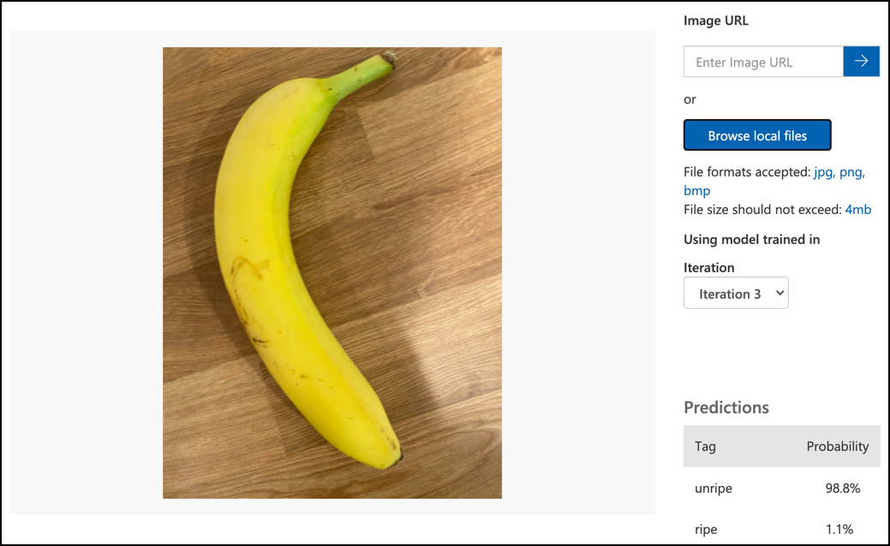

<!--
CO_OP_TRANSLATOR_METADATA:
{
  "original_hash": "f5e63c916d2dd97d58be12aaf76bd9f1",
  "translation_date": "2025-08-26T21:42:42+00:00",
  "source_file": "4-manufacturing/lessons/1-train-fruit-detector/README.md",
  "language_code": "ur"
}
-->
# پھلوں کے معیار کا پتہ لگانے والا تربیت کریں


> خاکہ [نیتیا نرسمہن](https://github.com/nitya) کی تخلیق کردہ۔ بڑی تصویر دیکھنے کے لیے تصویر پر کلک کریں۔

یہ ویڈیو Azure Custom Vision سروس کا جائزہ پیش کرتی ہے، جو اس سبق میں شامل کی جائے گی۔

[](https://www.youtube.com/watch?v=TETcDLJlWR4)

> 🎥 ویڈیو دیکھنے کے لیے اوپر دی گئی تصویر پر کلک کریں

## لیکچر سے پہلے کا کوئز

[لیکچر سے پہلے کا کوئز](https://black-meadow-040d15503.1.azurestaticapps.net/quiz/29)

## تعارف

مصنوعی ذہانت (AI) اور مشین لرننگ (ML) میں حالیہ ترقی نے آج کے ڈویلپرز کو مختلف صلاحیتیں فراہم کی ہیں۔ ML ماڈلز کو تصاویر میں مختلف اشیاء کو پہچاننے کے لیے تربیت دی جا سکتی ہے، جیسے کہ کچے پھل، اور یہ IoT ڈیوائسز میں استعمال ہو سکتے ہیں تاکہ فصل کی کٹائی یا فیکٹریوں اور گوداموں میں پروسیسنگ کے دوران پیداوار کو ترتیب دینے میں مدد مل سکے۔

اس سبق میں آپ تصویر کی درجہ بندی کے بارے میں سیکھیں گے - ML ماڈلز کا استعمال کرتے ہوئے مختلف اشیاء کی تصاویر کے درمیان فرق کرنا۔ آپ سیکھیں گے کہ ایک تصویر کے درجہ بندی کرنے والے ماڈل کو تربیت دے کر اچھے اور خراب پھلوں کے درمیان فرق کیسے کیا جائے، چاہے وہ کچے ہوں، زیادہ پکے ہوں، زخمی ہوں، یا سڑے ہوئے ہوں۔

اس سبق میں ہم درج ذیل موضوعات کا احاطہ کریں گے:

* [AI اور ML کا استعمال کرتے ہوئے خوراک کو ترتیب دینا](../../../../../4-manufacturing/lessons/1-train-fruit-detector)
* [مشین لرننگ کے ذریعے تصویر کی درجہ بندی](../../../../../4-manufacturing/lessons/1-train-fruit-detector)
* [تصویر کے درجہ بندی کرنے والے ماڈل کو تربیت دینا](../../../../../4-manufacturing/lessons/1-train-fruit-detector)
* [اپنے تصویر کے درجہ بندی کرنے والے ماڈل کو جانچنا](../../../../../4-manufacturing/lessons/1-train-fruit-detector)
* [اپنے تصویر کے درجہ بندی کرنے والے ماڈل کو دوبارہ تربیت دینا](../../../../../4-manufacturing/lessons/1-train-fruit-detector)

## AI اور ML کا استعمال کرتے ہوئے خوراک کو ترتیب دینا

دنیا کی آبادی کو کھلانا ایک مشکل کام ہے، خاص طور پر ایسی قیمت پر جو سب کے لیے قابل برداشت ہو۔ سب سے بڑے اخراجات میں سے ایک مزدوری ہے، اس لیے کسان مزدوری کے اخراجات کو کم کرنے کے لیے خودکار نظام اور IoT جیسے آلات کی طرف رجوع کر رہے ہیں۔ ہاتھ سے فصل کاٹنا محنت طلب (اور اکثر کمر توڑنے والا کام) ہے، اور یہ خاص طور پر امیر ممالک میں مشینری سے تبدیل ہو رہا ہے۔ مشینری کے استعمال سے فصل کاٹنے کی لاگت میں کمی آتی ہے، لیکن اس کے ساتھ ایک مسئلہ بھی ہے - فصل کاٹتے وقت خوراک کو ترتیب دینے کی صلاحیت۔

تمام فصلیں یکساں طور پر نہیں پک پاتیں۔ مثال کے طور پر، ٹماٹر کی بیل پر کچھ سبز پھل ہو سکتے ہیں جب کہ زیادہ تر فصل کٹائی کے لیے تیار ہو۔ اگرچہ ان سبز پھلوں کو وقت سے پہلے کاٹنا ضیاع ہے، لیکن کسان کے لیے مشینری کا استعمال کرتے ہوئے سب کچھ کاٹنا اور بعد میں کچے پھلوں کو ضائع کرنا سستا اور آسان ہے۔

✅ اپنے آس پاس کے کھیتوں، باغات، یا دکانوں میں مختلف پھلوں یا سبزیوں کو دیکھیں۔ کیا وہ سب ایک ہی پکاؤ کے ہیں، یا آپ کو ان میں فرق نظر آتا ہے؟

خودکار کٹائی کے بڑھتے ہوئے رجحان نے پیداوار کی ترتیب کو کھیت سے فیکٹری میں منتقل کر دیا۔ خوراک لمبی کنویئر بیلٹس پر سفر کرتی، جہاں لوگوں کی ٹیمیں پیداوار کو چن کر غیر معیاری اشیاء کو ہٹا دیتیں۔ مشینری کی بدولت کٹائی سستی ہو گئی، لیکن خوراک کو دستی طور پر ترتیب دینے کی لاگت اب بھی موجود تھی۔


اگلا ارتقاء مشینوں کا استعمال تھا جو یا تو کٹائی کرنے والی مشین میں شامل تھیں یا پروسیسنگ پلانٹس میں۔ ان مشینوں کی پہلی نسل نے رنگوں کا پتہ لگانے کے لیے آپٹیکل سینسرز کا استعمال کیا، جو لیورز یا ہوا کے جھونکوں کے ذریعے سبز ٹماٹروں کو فضلہ کے ڈبے میں دھکیلتے تھے، جبکہ سرخ ٹماٹر کنویئر بیلٹس کے نیٹ ورک پر چلتے رہتے تھے۔

اس ویڈیو میں، جب ٹماٹر ایک کنویئر بیلٹ سے دوسرے پر گرتے ہیں، سبز ٹماٹروں کا پتہ لگایا جاتا ہے اور انہیں لیورز کے ذریعے ایک ڈبے میں ڈال دیا جاتا ہے۔

✅ فیکٹری یا کھیت میں ان آپٹیکل سینسرز کے درست کام کرنے کے لیے کن حالات کی ضرورت ہوگی؟

ان ترتیب دینے والی مشینوں کا تازہ ترین ارتقاء AI اور ML کا فائدہ اٹھاتا ہے، ایسے ماڈلز کا استعمال کرتے ہوئے جو نہ صرف رنگ کے واضح فرق جیسے سبز ٹماٹروں اور سرخ ٹماٹروں کے درمیان، بلکہ ظاہری شکل کے زیادہ باریک فرق کو بھی پہچان سکتے ہیں جو بیماری یا زخم کی نشاندہی کر سکتے ہیں۔

## مشین لرننگ کے ذریعے تصویر کی درجہ بندی

روایتی پروگرامنگ میں آپ ڈیٹا لیتے ہیں، اس پر ایک الگورتھم لگاتے ہیں، اور نتیجہ حاصل کرتے ہیں۔ مثال کے طور پر، پچھلے پروجیکٹ میں آپ نے GPS کوآرڈینیٹس اور ایک جغرافیائی حد لی، Azure Maps کے فراہم کردہ الگورتھم کو لاگو کیا، اور نتیجہ حاصل کیا کہ آیا پوائنٹ جغرافیائی حد کے اندر ہے یا باہر۔ آپ مزید ڈیٹا داخل کرتے ہیں، آپ کو مزید نتائج ملتے ہیں۔


مشین لرننگ اس عمل کو پلٹ دیتی ہے - آپ ڈیٹا اور معلوم نتائج سے شروع کرتے ہیں، اور مشین لرننگ الگورتھم ڈیٹا سے سیکھتا ہے۔ آپ پھر اس تربیت یافتہ الگورتھم، جسے *مشین لرننگ ماڈل* یا *ماڈل* کہا جاتا ہے، کو نیا ڈیٹا دیتے ہیں اور نیا نتیجہ حاصل کرتے ہیں۔

> 🎓 مشین لرننگ الگورتھم کے ڈیٹا سے سیکھنے کے عمل کو *تربیت* کہا جاتا ہے۔ ان پٹس اور معلوم نتائج کو *تربیتی ڈیٹا* کہا جاتا ہے۔

مثال کے طور پر، آپ ایک ماڈل کو لاکھوں کچے کیلے کی تصاویر تربیتی ڈیٹا کے طور پر دے سکتے ہیں، اور تربیتی نتیجہ `کچا` مقرر کر سکتے ہیں، اور لاکھوں پکے کیلے کی تصاویر تربیتی ڈیٹا کے طور پر دے سکتے ہیں اور نتیجہ `پکا` مقرر کر سکتے ہیں۔ ML الگورتھم اس ڈیٹا کی بنیاد پر ایک ماڈل بنائے گا۔ آپ پھر اس ماڈل کو ایک نئے کیلے کی تصویر دیتے ہیں، اور یہ پیش گوئی کرے گا کہ نئی تصویر کچا ہے یا پکا۔

> 🎓 ML ماڈلز کے نتائج کو *پیش گوئیاں* کہا جاتا ہے۔


ML ماڈلز بائنری جواب نہیں دیتے، بلکہ امکانات دیتے ہیں۔ مثال کے طور پر، ایک ماڈل کو ایک کیلے کی تصویر دی جا سکتی ہے اور یہ `پکا` 99.7% اور `کچا` 0.3% پیش گوئی کر سکتا ہے۔ آپ کا کوڈ پھر بہترین پیش گوئی کا انتخاب کرے گا اور فیصلہ کرے گا کہ کیلا پکا ہے۔

تصاویر کا پتہ لگانے کے لیے استعمال ہونے والے ML ماڈل کو *تصویر کا درجہ بندی کرنے والا ماڈل* کہا جاتا ہے - اسے لیبل شدہ تصاویر دی جاتی ہیں، اور پھر یہ ان لیبلز کی بنیاد پر نئی تصاویر کو درجہ بندی کرتا ہے۔

> 💁 یہ ایک سادہ وضاحت ہے، اور ماڈلز کو تربیت دینے کے اور بھی کئی طریقے ہیں جو ہمیشہ لیبل شدہ نتائج کی ضرورت نہیں رکھتے، جیسے غیر نگرانی شدہ سیکھنا۔ اگر آپ ML کے بارے میں مزید سیکھنا چاہتے ہیں تو [ML for beginners، مشین لرننگ پر 24 اسباق کا نصاب](https://aka.ms/ML-beginners) دیکھیں۔

## تصویر کے درجہ بندی کرنے والے ماڈل کو تربیت دینا

ایک کامیاب تصویر کے درجہ بندی کرنے والے ماڈل کو تربیت دینے کے لیے آپ کو لاکھوں تصاویر کی ضرورت ہوتی ہے۔ لیکن خوش قسمتی سے، ایک بار جب آپ کے پاس لاکھوں یا اربوں مختلف تصاویر پر تربیت یافتہ ماڈل ہو، تو آپ اسے دوبارہ استعمال کر سکتے ہیں اور ایک چھوٹے سیٹ کی تصاویر کے ساتھ دوبارہ تربیت دے کر بہترین نتائج حاصل کر سکتے ہیں، جسے *ٹرانسفر لرننگ* کہا جاتا ہے۔

> 🎓 ٹرانسفر لرننگ وہ عمل ہے جس میں موجودہ ML ماڈل کی سیکھنے کی صلاحیت کو نئے ڈیٹا کی بنیاد پر ایک نئے ماڈل میں منتقل کیا جاتا ہے۔

ایک بار جب ایک تصویر کے درجہ بندی کرنے والے ماڈل کو مختلف تصاویر کے لیے تربیت دی جاتی ہے، تو اس کے اندرونی حصے اشکال، رنگوں اور نمونوں کو پہچاننے میں ماہر ہو جاتے ہیں۔ ٹرانسفر لرننگ ماڈل کو یہ سکھانے کی اجازت دیتی ہے کہ ان اشکال کو نئے تصاویر میں کیسے پہچانا جائے۔


آپ اسے بچوں کی شکلوں کی کتابوں کی طرح سمجھ سکتے ہیں، جہاں ایک بار جب آپ ایک نیم دائرہ، ایک مستطیل اور ایک مثلث کو پہچان لیتے ہیں، تو آپ ان اشکال کی ترتیب کے مطابق ایک کشتی یا بلی کو پہچان سکتے ہیں۔ تصویر کے درجہ بندی کرنے والا ماڈل اشکال کو پہچان سکتا ہے، اور ٹرانسفر لرننگ اسے سکھاتی ہے کہ کون سی ترتیب ایک کشتی یا بلی بناتی ہے - یا ایک پکا ہوا کیلا۔

ایسے کئی ٹولز موجود ہیں جو آپ کو یہ کرنے میں مدد دے سکتے ہیں، بشمول کلاؤڈ بیسڈ سروسز جو آپ کو اپنے ماڈل کو تربیت دینے اور پھر اسے ویب APIs کے ذریعے استعمال کرنے میں مدد دیتی ہیں۔

> 💁 ان ماڈلز کو تربیت دینے کے لیے بہت زیادہ کمپیوٹر پاور کی ضرورت ہوتی ہے، عام طور پر گرافکس پروسیسنگ یونٹس (GPUs) کے ذریعے۔ وہی خاص ہارڈویئر جو آپ کے Xbox پر گیمز کو شاندار بناتا ہے، مشین لرننگ ماڈلز کو تربیت دینے کے لیے بھی استعمال کیا جا سکتا ہے۔ کلاؤڈ کا استعمال کرتے ہوئے آپ طاقتور کمپیوٹرز کے GPUs پر وقت کرائے پر لے سکتے ہیں تاکہ ان ماڈلز کو تربیت دی جا سکے، اور صرف اس وقت کے لیے کمپیوٹنگ پاور تک رسائی حاصل کر سکیں جب آپ کو اس کی ضرورت ہو۔

## کسٹم وژن

کسٹم وژن ایک کلاؤڈ بیسڈ ٹول ہے جو تصویر کے درجہ بندی کرنے والے ماڈلز کو تربیت دینے کے لیے استعمال ہوتا ہے۔ یہ آپ کو صرف چند تصاویر کے ساتھ ایک ماڈل کو تربیت دینے کی اجازت دیتا ہے۔ آپ تصاویر کو ویب پورٹل، ویب API یا SDK کے ذریعے اپ لوڈ کر سکتے ہیں، ہر تصویر کو ایک *ٹیگ* دے کر جو اس تصویر کی درجہ بندی کی نمائندگی کرتا ہے۔ آپ پھر ماڈل کو تربیت دیتے ہیں، اور اس کی کارکردگی کو جانچتے ہیں۔ جب آپ ماڈل سے مطمئن ہو جائیں، تو آپ اس کے ورژنز کو شائع کر سکتے ہیں جو ویب API یا SDK کے ذریعے قابل رسائی ہوں۔


> 💁 آپ کم از کم 5 تصاویر فی درجہ بندی کے ساتھ ایک کسٹم وژن ماڈل کو تربیت دے سکتے ہیں، لیکن زیادہ بہتر ہے۔ کم از کم 30 تصاویر کے ساتھ آپ کو بہتر نتائج مل سکتے ہیں۔

کسٹم وژن مائیکروسافٹ کے AI ٹولز کے ایک سلسلے کا حصہ ہے جسے Cognitive Services کہا جاتا ہے۔ یہ AI ٹولز ہیں جنہیں یا تو بغیر کسی تربیت کے یا تھوڑی سی تربیت کے ساتھ استعمال کیا جا سکتا ہے۔ ان میں تقریر کی پہچان اور ترجمہ، زبان کی سمجھ اور تصویر کا تجزیہ شامل ہیں۔ یہ Azure میں ایک مفت ٹائر کے ساتھ دستیاب ہیں۔

> 💁 مفت ٹائر ایک ماڈل بنانے، تربیت دینے، اور پھر اسے ترقیاتی کام کے لیے استعمال کرنے کے لیے کافی ہے۔ آپ مفت ٹائر کی حدود کے بارے میں [Microsoft Docs پر Custom Vision Limits and Quotas صفحہ](https://docs.microsoft.com/azure/cognitive-services/custom-vision-service/limits-and-quotas?WT.mc_id=academic-17441-jabenn) پر پڑھ سکتے ہیں۔

### کام - ایک Cognitive Services ریسورس بنائیں

کسٹم وژن استعمال کرنے کے لیے، آپ کو Azure CLI کا استعمال کرتے ہوئے Azure میں دو Cognitive Services ریسورسز بنانی ہوں گی، ایک کسٹم وژن تربیت کے لیے اور ایک کسٹم وژن پیش گوئی کے لیے۔

1. اس پروجیکٹ کے لیے `fruit-quality-detector` نامی ایک ریسورس گروپ بنائیں۔

1. درج ذیل کمانڈ کا استعمال کرتے ہوئے ایک مفت کسٹم وژن تربیتی ریسورس بنائیں:

    ```sh
    az cognitiveservices account create --name fruit-quality-detector-training \
                                        --resource-group fruit-quality-detector \
                                        --kind CustomVision.Training \
                                        --sku F0 \
                                        --yes \
                                        --location <location>
    ```

    `<location>` کو اس مقام سے تبدیل کریں جو آپ نے ریسورس گروپ بناتے وقت استعمال کیا تھا۔

    یہ آپ کے ریسورس گروپ میں ایک کسٹم وژن تربیتی ریسورس بنائے گا۔ اس کا نام `fruit-quality-detector-training` ہوگا اور یہ `F0` SKU استعمال کرے گا، جو مفت ٹائر ہے۔ `--yes` آپشن کا مطلب ہے کہ آپ Cognitive Services کی شرائط و ضوابط سے اتفاق کرتے ہیں۔

> 💁 اگر آپ کے پاس پہلے سے ہی Cognitive Services کے کسی بھی مفت اکاؤنٹ کا استعمال ہے تو `S0` SKU استعمال کریں۔

1. درج ذیل کمانڈ کا استعمال کرتے ہوئے ایک مفت کسٹم وژن پیش گوئی ریسورس بنائیں:

    ```sh
    az cognitiveservices account create --name fruit-quality-detector-prediction \
                                        --resource-group fruit-quality-detector \
                                        --kind CustomVision.Prediction \
                                        --sku F0 \
                                        --yes \
                                        --location <location>
    ```

    `<location>` کو اس مقام سے تبدیل کریں جو آپ نے ریسورس گروپ بناتے وقت استعمال کیا تھا۔

    یہ آپ کے ریسورس گروپ میں ایک کسٹم وژن پیش گوئی ریسورس بنائے گا۔ اس کا نام `fruit-quality-detector-prediction` ہوگا اور یہ `F0` SKU استعمال کرے گا، جو مفت ٹائر ہے۔ `--yes` آپشن کا مطلب ہے کہ آپ Cognitive Services کی شرائط و ضوابط سے اتفاق کرتے ہیں۔

### کام - ایک تصویر کے درجہ بندی کرنے والے پروجیکٹ بنائیں

1. [CustomVision.ai](https://customvision.ai) پر کسٹم وژن پورٹل لانچ کریں، اور اپنے Azure اکاؤنٹ کے لیے استعمال کیے گئے Microsoft اکاؤنٹ کے ساتھ سائن ان کریں۔

1. [Microsoft Docs پر Build a Classifier Quickstart کے Create a New Project سیکشن](https://docs.microsoft.com/azure/cognitive-services/custom-vision-service/getting-started-build-a-classifier?WT.mc_id=academic-17441-jabenn#create-a-new-project) کی پیروی کریں تاکہ ایک نیا کسٹم وژن پروجیکٹ بنایا جا سکے۔ UI تبدیل ہو سکتا ہے، اور یہ دستاویزات ہمیشہ تازہ ترین حوالہ ہیں۔

    اپنے پروجیکٹ کا نام `fruit-quality-detector` رکھیں۔

    جب آپ اپنا پروجیکٹ بنائیں، تو اس بات کو یقینی بنائیں کہ آپ نے پہلے بنائے گئے `fruit-quality-detector-training` ریسورس کا استعمال کیا ہے۔ *Classification* پروجیکٹ ٹائپ، *Multiclass* درجہ بندی کی قسم، اور *Food* ڈومین استعمال کریں۔

    

✅ اپنے تصویر کے درجہ بندی کرنے والے ماڈل کے لیے کسٹم وژن UI کو دریافت کرنے کے لیے کچھ وقت نکالیں۔

### کام - اپنے تصویر کے درجہ بندی کرنے والے پروجیکٹ کو تربیت دیں

تصویر کے درجہ بندی کرنے والے ماڈل کو تربیت دینے کے لیے، آپ کو مختلف پھلوں کی تصاویر کی ضرورت ہوگی، چاہے وہ اچھے معیار کے ہوں یا خراب، جیسے کہ ایک پکا ہوا اور ایک زیادہ پکا ہوا کیلا۔
💁 یہ کلاسفائرز کسی بھی چیز کی تصاویر کو درجہ بندی کر سکتے ہیں، لہذا اگر آپ کے پاس مختلف معیار کے پھل دستیاب نہیں ہیں، تو آپ دو مختلف قسم کے پھل، یا بلیوں اور کتوں کا استعمال کر سکتے ہیں!
ہر تصویر میں صرف پھل ہونا چاہیے، یا تو ایک مستقل پس منظر کے ساتھ یا مختلف قسم کے پس منظر کے ساتھ۔ اس بات کو یقینی بنائیں کہ پس منظر میں کوئی ایسی چیز نہ ہو جو پکے ہوئے یا کچے پھلوں کے فرق کو ظاہر کرے۔

> 💁 یہ ضروری ہے کہ مخصوص پس منظر یا ایسی اشیاء شامل نہ ہوں جو ٹیگ کے مطابق چیز کی درجہ بندی سے متعلق نہ ہوں، ورنہ درجہ بندی کرنے والا ماڈل صرف پس منظر کی بنیاد پر فیصلہ کر سکتا ہے۔ ایک ماڈل جلد کے کینسر کی درجہ بندی کے لیے بنایا گیا تھا، جس میں عام اور کینسر زدہ تلوں کی تصاویر شامل تھیں۔ کینسر زدہ تلوں کے ساتھ ہمیشہ سائز ناپنے کے لیے حکمران موجود تھے۔ نتیجہ یہ نکلا کہ ماڈل تقریباً 100% درستگی کے ساتھ تصاویر میں حکمرانوں کی شناخت کر رہا تھا، نہ کہ کینسر زدہ تلوں کی۔

تصویری درجہ بندی کرنے والے ماڈلز بہت کم ریزولوشن پر کام کرتے ہیں۔ مثال کے طور پر، Custom Vision تربیت اور پیش گوئی کے لیے 10240x10240 تک کی تصاویر لے سکتا ہے، لیکن ماڈل کو 227x227 کی تصاویر پر تربیت دیتا ہے اور چلاتا ہے۔ بڑی تصاویر کو اس سائز میں سکڑایا جاتا ہے، لہذا اس بات کو یقینی بنائیں کہ جس چیز کی آپ درجہ بندی کر رہے ہیں وہ تصویر کے بڑے حصے پر مشتمل ہو، ورنہ یہ چھوٹے سائز کی تصویر میں بہت چھوٹی ہو سکتی ہے۔

1. اپنے ماڈل کے لیے تصاویر جمع کریں۔ آپ کو ہر لیبل کے لیے کم از کم 5 تصاویر کی ضرورت ہوگی تاکہ ماڈل کو تربیت دی جا سکے، لیکن جتنی زیادہ ہوں اتنا بہتر ہے۔ آپ کو ماڈل کی جانچ کے لیے کچھ اضافی تصاویر بھی درکار ہوں گی۔ یہ تصاویر ایک ہی چیز کی مختلف تصاویر ہونی چاہئیں۔ مثال کے طور پر:

    * 2 پکے ہوئے کیلے استعمال کرتے ہوئے، ہر ایک کی مختلف زاویوں سے کچھ تصاویر لیں، کم از کم 7 تصاویر (5 تربیت کے لیے، 2 جانچ کے لیے)، لیکن ترجیحاً زیادہ۔

        

    * یہی عمل 2 کچے کیلے کے ساتھ دہرائیں۔

    آپ کے پاس کم از کم 10 تربیتی تصاویر ہونی چاہئیں، جن میں کم از کم 5 پکے ہوئے اور 5 کچے، اور 4 جانچ کی تصاویر، 2 پکے ہوئے، 2 کچے۔ آپ کی تصاویر png یا jpeg فارمیٹ میں ہونی چاہئیں، اور 6MB سے چھوٹی ہونی چاہئیں۔ اگر آپ انہیں آئی فون سے بناتے ہیں تو وہ ممکنہ طور پر ہائی ریزولوشن HEIC فارمیٹ میں ہوں گی، لہذا انہیں تبدیل اور سکڑانا پڑ سکتا ہے۔ جتنی زیادہ تصاویر ہوں اتنا بہتر، اور پکے ہوئے اور کچے پھلوں کی تعداد تقریباً برابر ہونی چاہیے۔

    اگر آپ کے پاس دونوں قسم کے پھل نہیں ہیں، تو آپ مختلف پھلوں یا کسی بھی دو دستیاب اشیاء کا استعمال کر سکتے ہیں۔ آپ پکے اور کچے کیلے کی مثال تصاویر [images](../../../../../4-manufacturing/lessons/1-train-fruit-detector/images) فولڈر میں بھی دیکھ سکتے ہیں۔

1. [Microsoft Docs پر ماڈل بنانے کے فوری آغاز کے اپلوڈ اور ٹیگ تصاویر کے سیکشن](https://docs.microsoft.com/azure/cognitive-services/custom-vision-service/getting-started-build-a-classifier?WT.mc_id=academic-17441-jabenn#upload-and-tag-images) کی پیروی کریں تاکہ اپنی تربیتی تصاویر اپلوڈ کریں۔ پکے ہوئے پھل کو `ripe` اور کچے پھل کو `unripe` کے طور پر ٹیگ کریں۔

    

1. [Microsoft Docs پر ماڈل بنانے کے فوری آغاز کے ماڈل کو تربیت دینے کے سیکشن](https://docs.microsoft.com/azure/cognitive-services/custom-vision-service/getting-started-build-a-classifier?WT.mc_id=academic-17441-jabenn#train-the-classifier) کی پیروی کریں تاکہ اپنی اپلوڈ کردہ تصاویر پر ماڈل کو تربیت دیں۔

    آپ کو تربیت کی قسم کا انتخاب دیا جائے گا۔ **Quick Training** منتخب کریں۔

ماڈل تربیت حاصل کرے گا۔ تربیت مکمل ہونے میں چند منٹ لگیں گے۔

> 🍌 اگر آپ تربیت کے دوران اپنے پھل کھانے کا فیصلہ کرتے ہیں، تو پہلے یہ یقینی بنائیں کہ آپ کے پاس جانچ کے لیے کافی تصاویر موجود ہیں!

## اپنے ماڈل کی جانچ کریں

جب آپ کا ماڈل تربیت حاصل کر لے، تو آپ اسے نئی تصویر دے کر جانچ سکتے ہیں۔

### کام - اپنے ماڈل کی جانچ کریں

1. [Microsoft Docs پر ماڈل کی جانچ کے دستاویزات](https://docs.microsoft.com/azure/cognitive-services/custom-vision-service/test-your-model?WT.mc_id=academic-17441-jabenn#test-your-model) کی پیروی کریں تاکہ اپنے ماڈل کی جانچ کریں۔ وہ تصاویر استعمال کریں جو آپ نے پہلے جانچ کے لیے بنائی تھیں، نہ کہ وہ تصاویر جو تربیت کے لیے استعمال کی گئی تھیں۔

    

1. تمام جانچ کی تصاویر آزمائیں جو آپ کے پاس دستیاب ہیں اور امکانات کا مشاہدہ کریں۔

## اپنے ماڈل کو دوبارہ تربیت دیں

جب آپ اپنے ماڈل کی جانچ کرتے ہیں، تو یہ ممکن ہے کہ نتائج آپ کی توقعات کے مطابق نہ ہوں۔ تصویری ماڈلز مشین لرننگ کا استعمال کرتے ہوئے پیش گوئی کرتے ہیں کہ تصویر میں کیا ہے، امکانات کی بنیاد پر کہ تصویر کی خاص خصوصیات کسی خاص لیبل سے مطابقت رکھتی ہیں۔ یہ تصویر میں موجود چیز کو نہیں سمجھتا - یہ نہیں جانتا کہ کیلا کیا ہے یا کیلے کو کشتی سے مختلف کیا بناتا ہے۔ آپ اپنے ماڈل کو ان تصاویر کے ساتھ دوبارہ تربیت دے کر بہتر بنا سکتے ہیں جن میں یہ غلطی کرتا ہے۔

جب بھی آپ فوری جانچ کے آپشن کا استعمال کرتے ہوئے پیش گوئی کرتے ہیں، تصویر اور نتائج محفوظ کیے جاتے ہیں۔ آپ ان تصاویر کو اپنے ماڈل کو دوبارہ تربیت دینے کے لیے استعمال کر سکتے ہیں۔

### کام - اپنے ماڈل کو دوبارہ تربیت دیں

1. [Microsoft Docs پر پیش گوئی شدہ تصویر کو تربیت کے لیے استعمال کرنے کے دستاویزات](https://docs.microsoft.com/azure/cognitive-services/custom-vision-service/test-your-model?WT.mc_id=academic-17441-jabenn#use-the-predicted-image-for-training) کی پیروی کریں تاکہ اپنے ماڈل کو دوبارہ تربیت دیں، ہر تصویر کے لیے درست ٹیگ استعمال کرتے ہوئے۔

1. جب آپ کا ماڈل دوبارہ تربیت حاصل کر لے، تو نئی تصاویر پر جانچ کریں۔

---

## 🚀 چیلنج

آپ کے خیال میں کیا ہوگا اگر آپ کیلے پر تربیت یافتہ ماڈل کے ساتھ اسٹرابیری کی تصویر استعمال کریں، یا ایک inflatable کیلا، یا کیلے کے لباس میں کوئی شخص، یا یہاں تک کہ ایک پیلا کارٹون کردار جیسے سمپسنز کا کوئی کردار؟

آزمائیں اور دیکھیں کہ پیش گوئیاں کیا ہیں۔ آپ [Bing Image search](https://www.bing.com/images/trending) کا استعمال کرتے ہوئے تصاویر تلاش کر سکتے ہیں۔

## لیکچر کے بعد کا کوئز

[لیکچر کے بعد کا کوئز](https://black-meadow-040d15503.1.azurestaticapps.net/quiz/30)

## جائزہ اور خود مطالعہ

* جب آپ نے اپنے ماڈل کو تربیت دی، تو آپ نے *Precision*, *Recall*, اور *AP* کی قدریں دیکھی ہوں گی جو بنائے گئے ماڈل کی درجہ بندی کرتی ہیں۔ ان قدروں کے بارے میں پڑھیں [Microsoft Docs پر ماڈل کی درجہ بندی کے جائزہ کے سیکشن](https://docs.microsoft.com/azure/cognitive-services/custom-vision-service/getting-started-build-a-classifier?WT.mc_id=academic-17441-jabenn#evaluate-the-classifier) کا استعمال کرتے ہوئے۔
* اپنے ماڈل کو بہتر بنانے کے بارے میں پڑھیں [Microsoft Docs پر Custom Vision ماڈل کو بہتر بنانے کے طریقے](https://docs.microsoft.com/azure/cognitive-services/custom-vision-service/getting-started-improving-your-classifier?WT.mc_id=academic-17441-jabenn) کا استعمال کرتے ہوئے۔

## اسائنمنٹ

[اپنے ماڈل کو مختلف پھلوں اور سبزیوں کے لیے تربیت دیں](assignment.md)

---

**ڈسکلیمر**:  
یہ دستاویز AI ترجمہ سروس [Co-op Translator](https://github.com/Azure/co-op-translator) کا استعمال کرتے ہوئے ترجمہ کی گئی ہے۔ ہم درستگی کے لیے کوشش کرتے ہیں، لیکن براہ کرم آگاہ رہیں کہ خودکار ترجمے میں غلطیاں یا غیر درستیاں ہو سکتی ہیں۔ اصل دستاویز کو اس کی اصل زبان میں مستند ذریعہ سمجھا جانا چاہیے۔ اہم معلومات کے لیے، پیشہ ور انسانی ترجمہ کی سفارش کی جاتی ہے۔ ہم اس ترجمے کے استعمال سے پیدا ہونے والی کسی بھی غلط فہمی یا غلط تشریح کے ذمہ دار نہیں ہیں۔