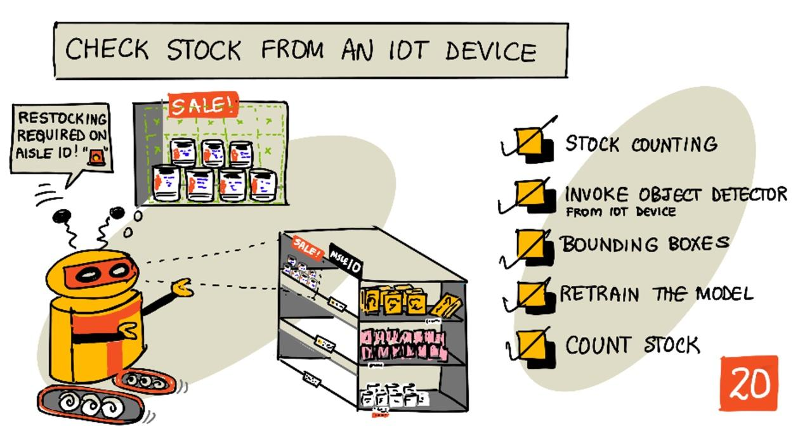

<!--
CO_OP_TRANSLATOR_METADATA:
{
  "original_hash": "1c9e5fa8b7be726c75a97232b1e41c97",
  "translation_date": "2025-08-26T21:31:22+00:00",
  "source_file": "5-retail/lessons/2-check-stock-device/README.md",
  "language_code": "ur"
}
-->
# آئی او ٹی ڈیوائس سے اسٹاک چیک کریں



> خاکہ: [نیتیا نرسمہن](https://github.com/nitya)۔ تصویر پر کلک کریں تاکہ بڑا ورژن دیکھ سکیں۔

## لیکچر سے پہلے کا کوئز

[لیکچر سے پہلے کا کوئز](https://black-meadow-040d15503.1.azurestaticapps.net/quiz/39)

## تعارف

پچھلے سبق میں آپ نے ریٹیل میں آبجیکٹ ڈیٹیکشن کے مختلف استعمالات کے بارے میں سیکھا۔ آپ نے یہ بھی سیکھا کہ اسٹاک کی شناخت کے لیے آبجیکٹ ڈیٹیکٹر کو کیسے تربیت دی جائے۔ اس سبق میں آپ سیکھیں گے کہ اپنے آئی او ٹی ڈیوائس سے آبجیکٹ ڈیٹیکٹر کا استعمال کرکے اسٹاک کیسے گنا جائے۔

اس سبق میں ہم درج ذیل موضوعات کا احاطہ کریں گے:

* [اسٹاک گننا](../../../../../5-retail/lessons/2-check-stock-device)
* [اپنے آئی او ٹی ڈیوائس سے آبجیکٹ ڈیٹیکٹر کو کال کریں](../../../../../5-retail/lessons/2-check-stock-device)
* [باؤنڈنگ باکسز](../../../../../5-retail/lessons/2-check-stock-device)
* [ماڈل کو دوبارہ تربیت دیں](../../../../../5-retail/lessons/2-check-stock-device)
* [اسٹاک گنیں](../../../../../5-retail/lessons/2-check-stock-device)

> 🗑 یہ اس پروجیکٹ کا آخری سبق ہے، لہذا سبق اور اسائنمنٹ مکمل کرنے کے بعد اپنے کلاؤڈ سروسز کو صاف کرنا نہ بھولیں۔ اسائنمنٹ مکمل کرنے کے لیے آپ کو سروسز کی ضرورت ہوگی، لہذا پہلے اسائنمنٹ مکمل کریں۔
>
> اگر ضرورت ہو تو [اپنے پروجیکٹ کو صاف کرنے کے گائیڈ](../../../clean-up.md) کا حوالہ دیں۔

## اسٹاک گننا

آبجیکٹ ڈیٹیکٹرز اسٹاک چیکنگ کے لیے استعمال کیے جا سکتے ہیں، چاہے اسٹاک گننا ہو یا یہ یقینی بنانا کہ اسٹاک اپنی جگہ پر موجود ہے۔ کیمروں کے ساتھ آئی او ٹی ڈیوائسز اسٹور کے مختلف حصوں میں تعینات کی جا سکتی ہیں تاکہ اسٹاک کی نگرانی کی جا سکے، خاص طور پر ان جگہوں پر جہاں اشیاء کو دوبارہ اسٹاک کرنا ضروری ہو، جیسے وہ علاقے جہاں کم تعداد میں قیمتی اشیاء رکھی جاتی ہیں۔

مثال کے طور پر، اگر ایک کیمرا ان شیلفوں کی طرف اشارہ کر رہا ہے جو 8 ٹماٹر پیسٹ کے کین رکھ سکتے ہیں، اور آبجیکٹ ڈیٹیکٹر صرف 7 کین کا پتہ لگاتا ہے، تو ایک کین غائب ہے اور اسے دوبارہ اسٹاک کرنے کی ضرورت ہے۔


اوپر دی گئی تصویر میں، آبجیکٹ ڈیٹیکٹر نے شیلف پر 7 ٹماٹر پیسٹ کے کین کا پتہ لگایا ہے جو 8 کین رکھ سکتا ہے۔ نہ صرف آئی او ٹی ڈیوائس دوبارہ اسٹاک کرنے کی ضرورت کا نوٹیفکیشن بھیج سکتی ہے، بلکہ یہ غائب آئٹم کے مقام کا اشارہ بھی دے سکتی ہے، جو اہم ڈیٹا ہے اگر آپ روبوٹس کا استعمال کر رہے ہیں تاکہ شیلف کو دوبارہ اسٹاک کیا جا سکے۔

> 💁 اسٹور اور آئٹم کی مقبولیت کے لحاظ سے، اگر صرف 1 کین غائب ہو تو شاید دوبارہ اسٹاک نہ کیا جائے۔ آپ کو ایک الگورتھم بنانا ہوگا جو آپ کی پروڈکٹ، گاہکوں اور دیگر معیار کی بنیاد پر فیصلہ کرے کہ کب دوبارہ اسٹاک کرنا ہے۔

✅ آپ کن دیگر حالات میں آبجیکٹ ڈیٹیکشن اور روبوٹس کو ملا کر استعمال کر سکتے ہیں؟

کبھی کبھی غلط اسٹاک شیلف پر ہو سکتا ہے۔ یہ دوبارہ اسٹاک کرتے وقت انسانی غلطی ہو سکتی ہے، یا گاہک اپنی خریداری پر دوبارہ غور کر کے آئٹم کو پہلی دستیاب جگہ پر رکھ سکتے ہیں۔ جب یہ غیر خراب ہونے والی اشیاء جیسے کینڈ گڈز ہوں، تو یہ ایک پریشانی ہے۔ اگر یہ خراب ہونے والی اشیاء جیسے فریز یا ٹھنڈی اشیاء ہوں، تو اس کا مطلب یہ ہو سکتا ہے کہ پروڈکٹ کو مزید فروخت نہیں کیا جا سکتا کیونکہ یہ بتانا ممکن نہیں ہوگا کہ آئٹم کتنی دیر تک فریزر سے باہر رہا۔

آبجیکٹ ڈیٹیکشن غیر متوقع اشیاء کا پتہ لگانے کے لیے استعمال کیا جا سکتا ہے، اور دوبارہ آئٹم کو صحیح جگہ پر رکھنے کے لیے انسان یا روبوٹ کو الرٹ کیا جا سکتا ہے۔


اوپر دی گئی تصویر میں، بیبی کارن کا ایک کین ٹماٹر پیسٹ کے شیلف پر رکھا گیا ہے۔ آبجیکٹ ڈیٹیکٹر نے اس کا پتہ لگایا ہے، جس سے آئی او ٹی ڈیوائس انسان یا روبوٹ کو کین کو اس کی صحیح جگہ پر واپس رکھنے کے لیے مطلع کر سکتی ہے۔

## اپنے آئی او ٹی ڈیوائس سے آبجیکٹ ڈیٹیکٹر کو کال کریں

پچھلے سبق میں تربیت دی گئی آبجیکٹ ڈیٹیکٹر کو آپ کے آئی او ٹی ڈیوائس سے کال کیا جا سکتا ہے۔

### کام - اپنے آبجیکٹ ڈیٹیکٹر کا ایک ورژن شائع کریں

ورژنز کو کسٹم وژن پورٹل سے شائع کیا جاتا ہے۔

1. [CustomVision.ai](https://customvision.ai) پر کسٹم وژن پورٹل لانچ کریں اور سائن ان کریں اگر آپ نے پہلے سے اسے کھولا نہیں ہے۔ پھر اپنے `stock-detector` پروجیکٹ کو کھولیں۔

1. اوپر دیے گئے آپشنز میں سے **Performance** ٹیب منتخب کریں۔

1. سائیڈ پر موجود *Iterations* کی فہرست سے تازہ ترین ورژن منتخب کریں۔

1. ورژن کے لیے **Publish** بٹن منتخب کریں۔

    

1. *Publish Model* ڈائیلاگ میں، *Prediction resource* کو `stock-detector-prediction` ریسورس پر سیٹ کریں جو آپ نے پچھلے سبق میں بنایا تھا۔ نام کو `Iteration2` کے طور پر چھوڑ دیں، اور **Publish** بٹن منتخب کریں۔

1. شائع ہونے کے بعد، **Prediction URL** بٹن منتخب کریں۔ یہ پیش گوئی API کی تفصیلات دکھائے گا، اور آپ کو یہ اپنے آئی او ٹی ڈیوائس سے ماڈل کو کال کرنے کے لیے درکار ہوں گی۔ نچلا حصہ *If you have an image file* کے لیبل کے ساتھ ہے، اور یہ وہ تفصیلات ہیں جو آپ کو چاہیے۔ دکھائی گئی URL کی ایک کاپی لیں جو کچھ اس طرح ہوگی:

    ```output
    https://<location>.api.cognitive.microsoft.com/customvision/v3.0/Prediction/<id>/detect/iterations/Iteration2/image
    ```

    جہاں `<location>` وہ مقام ہوگا جو آپ نے کسٹم وژن ریسورس بناتے وقت استعمال کیا تھا، اور `<id>` ایک لمبی آئی ڈی ہوگی جو حروف اور نمبروں پر مشتمل ہوگی۔

    *Prediction-Key* ویلیو کی بھی ایک کاپی لیں۔ یہ ایک محفوظ کلید ہے جسے آپ کو ماڈل کو کال کرتے وقت پاس کرنا ہوگا۔ صرف وہی ایپلیکیشنز جو اس کلید کو پاس کرتی ہیں ماڈل استعمال کرنے کی اجازت رکھتی ہیں، دیگر تمام ایپلیکیشنز کو مسترد کر دیا جاتا ہے۔

    

✅ جب ایک نیا ورژن شائع ہوتا ہے، تو اس کا نام مختلف ہوگا۔ آپ کے خیال میں آپ آئی او ٹی ڈیوائس کو کیسے تبدیل کریں گے تاکہ وہ نیا ورژن استعمال کرے؟

### کام - اپنے آئی او ٹی ڈیوائس سے آبجیکٹ ڈیٹیکٹر کو کال کریں

اپنے آئی او ٹی ڈیوائس سے آبجیکٹ ڈیٹیکٹر استعمال کرنے کے لیے نیچے دیے گئے متعلقہ گائیڈز پر عمل کریں:

* [Arduino - Wio Terminal](wio-terminal-object-detector.md)
* [سنگل بورڈ کمپیوٹر - Raspberry Pi/Virtual device](single-board-computer-object-detector.md)

## باؤنڈنگ باکسز

جب آپ آبجیکٹ ڈیٹیکٹر استعمال کرتے ہیں، تو آپ کو نہ صرف ڈیٹیکٹ کیے گئے آبجیکٹس کے ٹیگز اور امکانات واپس ملتے ہیں، بلکہ آپ کو آبجیکٹس کے باؤنڈنگ باکسز بھی ملتے ہیں۔ یہ ان علاقوں کی وضاحت کرتے ہیں جہاں آبجیکٹ ڈیٹیکٹر نے دیے گئے امکان کے ساتھ آبجیکٹ کا پتہ لگایا۔

> 💁 باؤنڈنگ باکس ایک ایسا باکس ہے جو اس علاقے کی وضاحت کرتا ہے جہاں ڈیٹیکٹ کیا گیا آبجیکٹ موجود ہے، ایک باکس جو آبجیکٹ کی حد کو بیان کرتا ہے۔

کسٹم وژن میں **Predictions** ٹیب میں پیش گوئی کے نتائج میں باؤنڈنگ باکسز اس تصویر پر کھینچے جاتے ہیں جو پیش گوئی کے لیے بھیجی گئی تھی۔


اوپر دی گئی تصویر میں، 4 ٹماٹر پیسٹ کے کین کا پتہ لگایا گیا۔ نتائج میں ہر ڈیٹیکٹ کیے گئے آبجیکٹ کے لیے تصویر پر ایک سرخ مربع اوورلے کیا گیا ہے، جو تصویر کے لیے باؤنڈنگ باکس کی نشاندہی کرتا ہے۔

✅ کسٹم وژن میں پیش گوئی کھولیں اور باؤنڈنگ باکسز کو چیک کریں۔

باؤنڈنگ باکسز 4 ویلیوز کے ساتھ بیان کیے جاتے ہیں - اوپر، بائیں، اونچائی اور چوڑائی۔ یہ ویلیوز 0-1 کے پیمانے پر ہوتی ہیں، جو تصویر کے سائز کے فیصد کے طور پر پوزیشنز کی نمائندگی کرتی ہیں۔ اصل (0,0 پوزیشن) تصویر کے اوپر بائیں طرف ہے، لہذا اوپر کی ویلیو اوپر سے فاصلہ ہے، اور باؤنڈنگ باکس کا نیچے اوپر کے ساتھ اونچائی کے برابر ہے۔


اوپر دی گئی تصویر 600 پکسلز چوڑی اور 800 پکسلز لمبی ہے۔ باؤنڈنگ باکس 320 پکسلز نیچے سے شروع ہوتا ہے، جس سے اوپر کا کوآرڈینیٹ 0.4 بنتا ہے (800 x 0.4 = 320)۔ بائیں طرف سے، باؤنڈنگ باکس 240 پکسلز سے شروع ہوتا ہے، جس سے بائیں کوآرڈینیٹ 0.4 بنتا ہے (600 x 0.4 = 240)۔ باؤنڈنگ باکس کی اونچائی 240 پکسلز ہے، جس سے اونچائی کی ویلیو 0.3 بنتی ہے (800 x 0.3 = 240)۔ باؤنڈنگ باکس کی چوڑائی 120 پکسلز ہے، جس سے چوڑائی کی ویلیو 0.2 بنتی ہے (600 x 0.2 = 120)۔

| کوآرڈینیٹ | ویلیو |
| ---------- | ----: |
| اوپر        | 0.4   |
| بائیں       | 0.4   |
| اونچائی     | 0.3   |
| چوڑائی      | 0.2   |

0-1 کے فیصد ویلیوز کا استعمال کرنے کا مطلب ہے کہ تصویر کو کسی بھی سائز میں اسکیل کیا جائے، باؤنڈنگ باکس 0.4 کے فاصلے پر شروع ہوتا ہے اور نیچے، اور 0.3 اونچائی اور 0.2 چوڑائی کا ہوتا ہے۔

آپ باؤنڈنگ باکسز کو امکانات کے ساتھ ملا کر ڈیٹیکشن کی درستگی کا جائزہ لے سکتے ہیں۔ مثال کے طور پر، ایک آبجیکٹ ڈیٹیکٹر متعدد آبجیکٹس کا پتہ لگا سکتا ہے جو ایک دوسرے کے اوپر ہیں، جیسے ایک کین دوسرے کے اندر ڈیٹیکٹ کرنا۔ آپ کا کوڈ باؤنڈنگ باکسز کو دیکھ سکتا ہے، سمجھ سکتا ہے کہ یہ ناممکن ہے، اور کسی بھی آبجیکٹ کو نظر انداز کر سکتا ہے جو دوسرے آبجیکٹس کے ساتھ نمایاں طور پر اوورلیپ کرتا ہے۔


اوپر دی گئی مثال میں، ایک باؤنڈنگ باکس نے 78.3% امکان کے ساتھ ٹماٹر پیسٹ کے کین کی پیش گوئی کی۔ دوسرا باؤنڈنگ باکس تھوڑا چھوٹا ہے، اور پہلے باؤنڈنگ باکس کے اندر ہے جس کا امکان 64.3% ہے۔ آپ کا کوڈ باؤنڈنگ باکسز کو چیک کر سکتا ہے، دیکھ سکتا ہے کہ وہ مکمل طور پر اوورلیپ کرتے ہیں، اور کم امکان کو نظر انداز کر سکتا ہے کیونکہ ایک کین دوسرے کے اندر نہیں ہو سکتا۔

✅ کیا آپ کسی ایسی صورتحال کے بارے میں سوچ سکتے ہیں جہاں ایک آبجیکٹ دوسرے کے اندر ڈیٹیکٹ کرنا جائز ہو؟

## ماڈل کو دوبارہ تربیت دیں

امیج کلاسفائر کی طرح، آپ اپنے آئی او ٹی ڈیوائس کے ذریعے حاصل کردہ ڈیٹا کا استعمال کرتے ہوئے اپنے ماڈل کو دوبارہ تربیت دے سکتے ہیں۔ اس حقیقی دنیا کے ڈیٹا کا استعمال یہ یقینی بنائے گا کہ آپ کا ماڈل آپ کے آئی او ٹی ڈیوائس سے استعمال کرتے وقت اچھی طرح کام کرے۔

امیج کلاسفائر کے برعکس، آپ صرف ایک تصویر کو ٹیگ نہیں کر سکتے۔ اس کے بجائے آپ کو ماڈل کے ذریعے ڈیٹیکٹ کیے گئے ہر باؤنڈنگ باکس کا جائزہ لینا ہوگا۔ اگر باکس غلط چیز کے ارد گرد ہے تو اسے حذف کرنا ہوگا، اگر یہ غلط جگہ پر ہے تو اسے ایڈجسٹ کرنا ہوگا۔

### کام - ماڈل کو دوبارہ تربیت دیں

1. یقینی بنائیں کہ آپ نے اپنے آئی او ٹی ڈیوائس کا استعمال کرتے ہوئے مختلف تصاویر حاصل کی ہیں۔

1. **Predictions** ٹیب سے ایک تصویر منتخب کریں۔ آپ کو ڈیٹیکٹ کیے گئے آبجیکٹس کے باؤنڈنگ باکسز کے لیے سرخ باکسز نظر آئیں گے۔

1. ہر باؤنڈنگ باکس پر کام کریں۔ پہلے اسے منتخب کریں اور آپ کو ایک پاپ اپ نظر آئے گا جو ٹیگ دکھائے گا۔ اگر ضروری ہو تو باؤنڈنگ باکس کے کونے پر موجود ہینڈلز کا استعمال کرتے ہوئے سائز کو ایڈجسٹ کریں۔ اگر ٹیگ غلط ہے، تو اسے **X** بٹن کے ساتھ ہٹا دیں اور صحیح ٹیگ شامل کریں۔ اگر باؤنڈنگ باکس میں کوئی آبجیکٹ نہیں ہے، تو اسے ٹریشکن بٹن کے ساتھ حذف کریں۔

1. ایڈیٹر کو بند کریں جب کام مکمل ہو جائے اور تصویر **Predictions** ٹیب سے **Training Images** ٹیب میں منتقل ہو جائے گی۔ تمام پیش گوئیوں کے لیے اس عمل کو دہرائیں۔

1. **Train** بٹن کا استعمال کرتے ہوئے اپنے ماڈل کو دوبارہ تربیت دیں۔ ایک بار جب یہ تربیت حاصل کر لے، ورژن شائع کریں اور اپنے آئی او ٹی ڈیوائس کو نئے ورژن کے URL کے ساتھ اپ ڈیٹ کریں۔

1. اپنا کوڈ دوبارہ تعینات کریں اور اپنے آئی او ٹی ڈیوائس کو ٹیسٹ کریں۔

## اسٹاک گنیں

آبجیکٹس کی تعداد اور باؤنڈنگ باکسز کے امتزاج کا استعمال کرتے ہوئے، آپ شیلف پر موجود اسٹاک کو گن سکتے ہیں۔

### کام - اسٹاک گنیں

اپنے آئی او ٹی ڈیوائس سے آبجیکٹ ڈیٹیکٹر کے نتائج کا استعمال کرتے ہوئے اسٹاک گننے کے لیے نیچے دیے گئے متعلقہ گائیڈز پر عمل کریں:

* [Arduino - Wio Terminal](wio-terminal-count-stock.md)
* [سنگل بورڈ کمپیوٹر - Raspberry Pi/Virtual device](single-board-computer-count-stock.md)

---

## 🚀 چیلنج

کیا آپ غلط اسٹاک کا پتہ لگا سکتے ہیں؟ اپنے ماڈل کو متعدد آبجیکٹس پر تربیت دیں، پھر اپنی ایپ کو اپ ڈیٹ کریں تاکہ آپ کو غلط اسٹاک کا پتہ لگنے پر الرٹ کرے۔

شاید اس سے بھی آگے بڑھیں اور ایک ہی شیلف پر اسٹاک کو ساتھ ساتھ ڈیٹیکٹ کریں، اور دیکھیں کہ آیا کچھ غلط جگہ پر رکھا گیا ہے باؤنڈنگ باکسز پر حدود کی وضاحت کرکے۔

## لیکچر کے بعد کا کوئز

[لیکچر کے بعد کا کوئز](https://black-meadow-040d15503.1.azurestaticapps.net/quiz/40)

## جائزہ اور خود مطالعہ

* اسٹاک ڈیٹیکشن سسٹم کو آخر سے آخر تک آرکیٹیکٹ کرنے کے بارے میں مزید جانیں [Microsoft Docs پر Out of stock detection at the edge pattern guide](https://docs.microsoft.com/hybrid/app-solutions/pattern-out-of-stock-at-edge?WT.mc_id=academic-17441-jabenn) سے۔
* آئی او ٹی اور کلاؤڈ سروسز کے امتزاج سے آخر سے آخر تک ریٹیل حل بنانے کے دیگر طریقے سیکھیں، یہ دیکھ کر [Behind the scenes of a retail solution - Hands On! ویڈیو یوٹیوب پر](https://www.youtube.com/watch?v=m3Pc300x2Mw)۔

## اسائنمنٹ

[اپنے آبجیکٹ ڈیٹیکٹر کو ایج پر استعمال کریں](assignment.md)

---

**ڈسکلیمر**:  
یہ دستاویز AI ترجمہ سروس [Co-op Translator](https://github.com/Azure/co-op-translator) کا استعمال کرتے ہوئے ترجمہ کی گئی ہے۔ ہم درستگی کے لیے کوشش کرتے ہیں، لیکن براہ کرم آگاہ رہیں کہ خودکار ترجمے میں غلطیاں یا غیر درستیاں ہو سکتی ہیں۔ اصل دستاویز کو اس کی اصل زبان میں مستند ذریعہ سمجھا جانا چاہیے۔ اہم معلومات کے لیے، پیشہ ور انسانی ترجمہ کی سفارش کی جاتی ہے۔ ہم اس ترجمے کے استعمال سے پیدا ہونے والی کسی بھی غلط فہمی یا غلط تشریح کے ذمہ دار نہیں ہیں۔