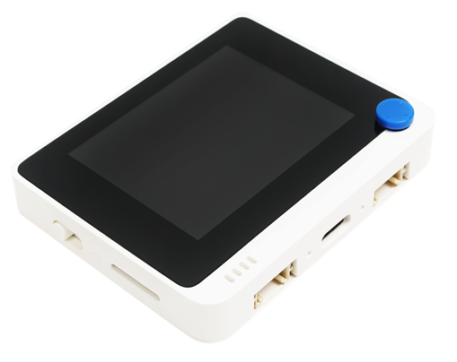

<!--
CO_OP_TRANSLATOR_METADATA:
{
  "original_hash": "a4f0c166010e31fd7b6ca20bc88dec6d",
  "translation_date": "2025-08-27T22:46:11+00:00",
  "source_file": "1-getting-started/lessons/1-introduction-to-iot/wio-terminal.md",
  "language_code": "vi"
}
-->
# Wio Terminal

[Wio Terminal từ Seeed Studios](https://www.seeedstudio.com/Wio-Terminal-p-4509.html) là một vi điều khiển tương thích với Arduino, được tích hợp WiFi cùng một số cảm biến và bộ truyền động, cũng như các cổng để thêm cảm biến và bộ truyền động khác, sử dụng hệ sinh thái phần cứng gọi là [Grove](https://www.seeedstudio.com/category/Grove-c-1003.html).



## Cài đặt

Để sử dụng Wio Terminal, bạn cần cài đặt một số phần mềm miễn phí trên máy tính của mình. Bạn cũng cần cập nhật firmware của Wio Terminal trước khi có thể kết nối nó với WiFi.

### Nhiệm vụ - cài đặt

Cài đặt phần mềm cần thiết và cập nhật firmware.

1. Cài đặt Visual Studio Code (VS Code). Đây là trình soạn thảo bạn sẽ sử dụng để viết mã cho thiết bị của mình bằng C/C++. Tham khảo [tài liệu VS Code](https://code.visualstudio.com?WT.mc_id=academic-17441-jabenn) để biết hướng dẫn cài đặt VS Code.

    > 💁 Một IDE phổ biến khác để phát triển Arduino là [Arduino IDE](https://www.arduino.cc/en/software). Nếu bạn đã quen thuộc với công cụ này, bạn có thể sử dụng nó thay vì VS Code và PlatformIO, nhưng các bài học sẽ hướng dẫn dựa trên việc sử dụng VS Code.

1. Cài đặt tiện ích mở rộng PlatformIO cho VS Code. Đây là một tiện ích mở rộng hỗ trợ lập trình vi điều khiển bằng C/C++. Tham khảo [tài liệu về tiện ích mở rộng PlatformIO](https://marketplace.visualstudio.com/items?WT.mc_id=academic-17441-jabenn&itemName=platformio.platformio-ide) để biết hướng dẫn cài đặt tiện ích này trong VS Code. Tiện ích này phụ thuộc vào tiện ích mở rộng Microsoft C/C++ để làm việc với mã C và C++, và tiện ích C/C++ sẽ được cài đặt tự động khi bạn cài đặt PlatformIO.

1. Kết nối Wio Terminal với máy tính của bạn. Wio Terminal có một cổng USB-C ở phía dưới, và cổng này cần được kết nối với một cổng USB trên máy tính của bạn. Wio Terminal đi kèm với một cáp USB-C sang USB-A, nhưng nếu máy tính của bạn chỉ có cổng USB-C, bạn sẽ cần một cáp USB-C hoặc một bộ chuyển đổi USB-A sang USB-C.

1. Làm theo hướng dẫn trong [tài liệu Wiki WiFi Overview của Wio Terminal](https://wiki.seeedstudio.com/Wio-Terminal-Network-Overview/) để thiết lập Wio Terminal và cập nhật firmware.

## Hello World

Khi bắt đầu với một ngôn ngữ lập trình hoặc công nghệ mới, thông thường bạn sẽ tạo một ứng dụng 'Hello World' - một ứng dụng nhỏ hiển thị văn bản như `"Hello World"` để kiểm tra xem tất cả các công cụ đã được cấu hình đúng hay chưa.

Ứng dụng Hello World cho Wio Terminal sẽ đảm bảo rằng bạn đã cài đặt Visual Studio Code đúng cách với PlatformIO và thiết lập để phát triển vi điều khiển.

### Tạo dự án PlatformIO

Bước đầu tiên là tạo một dự án mới sử dụng PlatformIO được cấu hình cho Wio Terminal.

#### Nhiệm vụ - tạo dự án PlatformIO

Tạo dự án PlatformIO.

1. Kết nối Wio Terminal với máy tính của bạn.

1. Mở VS Code.

1. Biểu tượng PlatformIO sẽ xuất hiện trên thanh menu bên cạnh:

    

    Chọn mục menu này, sau đó chọn *PIO Home -> Open*.

    

1. Từ màn hình chào mừng, chọn nút **+ New Project**.

    

1. Cấu hình dự án trong *Project Wizard*:

    1. Đặt tên dự án của bạn là `nightlight`.

    1. Từ menu thả xuống *Board*, nhập `WIO` để lọc các bảng, và chọn *Seeeduino Wio Terminal*.

    1. Giữ nguyên *Framework* là *Arduino*.

    1. Hoặc giữ nguyên hộp kiểm *Use default location* được chọn, hoặc bỏ chọn và chọn một vị trí cho dự án của bạn.

    1. Chọn nút **Finish**.

    

    PlatformIO sẽ tải xuống các thành phần cần thiết để biên dịch mã cho Wio Terminal và tạo dự án của bạn. Quá trình này có thể mất vài phút.

### Khám phá dự án PlatformIO

Trình khám phá của VS Code sẽ hiển thị một số tệp và thư mục được tạo bởi trình hướng dẫn PlatformIO.

#### Thư mục

* `.pio` - thư mục này chứa dữ liệu tạm thời cần thiết bởi PlatformIO như thư viện hoặc mã đã biên dịch. Nó sẽ được tạo lại tự động nếu bị xóa, và bạn không cần thêm thư mục này vào kiểm soát mã nguồn nếu bạn chia sẻ dự án của mình trên các trang như GitHub.
* `.vscode` - thư mục này chứa cấu hình được sử dụng bởi PlatformIO và VS Code. Nó sẽ được tạo lại tự động nếu bị xóa, và bạn không cần thêm thư mục này vào kiểm soát mã nguồn nếu bạn chia sẻ dự án của mình trên các trang như GitHub.
* `include` - thư mục này dành cho các tệp tiêu đề bên ngoài cần thiết khi thêm thư viện bổ sung vào mã của bạn. Bạn sẽ không sử dụng thư mục này trong bất kỳ bài học nào.
* `lib` - thư mục này dành cho các thư viện bên ngoài mà bạn muốn gọi từ mã của mình. Bạn sẽ không sử dụng thư mục này trong bất kỳ bài học nào.
* `src` - thư mục này chứa mã nguồn chính cho ứng dụng của bạn. Ban đầu, nó sẽ chứa một tệp duy nhất - `main.cpp`.
* `test` - thư mục này là nơi bạn sẽ đặt bất kỳ bài kiểm tra đơn vị nào cho mã của mình.

#### Tệp

* `main.cpp` - tệp này trong thư mục `src` chứa điểm bắt đầu cho ứng dụng của bạn. Mở tệp này, và nó sẽ chứa mã sau:

    ```cpp
    #include <Arduino.h>
    
    void setup() {
      // put your setup code here, to run once:
    }
    
    void loop() {
      // put your main code here, to run repeatedly:
    }
    ```

    Khi thiết bị khởi động, framework Arduino sẽ chạy hàm `setup` một lần, sau đó chạy hàm `loop` lặp đi lặp lại cho đến khi thiết bị bị tắt.

* `.gitignore` - tệp này liệt kê các tệp và thư mục cần bỏ qua khi thêm mã của bạn vào kiểm soát mã nguồn git, chẳng hạn như khi tải lên một kho lưu trữ trên GitHub.

* `platformio.ini` - tệp này chứa cấu hình cho thiết bị và ứng dụng của bạn. Mở tệp này, và nó sẽ chứa mã sau:

    ```ini
    [env:seeed_wio_terminal]
    platform = atmelsam
    board = seeed_wio_terminal
    framework = arduino
    ```

    Phần `[env:seeed_wio_terminal]` có cấu hình cho Wio Terminal. Bạn có thể có nhiều phần `env` để mã của bạn có thể được biên dịch cho nhiều bảng khác nhau.

    Các giá trị khác khớp với cấu hình từ trình hướng dẫn dự án:

  * `platform = atmelsam` định nghĩa phần cứng mà Wio Terminal sử dụng (vi điều khiển dựa trên ATSAMD51).
  * `board = seeed_wio_terminal` định nghĩa loại bảng vi điều khiển (Wio Terminal).
  * `framework = arduino` định nghĩa rằng dự án này sử dụng framework Arduino.

### Viết ứng dụng Hello World

Bây giờ bạn đã sẵn sàng viết ứng dụng Hello World.

#### Nhiệm vụ - viết ứng dụng Hello World

Viết ứng dụng Hello World.

1. Mở tệp `main.cpp` trong VS Code.

1. Thay đổi mã để khớp với mã sau:

    ```cpp
    #include <Arduino.h>

    void setup()
    {
        Serial.begin(9600);

        while (!Serial)
            ; // Wait for Serial to be ready
    
        delay(1000);
    }
    
    void loop()
    {
        Serial.println("Hello World");
        delay(5000);
    }
    ```

    Hàm `setup` khởi tạo kết nối với cổng nối tiếp - trong trường hợp này là cổng USB được sử dụng để kết nối Wio Terminal với máy tính của bạn. Tham số `9600` là [tốc độ baud](https://wikipedia.org/wiki/Symbol_rate) (còn được gọi là tốc độ ký hiệu), hoặc tốc độ mà dữ liệu sẽ được gửi qua cổng nối tiếp tính bằng bit mỗi giây. Cài đặt này có nghĩa là 9.600 bit (0 và 1) dữ liệu được gửi mỗi giây. Sau đó, nó chờ cổng nối tiếp sẵn sàng.

    Hàm `loop` gửi dòng `Hello World!` đến cổng nối tiếp, cùng với một ký tự dòng mới. Sau đó, nó ngủ trong 5.000 mili giây hoặc 5 giây. Sau khi hàm `loop` kết thúc, nó sẽ được chạy lại, và cứ thế tiếp tục trong suốt thời gian vi điều khiển được bật.

1. Đưa Wio Terminal của bạn vào chế độ tải lên. Bạn sẽ cần làm điều này mỗi khi tải mã mới lên thiết bị:

    1. Kéo xuống hai lần nhanh chóng trên công tắc nguồn - nó sẽ bật lại vị trí bật mỗi lần.

    1. Kiểm tra đèn LED trạng thái màu xanh lam ở bên phải cổng USB. Nó nên nhấp nháy.

    [](https://youtu.be/LeKU_7zLRrQ)

    Nhấp vào hình ảnh trên để xem video hướng dẫn cách thực hiện.

1. Biên dịch và tải mã lên Wio Terminal.

    1. Mở bảng lệnh của VS Code.

    1. Nhập `PlatformIO Upload` để tìm tùy chọn tải lên, và chọn *PlatformIO: Upload*.

        

        PlatformIO sẽ tự động biên dịch mã nếu cần trước khi tải lên.

    1. Mã sẽ được biên dịch và tải lên Wio Terminal.

        > 💁 Nếu bạn đang sử dụng macOS, một thông báo về *DISK NOT EJECTED PROPERLY* sẽ xuất hiện. Điều này xảy ra vì Wio Terminal được gắn như một ổ đĩa trong quá trình nạp mã, và nó bị ngắt kết nối khi mã đã biên dịch được ghi vào thiết bị. Bạn có thể bỏ qua thông báo này.

    ⚠️ Nếu bạn gặp lỗi về cổng tải lên không khả dụng, trước tiên hãy đảm bảo rằng bạn đã kết nối Wio Terminal với máy tính, bật nó bằng công tắc ở bên trái màn hình, và đặt vào chế độ tải lên. Đèn xanh ở phía dưới nên sáng, và đèn xanh lam nên nhấp nháy. Nếu vẫn gặp lỗi, kéo công tắc bật/tắt xuống hai lần nhanh chóng để buộc Wio Terminal vào chế độ tải lên và thử tải lại.

PlatformIO có một Serial Monitor cho phép theo dõi dữ liệu được gửi qua cáp USB từ Wio Terminal. Điều này cho phép bạn theo dõi dữ liệu được gửi bởi lệnh `Serial.println("Hello World");`.

1. Mở bảng lệnh của VS Code.

1. Nhập `PlatformIO Serial` để tìm tùy chọn Serial Monitor, và chọn *PlatformIO: Serial Monitor*.

    

    Một terminal mới sẽ mở ra, và dữ liệu được gửi qua cổng nối tiếp sẽ được hiển thị trong terminal này:

    ```output
    > Executing task: platformio device monitor <
    
    --- Available filters and text transformations: colorize, debug, default, direct, hexlify, log2file, nocontrol, printable, send_on_enter, time
    --- More details at http://bit.ly/pio-monitor-filters
    --- Miniterm on /dev/cu.usbmodem101  9600,8,N,1 ---
    --- Quit: Ctrl+C | Menu: Ctrl+T | Help: Ctrl+T followed by Ctrl+H ---
    Hello World
    Hello World
    ```

    `Hello World` sẽ được in ra Serial Monitor mỗi 5 giây.

> 💁 Bạn có thể tìm thấy mã này trong thư mục [code/wio-terminal](../../../../../1-getting-started/lessons/1-introduction-to-iot/code/wio-terminal).

😀 Chương trình 'Hello World' của bạn đã thành công!

---

**Tuyên bố miễn trừ trách nhiệm**:  
Tài liệu này đã được dịch bằng dịch vụ dịch thuật AI [Co-op Translator](https://github.com/Azure/co-op-translator). Mặc dù chúng tôi cố gắng đảm bảo độ chính xác, xin lưu ý rằng các bản dịch tự động có thể chứa lỗi hoặc không chính xác. Tài liệu gốc bằng ngôn ngữ bản địa nên được coi là nguồn thông tin chính thức. Đối với các thông tin quan trọng, khuyến nghị sử dụng dịch vụ dịch thuật chuyên nghiệp bởi con người. Chúng tôi không chịu trách nhiệm cho bất kỳ sự hiểu lầm hoặc diễn giải sai nào phát sinh từ việc sử dụng bản dịch này.