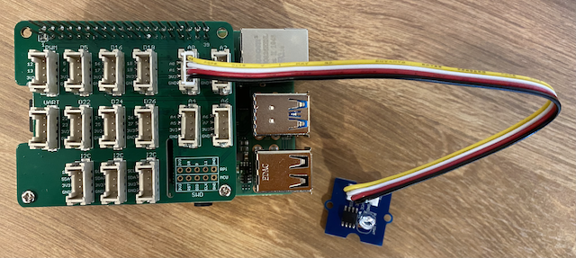

<!--
CO_OP_TRANSLATOR_METADATA:
{
  "original_hash": "ea733bd0cdf2479e082373f765a08678",
  "translation_date": "2025-08-27T22:24:15+00:00",
  "source_file": "1-getting-started/lessons/3-sensors-and-actuators/pi-sensor.md",
  "language_code": "vi"
}
-->
# Xây dựng đèn ngủ - Raspberry Pi

Trong phần này của bài học, bạn sẽ thêm một cảm biến ánh sáng vào Raspberry Pi của mình.

## Phần cứng

Cảm biến cho bài học này là **cảm biến ánh sáng** sử dụng [photodiode](https://wikipedia.org/wiki/Photodiode) để chuyển đổi ánh sáng thành tín hiệu điện. Đây là một cảm biến analog gửi giá trị số nguyên từ 0 đến 1.000, biểu thị mức độ ánh sáng tương đối mà không tương ứng với bất kỳ đơn vị đo lường tiêu chuẩn nào như [lux](https://wikipedia.org/wiki/Lux).

Cảm biến ánh sáng là một cảm biến Grove bên ngoài và cần được kết nối với Grove Base hat trên Raspberry Pi.

### Kết nối cảm biến ánh sáng

Cảm biến ánh sáng Grove được sử dụng để phát hiện mức độ ánh sáng cần được kết nối với Raspberry Pi.

#### Nhiệm vụ - kết nối cảm biến ánh sáng

Kết nối cảm biến ánh sáng


1. Cắm một đầu của cáp Grove vào ổ cắm trên module cảm biến ánh sáng. Cáp chỉ có thể cắm theo một chiều.

1. Khi Raspberry Pi đã tắt nguồn, kết nối đầu còn lại của cáp Grove vào ổ cắm analog được đánh dấu **A0** trên Grove Base hat gắn vào Pi. Ổ cắm này là ổ thứ hai từ bên phải, nằm trên hàng ổ cắm cạnh các chân GPIO.



## Lập trình cảm biến ánh sáng

Thiết bị giờ đây có thể được lập trình sử dụng cảm biến ánh sáng Grove.

### Nhiệm vụ - lập trình cảm biến ánh sáng

Lập trình thiết bị.

1. Bật nguồn Pi và chờ nó khởi động.

1. Mở dự án đèn ngủ trong VS Code mà bạn đã tạo ở phần trước của bài tập này, chạy trực tiếp trên Pi hoặc kết nối bằng tiện ích mở rộng Remote SSH.

1. Mở tệp `app.py` và xóa toàn bộ mã trong đó.

1. Thêm đoạn mã sau vào tệp `app.py` để nhập một số thư viện cần thiết:

    ```python
    import time
    from grove.grove_light_sensor_v1_2 import GroveLightSensor
    ```

    Lệnh `import time` nhập module `time`, sẽ được sử dụng sau trong bài tập này.

    Lệnh `from grove.grove_light_sensor_v1_2 import GroveLightSensor` nhập `GroveLightSensor` từ thư viện Python Grove. Thư viện này chứa mã để tương tác với cảm biến ánh sáng Grove và đã được cài đặt toàn cục trong quá trình thiết lập Pi.

1. Thêm đoạn mã sau sau đoạn mã trên để tạo một instance của lớp quản lý cảm biến ánh sáng:

    ```python
    light_sensor = GroveLightSensor(0)
    ```

    Dòng `light_sensor = GroveLightSensor(0)` tạo một instance của lớp `GroveLightSensor` kết nối với chân **A0** - chân analog Grove mà cảm biến ánh sáng được kết nối.

1. Thêm một vòng lặp vô hạn sau đoạn mã trên để lấy giá trị cảm biến ánh sáng và in ra màn hình:

    ```python
    while True:
        light = light_sensor.light
        print('Light level:', light)
    ```

    Điều này sẽ đọc mức độ ánh sáng hiện tại trên thang điểm từ 0-1.023 bằng thuộc tính `light` của lớp `GroveLightSensor`. Thuộc tính này đọc giá trị analog từ chân. Giá trị này sau đó được in ra màn hình.

1. Thêm một khoảng nghỉ nhỏ một giây ở cuối `loop` vì không cần kiểm tra mức độ ánh sáng liên tục. Khoảng nghỉ giúp giảm tiêu thụ năng lượng của thiết bị.

    ```python
    time.sleep(1)
    ```

1. Từ Terminal của VS Code, chạy lệnh sau để chạy ứng dụng Python của bạn:

    ```sh
    python3 app.py
    ```

    Các giá trị ánh sáng sẽ được hiển thị trên màn hình. Che và mở cảm biến ánh sáng, các giá trị sẽ thay đổi:

    ```output
    pi@raspberrypi:~/nightlight $ python3 app.py 
    Light level: 634
    Light level: 634
    Light level: 634
    Light level: 230
    Light level: 104
    Light level: 290
    ```

> 💁 Bạn có thể tìm thấy đoạn mã này trong thư mục [code-sensor/pi](../../../../../1-getting-started/lessons/3-sensors-and-actuators/code-sensor/pi).

😀 Thêm cảm biến vào chương trình đèn ngủ của bạn đã thành công!

---

**Tuyên bố miễn trừ trách nhiệm**:  
Tài liệu này đã được dịch bằng dịch vụ dịch thuật AI [Co-op Translator](https://github.com/Azure/co-op-translator). Mặc dù chúng tôi cố gắng đảm bảo độ chính xác, xin lưu ý rằng các bản dịch tự động có thể chứa lỗi hoặc không chính xác. Tài liệu gốc bằng ngôn ngữ bản địa nên được coi là nguồn thông tin chính thức. Đối với các thông tin quan trọng, khuyến nghị sử dụng dịch vụ dịch thuật chuyên nghiệp bởi con người. Chúng tôi không chịu trách nhiệm cho bất kỳ sự hiểu lầm hoặc diễn giải sai nào phát sinh từ việc sử dụng bản dịch này.