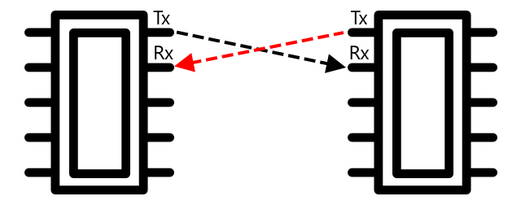

<!--
CO_OP_TRANSLATOR_METADATA:
{
  "original_hash": "4fb20273d299dc8d07a8f06c9cd0cdd9",
  "translation_date": "2025-08-28T01:09:14+00:00",
  "source_file": "2-farm/lessons/2-detect-soil-moisture/README.md",
  "language_code": "vi"
}
-->
C, phát âm là *I-squared-C*, là một giao thức đa bộ điều khiển, đa thiết bị ngoại vi, trong đó bất kỳ thiết bị nào được kết nối đều có thể hoạt động như một bộ điều khiển hoặc thiết bị ngoại vi giao tiếp qua bus I²C (tên gọi của hệ thống truyền dữ liệu). Dữ liệu được gửi dưới dạng các gói địa chỉ, mỗi gói chứa địa chỉ của thiết bị được kết nối mà nó hướng tới.

> 💁 Mô hình này trước đây được gọi là master/slave, nhưng thuật ngữ này đang bị loại bỏ do liên quan đến chế độ nô lệ. [Hiệp hội Phần cứng Mã nguồn Mở đã chấp nhận thuật ngữ controller/peripheral](https://www.oshwa.org/a-resolution-to-redefine-spi-signal-names/), nhưng bạn vẫn có thể thấy các tài liệu tham khảo đến thuật ngữ cũ.

Các thiết bị có một địa chỉ được sử dụng khi chúng kết nối với bus I²C, và thường được mã hóa cứng trên thiết bị. Ví dụ, mỗi loại cảm biến Grove từ Seeed có cùng một địa chỉ, vì vậy tất cả các cảm biến ánh sáng có cùng địa chỉ, tất cả các nút bấm có cùng địa chỉ nhưng khác với địa chỉ của cảm biến ánh sáng. Một số thiết bị có cách thay đổi địa chỉ, bằng cách thay đổi cài đặt jumper hoặc hàn các chân lại với nhau.

I²C có một bus gồm 2 dây chính, cùng với 2 dây nguồn:

| Dây | Tên | Mô tả |
| ---- | --------- | ----------- |
| SDA | Serial Data | Dây này dùng để gửi dữ liệu giữa các thiết bị. |
| SCL | Serial Clock | Dây này gửi tín hiệu đồng hồ với tốc độ được thiết lập bởi bộ điều khiển. |
| VCC | Voltage common collector | Nguồn cung cấp cho các thiết bị. Dây này được kết nối với dây SDA và SCL để cung cấp năng lượng thông qua một điện trở kéo lên, giúp tắt tín hiệu khi không có thiết bị nào là bộ điều khiển. |
| GND | Ground | Cung cấp một điểm nối đất chung cho mạch điện. |

Để gửi dữ liệu, một thiết bị sẽ phát ra điều kiện bắt đầu để cho biết nó sẵn sàng gửi dữ liệu. Sau đó, nó sẽ trở thành bộ điều khiển. Bộ điều khiển sau đó gửi địa chỉ của thiết bị mà nó muốn giao tiếp, cùng với việc nó muốn đọc hay ghi dữ liệu. Sau khi dữ liệu đã được truyền, bộ điều khiển gửi điều kiện dừng để chỉ ra rằng nó đã hoàn thành. Sau đó, một thiết bị khác có thể trở thành bộ điều khiển và gửi hoặc nhận dữ liệu.

2C có các giới hạn tốc độ, với 3 chế độ chạy ở tốc độ cố định. Chế độ nhanh nhất là chế độ High Speed với tốc độ tối đa 3.4Mbps (megabit mỗi giây), mặc dù rất ít thiết bị hỗ trợ tốc độ này. Ví dụ, Raspberry Pi bị giới hạn ở chế độ fast mode với tốc độ 400Kbps (kilobit mỗi giây). Chế độ Standard chạy ở tốc độ 100Kbps.

> 💁 Nếu bạn đang sử dụng Raspberry Pi với mũ Grove Base làm phần cứng IoT, bạn sẽ thấy một số ổ cắm I2C trên bo mạch mà bạn có thể sử dụng để giao tiếp với các cảm biến I2C. Các cảm biến Grove Analog cũng sử dụng I2C với ADC để gửi các giá trị analog dưới dạng dữ liệu số, vì vậy cảm biến ánh sáng bạn đã sử dụng mô phỏng một chân analog, với giá trị được gửi qua I2C vì Raspberry Pi chỉ hỗ trợ các chân số.

### Bộ thu-phát không đồng bộ toàn cầu (UART)

UART bao gồm mạch vật lý cho phép hai thiết bị giao tiếp. Mỗi thiết bị có 2 chân giao tiếp - truyền (Tx) và nhận (Rx), với chân Tx của thiết bị đầu tiên được kết nối với chân Rx của thiết bị thứ hai, và chân Tx của thiết bị thứ hai được kết nối với chân Rx của thiết bị đầu tiên. Điều này cho phép dữ liệu được gửi theo cả hai hướng.

* Thiết bị 1 truyền dữ liệu từ chân Tx của nó, dữ liệu này được nhận bởi thiết bị 2 trên chân Rx của nó.
* Thiết bị 1 nhận dữ liệu trên chân Rx của nó, dữ liệu này được truyền bởi thiết bị 2 từ chân Tx của nó.

> 🎓 Dữ liệu được gửi từng bit một, và điều này được gọi là giao tiếp *nối tiếp*. Hầu hết các hệ điều hành và vi điều khiển đều có *cổng nối tiếp*, tức là các kết nối có thể gửi và nhận dữ liệu nối tiếp mà mã của bạn có thể sử dụng.

Các thiết bị UART có [tốc độ baud](https://wikipedia.org/wiki/Symbol_rate) (còn được gọi là tốc độ ký hiệu), là tốc độ mà dữ liệu sẽ được gửi và nhận tính bằng bit mỗi giây. Một tốc độ baud phổ biến là 9.600, nghĩa là 9.600 bit (0 và 1) dữ liệu được gửi mỗi giây.

UART sử dụng các bit bắt đầu và kết thúc - nghĩa là nó gửi một bit bắt đầu để chỉ ra rằng nó sắp gửi một byte (8 bit) dữ liệu, sau đó là một bit kết thúc sau khi nó gửi 8 bit.

Tốc độ UART phụ thuộc vào phần cứng, nhưng ngay cả các triển khai nhanh nhất cũng không vượt quá 6.5 Mbps (megabit mỗi giây, hoặc hàng triệu bit, 0 hoặc 1, được gửi mỗi giây).

Bạn có thể sử dụng UART qua các chân GPIO - bạn có thể đặt một chân làm Tx và một chân khác làm Rx, sau đó kết nối chúng với một thiết bị khác.

> 💁 Nếu bạn đang sử dụng Raspberry Pi với mũ Grove Base làm phần cứng IoT, bạn sẽ thấy một ổ cắm UART trên bo mạch mà bạn có thể sử dụng để giao tiếp với các cảm biến sử dụng giao thức UART.

### Giao diện ngoại vi nối tiếp (SPI)

SPI được thiết kế để giao tiếp ở khoảng cách ngắn, chẳng hạn như trên một vi điều khiển để nói chuyện với một thiết bị lưu trữ như bộ nhớ flash. Nó dựa trên mô hình bộ điều khiển/thiết bị ngoại vi với một bộ điều khiển duy nhất (thường là bộ xử lý của thiết bị IoT) tương tác với nhiều thiết bị ngoại vi. Bộ điều khiển kiểm soát mọi thứ bằng cách chọn một thiết bị ngoại vi và gửi hoặc yêu cầu dữ liệu.

> 💁 Giống như I2C, các thuật ngữ bộ điều khiển và thiết bị ngoại vi là những thay đổi gần đây, vì vậy bạn có thể thấy các thuật ngữ cũ hơn vẫn được sử dụng.

Các bộ điều khiển SPI sử dụng 3 dây, cùng với 1 dây bổ sung cho mỗi thiết bị ngoại vi. Các thiết bị ngoại vi sử dụng 4 dây. Các dây này là:

| Dây | Tên | Mô tả |
| ---- | --------- | ----------- |
| COPI | Controller Output, Peripheral Input | Dây này dùng để gửi dữ liệu từ bộ điều khiển đến thiết bị ngoại vi. |
| CIPO | Controller Input, Peripheral Output | Dây này dùng để gửi dữ liệu từ thiết bị ngoại vi đến bộ điều khiển. |
| SCLK | Serial Clock | Dây này gửi tín hiệu đồng hồ ở tốc độ do bộ điều khiển đặt. |
| CS   | Chip Select | Bộ điều khiển có nhiều dây, mỗi dây cho một thiết bị ngoại vi, và mỗi dây kết nối với dây CS trên thiết bị ngoại vi tương ứng. |

Dây CS được sử dụng để kích hoạt một thiết bị ngoại vi tại một thời điểm, giao tiếp qua các dây COPI và CIPO. Khi bộ điều khiển cần thay đổi thiết bị ngoại vi, nó sẽ hủy kích hoạt dây CS kết nối với thiết bị ngoại vi hiện đang hoạt động, sau đó kích hoạt dây kết nối với thiết bị ngoại vi mà nó muốn giao tiếp tiếp theo.

SPI là *full-duplex*, nghĩa là bộ điều khiển có thể gửi và nhận dữ liệu cùng lúc từ cùng một thiết bị ngoại vi bằng cách sử dụng các dây COPI và CIPO. SPI sử dụng tín hiệu đồng hồ trên dây SCLK để giữ các thiết bị đồng bộ, vì vậy không giống như gửi trực tiếp qua UART, nó không cần các bit bắt đầu và kết thúc.

Không có giới hạn tốc độ được xác định cho SPI, với các triển khai thường có thể truyền nhiều megabyte dữ liệu mỗi giây.

Các bộ kit phát triển IoT thường hỗ trợ SPI qua một số chân GPIO. Ví dụ, trên Raspberry Pi, bạn có thể sử dụng các chân GPIO 19, 21, 23, 24 và 26 cho SPI.

### Không dây

Một số cảm biến có thể giao tiếp qua các giao thức không dây tiêu chuẩn, chẳng hạn như Bluetooth (chủ yếu là Bluetooth Low Energy, hoặc BLE), LoRaWAN (một giao thức mạng công suất thấp **Lo**ng **Ra**nge), hoặc WiFi. Điều này cho phép các cảm biến từ xa không được kết nối vật lý với thiết bị IoT.

Một ví dụ là trong các cảm biến độ ẩm đất thương mại. Các cảm biến này sẽ đo độ ẩm đất trong một cánh đồng, sau đó gửi dữ liệu qua LoRaWAN đến một thiết bị trung tâm, thiết bị này sẽ xử lý dữ liệu hoặc gửi nó qua Internet. Điều này cho phép cảm biến cách xa thiết bị IoT quản lý dữ liệu, giảm tiêu thụ năng lượng và nhu cầu về mạng WiFi lớn hoặc cáp dài.

BLE phổ biến cho các cảm biến tiên tiến như thiết bị theo dõi sức khỏe đeo trên cổ tay. Các thiết bị này kết hợp nhiều cảm biến và gửi dữ liệu cảm biến đến một thiết bị IoT dưới dạng điện thoại của bạn qua BLE.

✅ Bạn có cảm biến Bluetooth nào trên người, trong nhà hoặc ở trường không? Chúng có thể bao gồm cảm biến nhiệt độ, cảm biến hiện diện, thiết bị theo dõi và thiết bị thể dục.

Một cách phổ biến để các thiết bị thương mại kết nối là Zigbee. Zigbee sử dụng WiFi để tạo mạng lưới giữa các thiết bị, nơi mỗi thiết bị kết nối với càng nhiều thiết bị gần đó càng tốt, tạo thành một số lượng lớn các kết nối giống như mạng nhện. Khi một thiết bị muốn gửi một tin nhắn đến Internet, nó có thể gửi nó đến các thiết bị gần nhất, sau đó các thiết bị này chuyển tiếp nó đến các thiết bị gần đó khác và cứ thế, cho đến khi nó đến được bộ điều phối và có thể được gửi đến Internet.

> 🐝 Tên Zigbee đề cập đến điệu nhảy lắc lư của ong mật sau khi chúng trở về tổ ong.

## Đo độ ẩm trong đất

Bạn có thể đo độ ẩm trong đất bằng cách sử dụng cảm biến độ ẩm đất, một thiết bị IoT và một chậu cây trong nhà hoặc một mảnh đất gần đó.

### Nhiệm vụ - đo độ ẩm đất

Thực hiện theo hướng dẫn liên quan để đo độ ẩm đất bằng thiết bị IoT của bạn:

* [Arduino - Wio Terminal](wio-terminal-soil-moisture.md)
* [Máy tính đơn bo - Raspberry Pi](pi-soil-moisture.md)
* [Máy tính đơn bo - Thiết bị ảo](virtual-device-soil-moisture.md)

## Hiệu chỉnh cảm biến

Cảm biến dựa vào việc đo các thuộc tính điện như điện trở hoặc điện dung.

> 🎓 Điện trở, được đo bằng ohm (Ω), là mức độ cản trở dòng điện đi qua một vật liệu. Khi một điện áp được áp dụng lên một vật liệu, lượng dòng điện đi qua nó phụ thuộc vào điện trở của vật liệu. Bạn có thể đọc thêm trên [trang điện trở điện trên Wikipedia](https://wikipedia.org/wiki/Electrical_resistance_and_conductance).

> 🎓 Điện dung, được đo bằng farad (F), là khả năng của một thành phần hoặc mạch để thu thập và lưu trữ năng lượng điện. Bạn có thể đọc thêm về điện dung trên [trang điện dung trên Wikipedia](https://wikipedia.org/wiki/Capacitance).

Những phép đo này không phải lúc nào cũng hữu ích - hãy tưởng tượng một cảm biến nhiệt độ cho bạn một phép đo là 22.5KΩ! Thay vào đó, giá trị đo được cần được chuyển đổi thành một đơn vị hữu ích bằng cách hiệu chỉnh - tức là khớp các giá trị đo được với đại lượng đo được để cho phép các phép đo mới được chuyển đổi sang đơn vị đúng.

Một số cảm biến được hiệu chỉnh sẵn. Ví dụ, cảm biến nhiệt độ bạn đã sử dụng trong bài học trước đã được hiệu chỉnh để nó có thể trả về một phép đo nhiệt độ bằng °C. Trong nhà máy, cảm biến đầu tiên được tạo ra sẽ được tiếp xúc với một loạt các nhiệt độ đã biết và điện trở được đo. Điều này sau đó sẽ được sử dụng để xây dựng một phép tính có thể chuyển đổi từ giá trị đo được bằng Ω (đơn vị của điện trở) sang °C.

> 💁 Công thức để tính điện trở từ nhiệt độ được gọi là [phương trình Steinhart–Hart](https://wikipedia.org/wiki/Steinhart–Hart_equation).

### Hiệu chỉnh cảm biến độ ẩm đất

Độ ẩm đất được đo bằng cách sử dụng hàm lượng nước trọng lượng hoặc thể tích.

* Trọng lượng là trọng lượng của nước trong một đơn vị trọng lượng đất được đo, tính bằng số kilogam nước trên mỗi kilogam đất khô.
* Thể tích là thể tích của nước trong một đơn vị thể tích đất được đo, tính bằng số mét khối nước trên mỗi mét khối đất khô.

> 🇺🇸 Đối với người Mỹ, do tính nhất quán của các đơn vị, những điều này có thể được đo bằng pound thay vì kilogam hoặc feet khối thay vì mét khối.

Cảm biến độ ẩm đất đo điện trở hoặc điện dung - điều này không chỉ thay đổi theo độ ẩm đất, mà còn theo loại đất vì các thành phần trong đất có thể thay đổi đặc tính điện của nó. Lý tưởng nhất là các cảm biến nên được hiệu chỉnh - tức là lấy các số đo từ cảm biến và so sánh chúng với các phép đo được tìm thấy bằng cách tiếp cận khoa học hơn. Ví dụ, một phòng thí nghiệm có thể tính toán độ ẩm đất trọng lượng bằng cách sử dụng các mẫu từ một cánh đồng cụ thể được lấy vài lần trong năm, và các con số này được sử dụng để hiệu chỉnh cảm biến, khớp số đo của cảm biến với độ ẩm đất trọng lượng.

Biểu đồ trên cho thấy cách hiệu chỉnh một cảm biến. Điện áp được ghi lại cho một mẫu đất sau đó được đo trong phòng thí nghiệm bằng cách so sánh trọng lượng ẩm với trọng lượng khô (bằng cách đo trọng lượng khi ướt, sau đó sấy khô trong lò và đo trọng lượng khô). Sau khi lấy một vài số đo, điều này có thể được vẽ trên biểu đồ và một đường thẳng được khớp với các điểm. Đường thẳng này sau đó có thể được sử dụng để chuyển đổi các số đo cảm biến độ ẩm đất được thực hiện bởi một thiết bị IoT thành các phép đo độ ẩm đất thực tế.

💁 Đối với các cảm biến độ ẩm đất điện trở, điện áp tăng khi độ ẩm đất tăng. Đối với các cảm biến độ ẩm đất điện dung, điện áp giảm khi độ ẩm đất tăng, vì vậy các biểu đồ cho các cảm biến này sẽ dốc xuống, không phải lên.

Biểu đồ trên cho thấy một số đo điện áp từ một cảm biến độ ẩm đất, và bằng cách theo dõi nó đến đường trên biểu đồ, độ ẩm đất thực tế có thể được tính toán.

Cách tiếp cận này có nghĩa là người nông dân chỉ cần lấy một vài số đo trong phòng thí nghiệm cho một cánh đồng, sau đó họ có thể sử dụng các thiết bị IoT để đo độ ẩm đất - giảm đáng kể thời gian để thực hiện các phép đo.

---

## 🚀 Thử thách

Cảm biến độ ẩm đất điện trở và điện dung có một số khác biệt. Những khác biệt này là gì, và loại nào (nếu có) là tốt nhất cho một người nông dân sử dụng? Câu trả lời này có thay đổi giữa các nước đang phát triển và các nước phát triển không?

## Câu hỏi sau bài giảng

[Câu hỏi sau bài giảng](https://black-meadow-040d15503.1.azurestaticapps.net/quiz/12)

## Ôn tập & Tự học

Tìm hiểu thêm về phần cứng và giao thức được sử dụng bởi các cảm biến và bộ truyền động:

* [Trang Wikipedia về GPIO](https://wikipedia.org/wiki/General-purpose_input/output)
* [Trang Wikipedia về UART](https://wikipedia.org/wiki/Universal_asynchronous_receiver-transmitter)
* [Trang Wikipedia về SPI](https://wikipedia.org/wiki/Serial_Peripheral_Interface)
* [Trang Wikipedia về I2C](https://wikipedia.org/wiki/I²C)
* [Trang Wikipedia về Zigbee](https://wikipedia.org/wiki/Zigbee)

## Bài tập

[Hiệu chỉnh cảm biến của bạn](assignment.md)

---

**Tuyên bố miễn trừ trách nhiệm**:  
Tài liệu này đã được dịch bằng dịch vụ dịch thuật AI [Co-op Translator](https://github.com/Azure/co-op-translator). Mặc dù chúng tôi cố gắng đảm bảo độ chính xác, xin lưu ý rằng các bản dịch tự động có thể chứa lỗi hoặc không chính xác. Tài liệu gốc bằng ngôn ngữ bản địa nên được coi là nguồn thông tin chính thức. Đối với các thông tin quan trọng, khuyến nghị sử dụng dịch vụ dịch thuật chuyên nghiệp bởi con người. Chúng tôi không chịu trách nhiệm cho bất kỳ sự hiểu lầm hoặc diễn giải sai nào phát sinh từ việc sử dụng bản dịch này.