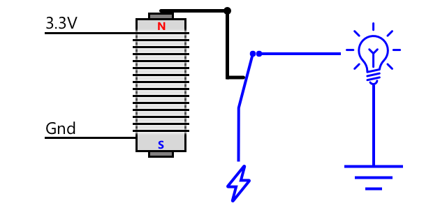
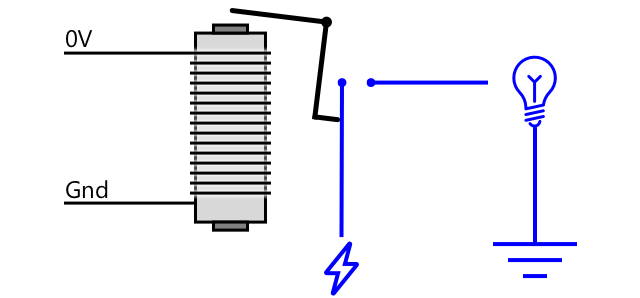

<!--
CO_OP_TRANSLATOR_METADATA:
{
  "original_hash": "f7bb24ba53fb627ddb38a8b24a05e594",
  "translation_date": "2025-08-27T21:31:31+00:00",
  "source_file": "2-farm/lessons/3-automated-plant-watering/README.md",
  "language_code": "vi"
}
-->
# Tưới cây tự động


> Sketchnote bởi [Nitya Narasimhan](https://github.com/nitya). Nhấp vào hình ảnh để xem phiên bản lớn hơn.

Bài học này được giảng dạy trong [IoT for Beginners Project 2 - Digital Agriculture series](https://youtube.com/playlist?list=PLmsFUfdnGr3yCutmcVg6eAUEfsGiFXgcx) từ [Microsoft Reactor](https://developer.microsoft.com/reactor/?WT.mc_id=academic-17441-jabenn).

[](https://youtu.be/g9FfZwv9R58)

## Câu hỏi trước bài giảng

[Câu hỏi trước bài giảng](https://black-meadow-040d15503.1.azurestaticapps.net/quiz/13)

## Giới thiệu

Trong bài học trước, bạn đã học cách theo dõi độ ẩm của đất. Trong bài học này, bạn sẽ học cách xây dựng các thành phần cốt lõi của hệ thống tưới nước tự động phản ứng với độ ẩm của đất. Bạn cũng sẽ tìm hiểu về thời gian - cách các cảm biến có thể mất một khoảng thời gian để phản hồi thay đổi, và cách các bộ truyền động cần thời gian để thay đổi các thuộc tính được cảm biến đo lường.

Trong bài học này, chúng ta sẽ đề cập đến:

* [Điều khiển thiết bị công suất cao từ thiết bị IoT công suất thấp](../../../../../2-farm/lessons/3-automated-plant-watering)
* [Điều khiển relay](../../../../../2-farm/lessons/3-automated-plant-watering)
* [Điều khiển cây của bạn qua MQTT](../../../../../2-farm/lessons/3-automated-plant-watering)
* [Thời gian của cảm biến và bộ truyền động](../../../../../2-farm/lessons/3-automated-plant-watering)
* [Thêm thời gian vào máy chủ điều khiển cây của bạn](../../../../../2-farm/lessons/3-automated-plant-watering)

## Điều khiển thiết bị công suất cao từ thiết bị IoT công suất thấp

Thiết bị IoT sử dụng điện áp thấp. Mặc dù điều này đủ cho các cảm biến và bộ truyền động công suất thấp như đèn LED, nhưng lại quá thấp để điều khiển phần cứng lớn hơn, chẳng hạn như máy bơm nước dùng cho tưới tiêu. Ngay cả các máy bơm nhỏ bạn có thể sử dụng cho cây trong nhà cũng tiêu thụ quá nhiều dòng điện đối với bộ phát triển IoT và có thể làm hỏng bảng mạch.

> 🎓 Dòng điện, được đo bằng Ampe (A), là lượng điện di chuyển qua một mạch. Điện áp cung cấp lực đẩy, dòng điện là lượng điện được đẩy. Bạn có thể tìm hiểu thêm về dòng điện trên [trang dòng điện trên Wikipedia](https://wikipedia.org/wiki/Electric_current).

Giải pháp cho vấn đề này là kết nối máy bơm với nguồn điện bên ngoài và sử dụng một bộ truyền động để bật máy bơm, tương tự như cách bạn bật một chiếc đèn. Chỉ cần một lượng nhỏ năng lượng (dưới dạng năng lượng trong cơ thể bạn) để ngón tay của bạn bật công tắc, và điều này kết nối đèn với nguồn điện chính chạy ở 110v/240v.


> 🎓 [Điện lưới](https://wikipedia.org/wiki/Mains_electricity) là điện được cung cấp cho các hộ gia đình và doanh nghiệp thông qua cơ sở hạ tầng quốc gia ở nhiều nơi trên thế giới.

✅ Thiết bị IoT thường cung cấp 3.3V hoặc 5V, với dòng điện dưới 1 ampe (1A). So sánh điều này với điện lưới, thường là 230V (120V ở Bắc Mỹ và 100V ở Nhật Bản), và có thể cung cấp năng lượng cho các thiết bị tiêu thụ dòng điện lên đến 30A.

Có một số bộ truyền động có thể làm điều này, bao gồm các thiết bị cơ học bạn có thể gắn vào các công tắc hiện có để mô phỏng ngón tay bật chúng lên. Phổ biến nhất là relay.

### Relay

Relay là một công tắc điện cơ chuyển đổi tín hiệu điện thành chuyển động cơ học để bật công tắc. Cốt lõi của relay là một nam châm điện.

> 🎓 [Nam châm điện](https://wikipedia.org/wiki/Electromagnet) là nam châm được tạo ra bằng cách truyền điện qua một cuộn dây. Khi điện được bật, cuộn dây trở nên từ hóa. Khi điện bị tắt, cuộn dây mất từ tính.



Trong relay, một mạch điều khiển cung cấp năng lượng cho nam châm điện. Khi nam châm điện được bật, nó kéo một đòn bẩy di chuyển công tắc, đóng một cặp tiếp điểm và hoàn thành mạch đầu ra.



Khi mạch điều khiển tắt, nam châm điện tắt, thả đòn bẩy và mở các tiếp điểm, tắt mạch đầu ra. Relay là bộ truyền động kỹ thuật số - tín hiệu cao đến relay sẽ bật nó lên, tín hiệu thấp sẽ tắt nó đi.

Mạch đầu ra có thể được sử dụng để cung cấp năng lượng cho phần cứng bổ sung, như hệ thống tưới tiêu. Thiết bị IoT có thể bật relay, hoàn thành mạch đầu ra cung cấp năng lượng cho hệ thống tưới tiêu, và cây sẽ được tưới nước. Thiết bị IoT sau đó có thể tắt relay, cắt nguồn điện cho hệ thống tưới tiêu, tắt nước.


Trong video trên, một relay được bật. Một đèn LED trên relay sáng lên để chỉ báo rằng nó đang bật (một số bảng relay có đèn LED để chỉ báo relay đang bật hay tắt), và nguồn điện được gửi đến máy bơm, bật máy bơm và bơm nước vào cây.

> 💁 Relay cũng có thể được sử dụng để chuyển đổi giữa hai mạch đầu ra thay vì bật hoặc tắt một mạch. Khi đòn bẩy di chuyển, nó di chuyển một công tắc từ hoàn thành một mạch đầu ra sang hoàn thành một mạch đầu ra khác, thường chia sẻ một kết nối nguồn chung hoặc kết nối đất chung.

✅ Nghiên cứu thêm: Có nhiều loại relay khác nhau, với sự khác biệt như việc mạch điều khiển bật hoặc tắt relay khi nguồn điện được áp dụng, hoặc có nhiều mạch đầu ra. Tìm hiểu về các loại relay khác nhau này.

Khi đòn bẩy di chuyển, bạn thường có thể nghe thấy nó tiếp xúc với nam châm điện với một tiếng click rõ ràng.

> 💁 Relay có thể được nối dây sao cho việc tạo kết nối thực sự làm ngắt nguồn điện đến relay, tắt relay, sau đó gửi nguồn điện đến relay để bật nó lên lại, và cứ thế. Điều này khiến relay click rất nhanh tạo ra tiếng kêu vo vo. Đây là cách một số chuông cửa điện đầu tiên hoạt động.

### Công suất của relay

Nam châm điện không cần nhiều năng lượng để kích hoạt và kéo đòn bẩy, nó có thể được điều khiển bằng đầu ra 3.3V hoặc 5V từ bộ phát triển IoT. Mạch đầu ra có thể mang nhiều năng lượng hơn, tùy thuộc vào relay, bao gồm điện lưới hoặc thậm chí mức công suất cao hơn cho sử dụng công nghiệp. Bằng cách này, bộ phát triển IoT có thể điều khiển hệ thống tưới tiêu, từ máy bơm nhỏ cho một cây đơn lẻ, đến hệ thống công nghiệp lớn cho cả một trang trại thương mại.


Hình ảnh trên cho thấy một relay Grove. Mạch điều khiển kết nối với thiết bị IoT và bật hoặc tắt relay bằng 3.3V hoặc 5V. Mạch đầu ra có hai đầu nối, bất kỳ đầu nào cũng có thể là nguồn hoặc đất. Mạch đầu ra có thể xử lý lên đến 250V tại 10A, đủ cho một loạt các thiết bị chạy bằng điện lưới. Bạn có thể mua các relay có thể xử lý mức công suất cao hơn.


Trong hình ảnh trên, nguồn điện được cung cấp cho máy bơm thông qua relay. Có một dây đỏ kết nối đầu nối +5V của nguồn điện USB với một đầu nối của mạch đầu ra của relay, và một dây đỏ khác kết nối đầu nối còn lại của mạch đầu ra với máy bơm. Một dây đen kết nối máy bơm với đất trên nguồn điện USB. Khi relay bật, nó hoàn thành mạch, gửi 5V đến máy bơm, bật máy bơm.

## Điều khiển relay

Bạn có thể điều khiển relay từ bộ phát triển IoT của mình.

### Nhiệm vụ - điều khiển relay

Thực hiện theo hướng dẫn liên quan để điều khiển relay bằng thiết bị IoT của bạn:

* [Arduino - Wio Terminal](wio-terminal-relay.md)
* [Máy tính đơn bảng - Raspberry Pi](pi-relay.md)
* [Máy tính đơn bảng - Thiết bị ảo](virtual-device-relay.md)

## Điều khiển cây của bạn qua MQTT

Hiện tại relay của bạn được điều khiển trực tiếp bởi thiết bị IoT dựa trên một lần đọc độ ẩm đất. Trong hệ thống tưới tiêu thương mại, logic điều khiển sẽ được tập trung, cho phép nó đưa ra quyết định về việc tưới nước bằng cách sử dụng dữ liệu từ nhiều cảm biến, và cho phép bất kỳ cấu hình nào được thay đổi tại một nơi duy nhất. Để mô phỏng điều này, bạn có thể điều khiển relay qua MQTT.

### Nhiệm vụ - điều khiển relay qua MQTT

1. Thêm các thư viện/pip packages MQTT liên quan và mã vào dự án `soil-moisture-sensor` của bạn để kết nối với MQTT. Đặt tên ID client là `soilmoisturesensor_client` với tiền tố là ID của bạn.

    > ⚠️ Bạn có thể tham khảo [hướng dẫn kết nối với MQTT trong dự án 1, bài học 4 nếu cần](../../../1-getting-started/lessons/4-connect-internet/README.md#connect-your-iot-device-to-mqtt).

1. Thêm mã thiết bị liên quan để gửi dữ liệu đo lường với cài đặt độ ẩm đất. Đặt tên thuộc tính của tin nhắn đo lường là `soil_moisture`.

    > ⚠️ Bạn có thể tham khảo [hướng dẫn gửi dữ liệu đo lường đến MQTT trong dự án 1, bài học 4 nếu cần](../../../1-getting-started/lessons/4-connect-internet/README.md#send-telemetry-from-your-iot-device).

1. Tạo một số mã máy chủ cục bộ để đăng ký dữ liệu đo lường và gửi lệnh điều khiển relay trong một thư mục gọi là `soil-moisture-sensor-server`. Đặt tên thuộc tính trong tin nhắn lệnh là `relay_on`, và đặt ID client là `soilmoisturesensor_server` với tiền tố là ID của bạn. Giữ cùng cấu trúc như mã máy chủ bạn đã viết cho dự án 1, bài học 4 vì bạn sẽ thêm vào mã này sau trong bài học này.

    > ⚠️ Bạn có thể tham khảo [hướng dẫn gửi dữ liệu đo lường đến MQTT](../../../1-getting-started/lessons/4-connect-internet/README.md#write-the-server-code) và [gửi lệnh qua MQTT](../../../1-getting-started/lessons/4-connect-internet/README.md#send-commands-to-the-mqtt-broker) trong dự án 1, bài học 4 nếu cần.

1. Thêm mã thiết bị liên quan để điều khiển relay từ các lệnh nhận được, sử dụng thuộc tính `relay_on` từ tin nhắn. Gửi giá trị true cho `relay_on` nếu `soil_moisture` lớn hơn 450, nếu không thì gửi false, giống như logic bạn đã thêm cho thiết bị IoT trước đó.

    > ⚠️ Bạn có thể tham khảo [hướng dẫn phản hồi lệnh từ MQTT trong dự án 1, bài học 4 nếu cần](../../../1-getting-started/lessons/4-connect-internet/README.md#handle-commands-on-the-iot-device).

> 💁 Bạn có thể tìm thấy mã này trong thư mục [code-mqtt](../../../../../2-farm/lessons/3-automated-plant-watering/code-mqtt).

Đảm bảo mã đang chạy trên thiết bị và máy chủ cục bộ của bạn, và kiểm tra bằng cách thay đổi mức độ ẩm đất, hoặc bằng cách thay đổi giá trị được gửi bởi cảm biến ảo, hoặc bằng cách thay đổi mức độ ẩm của đất bằng cách thêm nước hoặc loại bỏ cảm biến khỏi đất.

## Thời gian của cảm biến và bộ truyền động

Quay lại bài học 3, bạn đã xây dựng một chiếc đèn ngủ - một đèn LED bật lên ngay khi mức độ ánh sáng thấp được cảm biến ánh sáng phát hiện. Cảm biến ánh sáng phát hiện thay đổi mức độ ánh sáng ngay lập tức, và thiết bị có thể phản hồi nhanh chóng, chỉ bị giới hạn bởi độ dài của độ trễ trong hàm `loop` hoặc vòng lặp `while True:`. Là một nhà phát triển IoT, bạn không phải lúc nào cũng có thể dựa vào vòng phản hồi nhanh như vậy.

### Thời gian cho độ ẩm đất

Nếu bạn đã thực hiện bài học trước về độ ẩm đất bằng cảm biến vật lý, bạn sẽ nhận thấy rằng phải mất vài giây để mức độ ẩm đất giảm sau khi bạn tưới cây. Điều này không phải vì cảm biến chậm, mà vì nước cần thời gian để thấm qua đất.
💁 Nếu bạn tưới nước quá gần cảm biến, bạn có thể đã thấy chỉ số giảm nhanh rồi tăng trở lại - điều này xảy ra do nước gần cảm biến lan ra khắp phần đất còn lại, làm giảm độ ẩm đất xung quanh cảm biến.


Trong sơ đồ trên, một phép đo độ ẩm đất hiển thị giá trị 658. Cây được tưới nước, nhưng giá trị này không thay đổi ngay lập tức vì nước chưa đến cảm biến. Việc tưới nước thậm chí có thể kết thúc trước khi nước đến cảm biến và giá trị giảm xuống để phản ánh mức độ ẩm mới.

Nếu bạn đang viết mã để điều khiển hệ thống tưới nước thông qua một rơ-le dựa trên mức độ ẩm đất, bạn cần tính đến sự chậm trễ này và xây dựng thời gian thông minh hơn vào thiết bị IoT của mình.

✅ Hãy dành một chút thời gian để suy nghĩ về cách bạn có thể làm điều này.

### Điều khiển thời gian của cảm biến và bộ truyền động

Hãy tưởng tượng bạn được giao nhiệm vụ xây dựng một hệ thống tưới nước cho một trang trại. Dựa trên loại đất, mức độ ẩm lý tưởng cho cây trồng được xác định tương ứng với giá trị điện áp tương tự từ 400-450.

Bạn có thể lập trình thiết bị theo cách tương tự như đèn ngủ - bất cứ khi nào cảm biến đọc giá trị trên 450, bật rơ-le để bật máy bơm. Vấn đề là nước cần một khoảng thời gian để đi từ máy bơm, thấm qua đất đến cảm biến. Cảm biến sẽ dừng nước khi phát hiện mức 450, nhưng mức nước sẽ tiếp tục giảm khi nước bơm tiếp tục thấm qua đất. Kết quả cuối cùng là lãng phí nước và nguy cơ làm hỏng rễ cây.

✅ Hãy nhớ - quá nhiều nước có thể gây hại cho cây trồng như khi thiếu nước, và cũng lãng phí một nguồn tài nguyên quý giá.

Giải pháp tốt hơn là hiểu rằng có một độ trễ giữa việc bật bộ truyền động và sự thay đổi thuộc tính mà cảm biến đọc được. Điều này có nghĩa là không chỉ cảm biến cần chờ một lúc trước khi đo lại giá trị, mà bộ truyền động cũng cần tắt một lúc trước khi thực hiện phép đo tiếp theo.

Máy bơm nên bật trong bao lâu mỗi lần? Tốt hơn là nên thận trọng và chỉ bật máy bơm trong một thời gian ngắn, sau đó chờ nước thấm qua, rồi kiểm tra lại mức độ ẩm. Dù sao thì bạn luôn có thể bật máy bơm lại để thêm nước, nhưng bạn không thể lấy nước ra khỏi đất.

> 💁 Loại điều khiển thời gian này rất cụ thể đối với thiết bị IoT mà bạn đang xây dựng, thuộc tính bạn đang đo lường và các cảm biến, bộ truyền động được sử dụng.


Ví dụ, tôi có một cây dâu tây với một cảm biến độ ẩm đất và một máy bơm được điều khiển bởi một rơ-le. Tôi đã quan sát thấy rằng khi tôi thêm nước, phải mất khoảng 20 giây để giá trị độ ẩm đất ổn định. Điều này có nghĩa là tôi cần tắt rơ-le và chờ 20 giây trước khi kiểm tra mức độ ẩm. Tôi thà có ít nước hơn là quá nhiều - tôi luôn có thể bật máy bơm lại, nhưng tôi không thể lấy nước ra khỏi cây.


Điều này có nghĩa là quy trình tốt nhất sẽ là một chu kỳ tưới nước như sau:

* Bật máy bơm trong 5 giây  
* Chờ 20 giây  
* Kiểm tra độ ẩm đất  
* Nếu mức độ vẫn cao hơn mức cần thiết, lặp lại các bước trên  

5 giây có thể là quá dài đối với máy bơm, đặc biệt nếu mức độ ẩm chỉ hơi cao hơn mức yêu cầu. Cách tốt nhất để biết thời gian cần sử dụng là thử nghiệm, sau đó điều chỉnh khi bạn có dữ liệu từ cảm biến, với một vòng lặp phản hồi liên tục. Điều này thậm chí có thể dẫn đến thời gian chi tiết hơn, chẳng hạn như bật máy bơm trong 1 giây cho mỗi 100 trên mức độ ẩm đất yêu cầu, thay vì cố định 5 giây.

✅ Hãy nghiên cứu: Có những yếu tố thời gian nào khác cần xem xét không? Cây có thể được tưới bất cứ lúc nào khi độ ẩm đất quá thấp, hay có những thời điểm cụ thể trong ngày tốt hoặc không tốt để tưới cây?

> 💁 Dự báo thời tiết cũng có thể được xem xét khi điều khiển hệ thống tưới nước tự động cho cây trồng ngoài trời. Nếu dự báo có mưa, việc tưới nước có thể được hoãn lại cho đến khi mưa kết thúc. Lúc đó, đất có thể đủ ẩm mà không cần tưới, hiệu quả hơn nhiều so với việc lãng phí nước bằng cách tưới ngay trước khi mưa.

## Thêm thời gian vào máy chủ điều khiển cây trồng của bạn

Mã máy chủ có thể được sửa đổi để thêm điều khiển xung quanh thời gian của chu kỳ tưới nước và chờ mức độ ẩm đất thay đổi. Logic máy chủ để điều khiển thời gian của rơ-le là:

1. Nhận thông điệp đo lường từ xa  
1. Kiểm tra mức độ ẩm đất  
1. Nếu mức độ ổn, không làm gì cả. Nếu giá trị quá cao (nghĩa là độ ẩm đất quá thấp) thì:  
    1. Gửi lệnh bật rơ-le  
    1. Chờ 5 giây  
    1. Gửi lệnh tắt rơ-le  
    1. Chờ 20 giây để mức độ ẩm đất ổn định  

Chu kỳ tưới nước, từ khi nhận thông điệp đo lường từ xa đến khi sẵn sàng xử lý mức độ ẩm đất lần nữa, mất khoảng 25 giây. Chúng ta đang gửi mức độ ẩm đất mỗi 10 giây, vì vậy có sự chồng chéo khi một thông điệp được nhận trong khi máy chủ đang chờ mức độ ẩm đất ổn định, điều này có thể bắt đầu một chu kỳ tưới nước khác.

Có hai cách để giải quyết vấn đề này:

* Thay đổi mã thiết bị IoT để chỉ gửi thông điệp đo lường mỗi phút, như vậy chu kỳ tưới nước sẽ hoàn thành trước khi thông điệp tiếp theo được gửi  
* Hủy đăng ký nhận thông điệp đo lường trong chu kỳ tưới nước  

Cách đầu tiên không phải lúc nào cũng là giải pháp tốt cho các trang trại lớn. Người nông dân có thể muốn thu thập mức độ ẩm đất khi đất đang được tưới để phân tích sau này, ví dụ để biết dòng chảy nước ở các khu vực khác nhau trên trang trại nhằm hướng dẫn tưới nước chính xác hơn. Cách thứ hai tốt hơn - mã chỉ bỏ qua thông điệp đo lường khi không thể sử dụng nó, nhưng thông điệp vẫn có sẵn cho các dịch vụ khác có thể đăng ký nhận nó.

> 💁 Dữ liệu IoT không chỉ được gửi từ một thiết bị đến một dịch vụ duy nhất, mà nhiều thiết bị có thể gửi dữ liệu đến một broker, và nhiều dịch vụ có thể lắng nghe dữ liệu từ broker. Ví dụ, một dịch vụ có thể lắng nghe dữ liệu độ ẩm đất và lưu trữ nó vào cơ sở dữ liệu để phân tích sau này. Một dịch vụ khác cũng có thể lắng nghe cùng một thông điệp để điều khiển hệ thống tưới nước.

### Nhiệm vụ - thêm thời gian vào máy chủ điều khiển cây trồng của bạn

Cập nhật mã máy chủ của bạn để chạy rơ-le trong 5 giây, sau đó chờ 20 giây.

1. Mở thư mục `soil-moisture-sensor-server` trong VS Code nếu chưa mở. Đảm bảo môi trường ảo đã được kích hoạt.

1. Mở tệp `app.py`

1. Thêm đoạn mã sau vào tệp `app.py` bên dưới các import hiện có:

    ```python
    import threading
    ```

    Dòng này nhập `threading` từ thư viện Python, cho phép Python thực thi mã khác trong khi chờ.

1. Thêm đoạn mã sau trước hàm `handle_telemetry` xử lý thông điệp đo lường từ xa nhận được bởi mã máy chủ:

    ```python
    water_time = 5
    wait_time = 20
    ```

    Điều này định nghĩa thời gian chạy rơ-le (`water_time`) và thời gian chờ sau đó để kiểm tra độ ẩm đất (`wait_time`).

1. Bên dưới đoạn mã này, thêm đoạn sau:

    ```python
    def send_relay_command(client, state):
        command = { 'relay_on' : state }
        print("Sending message:", command)
        client.publish(server_command_topic, json.dumps(command))
    ```

    Đoạn mã này định nghĩa một hàm gọi là `send_relay_command` để gửi lệnh qua MQTT điều khiển rơ-le. Thông điệp đo lường được tạo dưới dạng một từ điển, sau đó chuyển đổi thành chuỗi JSON. Giá trị được truyền vào `state` xác định rơ-le nên bật hay tắt.

1. Sau hàm `send_relay_command`, thêm đoạn mã sau:

    ```python
    def control_relay(client):
        print("Unsubscribing from telemetry")
        mqtt_client.unsubscribe(client_telemetry_topic)
    
        send_relay_command(client, True)
        time.sleep(water_time)
        send_relay_command(client, False)
    
        time.sleep(wait_time)
    
        print("Subscribing to telemetry")
        mqtt_client.subscribe(client_telemetry_topic)
    ```

    Đoạn mã này định nghĩa một hàm để điều khiển rơ-le dựa trên thời gian yêu cầu. Nó bắt đầu bằng việc hủy đăng ký nhận thông điệp đo lường để các thông điệp độ ẩm đất không được xử lý trong khi tưới nước. Tiếp theo, nó gửi lệnh bật rơ-le. Sau đó, nó chờ `water_time` trước khi gửi lệnh tắt rơ-le. Cuối cùng, nó chờ mức độ ẩm đất ổn định trong `wait_time` giây. Sau đó, nó đăng ký lại nhận thông điệp đo lường.

1. Thay đổi hàm `handle_telemetry` thành đoạn mã sau:

    ```python
    def handle_telemetry(client, userdata, message):
        payload = json.loads(message.payload.decode())
        print("Message received:", payload)
    
        if payload['soil_moisture'] > 450:
            threading.Thread(target=control_relay, args=(client,)).start()
    ```

    Đoạn mã này kiểm tra mức độ ẩm đất. Nếu lớn hơn 450, đất cần được tưới, vì vậy nó gọi hàm `control_relay`. Hàm này chạy trên một luồng riêng, chạy ở chế độ nền.

1. Đảm bảo thiết bị IoT của bạn đang chạy, sau đó chạy mã này. Thay đổi mức độ ẩm đất và quan sát điều gì xảy ra với rơ-le - nó sẽ bật trong 5 giây, sau đó tắt ít nhất 20 giây, chỉ bật lại nếu mức độ ẩm đất không đủ.

    ```output
    (.venv) ➜  soil-moisture-sensor-server ✗ python app.py
    Message received: {'soil_moisture': 457}
    Unsubscribing from telemetry
    Sending message: {'relay_on': True}
    Sending message: {'relay_on': False}
    Subscribing to telemetry
    Message received: {'soil_moisture': 302}
    ```

    Một cách tốt để kiểm tra điều này trong hệ thống tưới nước mô phỏng là sử dụng đất khô, sau đó đổ nước vào bằng tay trong khi rơ-le đang bật, dừng đổ khi rơ-le tắt.

> 💁 Bạn có thể tìm thấy mã này trong thư mục [code-timing](../../../../../2-farm/lessons/3-automated-plant-watering/code-timing).

> 💁 Nếu bạn muốn sử dụng máy bơm để xây dựng một hệ thống tưới nước thực tế, bạn có thể sử dụng [máy bơm nước 6V](https://www.seeedstudio.com/6V-Mini-Water-Pump-p-1945.html) với [nguồn cấp điện qua cổng USB](https://www.adafruit.com/product/3628). Đảm bảo nguồn điện đến hoặc từ máy bơm được kết nối qua rơ-le.

---

## 🚀 Thử thách

Bạn có thể nghĩ đến các thiết bị IoT hoặc thiết bị điện khác có vấn đề tương tự, nơi cần một khoảng thời gian để kết quả của bộ truyền động đến được cảm biến không? Có lẽ bạn có một vài thiết bị như vậy trong nhà hoặc trường học.

* Chúng đo lường thuộc tính gì?  
* Mất bao lâu để thuộc tính thay đổi sau khi sử dụng bộ truyền động?  
* Có ổn không nếu thuộc tính thay đổi vượt quá giá trị yêu cầu?  
* Làm thế nào để đưa thuộc tính trở lại giá trị yêu cầu nếu cần?  

## Câu hỏi sau bài giảng

[Câu hỏi sau bài giảng](https://black-meadow-040d15503.1.azurestaticapps.net/quiz/14)

## Ôn tập & Tự học

* Đọc thêm về rơ-le bao gồm cả việc sử dụng lịch sử của chúng trong các tổng đài điện thoại trên [trang Wikipedia về rơ-le](https://wikipedia.org/wiki/Relay).

## Bài tập

[Xây dựng một chu kỳ tưới nước hiệu quả hơn](assignment.md)

---

**Tuyên bố miễn trừ trách nhiệm**:  
Tài liệu này đã được dịch bằng dịch vụ dịch thuật AI [Co-op Translator](https://github.com/Azure/co-op-translator). Mặc dù chúng tôi cố gắng đảm bảo độ chính xác, xin lưu ý rằng các bản dịch tự động có thể chứa lỗi hoặc không chính xác. Tài liệu gốc bằng ngôn ngữ bản địa nên được coi là nguồn thông tin chính thức. Đối với các thông tin quan trọng, khuyến nghị sử dụng dịch vụ dịch thuật chuyên nghiệp bởi con người. Chúng tôi không chịu trách nhiệm cho bất kỳ sự hiểu lầm hoặc diễn giải sai nào phát sinh từ việc sử dụng bản dịch này.