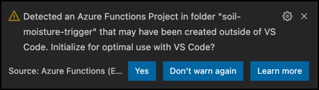

<!--
CO_OP_TRANSLATOR_METADATA:
{
  "original_hash": "5f2d2f4a5a023c93ab34a0cc5b47c0c4",
  "translation_date": "2025-08-27T21:39:44+00:00",
  "source_file": "2-farm/lessons/5-migrate-application-to-the-cloud/README.md",
  "language_code": "vi"
}
-->
# Di chuyển logic ứng dụng của bạn lên đám mây


> Hình vẽ minh họa bởi [Nitya Narasimhan](https://github.com/nitya). Nhấp vào hình để xem phiên bản lớn hơn.

Bài học này được giảng dạy trong [Dự án IoT cho Người mới bắt đầu - Chuỗi Nông nghiệp Kỹ thuật số](https://youtube.com/playlist?list=PLmsFUfdnGr3yCutmcVg6eAUEfsGiFXgcx) từ [Microsoft Reactor](https://developer.microsoft.com/reactor/?WT.mc_id=academic-17441-jabenn).

[](https://youtu.be/VVZDcs5u1_I)

## Câu hỏi trước bài học

[Câu hỏi trước bài học](https://black-meadow-040d15503.1.azurestaticapps.net/quiz/17)

## Giới thiệu

Trong bài học trước, bạn đã học cách kết nối hệ thống giám sát độ ẩm đất và điều khiển rơ-le của cây trồng với một dịch vụ IoT trên đám mây. Bước tiếp theo là di chuyển mã máy chủ điều khiển thời gian của rơ-le lên đám mây. Trong bài học này, bạn sẽ học cách thực hiện điều này bằng cách sử dụng các hàm serverless.

Trong bài học này, chúng ta sẽ đề cập đến:

* [Serverless là gì?](../../../../../2-farm/lessons/5-migrate-application-to-the-cloud)
* [Tạo một ứng dụng serverless](../../../../../2-farm/lessons/5-migrate-application-to-the-cloud)
* [Tạo một trigger sự kiện IoT Hub](../../../../../2-farm/lessons/5-migrate-application-to-the-cloud)
* [Gửi yêu cầu phương thức trực tiếp từ mã serverless](../../../../../2-farm/lessons/5-migrate-application-to-the-cloud)
* [Triển khai mã serverless của bạn lên đám mây](../../../../../2-farm/lessons/5-migrate-application-to-the-cloud)

## Serverless là gì?

Serverless, hay điện toán không máy chủ, liên quan đến việc tạo các khối mã nhỏ được chạy trên đám mây để phản hồi các loại sự kiện khác nhau. Khi sự kiện xảy ra, mã của bạn sẽ được chạy và nhận dữ liệu về sự kiện đó. Các sự kiện này có thể đến từ nhiều nguồn khác nhau, bao gồm yêu cầu web, tin nhắn được đặt trong hàng đợi, thay đổi dữ liệu trong cơ sở dữ liệu, hoặc tin nhắn được gửi đến một dịch vụ IoT bởi các thiết bị IoT.


> 💁 Nếu bạn đã từng sử dụng trigger cơ sở dữ liệu trước đây, bạn có thể nghĩ điều này tương tự như vậy, mã được kích hoạt bởi một sự kiện như chèn một hàng.


Mã của bạn chỉ được chạy khi sự kiện xảy ra, không có gì giữ mã của bạn hoạt động vào các thời điểm khác. Khi sự kiện xảy ra, mã của bạn được tải và chạy. Điều này làm cho serverless rất dễ mở rộng - nếu nhiều sự kiện xảy ra cùng lúc, nhà cung cấp đám mây có thể chạy hàm của bạn nhiều lần như bạn cần đồng thời trên các máy chủ mà họ có sẵn. Nhược điểm của điều này là nếu bạn cần chia sẻ thông tin giữa các sự kiện, bạn cần lưu trữ nó ở đâu đó như cơ sở dữ liệu thay vì lưu trữ trong bộ nhớ.

Mã của bạn được viết dưới dạng một hàm nhận thông tin chi tiết về sự kiện làm tham số. Bạn có thể sử dụng nhiều ngôn ngữ lập trình khác nhau để viết các hàm serverless này.

> 🎓 Serverless cũng được gọi là Functions as a Service (FaaS) vì mỗi trigger sự kiện được triển khai dưới dạng một hàm trong mã.

Mặc dù tên gọi là serverless, thực tế vẫn sử dụng máy chủ. Tên gọi này xuất phát từ việc bạn, với tư cách là nhà phát triển, không cần quan tâm đến các máy chủ cần thiết để chạy mã của mình, tất cả những gì bạn quan tâm là mã của bạn được chạy để phản hồi một sự kiện. Nhà cung cấp đám mây có một *runtime* serverless quản lý việc phân bổ máy chủ, mạng, lưu trữ, CPU, bộ nhớ và mọi thứ khác cần thiết để chạy mã của bạn. Mô hình này có nghĩa là bạn không trả tiền theo máy chủ, vì không có máy chủ cụ thể. Thay vào đó, bạn trả tiền cho thời gian mã của bạn chạy và lượng bộ nhớ được sử dụng.

> 💰 Serverless là một trong những cách rẻ nhất để chạy mã trên đám mây. Ví dụ, tại thời điểm viết bài, một nhà cung cấp đám mây cho phép tất cả các hàm serverless của bạn thực thi tổng cộng 1.000.000 lần mỗi tháng trước khi bắt đầu tính phí, và sau đó họ tính phí 0,20 USD cho mỗi 1.000.000 lần thực thi. Khi mã của bạn không chạy, bạn không phải trả tiền.

Là một nhà phát triển IoT, mô hình serverless là lý tưởng. Bạn có thể viết một hàm được gọi để phản hồi các tin nhắn được gửi từ bất kỳ thiết bị IoT nào được kết nối với dịch vụ IoT được lưu trữ trên đám mây của bạn. Mã của bạn sẽ xử lý tất cả các tin nhắn được gửi, nhưng chỉ chạy khi cần thiết.

✅ Hãy xem lại mã bạn đã viết dưới dạng mã máy chủ lắng nghe tin nhắn qua MQTT. Làm thế nào mã này có thể chạy trên đám mây bằng serverless? Bạn nghĩ mã cần thay đổi như thế nào để hỗ trợ điện toán serverless?

> 💁 Mô hình serverless đang được mở rộng sang các dịch vụ đám mây khác ngoài việc chạy mã. Ví dụ, cơ sở dữ liệu serverless có sẵn trên đám mây sử dụng mô hình định giá serverless, nơi bạn trả tiền cho mỗi yêu cầu thực hiện đối với cơ sở dữ liệu, chẳng hạn như truy vấn hoặc chèn, thường dựa trên lượng công việc cần thiết để xử lý yêu cầu. Ví dụ, một truy vấn đơn giản chọn một hàng theo khóa chính sẽ tốn ít hơn một thao tác phức tạp kết hợp nhiều bảng và trả về hàng nghìn hàng.

## Tạo một ứng dụng serverless

Dịch vụ điện toán serverless từ Microsoft được gọi là Azure Functions.


Video ngắn dưới đây cung cấp tổng quan về Azure Functions:

[](https://www.youtube.com/watch?v=8-jz5f_JyEQ)

> 🎥 Nhấp vào hình trên để xem video

✅ Dành một chút thời gian để nghiên cứu và đọc tổng quan về Azure Functions trong [tài liệu Azure Functions của Microsoft](https://docs.microsoft.com/azure/azure-functions/functions-overview?WT.mc_id=academic-17441-jabenn).

Để viết Azure Functions, bạn bắt đầu với một ứng dụng Azure Functions bằng ngôn ngữ bạn chọn. Azure Functions hỗ trợ Python, JavaScript, TypeScript, C#, F#, Java và Powershell. Trong bài học này, bạn sẽ học cách viết một ứng dụng Azure Functions bằng Python.

> 💁 Azure Functions cũng hỗ trợ các trình xử lý tùy chỉnh, vì vậy bạn có thể viết các hàm của mình bằng bất kỳ ngôn ngữ nào hỗ trợ yêu cầu HTTP, bao gồm cả các ngôn ngữ cũ như COBOL.

Ứng dụng Functions bao gồm một hoặc nhiều *trigger* - các hàm phản hồi sự kiện. Bạn có thể có nhiều trigger trong một ứng dụng Functions, tất cả đều chia sẻ cấu hình chung. Ví dụ, trong tệp cấu hình cho ứng dụng Functions của bạn, bạn có thể có thông tin kết nối của IoT Hub, và tất cả các hàm trong ứng dụng có thể sử dụng thông tin này để kết nối và lắng nghe sự kiện.

### Nhiệm vụ - cài đặt công cụ Azure Functions

> Tại thời điểm viết bài, các công cụ mã Azure Functions chưa hoàn toàn hoạt động trên Apple Silicon với các dự án Python. Bạn sẽ cần sử dụng máy Mac dựa trên Intel, PC Windows hoặc PC Linux.

Một tính năng tuyệt vời của Azure Functions là bạn có thể chạy chúng cục bộ. Runtime giống như trên đám mây có thể chạy trên máy tính của bạn, cho phép bạn viết mã phản hồi các tin nhắn IoT và chạy nó cục bộ. Bạn thậm chí có thể gỡ lỗi mã của mình khi các sự kiện được xử lý. Khi bạn hài lòng với mã của mình, nó có thể được triển khai lên đám mây.

Công cụ Azure Functions có sẵn dưới dạng CLI, được gọi là Azure Functions Core Tools.

1. Cài đặt công cụ Azure Functions Core Tools bằng cách làm theo hướng dẫn trong [tài liệu Azure Functions Core Tools](https://docs.microsoft.com/azure/azure-functions/functions-run-local?WT.mc_id=academic-17441-jabenn).

1. Cài đặt tiện ích mở rộng Azure Functions cho VS Code. Tiện ích này cung cấp hỗ trợ cho việc tạo, gỡ lỗi và triển khai Azure Functions. Tham khảo [tài liệu tiện ích mở rộng Azure Functions](https://marketplace.visualstudio.com/items?WT.mc_id=academic-17441-jabenn&itemName=ms-azuretools.vscode-azurefunctions) để biết hướng dẫn cài đặt tiện ích này trong VS Code.

Khi bạn triển khai ứng dụng Azure Functions của mình lên đám mây, nó cần sử dụng một lượng nhỏ lưu trữ đám mây để lưu trữ các tệp ứng dụng và tệp nhật ký. Khi bạn chạy ứng dụng Functions cục bộ, bạn vẫn cần kết nối với lưu trữ đám mây, nhưng thay vì sử dụng lưu trữ đám mây thực tế, bạn có thể sử dụng một trình giả lập lưu trữ gọi là [Azurite](https://github.com/Azure/Azurite). Trình giả lập này chạy cục bộ nhưng hoạt động như lưu trữ đám mây.

> 🎓 Trong Azure, lưu trữ mà Azure Functions sử dụng là một Tài khoản Lưu trữ Azure. Các tài khoản này có thể lưu trữ tệp, blob, dữ liệu trong bảng hoặc dữ liệu trong hàng đợi. Bạn có thể chia sẻ một tài khoản lưu trữ giữa nhiều ứng dụng, chẳng hạn như một ứng dụng Functions và một ứng dụng web.

1. Azurite là một ứng dụng Node.js, vì vậy bạn sẽ cần cài đặt Node.js. Bạn có thể tìm thấy hướng dẫn tải xuống và cài đặt trên [trang web Node.js](https://nodejs.org/). Nếu bạn đang sử dụng Mac, bạn cũng có thể cài đặt nó từ [Homebrew](https://formulae.brew.sh/formula/node).

1. Cài đặt Azurite bằng lệnh sau (`npm` là một công cụ được cài đặt khi bạn cài đặt Node.js):

    ```sh
    npm install -g azurite
    ```

1. Tạo một thư mục gọi là `azurite` để Azurite sử dụng để lưu trữ dữ liệu:

    ```sh
    mkdir azurite
    ```

1. Chạy Azurite, truyền cho nó thư mục mới này:

    ```sh
    azurite --location azurite
    ```

    Trình giả lập lưu trữ Azurite sẽ khởi chạy và sẵn sàng để runtime Functions cục bộ kết nối.

    ```output
    ➜  ~ azurite --location azurite  
    Azurite Blob service is starting at http://127.0.0.1:10000
    Azurite Blob service is successfully listening at http://127.0.0.1:10000
    Azurite Queue service is starting at http://127.0.0.1:10001
    Azurite Queue service is successfully listening at http://127.0.0.1:10001
    Azurite Table service is starting at http://127.0.0.1:10002
    Azurite Table service is successfully listening at http://127.0.0.1:10002
    ```

### Nhiệm vụ - tạo một dự án Azure Functions

CLI Azure Functions có thể được sử dụng để tạo một ứng dụng Functions mới.

1. Tạo một thư mục cho ứng dụng Functions của bạn và điều hướng đến đó. Gọi nó là `soil-moisture-trigger`:

    ```sh
    mkdir soil-moisture-trigger
    cd soil-moisture-trigger
    ```

1. Tạo một môi trường ảo Python bên trong thư mục này:

    ```sh
    python3 -m venv .venv
    ```

1. Kích hoạt môi trường ảo:

    * Trên Windows:
        * Nếu bạn đang sử dụng Command Prompt hoặc Command Prompt qua Windows Terminal, chạy:

            ```cmd
            .venv\Scripts\activate.bat
            ```

        * Nếu bạn đang sử dụng PowerShell, chạy:

            ```powershell
            .\.venv\Scripts\Activate.ps1
            ```

    * Trên macOS hoặc Linux, chạy:

        ```cmd
        source ./.venv/bin/activate
        ```

    > 💁 Các lệnh này nên được chạy từ cùng vị trí bạn đã chạy lệnh để tạo môi trường ảo. Bạn sẽ không bao giờ cần điều hướng vào thư mục `.venv`, bạn nên luôn chạy lệnh kích hoạt và bất kỳ lệnh nào để cài đặt gói hoặc chạy mã từ thư mục bạn đã ở khi tạo môi trường ảo.

1. Chạy lệnh sau để tạo một ứng dụng Functions trong thư mục này:

    ```sh
    func init --worker-runtime python soil-moisture-trigger
    ```

    Điều này sẽ tạo ba tệp bên trong thư mục hiện tại:

    * `host.json` - tài liệu JSON này chứa các cài đặt cho ứng dụng Functions của bạn. Bạn sẽ không cần sửa đổi các cài đặt này.
    * `local.settings.json` - tài liệu JSON này chứa các cài đặt mà ứng dụng của bạn sẽ sử dụng khi chạy cục bộ, chẳng hạn như chuỗi kết nối cho IoT Hub. Các cài đặt này chỉ dành cho cục bộ và không nên được thêm vào kiểm soát mã nguồn. Khi bạn triển khai ứng dụng lên đám mây, các cài đặt này không được triển khai, thay vào đó các cài đặt của bạn sẽ được tải từ cài đặt ứng dụng. Điều này sẽ được đề cập sau trong bài học này.
    * `requirements.txt` - đây là một [tệp yêu cầu Pip](https://pip.pypa.io/en/stable/user_guide/#requirements-files) chứa các gói Pip cần thiết để chạy ứng dụng Functions của bạn.

1. Tệp `local.settings.json` có một cài đặt cho tài khoản lưu trữ mà ứng dụng Functions sẽ sử dụng. Mặc định là một cài đặt trống, vì vậy cần được thiết lập. Để kết nối với trình giả lập lưu trữ cục bộ Azurite, đặt giá trị này thành:

    ```json
    "AzureWebJobsStorage": "UseDevelopmentStorage=true",
    ```

1. Cài đặt các gói Pip cần thiết bằng tệp yêu cầu:

    ```sh
    pip install -r requirements.txt
    ```

    > 💁 Các gói Pip cần thiết cần có trong tệp này, để khi ứng dụng Functions được triển khai lên đám mây, runtime có thể đảm bảo cài đặt đúng các gói.

1. Để kiểm tra mọi thứ hoạt động đúng, bạn có thể khởi động runtime Functions. Chạy lệnh sau để làm điều này:

    ```sh
    func start
    ```

    Bạn sẽ thấy runtime khởi động và báo cáo rằng nó không tìm thấy bất kỳ hàm công việc nào (trigger).

    ```output
    (.venv) ➜  soil-moisture-trigger func start
    Found Python version 3.9.1 (python3).
    
    Azure Functions Core Tools
    Core Tools Version:       3.0.3442 Commit hash: 6bfab24b2743f8421475d996402c398d2fe4a9e0  (64-bit)
    Function Runtime Version: 3.0.15417.0
    
    [2021-05-05T01:24:46.795Z] No job functions found.
    ```
> ⚠️ Nếu bạn nhận được thông báo tường lửa, hãy cấp quyền truy cập vì ứng dụng `func` cần có khả năng đọc và ghi vào mạng của bạn.
> ⚠️ Nếu bạn đang sử dụng macOS, có thể xuất hiện các cảnh báo trong đầu ra:
>
> ```output
    > (.venv) ➜  soil-moisture-trigger func start
    > Found Python version 3.9.1 (python3).
    >
    > Azure Functions Core Tools
    > Core Tools Version:       3.0.3442 Commit hash: 6bfab24b2743f8421475d996402c398d2fe4a9e0  (64-bit)
    > Function Runtime Version: 3.0.15417.0
    >
    > [2021-06-16T08:18:28.315Z] Cannot create directory for shared memory usage: /dev/shm/AzureFunctions
    > [2021-06-16T08:18:28.316Z] System.IO.FileSystem: Access to the path '/dev/shm/AzureFunctions' is denied. Operation not permitted.
    > [2021-06-16T08:18:30.361Z] No job functions found.
    > ```
>
> Bạn có thể bỏ qua những cảnh báo này miễn là ứng dụng Functions khởi động đúng cách và liệt kê các chức năng đang chạy. Như đã đề cập trong [câu hỏi này trên Microsoft Docs Q&A](https://docs.microsoft.com/answers/questions/396617/azure-functions-core-tools-error-osx-devshmazurefu.html?WT.mc_id=academic-17441-jabenn), bạn có thể bỏ qua.

1. Dừng ứng dụng Functions bằng cách nhấn `ctrl+c`.

1. Mở thư mục hiện tại trong VS Code, bằng cách mở VS Code rồi mở thư mục này, hoặc chạy lệnh sau:

    ```sh
    code .
    ```

    VS Code sẽ nhận diện dự án Functions của bạn và hiển thị thông báo như sau:

    ```output
    Detected an Azure Functions Project in folder "soil-moisture-trigger" that may have been created outside of
    VS Code. Initialize for optimal use with VS Code?
    ```

    

    Chọn **Yes** từ thông báo này.

1. Đảm bảo môi trường ảo Python đang chạy trong terminal của VS Code. Kết thúc và khởi động lại nếu cần thiết.

## Tạo trigger sự kiện IoT Hub

Ứng dụng Functions là lớp vỏ cho mã serverless của bạn. Để phản hồi các sự kiện từ IoT Hub, bạn có thể thêm một trigger IoT Hub vào ứng dụng này. Trigger này cần kết nối với luồng tin nhắn được gửi đến IoT Hub và phản hồi chúng. Để nhận luồng tin nhắn này, trigger của bạn cần kết nối với *điểm cuối tương thích sự kiện* của IoT Hub.

IoT Hub được xây dựng dựa trên một dịch vụ Azure khác gọi là Azure Event Hubs. Event Hubs là một dịch vụ cho phép bạn gửi và nhận tin nhắn, IoT Hub mở rộng dịch vụ này để thêm các tính năng cho thiết bị IoT. Cách bạn kết nối để đọc tin nhắn từ IoT Hub giống như cách bạn sử dụng Event Hubs.

✅ Nghiên cứu thêm: Đọc tổng quan về Event Hubs trong [tài liệu Azure Event Hubs](https://docs.microsoft.com/azure/event-hubs/event-hubs-about?WT.mc_id=academic-17441-jabenn). Các tính năng cơ bản so với IoT Hub như thế nào?

Để một thiết bị IoT kết nối với IoT Hub, nó phải sử dụng một khóa bí mật để đảm bảo chỉ các thiết bị được phép mới có thể kết nối. Điều này cũng áp dụng khi kết nối để đọc tin nhắn, mã của bạn sẽ cần một chuỗi kết nối chứa khóa bí mật cùng với thông tin chi tiết về IoT Hub.

> 💁 Chuỗi kết nối mặc định bạn nhận được có quyền **iothubowner**, cho phép bất kỳ mã nào sử dụng nó có toàn quyền trên IoT Hub. Tốt nhất bạn nên kết nối với mức quyền thấp nhất cần thiết. Điều này sẽ được đề cập trong bài học tiếp theo.

Khi trigger của bạn đã kết nối, mã bên trong hàm sẽ được gọi cho mỗi tin nhắn gửi đến IoT Hub, bất kể thiết bị nào gửi tin nhắn. Trigger sẽ nhận tin nhắn dưới dạng tham số.

### Nhiệm vụ - lấy chuỗi kết nối điểm cuối tương thích sự kiện

1. Từ terminal của VS Code, chạy lệnh sau để lấy chuỗi kết nối cho điểm cuối tương thích sự kiện của IoT Hub:

    ```sh
    az iot hub connection-string show --default-eventhub \
                                      --output table \
                                      --hub-name <hub_name>
    ```

    Thay `<hub_name>` bằng tên bạn đã sử dụng cho IoT Hub.

1. Trong VS Code, mở tệp `local.settings.json`. Thêm giá trị sau vào bên trong phần `Values`:

    ```json
    "IOT_HUB_CONNECTION_STRING": "<connection string>"
    ```

    Thay `<connection string>` bằng giá trị từ bước trước. Bạn sẽ cần thêm dấu phẩy sau dòng trên để đảm bảo JSON hợp lệ.

### Nhiệm vụ - tạo trigger sự kiện

Bây giờ bạn đã sẵn sàng để tạo trigger sự kiện.

1. Từ terminal của VS Code, chạy lệnh sau từ bên trong thư mục `soil-moisture-trigger`:

    ```sh
    func new --name iot-hub-trigger --template "Azure Event Hub trigger"
    ```

    Lệnh này tạo một Function mới gọi là `iot-hub-trigger`. Trigger sẽ kết nối với điểm cuối tương thích sự kiện trên IoT Hub, vì vậy bạn có thể sử dụng trigger sự kiện hub. Không có trigger cụ thể cho IoT Hub.

Điều này sẽ tạo một thư mục bên trong thư mục `soil-moisture-trigger` gọi là `iot-hub-trigger` chứa chức năng này. Thư mục này sẽ có các tệp sau bên trong:

* `__init__.py` - đây là tệp mã Python chứa trigger, sử dụng quy ước đặt tên tệp Python tiêu chuẩn để biến thư mục này thành một module Python.

    Tệp này sẽ chứa mã sau:

    ```python
    import logging

    import azure.functions as func


    def main(event: func.EventHubEvent):
        logging.info('Python EventHub trigger processed an event: %s',
                    event.get_body().decode('utf-8'))
    ```

    Phần cốt lõi của trigger là hàm `main`. Chính hàm này được gọi với các sự kiện từ IoT Hub. Hàm này có một tham số gọi là `event` chứa một `EventHubEvent`. Mỗi lần một tin nhắn được gửi đến IoT Hub, hàm này sẽ được gọi và truyền tin nhắn đó dưới dạng `event`, cùng với các thuộc tính giống như các chú thích bạn đã thấy trong bài học trước.

    Phần cốt lõi của hàm này là ghi lại sự kiện.

* `function.json` - tệp này chứa cấu hình cho trigger. Cấu hình chính nằm trong một phần gọi là `bindings`. Binding là thuật ngữ để chỉ kết nối giữa Azure Functions và các dịch vụ Azure khác. Chức năng này có một binding đầu vào đến một event hub - nó kết nối với một event hub và nhận dữ liệu.

    > 💁 Bạn cũng có thể có các binding đầu ra để đầu ra của một chức năng được gửi đến một dịch vụ khác. Ví dụ, bạn có thể thêm một binding đầu ra đến cơ sở dữ liệu và trả lại sự kiện IoT Hub từ chức năng, và nó sẽ tự động được chèn vào cơ sở dữ liệu.

    ✅ Nghiên cứu thêm: Đọc về bindings trong [tài liệu khái niệm triggers và bindings của Azure Functions](https://docs.microsoft.com/azure/azure-functions/functions-triggers-bindings?WT.mc_id=academic-17441-jabenn&tabs=python).

    Phần `bindings` bao gồm cấu hình cho binding. Các giá trị đáng chú ý là:

  * `"type": "eventHubTrigger"` - điều này cho biết chức năng cần lắng nghe các sự kiện từ Event Hub
  * `"name": "events"` - đây là tên tham số để sử dụng cho các sự kiện Event Hub. Tên này khớp với tên tham số trong hàm `main` trong mã Python.
  * `"direction": "in"` - đây là binding đầu vào, dữ liệu từ event hub đi vào chức năng
  * `"connection": ""` - điều này xác định tên của thiết lập để đọc chuỗi kết nối. Khi chạy cục bộ, điều này sẽ đọc thiết lập này từ tệp `local.settings.json`.

    > 💁 Chuỗi kết nối không thể được lưu trữ trong tệp `function.json`, nó phải được đọc từ thiết lập. Điều này nhằm ngăn bạn vô tình làm lộ chuỗi kết nối.

1. Do [lỗi trong mẫu Azure Functions](https://github.com/Azure/azure-functions-templates/issues/1250), tệp `function.json` có giá trị không chính xác cho trường `cardinality`. Cập nhật trường này từ `many` thành `one`:

    ```json
    "cardinality": "one",
    ```

1. Cập nhật giá trị `"connection"` trong tệp `function.json` để trỏ đến giá trị mới bạn đã thêm vào tệp `local.settings.json`:

    ```json
    "connection": "IOT_HUB_CONNECTION_STRING",
    ```

    > 💁 Nhớ rằng - điều này cần trỏ đến thiết lập, không chứa chuỗi kết nối thực tế.

1. Chuỗi kết nối chứa giá trị `eventHubName`, vì vậy giá trị này trong tệp `function.json` cần được xóa. Cập nhật giá trị này thành chuỗi rỗng:

    ```json
    "eventHubName": "",
    ```

### Nhiệm vụ - chạy trigger sự kiện

1. Đảm bảo bạn không chạy trình giám sát sự kiện IoT Hub. Nếu trình này đang chạy cùng lúc với ứng dụng Functions, ứng dụng Functions sẽ không thể kết nối và tiêu thụ sự kiện.

    > 💁 Nhiều ứng dụng có thể kết nối với các điểm cuối IoT Hub bằng cách sử dụng các *nhóm người tiêu dùng* khác nhau. Điều này sẽ được đề cập trong bài học sau.

1. Để chạy ứng dụng Functions, chạy lệnh sau từ terminal của VS Code:

    ```sh
    func start
    ```

    Ứng dụng Functions sẽ khởi động và phát hiện chức năng `iot-hub-trigger`. Sau đó, nó sẽ xử lý bất kỳ sự kiện nào đã được gửi đến IoT Hub trong ngày qua.

    ```output
    (.venv) ➜  soil-moisture-trigger func start
    Found Python version 3.9.1 (python3).
    
    Azure Functions Core Tools
    Core Tools Version:       3.0.3442 Commit hash: 6bfab24b2743f8421475d996402c398d2fe4a9e0  (64-bit)
    Function Runtime Version: 3.0.15417.0
    
    Functions:
    
            iot-hub-trigger: eventHubTrigger
    
    For detailed output, run func with --verbose flag.
    [2021-05-05T02:44:07.517Z] Worker process started and initialized.
    [2021-05-05T02:44:09.202Z] Executing 'Functions.iot-hub-trigger' (Reason='(null)', Id=802803a5-eae9-4401-a1f4-176631456ce4)
    [2021-05-05T02:44:09.205Z] Trigger Details: PartitionId: 0, Offset: 1011240-1011632, EnqueueTimeUtc: 2021-05-04T19:04:04.2030000Z-2021-05-04T19:04:04.3900000Z, SequenceNumber: 2546-2547, Count: 2
    [2021-05-05T02:44:09.352Z] Python EventHub trigger processed an event: {"soil_moisture":628}
    [2021-05-05T02:44:09.354Z] Python EventHub trigger processed an event: {"soil_moisture":624}
    [2021-05-05T02:44:09.395Z] Executed 'Functions.iot-hub-trigger' (Succeeded, Id=802803a5-eae9-4401-a1f4-176631456ce4, Duration=245ms)
    ```

    Mỗi lần gọi chức năng sẽ được bao quanh bởi một khối `Executing 'Functions.iot-hub-trigger'`/`Executed 'Functions.iot-hub-trigger'` trong đầu ra, vì vậy bạn có thể thấy có bao nhiêu tin nhắn đã được xử lý trong mỗi lần gọi chức năng.

1. Đảm bảo thiết bị IoT của bạn đang chạy. Bạn sẽ thấy các tin nhắn độ ẩm đất mới xuất hiện trong ứng dụng Functions.

1. Dừng và khởi động lại ứng dụng Functions. Bạn sẽ thấy rằng nó sẽ không xử lý lại các tin nhắn trước đó, chỉ xử lý các tin nhắn mới.

> 💁 VS Code cũng hỗ trợ gỡ lỗi ứng dụng Functions của bạn. Bạn có thể đặt điểm dừng bằng cách nhấp vào đường viền bên cạnh đầu mỗi dòng mã, hoặc đặt con trỏ trên một dòng mã và chọn *Run -> Toggle breakpoint*, hoặc nhấn `F9`. Bạn có thể khởi chạy trình gỡ lỗi bằng cách chọn *Run -> Start debugging*, nhấn `F5`, hoặc chọn bảng *Run and debug* và chọn nút **Start debugging**. Bằng cách này, bạn có thể xem chi tiết các sự kiện đang được xử lý.

#### Xử lý sự cố

* Nếu bạn gặp lỗi sau:

    ```output
    The listener for function 'Functions.iot-hub-trigger' was unable to start. Microsoft.WindowsAzure.Storage: Connection refused. System.Net.Http: Connection refused. System.Private.CoreLib: Connection refused.
    ```

    Kiểm tra Azurite đang chạy và bạn đã đặt `AzureWebJobsStorage` trong tệp `local.settings.json` thành `UseDevelopmentStorage=true`.

* Nếu bạn gặp lỗi sau:

    ```output
    System.Private.CoreLib: Exception while executing function: Functions.iot-hub-trigger. System.Private.CoreLib: Result: Failure Exception: AttributeError: 'list' object has no attribute 'get_body'
    ```

    Kiểm tra rằng bạn đã đặt `cardinality` trong tệp `function.json` thành `one`.

* Nếu bạn gặp lỗi sau:

    ```output
    Azure.Messaging.EventHubs: The path to an Event Hub may be specified as part of the connection string or as a separate value, but not both.  Please verify that your connection string does not have the `EntityPath` token if you are passing an explicit Event Hub name. (Parameter 'connectionString').
    ```

    Kiểm tra rằng bạn đã đặt `eventHubName` trong tệp `function.json` thành chuỗi rỗng.

## Gửi yêu cầu phương thức trực tiếp từ mã serverless

Cho đến nay, ứng dụng Functions của bạn đang lắng nghe các tin nhắn từ IoT Hub bằng điểm cuối tương thích Event Hub. Bây giờ bạn cần gửi lệnh đến thiết bị IoT. Điều này được thực hiện bằng cách sử dụng một kết nối khác đến IoT Hub thông qua *Registry Manager*. Registry Manager là một công cụ cho phép bạn xem các thiết bị nào đã được đăng ký với IoT Hub, và giao tiếp với các thiết bị đó bằng cách gửi tin nhắn từ đám mây đến thiết bị, yêu cầu phương thức trực tiếp hoặc cập nhật device twin. Bạn cũng có thể sử dụng nó để đăng ký, cập nhật hoặc xóa thiết bị IoT khỏi IoT Hub.

Để kết nối với Registry Manager, bạn cần một chuỗi kết nối.

### Nhiệm vụ - lấy chuỗi kết nối Registry Manager

1. Để lấy chuỗi kết nối, chạy lệnh sau:

    ```sh
    az iot hub connection-string show --policy-name service \
                                      --output table \
                                      --hub-name <hub_name>
    ```

    Thay `<hub_name>` bằng tên bạn đã sử dụng cho IoT Hub.

    Chuỗi kết nối được yêu cầu cho chính sách *ServiceConnect* bằng cách sử dụng tham số `--policy-name service`. Khi bạn yêu cầu một chuỗi kết nối, bạn có thể chỉ định quyền mà chuỗi kết nối đó sẽ cho phép. Chính sách ServiceConnect cho phép mã của bạn kết nối và gửi tin nhắn đến các thiết bị IoT.

    ✅ Nghiên cứu thêm: Đọc về các chính sách khác nhau trong [tài liệu quyền IoT Hub](https://docs.microsoft.com/azure/iot-hub/iot-hub-devguide-security#iot-hub-permissions?WT.mc_id=academic-17441-jabenn)

1. Trong VS Code, mở tệp `local.settings.json`. Thêm giá trị sau vào bên trong phần `Values`:

    ```json
    "REGISTRY_MANAGER_CONNECTION_STRING": "<connection string>"
    ```

    Thay `<connection string>` bằng giá trị từ bước trước. Bạn sẽ cần thêm dấu phẩy sau dòng trên để đảm bảo JSON hợp lệ.

### Nhiệm vụ - gửi yêu cầu phương thức trực tiếp đến thiết bị

1. SDK cho Registry Manager có sẵn thông qua gói Pip. Thêm dòng sau vào tệp `requirements.txt` để thêm phụ thuộc vào gói này:

    ```sh
    azure-iot-hub
    ```

1. Đảm bảo terminal của VS Code đã kích hoạt môi trường ảo, và chạy lệnh sau để cài đặt các gói Pip:

    ```sh
    pip install -r requirements.txt
    ```

1. Thêm các import sau vào tệp `__init__.py`:

    ```python
    import json
    import os
    from azure.iot.hub import IoTHubRegistryManager
    from azure.iot.hub.models import CloudToDeviceMethod
    ```

    Điều này import một số thư viện hệ thống, cũng như các thư viện để tương tác với Registry Manager và gửi yêu cầu phương thức trực tiếp.

1. Xóa mã bên trong phương thức `main`, nhưng giữ lại phương thức này.

1. Trong phương thức `main`, thêm mã sau:

    ```python
    body = json.loads(event.get_body().decode('utf-8'))
    device_id = event.iothub_metadata['connection-device-id']

    logging.info(f'Received message: {body} from {device_id}')
    ```

    Mã này trích xuất nội dung của sự kiện chứa tin nhắn JSON được gửi bởi thiết bị IoT.

    Sau đó, nó lấy ID thiết bị từ các chú thích được truyền cùng với tin nhắn. Nội dung của sự kiện chứa tin nhắn được gửi dưới dạng telemetry, dictionary `iothub_metadata` chứa các thuộc tính được đặt bởi IoT Hub như ID thiết bị của người gửi và thời gian tin nhắn được gửi.

    Thông tin này sau đó được ghi lại. Bạn sẽ thấy việc ghi này trong terminal khi chạy ứng dụng Function cục bộ.

1. Bên dưới đoạn mã này, thêm mã sau:

    ```python
    soil_moisture = body['soil_moisture']

    if soil_moisture > 450:
        direct_method = CloudToDeviceMethod(method_name='relay_on', payload='{}')
    else:
        direct_method = CloudToDeviceMethod(method_name='relay_off', payload='{}')
    ```

    Mã này lấy độ ẩm đất từ tin nhắn. Sau đó, nó kiểm tra độ ẩm đất, và tùy thuộc vào giá trị, tạo một lớp trợ giúp cho yêu cầu phương thức trực tiếp cho phương thức `relay_on` hoặc `relay_off`. Yêu cầu phương thức không cần payload, vì vậy một tài liệu JSON rỗng được gửi.

1. Bên dưới đoạn mã này, thêm mã sau:

    ```python
    logging.info(f'Sending direct method request for {direct_method.method_name} for device {device_id}')

    registry_manager_connection_string = os.environ['REGISTRY_MANAGER_CONNECTION_STRING']
    registry_manager = IoTHubRegistryManager(registry_manager_connection_string)
    ```
Đoạn mã này tải `REGISTRY_MANAGER_CONNECTION_STRING` từ tệp `local.settings.json`. Các giá trị trong tệp này được cung cấp dưới dạng biến môi trường và có thể được đọc bằng hàm `os.environ`, một hàm trả về một từ điển chứa tất cả các biến môi trường.

> 💁 Khi đoạn mã này được triển khai lên đám mây, các giá trị trong tệp `local.settings.json` sẽ được thiết lập thành *Application Settings* và có thể được đọc từ các biến môi trường.

Đoạn mã sau đó tạo một thể hiện của lớp hỗ trợ Registry Manager bằng chuỗi kết nối.

1. Thêm đoạn mã sau vào bên dưới:

    ```python
    registry_manager.invoke_device_method(device_id, direct_method)

    logging.info('Direct method request sent!')
    ```

    Đoạn mã này yêu cầu registry manager gửi yêu cầu phương thức trực tiếp đến thiết bị đã gửi dữ liệu telemetry.

    > 💁 Trong các phiên bản ứng dụng bạn đã tạo ở các bài học trước sử dụng MQTT, các lệnh điều khiển relay được gửi đến tất cả các thiết bị. Đoạn mã giả định rằng bạn chỉ có một thiết bị. Phiên bản mã này gửi yêu cầu phương thức đến một thiết bị duy nhất, vì vậy nó sẽ hoạt động nếu bạn có nhiều thiết lập cảm biến độ ẩm và relay, gửi đúng yêu cầu phương thức trực tiếp đến đúng thiết bị.

1. Chạy ứng dụng Functions và đảm bảo thiết bị IoT của bạn đang gửi dữ liệu. Bạn sẽ thấy các tin nhắn được xử lý và các yêu cầu phương thức trực tiếp được gửi đi. Di chuyển cảm biến độ ẩm đất vào và ra khỏi đất để thấy giá trị thay đổi và relay bật/tắt.

> 💁 Bạn có thể tìm thấy đoạn mã này trong thư mục [code/functions](../../../../../2-farm/lessons/5-migrate-application-to-the-cloud/code/functions).

## Triển khai mã serverless của bạn lên đám mây

Mã của bạn hiện đang hoạt động cục bộ, vì vậy bước tiếp theo là triển khai ứng dụng Functions lên đám mây.

### Nhiệm vụ - tạo tài nguyên trên đám mây

Ứng dụng Functions của bạn cần được triển khai vào một tài nguyên Functions App trong Azure, nằm trong Resource Group mà bạn đã tạo cho IoT Hub. Bạn cũng sẽ cần một Storage Account được tạo trong Azure để thay thế trình giả lập đang chạy cục bộ.

1. Chạy lệnh sau để tạo một storage account:

    ```sh
    az storage account create --resource-group soil-moisture-sensor \
                              --sku Standard_LRS \
                              --name <storage_name> 
    ```

    Thay thế `<storage_name>` bằng một tên cho storage account của bạn. Tên này cần phải là duy nhất trên toàn cầu vì nó là một phần của URL được sử dụng để truy cập storage account. Bạn chỉ có thể sử dụng các chữ cái thường và số cho tên này, không được sử dụng ký tự khác, và nó bị giới hạn ở 24 ký tự. Sử dụng một cái gì đó như `sms` và thêm một định danh duy nhất ở cuối, như một vài từ ngẫu nhiên hoặc tên của bạn.

    Tùy chọn `--sku Standard_LRS` chọn cấp giá, chọn tài khoản đa năng có chi phí thấp nhất. Không có cấp miễn phí cho storage, và bạn trả tiền cho những gì bạn sử dụng. Chi phí tương đối thấp, với loại storage đắt nhất dưới 0,05 USD mỗi tháng cho mỗi gigabyte được lưu trữ.

    ✅ Tìm hiểu thêm về giá cả trên [trang giá Azure Storage Account](https://azure.microsoft.com/pricing/details/storage/?WT.mc_id=academic-17441-jabenn)

1. Chạy lệnh sau để tạo một Function App:

    ```sh
    az functionapp create --resource-group soil-moisture-sensor \
                          --runtime python \
                          --functions-version 3 \
                          --os-type Linux \
                          --consumption-plan-location <location> \
                          --storage-account <storage_name> \
                          --name <functions_app_name>
    ```

    Thay thế `<location>` bằng vị trí bạn đã sử dụng khi tạo Resource Group trong bài học trước.

    Thay thế `<storage_name>` bằng tên của storage account bạn đã tạo ở bước trước.

    Thay thế `<functions_app_name>` bằng một tên duy nhất cho Functions App của bạn. Tên này cần phải là duy nhất trên toàn cầu vì nó là một phần của URL được sử dụng để truy cập Functions App. Sử dụng một cái gì đó như `soil-moisture-sensor-` và thêm một định danh duy nhất ở cuối, như một vài từ ngẫu nhiên hoặc tên của bạn.

    Tùy chọn `--functions-version 3` thiết lập phiên bản Azure Functions để sử dụng. Phiên bản 3 là phiên bản mới nhất.

    Tùy chọn `--os-type Linux` yêu cầu runtime Functions sử dụng Linux làm hệ điều hành để lưu trữ các chức năng này. Functions có thể được lưu trữ trên Linux hoặc Windows, tùy thuộc vào ngôn ngữ lập trình được sử dụng. Các ứng dụng Python chỉ được hỗ trợ trên Linux.

### Nhiệm vụ - tải lên Application Settings của bạn

Khi bạn phát triển ứng dụng Functions, bạn đã lưu một số cài đặt trong tệp `local.settings.json` cho các chuỗi kết nối của IoT Hub. Những cài đặt này cần được ghi vào Application Settings trong Function App của bạn trên Azure để chúng có thể được sử dụng bởi mã của bạn.

> 🎓 Tệp `local.settings.json` chỉ dành cho các cài đặt phát triển cục bộ và không nên được kiểm tra vào hệ thống kiểm soát mã nguồn, chẳng hạn như GitHub. Khi được triển khai lên đám mây, Application Settings sẽ được sử dụng. Application Settings là các cặp key/value được lưu trữ trên đám mây và được đọc từ các biến môi trường trong mã của bạn hoặc bởi runtime khi kết nối mã của bạn với IoT Hub.

1. Chạy lệnh sau để thiết lập cài đặt `IOT_HUB_CONNECTION_STRING` trong Application Settings của Functions App:

    ```sh
    az functionapp config appsettings set --resource-group soil-moisture-sensor \
                                          --name <functions_app_name> \
                                          --settings "IOT_HUB_CONNECTION_STRING=<connection string>"
    ```

    Thay thế `<functions_app_name>` bằng tên bạn đã sử dụng cho Functions App của mình.

    Thay thế `<connection string>` bằng giá trị của `IOT_HUB_CONNECTION_STRING` từ tệp `local.settings.json` của bạn.

1. Lặp lại bước trên, nhưng thiết lập giá trị của `REGISTRY_MANAGER_CONNECTION_STRING` thành giá trị tương ứng từ tệp `local.settings.json` của bạn.

Khi bạn chạy các lệnh này, chúng cũng sẽ xuất ra danh sách tất cả Application Settings cho Functions App. Bạn có thể sử dụng danh sách này để kiểm tra rằng các giá trị của bạn đã được thiết lập chính xác.

> 💁 Bạn sẽ thấy một giá trị đã được thiết lập cho `AzureWebJobsStorage`. Trong tệp `local.settings.json` của bạn, giá trị này được thiết lập để sử dụng trình giả lập storage cục bộ. Khi bạn tạo Functions App, bạn truyền storage account làm tham số, và giá trị này được thiết lập tự động trong cài đặt này.

### Nhiệm vụ - triển khai Functions App của bạn lên đám mây

Bây giờ Functions App đã sẵn sàng, mã của bạn có thể được triển khai.

1. Chạy lệnh sau từ terminal của VS Code để xuất bản Functions App của bạn:

    ```sh
    func azure functionapp publish <functions_app_name>
    ```

    Thay thế `<functions_app_name>` bằng tên bạn đã sử dụng cho Functions App của mình.

Mã sẽ được đóng gói và gửi đến Functions App, nơi nó sẽ được triển khai và khởi động. Sẽ có rất nhiều đầu ra trên console, kết thúc bằng xác nhận triển khai và danh sách các chức năng đã triển khai. Trong trường hợp này, danh sách sẽ chỉ chứa trigger.

```output
Deployment successful.
Remote build succeeded!
Syncing triggers...
Functions in soil-moisture-sensor:
    iot-hub-trigger - [eventHubTrigger]
```

Đảm bảo thiết bị IoT của bạn đang chạy. Thay đổi mức độ ẩm bằng cách điều chỉnh độ ẩm đất hoặc di chuyển cảm biến vào và ra khỏi đất. Bạn sẽ thấy relay bật và tắt khi độ ẩm đất thay đổi.

---

## 🚀 Thử thách

Trong bài học trước, bạn đã quản lý thời gian cho relay bằng cách hủy đăng ký nhận tin nhắn MQTT trong khi relay đang bật và trong một khoảng thời gian ngắn sau khi nó tắt. Bạn không thể sử dụng phương pháp này ở đây - bạn không thể hủy đăng ký trigger IoT Hub của mình.

Hãy suy nghĩ về các cách khác nhau mà bạn có thể xử lý điều này trong Functions App của mình.

## Câu hỏi sau bài giảng

[Câu hỏi sau bài giảng](https://black-meadow-040d15503.1.azurestaticapps.net/quiz/18)

## Ôn tập & Tự học

* Tìm hiểu về điện toán serverless trên [trang Wikipedia về Serverless Computing](https://wikipedia.org/wiki/Serverless_computing)
* Đọc về việc sử dụng serverless trong Azure bao gồm một số ví dụ khác trên [bài viết blog Azure "Go serverless for your IoT needs"](https://azure.microsoft.com/blog/go-serverless-for-your-iot-needs/?WT.mc_id=academic-17441-jabenn)
* Tìm hiểu thêm về Azure Functions trên [kênh YouTube Azure Functions](https://www.youtube.com/c/AzureFunctions)

## Bài tập

[Thêm điều khiển relay thủ công](assignment.md)

---

**Tuyên bố miễn trừ trách nhiệm**:  
Tài liệu này đã được dịch bằng dịch vụ dịch thuật AI [Co-op Translator](https://github.com/Azure/co-op-translator). Mặc dù chúng tôi cố gắng đảm bảo độ chính xác, xin lưu ý rằng các bản dịch tự động có thể chứa lỗi hoặc không chính xác. Tài liệu gốc bằng ngôn ngữ bản địa nên được coi là nguồn thông tin chính thức. Đối với các thông tin quan trọng, nên sử dụng dịch vụ dịch thuật chuyên nghiệp từ con người. Chúng tôi không chịu trách nhiệm về bất kỳ sự hiểu lầm hoặc diễn giải sai nào phát sinh từ việc sử dụng bản dịch này.