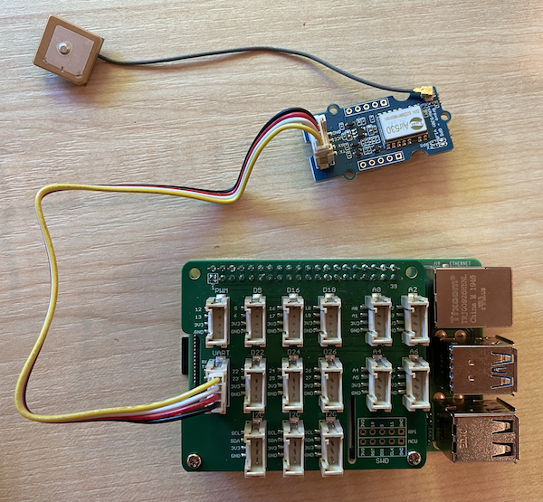

<!--
CO_OP_TRANSLATOR_METADATA:
{
  "original_hash": "3b2448c7ab4e9673e77e35a50c5e350d",
  "translation_date": "2025-08-27T23:49:21+00:00",
  "source_file": "3-transport/lessons/1-location-tracking/pi-gps-sensor.md",
  "language_code": "vi"
}
-->
# Đọc dữ liệu GPS - Raspberry Pi

Trong phần này của bài học, bạn sẽ thêm một cảm biến GPS vào Raspberry Pi và đọc các giá trị từ nó.

## Phần cứng

Raspberry Pi cần một cảm biến GPS.

Cảm biến bạn sẽ sử dụng là [Grove GPS Air530 sensor](https://www.seeedstudio.com/Grove-GPS-Air530-p-4584.html). Cảm biến này có thể kết nối với nhiều hệ thống GPS để cung cấp vị trí nhanh và chính xác. Cảm biến bao gồm 2 phần - phần lõi điện tử của cảm biến và một ăng-ten ngoài được kết nối bằng một dây mỏng để thu sóng radio từ các vệ tinh.

Đây là một cảm biến UART, vì vậy nó gửi dữ liệu GPS qua UART.

## Kết nối cảm biến GPS

Cảm biến GPS Grove có thể được kết nối với Raspberry Pi.

### Nhiệm vụ - kết nối cảm biến GPS

Kết nối cảm biến GPS.


1. Cắm một đầu của cáp Grove vào ổ cắm trên cảm biến GPS. Nó chỉ có thể cắm theo một chiều.

1. Khi Raspberry Pi đã tắt nguồn, kết nối đầu còn lại của cáp Grove vào ổ cắm UART được đánh dấu **UART** trên mũ Grove Base gắn vào Pi. Ổ cắm này nằm ở hàng giữa, phía gần khe cắm thẻ SD, đối diện với các cổng USB và cổng ethernet.

    

1. Đặt cảm biến GPS sao cho ăng-ten gắn kèm có thể nhìn thấy bầu trời - lý tưởng nhất là bên cạnh cửa sổ mở hoặc ngoài trời. Tín hiệu sẽ rõ ràng hơn nếu không có vật cản giữa ăng-ten và bầu trời.

## Lập trình cảm biến GPS

Raspberry Pi giờ đây có thể được lập trình để sử dụng cảm biến GPS đã gắn.

### Nhiệm vụ - lập trình cảm biến GPS

Lập trình thiết bị.

1. Bật nguồn Pi và chờ nó khởi động.

1. Cảm biến GPS có 2 đèn LED - một đèn LED màu xanh dương nhấp nháy khi dữ liệu được truyền, và một đèn LED màu xanh lá nhấp nháy mỗi giây khi nhận dữ liệu từ vệ tinh. Đảm bảo đèn LED màu xanh dương nhấp nháy khi bạn bật nguồn Pi. Sau vài phút, đèn LED màu xanh lá sẽ nhấp nháy - nếu không, bạn có thể cần điều chỉnh lại vị trí của ăng-ten.

1. Mở VS Code, trực tiếp trên Pi hoặc kết nối qua tiện ích mở rộng Remote SSH.

    > ⚠️ Bạn có thể tham khảo [hướng dẫn thiết lập và khởi chạy VS Code trong bài học 1 nếu cần](../../../1-getting-started/lessons/1-introduction-to-iot/pi.md).

1. Với các phiên bản Raspberry Pi mới hơn hỗ trợ Bluetooth, có một xung đột giữa cổng serial được sử dụng cho Bluetooth và cổng được sử dụng bởi cổng UART của Grove. Để khắc phục, thực hiện các bước sau:

    1. Từ terminal của VS Code, chỉnh sửa tệp `/boot/config.txt` bằng `nano`, một trình chỉnh sửa văn bản tích hợp trong terminal, với lệnh sau:

        ```sh
        sudo nano /boot/config.txt
        ```

        > Tệp này không thể được chỉnh sửa bằng VS Code vì bạn cần quyền `sudo`, một quyền nâng cao. VS Code không chạy với quyền này.

    1. Sử dụng các phím mũi tên để di chuyển đến cuối tệp, sau đó sao chép đoạn mã dưới đây và dán vào cuối tệp:

        ```ini
        dtoverlay=pi3-miniuart-bt
        dtoverlay=pi3-disable-bt
        enable_uart=1
        ```

        Bạn có thể dán bằng các phím tắt thông thường trên thiết bị của bạn (`Ctrl+v` trên Windows, Linux hoặc Raspberry Pi OS, `Cmd+v` trên macOS).

    1. Lưu tệp này và thoát nano bằng cách nhấn `Ctrl+x`. Nhấn `y` khi được hỏi có muốn lưu bộ đệm đã chỉnh sửa không, sau đó nhấn `enter` để xác nhận bạn muốn ghi đè lên `/boot/config.txt`.

        > Nếu bạn mắc lỗi, bạn có thể thoát mà không lưu, sau đó lặp lại các bước này.

    1. Chỉnh sửa tệp `/boot/cmdline.txt` trong nano với lệnh sau:

        ```sh
        sudo nano /boot/cmdline.txt
        ```

    1. Tệp này chứa một số cặp key/value được phân tách bằng dấu cách. Xóa bất kỳ cặp key/value nào có key là `console`. Chúng có thể trông giống như sau:

        ```output
        console=serial0,115200 console=tty1 
        ```

        Bạn có thể di chuyển đến các mục này bằng các phím mũi tên, sau đó xóa bằng các phím `del` hoặc `backspace` thông thường.

        Ví dụ, nếu tệp gốc của bạn trông như sau:

        ```output
        console=serial0,115200 console=tty1 root=PARTUUID=058e2867-02 rootfstype=ext4 elevator=deadline fsck.repair=yes rootwait
        ```

        Phiên bản mới sẽ là:

        ```output
        root=PARTUUID=058e2867-02 rootfstype=ext4 elevator=deadline fsck.repair=yes rootwait
        ```

    1. Thực hiện các bước trên để lưu tệp này và thoát nano.

    1. Khởi động lại Pi của bạn, sau đó kết nối lại trong VS Code sau khi Pi đã khởi động lại.

1. Từ terminal, tạo một thư mục mới trong thư mục chính của người dùng `pi` có tên là `gps-sensor`. Tạo một tệp trong thư mục này có tên là `app.py`.

1. Mở thư mục này trong VS Code.

1. Mô-đun GPS gửi dữ liệu UART qua một cổng serial. Cài đặt gói Pip `pyserial` để giao tiếp với cổng serial từ mã Python của bạn:

    ```sh
    pip3 install pyserial
    ```

1. Thêm đoạn mã sau vào tệp `app.py` của bạn:

    ```python
    import time
    import serial
    
    serial = serial.Serial('/dev/ttyAMA0', 9600, timeout=1)
    serial.reset_input_buffer()
    serial.flush()
    
    def print_gps_data(line):
        print(line.rstrip())
    
    while True:
        line = serial.readline().decode('utf-8')
    
        while len(line) > 0:
            print_gps_data(line)
            line = serial.readline().decode('utf-8')
    
        time.sleep(1)
    ```

    Đoạn mã này nhập mô-đun `serial` từ gói Pip `pyserial`. Sau đó, nó kết nối với cổng serial `/dev/ttyAMA0` - đây là địa chỉ của cổng serial mà Grove Pi Base Hat sử dụng cho cổng UART của nó. Tiếp theo, nó xóa bất kỳ dữ liệu nào hiện có từ kết nối serial này.

    Sau đó, một hàm có tên `print_gps_data` được định nghĩa để in ra dòng dữ liệu được truyền vào nó lên console.

    Tiếp theo, mã lặp vô hạn, đọc nhiều dòng văn bản nhất có thể từ cổng serial trong mỗi vòng lặp. Nó gọi hàm `print_gps_data` cho mỗi dòng.

    Sau khi tất cả dữ liệu đã được đọc, vòng lặp sẽ ngủ trong 1 giây, sau đó thử lại.

1. Chạy đoạn mã này. Bạn sẽ thấy đầu ra thô từ cảm biến GPS, giống như sau:

    ```output
    $GNGGA,020604.001,4738.538654,N,12208.341758,W,1,3,,164.7,M,-17.1,M,,*67
    $GPGSA,A,1,,,,,,,,,,,,,,,*1E
    $BDGSA,A,1,,,,,,,,,,,,,,,*0F
    $GPGSV,1,1,00*79
    $BDGSV,1,1,00*68
    ```

    > Nếu bạn gặp một trong các lỗi sau khi dừng và khởi động lại mã của mình, hãy thêm một khối `try - except` vào vòng lặp while của bạn.

      ```output
      UnicodeDecodeError: 'utf-8' codec can't decode byte 0x93 in position 0: invalid start byte
      UnicodeDecodeError: 'utf-8' codec can't decode byte 0xf1 in position 0: invalid continuation byte
      ```

    ```python
    while True:
        try:
            line = serial.readline().decode('utf-8')
              
            while len(line) > 0:
                print_gps_data()
                line = serial.readline().decode('utf-8')
      
        # There's a random chance the first byte being read is part way through a character.
        # Read another full line and continue.

        except UnicodeDecodeError:
            line = serial.readline().decode('utf-8')

    time.sleep(1)
    ```

> 💁 Bạn có thể tìm thấy đoạn mã này trong thư mục [code-gps/pi](../../../../../3-transport/lessons/1-location-tracking/code-gps/pi).

😀 Chương trình cảm biến GPS của bạn đã thành công!

---

**Tuyên bố miễn trừ trách nhiệm**:  
Tài liệu này đã được dịch bằng dịch vụ dịch thuật AI [Co-op Translator](https://github.com/Azure/co-op-translator). Mặc dù chúng tôi cố gắng đảm bảo độ chính xác, xin lưu ý rằng các bản dịch tự động có thể chứa lỗi hoặc không chính xác. Tài liệu gốc bằng ngôn ngữ bản địa nên được coi là nguồn thông tin chính thức. Đối với các thông tin quan trọng, khuyến nghị sử dụng dịch vụ dịch thuật chuyên nghiệp bởi con người. Chúng tôi không chịu trách nhiệm cho bất kỳ sự hiểu lầm hoặc diễn giải sai nào phát sinh từ việc sử dụng bản dịch này.