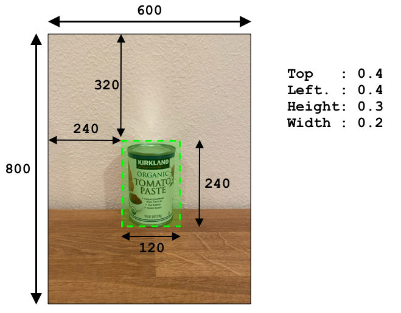

<!--
CO_OP_TRANSLATOR_METADATA:
{
  "original_hash": "1c9e5fa8b7be726c75a97232b1e41c97",
  "translation_date": "2025-08-28T00:58:49+00:00",
  "source_file": "5-retail/lessons/2-check-stock-device/README.md",
  "language_code": "vi"
}
-->
# Kiểm tra hàng tồn kho từ thiết bị IoT


> Sketchnote bởi [Nitya Narasimhan](https://github.com/nitya). Nhấp vào hình ảnh để xem phiên bản lớn hơn.

## Câu hỏi trước bài giảng

[Câu hỏi trước bài giảng](https://black-meadow-040d15503.1.azurestaticapps.net/quiz/39)

## Giới thiệu

Trong bài học trước, bạn đã tìm hiểu về các ứng dụng khác nhau của việc phát hiện đối tượng trong bán lẻ. Bạn cũng đã học cách huấn luyện một bộ phát hiện đối tượng để nhận diện hàng tồn kho. Trong bài học này, bạn sẽ học cách sử dụng bộ phát hiện đối tượng từ thiết bị IoT của mình để đếm hàng tồn kho.

Trong bài học này, chúng ta sẽ đề cập đến:

* [Đếm hàng tồn kho](../../../../../5-retail/lessons/2-check-stock-device)
* [Gọi bộ phát hiện đối tượng từ thiết bị IoT của bạn](../../../../../5-retail/lessons/2-check-stock-device)
* [Hộp giới hạn](../../../../../5-retail/lessons/2-check-stock-device)
* [Huấn luyện lại mô hình](../../../../../5-retail/lessons/2-check-stock-device)
* [Đếm hàng tồn kho](../../../../../5-retail/lessons/2-check-stock-device)

> 🗑 Đây là bài học cuối cùng trong dự án này, vì vậy sau khi hoàn thành bài học và bài tập, đừng quên dọn dẹp các dịch vụ đám mây của bạn. Bạn sẽ cần các dịch vụ này để hoàn thành bài tập, vì vậy hãy đảm bảo hoàn thành trước.
>
> Tham khảo [hướng dẫn dọn dẹp dự án của bạn](../../../clean-up.md) nếu cần để biết cách thực hiện.

## Đếm hàng tồn kho

Bộ phát hiện đối tượng có thể được sử dụng để kiểm tra hàng tồn kho, bao gồm việc đếm số lượng hàng hoặc đảm bảo hàng hóa ở đúng vị trí. Các thiết bị IoT có camera có thể được triển khai khắp cửa hàng để giám sát hàng tồn kho, bắt đầu từ các điểm nóng nơi việc bổ sung hàng hóa là quan trọng, chẳng hạn như khu vực chứa số lượng nhỏ các mặt hàng có giá trị cao.

Ví dụ, nếu một camera hướng vào một dãy kệ có thể chứa 8 lon sốt cà chua, và bộ phát hiện đối tượng chỉ phát hiện được 7 lon, thì một lon đã bị thiếu và cần được bổ sung.


Trong hình trên, bộ phát hiện đối tượng đã phát hiện 7 lon sốt cà chua trên một kệ có thể chứa 8 lon. Không chỉ thiết bị IoT có thể gửi thông báo về việc cần bổ sung, mà nó còn có thể cung cấp thông tin về vị trí của mặt hàng bị thiếu, dữ liệu quan trọng nếu bạn đang sử dụng robot để bổ sung hàng hóa.

> 💁 Tùy thuộc vào cửa hàng và mức độ phổ biến của mặt hàng, việc bổ sung có thể không xảy ra nếu chỉ thiếu 1 lon. Bạn sẽ cần xây dựng một thuật toán để xác định khi nào cần bổ sung dựa trên sản phẩm, khách hàng và các tiêu chí khác.

✅ Trong những tình huống nào khác bạn có thể kết hợp phát hiện đối tượng và robot?

Đôi khi hàng hóa sai có thể xuất hiện trên kệ. Điều này có thể do lỗi con người khi bổ sung hàng, hoặc khách hàng đổi ý về việc mua và đặt một mặt hàng vào vị trí trống đầu tiên. Khi đây là mặt hàng không dễ hỏng như đồ hộp, điều này chỉ là một sự phiền toái. Nếu đó là mặt hàng dễ hỏng như đồ đông lạnh hoặc đồ lạnh, điều này có thể khiến sản phẩm không còn được bán vì không thể xác định được thời gian mặt hàng đã bị bỏ ra khỏi tủ đông.

Phát hiện đối tượng có thể được sử dụng để phát hiện các mặt hàng không mong muốn, từ đó cảnh báo con người hoặc robot để trả lại mặt hàng ngay khi nó được phát hiện.


Trong hình trên, một lon ngô non đã được đặt trên kệ cạnh sốt cà chua. Bộ phát hiện đối tượng đã phát hiện điều này, cho phép thiết bị IoT thông báo cho con người hoặc robot để trả lon ngô về vị trí đúng.

## Gọi bộ phát hiện đối tượng từ thiết bị IoT của bạn

Bộ phát hiện đối tượng mà bạn đã huấn luyện trong bài học trước có thể được gọi từ thiết bị IoT của bạn.

### Nhiệm vụ - xuất bản một phiên bản của bộ phát hiện đối tượng

Các phiên bản được xuất bản từ cổng Custom Vision.

1. Mở cổng Custom Vision tại [CustomVision.ai](https://customvision.ai) và đăng nhập nếu bạn chưa mở. Sau đó mở dự án `stock-detector` của bạn.

1. Chọn tab **Performance** từ các tùy chọn ở trên cùng.

1. Chọn phiên bản mới nhất từ danh sách *Iterations* ở bên cạnh.

1. Nhấp vào nút **Publish** cho phiên bản.

    

1. Trong hộp thoại *Publish Model*, đặt *Prediction resource* thành tài nguyên `stock-detector-prediction` mà bạn đã tạo trong bài học trước. Giữ tên là `Iteration2`, và nhấp vào nút **Publish**.

1. Sau khi xuất bản, nhấp vào nút **Prediction URL**. Điều này sẽ hiển thị chi tiết về API dự đoán, và bạn sẽ cần những thông tin này để gọi mô hình từ thiết bị IoT của mình. Phần dưới được gắn nhãn *If you have an image file*, và đây là thông tin bạn cần. Sao chép URL được hiển thị, ví dụ:

    ```output
    https://<location>.api.cognitive.microsoft.com/customvision/v3.0/Prediction/<id>/detect/iterations/Iteration2/image
    ```

    Trong đó `<location>` là vị trí bạn đã sử dụng khi tạo tài nguyên Custom Vision, và `<id>` là một ID dài gồm các chữ cái và số.

    Cũng sao chép giá trị *Prediction-Key*. Đây là một khóa bảo mật mà bạn phải truyền khi gọi mô hình. Chỉ các ứng dụng truyền khóa này mới được phép sử dụng mô hình, các ứng dụng khác sẽ bị từ chối.

    

✅ Khi một phiên bản mới được xuất bản, nó sẽ có tên khác. Bạn nghĩ làm thế nào để thay đổi phiên bản mà thiết bị IoT đang sử dụng?

### Nhiệm vụ - gọi bộ phát hiện đối tượng từ thiết bị IoT của bạn

Làm theo hướng dẫn phù hợp dưới đây để sử dụng bộ phát hiện đối tượng từ thiết bị IoT của bạn:

* [Arduino - Wio Terminal](wio-terminal-object-detector.md)
* [Máy tính đơn bảng - Raspberry Pi/Thiết bị ảo](single-board-computer-object-detector.md)

## Hộp giới hạn

Khi bạn sử dụng bộ phát hiện đối tượng, bạn không chỉ nhận được các đối tượng được phát hiện với nhãn và xác suất của chúng, mà còn nhận được các hộp giới hạn của các đối tượng. Các hộp này xác định nơi bộ phát hiện đối tượng đã phát hiện đối tượng với xác suất đã cho.

> 💁 Hộp giới hạn là một hộp xác định khu vực chứa đối tượng được phát hiện, một hộp xác định ranh giới cho đối tượng.

Kết quả của một dự đoán trong tab **Predictions** của Custom Vision có các hộp giới hạn được vẽ trên hình ảnh được gửi để dự đoán.


Trong hình trên, 4 lon sốt cà chua đã được phát hiện. Trong kết quả, một ô vuông màu đỏ được phủ lên mỗi đối tượng được phát hiện trong hình ảnh, chỉ ra hộp giới hạn cho hình ảnh.

✅ Mở các dự đoán trong Custom Vision và kiểm tra các hộp giới hạn.

Hộp giới hạn được xác định với 4 giá trị - top, left, height và width. Các giá trị này nằm trong khoảng từ 0-1, đại diện cho vị trí dưới dạng phần trăm kích thước của hình ảnh. Điểm gốc (vị trí 0,0) là góc trên bên trái của hình ảnh, vì vậy giá trị top là khoảng cách từ trên xuống, và đáy của hộp giới hạn là top cộng với height.



Hình trên có chiều rộng 600 pixel và chiều cao 800 pixel. Hộp giới hạn bắt đầu từ 320 pixel xuống dưới, cho giá trị top là 0.4 (800 x 0.4 = 320). Từ bên trái, hộp giới hạn bắt đầu từ 240 pixel ngang, cho giá trị left là 0.4 (600 x 0.4 = 240). Chiều cao của hộp giới hạn là 240 pixel, cho giá trị height là 0.3 (800 x 0.3 = 240). Chiều rộng của hộp giới hạn là 120 pixel, cho giá trị width là 0.2 (600 x 0.2 = 120).

| Tọa độ   | Giá trị |
| -------- | ------: |
| Top      | 0.4     |
| Left     | 0.4     |
| Height   | 0.3     |
| Width    | 0.2     |

Sử dụng các giá trị phần trăm từ 0-1 có nghĩa là bất kể kích thước hình ảnh được thay đổi như thế nào, hộp giới hạn bắt đầu từ 0.4 của chiều dài và chiều cao, và có chiều cao là 0.3 và chiều rộng là 0.2.

Bạn có thể sử dụng hộp giới hạn kết hợp với xác suất để đánh giá độ chính xác của một phát hiện. Ví dụ, một bộ phát hiện đối tượng có thể phát hiện nhiều đối tượng chồng lên nhau, chẳng hạn phát hiện một lon bên trong một lon khác. Mã của bạn có thể kiểm tra các hộp giới hạn, hiểu rằng điều này là không thể, và bỏ qua bất kỳ đối tượng nào có sự chồng lấp đáng kể với các đối tượng khác.


Trong ví dụ trên, một hộp giới hạn chỉ ra một lon sốt cà chua được dự đoán với xác suất 78.3%. Một hộp giới hạn thứ hai nhỏ hơn một chút, nằm bên trong hộp giới hạn đầu tiên với xác suất 64.3%. Mã của bạn có thể kiểm tra các hộp giới hạn, thấy rằng chúng chồng lấp hoàn toàn, và bỏ qua xác suất thấp hơn vì không thể có một lon bên trong một lon khác.

✅ Bạn có thể nghĩ ra tình huống nào mà việc phát hiện một đối tượng bên trong một đối tượng khác là hợp lệ không?

## Huấn luyện lại mô hình

Giống như với bộ phân loại hình ảnh, bạn có thể huấn luyện lại mô hình của mình bằng dữ liệu được thu thập bởi thiết bị IoT của bạn. Sử dụng dữ liệu thực tế này sẽ đảm bảo mô hình của bạn hoạt động tốt khi được sử dụng từ thiết bị IoT.

Không giống như bộ phân loại hình ảnh, bạn không thể chỉ gắn nhãn một hình ảnh. Thay vào đó, bạn cần xem xét từng hộp giới hạn được phát hiện bởi mô hình. Nếu hộp nằm sai vị trí thì cần được xóa, nếu nó ở vị trí sai thì cần được điều chỉnh.

### Nhiệm vụ - huấn luyện lại mô hình

1. Đảm bảo bạn đã thu thập một loạt hình ảnh bằng thiết bị IoT của mình.

1. Từ tab **Predictions**, chọn một hình ảnh. Bạn sẽ thấy các hộp đỏ chỉ ra các hộp giới hạn của các đối tượng được phát hiện.

1. Làm việc qua từng hộp giới hạn. Chọn nó trước và bạn sẽ thấy một cửa sổ bật lên hiển thị nhãn. Sử dụng các tay cầm ở các góc của hộp giới hạn để điều chỉnh kích thước nếu cần. Nếu nhãn sai, xóa nó bằng nút **X** và thêm nhãn đúng. Nếu hộp giới hạn không chứa đối tượng, xóa nó bằng nút thùng rác.

1. Đóng trình chỉnh sửa khi hoàn tất và hình ảnh sẽ chuyển từ tab **Predictions** sang tab **Training Images**. Lặp lại quy trình cho tất cả các dự đoán.

1. Sử dụng nút **Train** để huấn luyện lại mô hình của bạn. Sau khi huấn luyện xong, xuất bản phiên bản và cập nhật thiết bị IoT của bạn để sử dụng URL của phiên bản mới.

1. Triển khai lại mã của bạn và kiểm tra thiết bị IoT của bạn.

## Đếm hàng tồn kho

Sử dụng kết hợp số lượng đối tượng được phát hiện và các hộp giới hạn, bạn có thể đếm hàng tồn kho trên kệ.

### Nhiệm vụ - đếm hàng tồn kho

Làm theo hướng dẫn phù hợp dưới đây để đếm hàng tồn kho bằng kết quả từ bộ phát hiện đối tượng từ thiết bị IoT của bạn:

* [Arduino - Wio Terminal](wio-terminal-count-stock.md)
* [Máy tính đơn bảng - Raspberry Pi/Thiết bị ảo](single-board-computer-count-stock.md)

---

## 🚀 Thử thách

Bạn có thể phát hiện hàng hóa sai không? Huấn luyện mô hình của bạn trên nhiều đối tượng, sau đó cập nhật ứng dụng của bạn để cảnh báo bạn nếu phát hiện hàng hóa sai.

Thậm chí có thể tiến xa hơn và phát hiện hàng hóa cạnh nhau trên cùng một kệ, và xem liệu có thứ gì đó bị đặt sai chỗ bằng cách định nghĩa giới hạn trên các hộp giới hạn.

## Câu hỏi sau bài giảng

[Câu hỏi sau bài giảng](https://black-meadow-040d15503.1.azurestaticapps.net/quiz/40)

## Ôn tập & Tự học

* Tìm hiểu thêm về cách thiết kế một hệ thống phát hiện hàng tồn kho từ hướng dẫn [Mẫu phát hiện hết hàng tại biên trên Microsoft Docs](https://docs.microsoft.com/hybrid/app-solutions/pattern-out-of-stock-at-edge?WT.mc_id=academic-17441-jabenn)
* Tìm hiểu các cách khác để xây dựng giải pháp bán lẻ từ đầu đến cuối kết hợp nhiều dịch vụ IoT và đám mây bằng cách xem [video Hands On! trên YouTube](https://www.youtube.com/watch?v=m3Pc300x2Mw).

## Bài tập

[Sử dụng bộ phát hiện đối tượng của bạn tại biên](assignment.md)

---

**Tuyên bố miễn trừ trách nhiệm**:  
Tài liệu này đã được dịch bằng dịch vụ dịch thuật AI [Co-op Translator](https://github.com/Azure/co-op-translator). Mặc dù chúng tôi cố gắng đảm bảo độ chính xác, xin lưu ý rằng các bản dịch tự động có thể chứa lỗi hoặc không chính xác. Tài liệu gốc bằng ngôn ngữ bản địa nên được coi là nguồn thông tin chính thức. Đối với các thông tin quan trọng, khuyến nghị sử dụng dịch vụ dịch thuật chuyên nghiệp bởi con người. Chúng tôi không chịu trách nhiệm cho bất kỳ sự hiểu lầm hoặc diễn giải sai nào phát sinh từ việc sử dụng bản dịch này.