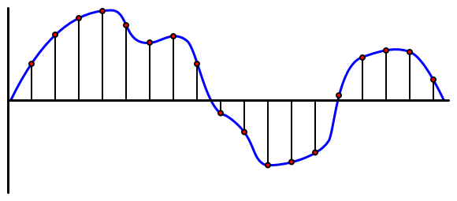

<!--
CO_OP_TRANSLATOR_METADATA:
{
  "original_hash": "6d6aa1be033625d201a190fc9c5cbfb4",
  "translation_date": "2025-08-27T23:22:40+00:00",
  "source_file": "6-consumer/lessons/1-speech-recognition/README.md",
  "language_code": "vi"
}
-->
# Nhận diện giọng nói với thiết bị IoT


> Sketchnote bởi [Nitya Narasimhan](https://github.com/nitya). Nhấp vào hình ảnh để xem phiên bản lớn hơn.

Video này cung cấp tổng quan về dịch vụ giọng nói Azure, một chủ đề sẽ được đề cập trong bài học này:

[](https://www.youtube.com/watch?v=iW0Fw0l3mrA)

> 🎥 Nhấp vào hình ảnh trên để xem video

## Câu hỏi trước bài học

[Câu hỏi trước bài học](https://black-meadow-040d15503.1.azurestaticapps.net/quiz/41)

## Giới thiệu

'Alexa, đặt hẹn giờ 12 phút'

'Alexa, trạng thái hẹn giờ'

'Alexa, đặt hẹn giờ 8 phút tên là hấp bông cải xanh'

Các thiết bị thông minh ngày càng trở nên phổ biến hơn. Không chỉ là loa thông minh như HomePods, Echos và Google Homes, mà còn được tích hợp trong điện thoại, đồng hồ, thậm chí là đèn và bộ điều chỉnh nhiệt.

> 💁 Tôi có ít nhất 19 thiết bị trong nhà có trợ lý giọng nói, và đó chỉ là những thiết bị tôi biết!

Điều khiển bằng giọng nói tăng cường khả năng tiếp cận bằng cách cho phép những người có hạn chế về vận động tương tác với thiết bị. Dù là khuyết tật vĩnh viễn như sinh ra không có tay, hay khuyết tật tạm thời như gãy tay, hoặc đơn giản là đang bận tay với việc mua sắm hoặc chăm sóc trẻ nhỏ, việc điều khiển ngôi nhà bằng giọng nói thay vì bằng tay mở ra một thế giới tiện ích. Hét lên 'Hey Siri, đóng cửa gara của tôi' trong khi đang thay tã cho em bé và xử lý một đứa trẻ nghịch ngợm có thể là một cải tiến nhỏ nhưng hiệu quả trong cuộc sống.

Một trong những cách sử dụng phổ biến nhất của trợ lý giọng nói là đặt hẹn giờ, đặc biệt là hẹn giờ trong bếp. Việc có thể đặt nhiều hẹn giờ chỉ bằng giọng nói là một sự trợ giúp lớn trong bếp - không cần phải dừng việc nhào bột, khuấy súp, hoặc làm sạch tay sau khi làm nhân bánh để sử dụng hẹn giờ vật lý.

Trong bài học này, bạn sẽ học cách tích hợp nhận diện giọng nói vào các thiết bị IoT. Bạn sẽ tìm hiểu về micro như cảm biến, cách thu âm từ micro gắn vào thiết bị IoT, và cách sử dụng AI để chuyển đổi âm thanh thành văn bản. Trong suốt dự án này, bạn sẽ xây dựng một hẹn giờ thông minh trong bếp, có thể đặt hẹn giờ bằng giọng nói với nhiều ngôn ngữ.

Trong bài học này, chúng ta sẽ đề cập đến:

* [Micro](../../../../../6-consumer/lessons/1-speech-recognition)
* [Thu âm từ thiết bị IoT của bạn](../../../../../6-consumer/lessons/1-speech-recognition)
* [Chuyển đổi giọng nói thành văn bản](../../../../../6-consumer/lessons/1-speech-recognition)
* [Chuyển đổi giọng nói thành văn bản](../../../../../6-consumer/lessons/1-speech-recognition)

## Micro

Micro là cảm biến analog chuyển đổi sóng âm thành tín hiệu điện. Dao động trong không khí làm các thành phần trong micro di chuyển một lượng nhỏ, và điều này gây ra những thay đổi nhỏ trong tín hiệu điện. Những thay đổi này sau đó được khuếch đại để tạo ra đầu ra điện.

### Các loại micro

Micro có nhiều loại khác nhau:

* Dynamic - Micro dynamic có nam châm gắn vào màng rung di chuyển trong cuộn dây tạo ra dòng điện. Đây là nguyên lý ngược lại với hầu hết loa, sử dụng dòng điện để di chuyển nam châm trong cuộn dây, làm màng rung để tạo ra âm thanh. Điều này có nghĩa là loa có thể được sử dụng như micro dynamic, và micro dynamic có thể được sử dụng như loa. Trong các thiết bị như intercom, nơi người dùng hoặc nghe hoặc nói nhưng không cả hai, một thiết bị có thể hoạt động như cả loa và micro.

    Micro dynamic không cần nguồn điện để hoạt động, tín hiệu điện được tạo ra hoàn toàn từ micro.

    

* Ribbon - Micro ribbon tương tự như micro dynamic, nhưng thay vì màng rung, chúng có một dải kim loại. Dải này di chuyển trong trường từ tạo ra dòng điện. Giống như micro dynamic, micro ribbon không cần nguồn điện để hoạt động.

    

* Condenser - Micro condenser có màng kim loại mỏng và một tấm kim loại cố định phía sau. Điện được áp dụng cho cả hai và khi màng rung, điện tích tĩnh giữa các tấm thay đổi tạo ra tín hiệu. Micro condenser cần nguồn điện để hoạt động - gọi là *Phantom power*.

    

* MEMS - Micro hệ thống vi cơ điện tử, hay MEMS, là micro trên chip. Chúng có màng nhạy áp lực được khắc trên chip silicon, hoạt động tương tự như micro condenser. Những micro này có thể rất nhỏ và tích hợp vào mạch.

    

    Trong hình trên, chip được gắn nhãn **LEFT** là micro MEMS, với màng nhỏ chưa đến một milimet.

✅ Nghiên cứu: Những micro nào bạn có xung quanh - trong máy tính, điện thoại, tai nghe hoặc các thiết bị khác? Chúng thuộc loại micro nào?

### Âm thanh kỹ thuật số

Âm thanh là tín hiệu analog mang thông tin rất chi tiết. Để chuyển đổi tín hiệu này sang kỹ thuật số, âm thanh cần được lấy mẫu hàng nghìn lần mỗi giây.

> 🎓 Lấy mẫu là quá trình chuyển đổi tín hiệu âm thanh thành giá trị kỹ thuật số đại diện cho tín hiệu tại thời điểm đó.



Âm thanh kỹ thuật số được lấy mẫu bằng cách sử dụng điều chế mã xung, hoặc PCM. PCM liên quan đến việc đọc điện áp của tín hiệu và chọn giá trị rời rạc gần nhất với điện áp đó bằng kích thước được định nghĩa.

> 💁 Bạn có thể nghĩ PCM như phiên bản cảm biến của điều chế độ rộng xung, hoặc PWM (PWM đã được đề cập trong [bài học 3 của dự án bắt đầu](../../../1-getting-started/lessons/3-sensors-and-actuators/README.md#pulse-width-modulation)). PCM chuyển đổi tín hiệu analog sang kỹ thuật số, PWM chuyển đổi tín hiệu kỹ thuật số sang analog.

Ví dụ, hầu hết các dịch vụ phát nhạc trực tuyến cung cấp âm thanh 16-bit hoặc 24-bit. Điều này có nghĩa là chúng chuyển đổi điện áp thành giá trị phù hợp với số nguyên 16-bit hoặc 24-bit. Âm thanh 16-bit phù hợp với giá trị trong phạm vi từ -32,768 đến 32,767, 24-bit trong phạm vi −8,388,608 đến 8,388,607. Số bit càng lớn, mẫu càng gần với những gì tai chúng ta thực sự nghe.

> 💁 Bạn có thể đã nghe về âm thanh 8-bit, thường được gọi là LoFi. Đây là âm thanh được lấy mẫu chỉ bằng 8-bit, tức là -128 đến 127. Âm thanh máy tính đầu tiên bị giới hạn ở 8-bit do hạn chế phần cứng, vì vậy điều này thường thấy trong trò chơi retro.

Những mẫu này được lấy hàng nghìn lần mỗi giây, sử dụng tốc độ lấy mẫu được đo bằng KHz (hàng nghìn lần đọc mỗi giây). Các dịch vụ phát nhạc trực tuyến sử dụng 48KHz cho hầu hết âm thanh, nhưng một số âm thanh 'lossless' sử dụng lên đến 96KHz hoặc thậm chí 192KHz. Tốc độ lấy mẫu càng cao, âm thanh càng gần với bản gốc, đến một mức độ nhất định. Có tranh luận liệu con người có thể phân biệt được sự khác biệt trên 48KHz hay không.

✅ Nghiên cứu: Nếu bạn sử dụng dịch vụ phát nhạc trực tuyến, tốc độ lấy mẫu và kích thước mà nó sử dụng là gì? Nếu bạn sử dụng CD, tốc độ lấy mẫu và kích thước của âm thanh CD là gì?

Có nhiều định dạng khác nhau cho dữ liệu âm thanh. Bạn có thể đã nghe về tệp mp3 - dữ liệu âm thanh được nén để làm nhỏ hơn mà không mất chất lượng. Âm thanh không nén thường được lưu dưới dạng tệp WAV - đây là tệp có 44 byte thông tin tiêu đề, theo sau là dữ liệu âm thanh thô. Tiêu đề chứa thông tin như tốc độ lấy mẫu (ví dụ 16000 cho 16KHz) và kích thước mẫu (16 cho 16-bit), và số kênh. Sau tiêu đề, tệp WAV chứa dữ liệu âm thanh thô.

> 🎓 Kênh đề cập đến số lượng luồng âm thanh khác nhau tạo nên âm thanh. Ví dụ, với âm thanh stereo có trái và phải, sẽ có 2 kênh. Với âm thanh vòm 7.1 cho hệ thống rạp hát tại nhà, sẽ có 8 kênh.

### Kích thước dữ liệu âm thanh

Dữ liệu âm thanh tương đối lớn. Ví dụ, thu âm không nén 16-bit ở 16KHz (tốc độ đủ tốt để sử dụng với mô hình chuyển đổi giọng nói thành văn bản), cần 32KB dữ liệu cho mỗi giây âm thanh:

* 16-bit nghĩa là 2 byte mỗi mẫu (1 byte là 8 bit).
* 16KHz là 16,000 mẫu mỗi giây.
* 16,000 x 2 byte = 32,000 byte mỗi giây.

Điều này nghe có vẻ là một lượng dữ liệu nhỏ, nhưng nếu bạn đang sử dụng vi điều khiển với bộ nhớ hạn chế, đây có thể là rất nhiều. Ví dụ, Wio Terminal có 192KB bộ nhớ, và bộ nhớ này cần lưu trữ mã chương trình và biến. Ngay cả khi mã chương trình của bạn rất nhỏ, bạn cũng không thể thu âm hơn 5 giây.

Vi điều khiển có thể truy cập bộ nhớ bổ sung, chẳng hạn như thẻ SD hoặc bộ nhớ flash. Khi xây dựng thiết bị IoT thu âm, bạn cần đảm bảo không chỉ có bộ nhớ bổ sung, mà mã của bạn ghi âm thu được từ micro trực tiếp vào bộ nhớ đó, và khi gửi lên đám mây, bạn truyền từ bộ nhớ đến yêu cầu web. Bằng cách đó, bạn có thể tránh hết bộ nhớ bằng cách cố gắng giữ toàn bộ khối dữ liệu âm thanh trong bộ nhớ cùng lúc.

## Thu âm từ thiết bị IoT của bạn

Thiết bị IoT của bạn có thể được kết nối với micro để thu âm, sẵn sàng chuyển đổi thành văn bản. Nó cũng có thể được kết nối với loa để phát âm thanh. Trong các bài học sau, điều này sẽ được sử dụng để cung cấp phản hồi âm thanh, nhưng việc thiết lập loa ngay bây giờ sẽ hữu ích để kiểm tra micro.

### Nhiệm vụ - cấu hình micro và loa

Thực hiện theo hướng dẫn phù hợp để cấu hình micro và loa cho thiết bị IoT của bạn:

* [Arduino - Wio Terminal](wio-terminal-microphone.md)
* [Máy tính đơn bảng - Raspberry Pi](pi-microphone.md)
* [Máy tính đơn bảng - Thiết bị ảo](virtual-device-microphone.md)

### Nhiệm vụ - thu âm

Thực hiện theo hướng dẫn phù hợp để thu âm trên thiết bị IoT của bạn:

* [Arduino - Wio Terminal](wio-terminal-audio.md)
* [Máy tính đơn bảng - Raspberry Pi](pi-audio.md)
* [Máy tính đơn bảng - Thiết bị ảo](virtual-device-audio.md)

## Chuyển đổi giọng nói thành văn bản

Chuyển đổi giọng nói thành văn bản, hay nhận diện giọng nói, liên quan đến việc sử dụng AI để chuyển đổi từ trong tín hiệu âm thanh thành văn bản.

### Mô hình nhận diện giọng nói

Để chuyển đổi giọng nói thành văn bản, các mẫu từ tín hiệu âm thanh được nhóm lại và đưa vào mô hình học máy dựa trên mạng nơ-ron hồi quy (RNN). Đây là một loại mô hình học máy có thể sử dụng dữ liệu trước đó để đưa ra quyết định về dữ liệu đang đến. Ví dụ, RNN có thể nhận diện một khối mẫu âm thanh là âm 'Hel', và khi nhận được khối khác mà nó nghĩ là âm 'lo', nó có thể kết hợp với âm trước đó, tìm rằng 'Hello' là một từ hợp lệ và chọn đó làm kết quả.

Các mô hình ML luôn chấp nhận dữ liệu có kích thước cố định mỗi lần. Bộ phân loại hình ảnh bạn đã xây dựng trong bài học trước đó thay đổi kích thước hình ảnh thành kích thước cố định và xử lý chúng. Tương tự với các mô hình giọng nói, chúng phải xử lý các khối âm thanh có kích thước cố định. Các mô hình giọng nói cần có khả năng kết hợp kết quả của nhiều dự đoán để đưa ra câu trả lời, để phân biệt giữa 'Hi' và 'Highway', hoặc 'flock' và 'floccinaucinihilipilification'.

Các mô hình giọng nói cũng đủ tiên tiến để hiểu ngữ cảnh, và có thể sửa các từ mà chúng nhận diện khi xử lý thêm âm thanh. Ví dụ, nếu bạn nói "Tôi đã đi đến cửa hàng để mua hai quả chuối và một quả táo nữa", bạn sẽ sử dụng ba từ nghe giống nhau nhưng được viết khác nhau - to, two và too. Các mô hình giọng nói có thể hiểu ngữ cảnh và sử dụng cách viết phù hợp của từ.
💁 Một số dịch vụ giọng nói cho phép tùy chỉnh để hoạt động tốt hơn trong các môi trường ồn ào như nhà máy, hoặc với các từ ngữ chuyên ngành như tên hóa chất. Những tùy chỉnh này được huấn luyện bằng cách cung cấp mẫu âm thanh và bản chép lời, và hoạt động dựa trên học chuyển giao, tương tự như cách bạn đã huấn luyện một bộ phân loại hình ảnh chỉ với một vài hình ảnh trong bài học trước.
### Quyền riêng tư

Khi sử dụng tính năng chuyển giọng nói thành văn bản trên thiết bị IoT dành cho người tiêu dùng, quyền riêng tư là vô cùng quan trọng. Những thiết bị này liên tục nghe âm thanh, vì vậy với tư cách là người tiêu dùng, bạn không muốn mọi thứ bạn nói đều được gửi lên đám mây và chuyển thành văn bản. Điều này không chỉ tiêu tốn nhiều băng thông Internet mà còn có những tác động lớn đến quyền riêng tư, đặc biệt khi một số nhà sản xuất thiết bị thông minh chọn ngẫu nhiên âm thanh để [con người xác thực với văn bản được tạo nhằm cải thiện mô hình của họ](https://www.theverge.com/2019/4/10/18305378/amazon-alexa-ai-voice-assistant-annotation-listen-private-recordings).

Bạn chỉ muốn thiết bị thông minh của mình gửi âm thanh lên đám mây để xử lý khi bạn đang sử dụng nó, không phải khi nó nghe thấy âm thanh trong nhà bạn, âm thanh có thể bao gồm các cuộc họp riêng tư hoặc tương tác thân mật. Cách mà hầu hết các thiết bị thông minh hoạt động là sử dụng một *từ đánh thức*, một cụm từ khóa như "Alexa", "Hey Siri", hoặc "OK Google" khiến thiết bị 'thức dậy' và lắng nghe những gì bạn nói cho đến khi nó phát hiện ra một khoảng dừng trong lời nói của bạn, cho thấy bạn đã kết thúc việc nói chuyện với thiết bị.

> 🎓 Phát hiện từ đánh thức còn được gọi là *Keyword spotting* hoặc *Keyword recognition*.

Những từ đánh thức này được phát hiện trên thiết bị, không phải trên đám mây. Các thiết bị thông minh này có các mô hình AI nhỏ chạy trên thiết bị để lắng nghe từ đánh thức, và khi nó được phát hiện, bắt đầu truyền âm thanh lên đám mây để nhận dạng. Những mô hình này rất chuyên biệt và chỉ lắng nghe từ đánh thức.

> 💁 Một số công ty công nghệ đang tăng cường quyền riêng tư cho thiết bị của họ bằng cách thực hiện một phần chuyển đổi giọng nói thành văn bản trên thiết bị. Apple đã công bố rằng trong các bản cập nhật iOS và macOS năm 2021, họ sẽ hỗ trợ chuyển đổi giọng nói thành văn bản trên thiết bị và có thể xử lý nhiều yêu cầu mà không cần sử dụng đám mây. Điều này có được nhờ vào việc có các bộ xử lý mạnh mẽ trong thiết bị của họ có thể chạy các mô hình ML.

✅ Bạn nghĩ gì về các tác động quyền riêng tư và đạo đức của việc lưu trữ âm thanh được gửi lên đám mây? Âm thanh này có nên được lưu trữ không, và nếu có, thì như thế nào? Bạn có nghĩ rằng việc sử dụng các bản ghi âm cho cơ quan thực thi pháp luật là một sự đánh đổi tốt cho việc mất quyền riêng tư không?

Phát hiện từ đánh thức thường sử dụng một kỹ thuật gọi là TinyML, tức là chuyển đổi các mô hình ML để có thể chạy trên các vi điều khiển. Những mô hình này có kích thước nhỏ và tiêu thụ rất ít năng lượng để chạy.

Để tránh sự phức tạp của việc huấn luyện và sử dụng mô hình từ đánh thức, bộ hẹn giờ thông minh mà bạn đang xây dựng trong bài học này sẽ sử dụng một nút để bật tính năng nhận dạng giọng nói.

> 💁 Nếu bạn muốn thử tạo một mô hình phát hiện từ đánh thức để chạy trên Wio Terminal hoặc Raspberry Pi, hãy xem hướng dẫn [phản hồi giọng nói của bạn từ Edge Impulse](https://docs.edgeimpulse.com/docs/responding-to-your-voice). Nếu bạn muốn sử dụng máy tính của mình để làm điều này, bạn có thể thử [bắt đầu với hướng dẫn nhanh về từ khóa tùy chỉnh trên tài liệu Microsoft](https://docs.microsoft.com/azure/cognitive-services/speech-service/keyword-recognition-overview?WT.mc_id=academic-17441-jabenn).

## Chuyển đổi giọng nói thành văn bản


Giống như với phân loại hình ảnh trong dự án trước, có các dịch vụ AI được xây dựng sẵn có thể nhận giọng nói dưới dạng tệp âm thanh và chuyển đổi thành văn bản. Một trong những dịch vụ như vậy là Speech Service, thuộc Cognitive Services, các dịch vụ AI được xây dựng sẵn mà bạn có thể sử dụng trong ứng dụng của mình.

### Nhiệm vụ - cấu hình tài nguyên AI giọng nói

1. Tạo một Nhóm Tài nguyên cho dự án này có tên `smart-timer`.

1. Sử dụng lệnh sau để tạo một tài nguyên giọng nói miễn phí:

    ```sh
    az cognitiveservices account create --name smart-timer \
                                        --resource-group smart-timer \
                                        --kind SpeechServices \
                                        --sku F0 \
                                        --yes \
                                        --location <location>
    ```

    Thay thế `<location>` bằng vị trí bạn đã sử dụng khi tạo Nhóm Tài nguyên.

1. Bạn sẽ cần một khóa API để truy cập tài nguyên giọng nói từ mã của mình. Chạy lệnh sau để lấy khóa:

    ```sh
    az cognitiveservices account keys list --name smart-timer \
                                           --resource-group smart-timer \
                                           --output table
    ```

    Sao chép một trong các khóa.

### Nhiệm vụ - chuyển đổi giọng nói thành văn bản

Thực hiện theo hướng dẫn liên quan để chuyển đổi giọng nói thành văn bản trên thiết bị IoT của bạn:

* [Arduino - Wio Terminal](wio-terminal-speech-to-text.md)
* [Máy tính đơn bảng - Raspberry Pi](pi-speech-to-text.md)
* [Máy tính đơn bảng - Thiết bị ảo](virtual-device-speech-to-text.md)

---

## 🚀 Thử thách

Nhận dạng giọng nói đã tồn tại từ lâu và liên tục được cải thiện. Nghiên cứu các khả năng hiện tại và so sánh cách chúng đã phát triển theo thời gian, bao gồm độ chính xác của các bản phiên âm máy so với con người.

Bạn nghĩ tương lai của nhận dạng giọng nói sẽ như thế nào?

## Câu hỏi sau bài giảng

[Câu hỏi sau bài giảng](https://black-meadow-040d15503.1.azurestaticapps.net/quiz/42)

## Ôn tập & Tự học

* Đọc về các loại micro khác nhau và cách chúng hoạt động trong bài viết [sự khác biệt giữa micro động và micro tụ điện trên Musician's HQ](https://musicianshq.com/whats-the-difference-between-dynamic-and-condenser-microphones/).
* Đọc thêm về dịch vụ giọng nói của Cognitive Services trong [tài liệu dịch vụ giọng nói trên Microsoft Docs](https://docs.microsoft.com/azure/cognitive-services/speech-service/?WT.mc_id=academic-17441-jabenn).
* Đọc về phát hiện từ khóa trong [tài liệu nhận dạng từ khóa trên Microsoft Docs](https://docs.microsoft.com/azure/cognitive-services/speech-service/keyword-recognition-overview?WT.mc_id=academic-17441-jabenn).

## Bài tập

[](assignment.md)

---

**Tuyên bố miễn trừ trách nhiệm**:  
Tài liệu này đã được dịch bằng dịch vụ dịch thuật AI [Co-op Translator](https://github.com/Azure/co-op-translator). Mặc dù chúng tôi cố gắng đảm bảo độ chính xác, xin lưu ý rằng các bản dịch tự động có thể chứa lỗi hoặc không chính xác. Tài liệu gốc bằng ngôn ngữ bản địa nên được coi là nguồn thông tin chính thức. Đối với các thông tin quan trọng, nên sử dụng dịch vụ dịch thuật chuyên nghiệp từ con người. Chúng tôi không chịu trách nhiệm cho bất kỳ sự hiểu lầm hoặc diễn giải sai nào phát sinh từ việc sử dụng bản dịch này.