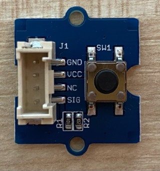

<!--
CO_OP_TRANSLATOR_METADATA:
{
  "original_hash": "0ac0afcfb40cb5970ef4cb74f01c32e9",
  "translation_date": "2025-08-27T23:26:28+00:00",
  "source_file": "6-consumer/lessons/1-speech-recognition/pi-audio.md",
  "language_code": "vi"
}
-->
# Ghi âm - Raspberry Pi

Trong phần này của bài học, bạn sẽ viết mã để ghi âm trên Raspberry Pi. Việc ghi âm sẽ được điều khiển bằng một nút bấm.

## Phần cứng

Raspberry Pi cần một nút bấm để điều khiển việc ghi âm.

Nút bấm bạn sẽ sử dụng là nút Grove. Đây là một cảm biến kỹ thuật số có thể bật hoặc tắt tín hiệu. Các nút này có thể được cấu hình để gửi tín hiệu cao khi nút được nhấn, và tín hiệu thấp khi không nhấn, hoặc ngược lại.

Nếu bạn đang sử dụng ReSpeaker 2-Mics Pi HAT làm micro, thì không cần kết nối nút bấm vì HAT này đã có sẵn một nút. Hãy chuyển sang phần tiếp theo.

### Kết nối nút bấm

Nút bấm có thể được kết nối với Grove base hat.

#### Nhiệm vụ - kết nối nút bấm



1. Cắm một đầu của cáp Grove vào ổ cắm trên module nút bấm. Cáp chỉ có thể cắm theo một chiều.

1. Khi Raspberry Pi đã tắt nguồn, kết nối đầu còn lại của cáp Grove vào ổ cắm kỹ thuật số được đánh dấu **D5** trên Grove Base hat gắn vào Pi. Ổ cắm này là ổ thứ hai từ bên trái, nằm trên hàng ổ cắm cạnh các chân GPIO.


## Ghi âm

Bạn có thể ghi âm từ micro bằng mã Python.

### Nhiệm vụ - ghi âm

1. Bật nguồn Pi và chờ nó khởi động.

1. Mở VS Code, trực tiếp trên Pi hoặc kết nối qua tiện ích Remote SSH.

1. Gói PyAudio Pip có các hàm để ghi và phát lại âm thanh. Gói này phụ thuộc vào một số thư viện âm thanh cần được cài đặt trước. Chạy các lệnh sau trong terminal để cài đặt:

    ```sh
    sudo apt update
    sudo apt install libportaudio0 libportaudio2 libportaudiocpp0 portaudio19-dev libasound2-plugins --yes 
    ```

1. Cài đặt gói PyAudio Pip.

    ```sh
    pip3 install pyaudio
    ```

1. Tạo một thư mục mới có tên `smart-timer` và thêm một tệp có tên `app.py` vào thư mục này.

1. Thêm các dòng import sau vào đầu tệp:

    ```python
    import io
    import pyaudio
    import time
    import wave
    
    from grove.factory import Factory
    ```

    Điều này sẽ import module `pyaudio`, một số module Python tiêu chuẩn để xử lý tệp wave, và module `grove.factory` để import `Factory` tạo lớp nút bấm.

1. Bên dưới, thêm mã để tạo nút Grove.

    Nếu bạn đang sử dụng ReSpeaker 2-Mics Pi HAT, sử dụng mã sau:

    ```python
    # The button on the ReSpeaker 2-Mics Pi HAT
    button = Factory.getButton("GPIO-LOW", 17)
    ```

    Mã này tạo một nút trên cổng **D17**, cổng mà nút trên ReSpeaker 2-Mics Pi HAT được kết nối. Nút này được thiết lập để gửi tín hiệu thấp khi nhấn.

    Nếu bạn không sử dụng ReSpeaker 2-Mics Pi HAT, và đang sử dụng nút Grove kết nối với base hat, sử dụng mã này.

    ```python
    button = Factory.getButton("GPIO-HIGH", 5)
    ```

    Mã này tạo một nút trên cổng **D5** được thiết lập để gửi tín hiệu cao khi nhấn.

1. Bên dưới, tạo một instance của lớp PyAudio để xử lý âm thanh:

    ```python
    audio = pyaudio.PyAudio()
    ```

1. Khai báo số card phần cứng cho micro và loa. Đây sẽ là số card bạn tìm thấy bằng cách chạy `arecord -l` và `aplay -l` trước đó trong bài học.

    ```python
    microphone_card_number = <microphone card number>
    speaker_card_number = <speaker card number>
    ```

    Thay `<microphone card number>` bằng số card của micro.

    Thay `<speaker card number>` bằng số card của loa, cùng số bạn đã thiết lập trong tệp `alsa.conf`.

1. Bên dưới, khai báo tốc độ mẫu để sử dụng cho việc ghi và phát lại âm thanh. Bạn có thể cần thay đổi giá trị này tùy thuộc vào phần cứng bạn đang sử dụng.

    ```python
    rate = 48000 #48KHz
    ```

    Nếu bạn gặp lỗi tốc độ mẫu khi chạy mã sau này, hãy thay đổi giá trị này thành `44100` hoặc `16000`. Giá trị càng cao, chất lượng âm thanh càng tốt.

1. Bên dưới, tạo một hàm mới có tên `capture_audio`. Hàm này sẽ được gọi để ghi âm từ micro:

    ```python
    def capture_audio():
    ```

1. Bên trong hàm này, thêm mã sau để ghi âm:

    ```python
    stream = audio.open(format = pyaudio.paInt16,
                        rate = rate,
                        channels = 1, 
                        input_device_index = microphone_card_number,
                        input = True,
                        frames_per_buffer = 4096)

    frames = []

    while button.is_pressed():
        frames.append(stream.read(4096))

    stream.stop_stream()
    stream.close()
    ```

    Mã này mở một luồng âm thanh đầu vào bằng đối tượng PyAudio. Luồng này sẽ ghi âm từ micro ở tần số 16KHz, ghi vào các bộ đệm có kích thước 4096 byte.

    Mã sau đó lặp lại trong khi nút Grove được nhấn, đọc các bộ đệm 4096 byte này vào một mảng mỗi lần.

    > 💁 Bạn có thể đọc thêm về các tùy chọn được truyền vào phương thức `open` trong [tài liệu PyAudio](https://people.csail.mit.edu/hubert/pyaudio/docs/).

    Khi nút được thả, luồng sẽ dừng và đóng lại.

1. Thêm mã sau vào cuối hàm này:

    ```python
    wav_buffer = io.BytesIO()
    with wave.open(wav_buffer, 'wb') as wavefile:
        wavefile.setnchannels(1)
        wavefile.setsampwidth(audio.get_sample_size(pyaudio.paInt16))
        wavefile.setframerate(rate)
        wavefile.writeframes(b''.join(frames))
        wav_buffer.seek(0)

    return wav_buffer
    ```

    Mã này tạo một bộ đệm nhị phân và ghi tất cả âm thanh đã ghi vào đó dưới dạng tệp [WAV](https://wikipedia.org/wiki/WAV). Đây là cách tiêu chuẩn để ghi âm thanh không nén vào tệp. Bộ đệm này sau đó được trả về.

1. Thêm hàm `play_audio` sau để phát lại bộ đệm âm thanh:

    ```python
    def play_audio(buffer):
        stream = audio.open(format = pyaudio.paInt16,
                            rate = rate,
                            channels = 1,
                            output_device_index = speaker_card_number,
                            output = True)
    
        with wave.open(buffer, 'rb') as wf:
            data = wf.readframes(4096)
    
            while len(data) > 0:
                stream.write(data)
                data = wf.readframes(4096)
    
            stream.close()
    ```

    Hàm này mở một luồng âm thanh khác, lần này là để phát âm thanh. Nó sử dụng cùng cài đặt như luồng đầu vào. Bộ đệm sau đó được mở dưới dạng tệp wave và ghi vào luồng đầu ra trong các khối 4096 byte, phát âm thanh. Luồng sau đó được đóng lại.

1. Thêm mã sau bên dưới hàm `capture_audio` để lặp lại cho đến khi nút được nhấn. Khi nút được nhấn, âm thanh sẽ được ghi lại, sau đó phát.

    ```python
    while True:
        while not button.is_pressed():
            time.sleep(.1)
        
        buffer = capture_audio()
        play_audio(buffer)
    ```

1. Chạy mã. Nhấn nút và nói vào micro. Thả nút khi bạn hoàn tất, và bạn sẽ nghe thấy bản ghi âm.

    Bạn có thể gặp một số lỗi ALSA khi instance PyAudio được tạo. Điều này là do cấu hình trên Pi cho các thiết bị âm thanh bạn không có. Bạn có thể bỏ qua các lỗi này.

    ```output
    pi@raspberrypi:~/smart-timer $ python3 app.py 
    ALSA lib pcm.c:2565:(snd_pcm_open_noupdate) Unknown PCM cards.pcm.front
    ALSA lib pcm.c:2565:(snd_pcm_open_noupdate) Unknown PCM cards.pcm.rear
    ALSA lib pcm.c:2565:(snd_pcm_open_noupdate) Unknown PCM cards.pcm.center_lfe
    ALSA lib pcm.c:2565:(snd_pcm_open_noupdate) Unknown PCM cards.pcm.side
    ```

    Nếu bạn gặp lỗi sau:

    ```output
    OSError: [Errno -9997] Invalid sample rate
    ```

    thì hãy thay đổi `rate` thành 44100 hoặc 16000.

> 💁 Bạn có thể tìm thấy mã này trong thư mục [code-record/pi](../../../../../6-consumer/lessons/1-speech-recognition/code-record/pi).

😀 Chương trình ghi âm của bạn đã thành công!

---

**Tuyên bố miễn trừ trách nhiệm**:  
Tài liệu này đã được dịch bằng dịch vụ dịch thuật AI [Co-op Translator](https://github.com/Azure/co-op-translator). Mặc dù chúng tôi cố gắng đảm bảo độ chính xác, xin lưu ý rằng các bản dịch tự động có thể chứa lỗi hoặc không chính xác. Tài liệu gốc bằng ngôn ngữ bản địa nên được coi là nguồn thông tin chính thức. Đối với các thông tin quan trọng, khuyến nghị sử dụng dịch vụ dịch thuật chuyên nghiệp bởi con người. Chúng tôi không chịu trách nhiệm cho bất kỳ sự hiểu lầm hoặc diễn giải sai nào phát sinh từ việc sử dụng bản dịch này.