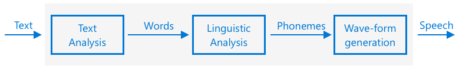

<!--
CO_OP_TRANSLATOR_METADATA:
{
  "original_hash": "b73fe10ec6b580fba2affb6f6e0a5c4d",
  "translation_date": "2025-08-27T23:09:29+00:00",
  "source_file": "6-consumer/lessons/3-spoken-feedback/README.md",
  "language_code": "vi"
}
-->
# Đặt hẹn giờ và cung cấp phản hồi bằng giọng nói


> Sketchnote bởi [Nitya Narasimhan](https://github.com/nitya). Nhấp vào hình ảnh để xem phiên bản lớn hơn.

## Câu hỏi trước bài giảng

[Câu hỏi trước bài giảng](https://black-meadow-040d15503.1.azurestaticapps.net/quiz/45)

## Giới thiệu

Trợ lý thông minh không phải là thiết bị giao tiếp một chiều. Bạn nói với chúng, và chúng phản hồi:

"Alexa, đặt hẹn giờ 3 phút"

"Ok, hẹn giờ của bạn đã được đặt trong 3 phút"

Trong 2 bài học trước, bạn đã học cách chuyển đổi giọng nói thành văn bản, sau đó trích xuất yêu cầu đặt hẹn giờ từ văn bản đó. Trong bài học này, bạn sẽ học cách đặt hẹn giờ trên thiết bị IoT, phản hồi người dùng bằng lời nói xác nhận hẹn giờ của họ, và thông báo khi hẹn giờ kết thúc.

Trong bài học này, chúng ta sẽ đề cập đến:

* [Chuyển văn bản thành giọng nói](../../../../../6-consumer/lessons/3-spoken-feedback)
* [Đặt hẹn giờ](../../../../../6-consumer/lessons/3-spoken-feedback)
* [Chuyển đổi văn bản thành giọng nói](../../../../../6-consumer/lessons/3-spoken-feedback)

## Chuyển văn bản thành giọng nói

Chuyển văn bản thành giọng nói, như tên gọi, là quá trình chuyển đổi văn bản thành âm thanh chứa các từ được nói. Nguyên tắc cơ bản là phân tích các từ trong văn bản thành các âm vị (phoneme) cấu thành, và ghép nối âm thanh cho các âm vị đó, hoặc sử dụng âm thanh đã được ghi sẵn hoặc âm thanh được tạo bởi các mô hình AI.



Hệ thống chuyển văn bản thành giọng nói thường có 3 giai đoạn:

* Phân tích văn bản
* Phân tích ngôn ngữ học
* Tạo dạng sóng âm thanh

### Phân tích văn bản

Phân tích văn bản liên quan đến việc lấy văn bản được cung cấp và chuyển đổi thành các từ có thể được sử dụng để tạo giọng nói. Ví dụ, nếu bạn chuyển đổi "Hello world", không cần phân tích văn bản, hai từ này có thể được chuyển thành giọng nói. Tuy nhiên, nếu bạn có "1234", thì điều này có thể cần được chuyển đổi thành "Một nghìn hai trăm ba mươi tư" hoặc "Một, hai, ba, bốn" tùy thuộc vào ngữ cảnh. Với "Tôi có 1234 quả táo", thì sẽ là "Một nghìn hai trăm ba mươi tư", nhưng với "Đứa trẻ đếm 1234" thì sẽ là "Một, hai, ba, bốn".

Các từ được tạo ra không chỉ khác nhau theo ngôn ngữ mà còn theo địa phương của ngôn ngữ đó. Ví dụ, trong tiếng Anh Mỹ, 120 sẽ là "One hundred twenty", trong tiếng Anh Anh sẽ là "One hundred and twenty", với việc sử dụng "and" sau hàng trăm.

✅ Một số ví dụ khác cần phân tích văn bản bao gồm "in" là viết tắt của inch, và "st" là viết tắt của saint và street. Bạn có thể nghĩ ra các ví dụ khác trong ngôn ngữ của bạn về các từ có thể gây nhầm lẫn nếu không có ngữ cảnh không?

Khi các từ đã được xác định, chúng sẽ được gửi để phân tích ngôn ngữ học.

### Phân tích ngôn ngữ học

Phân tích ngôn ngữ học phân tách các từ thành các âm vị. Các âm vị không chỉ dựa trên các chữ cái được sử dụng mà còn dựa trên các chữ cái khác trong từ. Ví dụ, trong tiếng Anh, âm 'a' trong 'car' và 'care' là khác nhau. Tiếng Anh có 44 âm vị khác nhau cho 26 chữ cái trong bảng chữ cái, một số được chia sẻ bởi các chữ cái khác nhau, chẳng hạn như âm vị giống nhau được sử dụng ở đầu từ 'circle' và 'serpent'.

✅ Tìm hiểu thêm: Các âm vị trong ngôn ngữ của bạn là gì?

Khi các từ đã được chuyển đổi thành âm vị, các âm vị này cần thêm dữ liệu để hỗ trợ ngữ điệu, điều chỉnh tông giọng hoặc thời lượng tùy thuộc vào ngữ cảnh. Một ví dụ là trong tiếng Anh, việc tăng cao độ có thể được sử dụng để chuyển một câu thành câu hỏi, với việc tăng cao độ ở từ cuối cùng ngụ ý một câu hỏi.

Ví dụ - câu "You have an apple" là một câu khẳng định rằng bạn có một quả táo. Nếu cao độ tăng lên ở cuối, tăng ở từ "apple", nó trở thành câu hỏi "You have an apple?", hỏi xem bạn có một quả táo không. Phân tích ngôn ngữ học cần sử dụng dấu chấm hỏi ở cuối để quyết định tăng cao độ.

Khi các âm vị đã được tạo ra, chúng có thể được gửi để tạo dạng sóng âm thanh để tạo ra đầu ra âm thanh.

### Tạo dạng sóng âm thanh

Các hệ thống chuyển văn bản thành giọng nói điện tử đầu tiên sử dụng các bản ghi âm đơn lẻ cho mỗi âm vị, dẫn đến giọng nói rất đơn điệu, giống như robot. Phân tích ngôn ngữ học sẽ tạo ra các âm vị, các âm vị này sẽ được tải từ cơ sở dữ liệu âm thanh và ghép nối để tạo ra âm thanh.

✅ Tìm hiểu thêm: Tìm một số bản ghi âm từ các hệ thống tổng hợp giọng nói đầu tiên. So sánh chúng với tổng hợp giọng nói hiện đại, chẳng hạn như được sử dụng trong các trợ lý thông minh.

Việc tạo dạng sóng âm thanh hiện đại hơn sử dụng các mô hình học máy (ML) được xây dựng bằng học sâu (các mạng nơ-ron rất lớn hoạt động tương tự như các nơ-ron trong não) để tạo ra giọng nói tự nhiên hơn, có thể không phân biệt được với con người.

> 💁 Một số mô hình ML này có thể được huấn luyện lại bằng cách sử dụng học chuyển giao để tạo ra giọng nói giống như người thật. Điều này có nghĩa là việc sử dụng giọng nói như một hệ thống bảo mật, điều mà các ngân hàng ngày càng cố gắng thực hiện, không còn là ý tưởng tốt nữa vì bất kỳ ai có bản ghi âm vài phút giọng nói của bạn đều có thể giả mạo bạn.

Các mô hình ML lớn này đang được huấn luyện để kết hợp cả ba bước thành các hệ thống tổng hợp giọng nói từ đầu đến cuối.

## Đặt hẹn giờ

Để đặt hẹn giờ, thiết bị IoT của bạn cần gọi endpoint REST mà bạn đã tạo bằng mã serverless, sau đó sử dụng số giây kết quả để đặt hẹn giờ.

### Nhiệm vụ - gọi hàm serverless để lấy thời gian hẹn giờ

Làm theo hướng dẫn phù hợp để gọi endpoint REST từ thiết bị IoT của bạn và đặt hẹn giờ cho thời gian yêu cầu:

* [Arduino - Wio Terminal](wio-terminal-set-timer.md)
* [Máy tính bảng đơn - Raspberry Pi/Thiết bị IoT ảo](single-board-computer-set-timer.md)

## Chuyển đổi văn bản thành giọng nói

Dịch vụ giọng nói mà bạn đã sử dụng để chuyển đổi giọng nói thành văn bản cũng có thể được sử dụng để chuyển đổi văn bản thành giọng nói, và điều này có thể được phát qua loa trên thiết bị IoT của bạn. Văn bản cần chuyển đổi được gửi đến dịch vụ giọng nói, cùng với loại âm thanh yêu cầu (chẳng hạn như tần số mẫu), và dữ liệu nhị phân chứa âm thanh được trả về.

Khi bạn gửi yêu cầu này, bạn gửi nó bằng *Ngôn ngữ Đánh dấu Tổng hợp Giọng nói* (SSML), một ngôn ngữ đánh dấu dựa trên XML dành cho các ứng dụng tổng hợp giọng nói. Điều này không chỉ xác định văn bản cần chuyển đổi mà còn ngôn ngữ của văn bản, giọng nói cần sử dụng, và thậm chí có thể được sử dụng để xác định tốc độ, âm lượng và cao độ cho một số hoặc tất cả các từ trong văn bản.

Ví dụ, SSML này xác định một yêu cầu chuyển đổi văn bản "Hẹn giờ 3 phút 5 giây của bạn đã được đặt" thành giọng nói bằng giọng Anh Anh có tên `en-GB-MiaNeural`

```xml
<speak version='1.0' xml:lang='en-GB'>
    <voice xml:lang='en-GB' name='en-GB-MiaNeural'>
        Your 3 minute 5 second time has been set
    </voice>
</speak>
```

> 💁 Hầu hết các hệ thống chuyển văn bản thành giọng nói đều có nhiều giọng nói cho các ngôn ngữ khác nhau, với các giọng điệu phù hợp như giọng Anh Anh với giọng Anh và giọng Anh New Zealand với giọng New Zealand.

### Nhiệm vụ - chuyển đổi văn bản thành giọng nói

Thực hiện theo hướng dẫn phù hợp để chuyển đổi văn bản thành giọng nói bằng thiết bị IoT của bạn:

* [Arduino - Wio Terminal](wio-terminal-text-to-speech.md)
* [Máy tính bảng đơn - Raspberry Pi](pi-text-to-speech.md)
* [Máy tính bảng đơn - Thiết bị ảo](virtual-device-text-to-speech.md)

---

## 🚀 Thử thách

SSML có các cách để thay đổi cách các từ được nói, chẳng hạn như thêm nhấn mạnh vào một số từ, thêm khoảng dừng, hoặc thay đổi cao độ. Hãy thử một số cách này, gửi các SSML khác nhau từ thiết bị IoT của bạn và so sánh kết quả. Bạn có thể đọc thêm về SSML, bao gồm cách thay đổi cách các từ được nói trong [Đặc tả Ngôn ngữ Đánh dấu Tổng hợp Giọng nói (SSML) Phiên bản 1.1 từ World Wide Web Consortium](https://www.w3.org/TR/speech-synthesis11/).

## Câu hỏi sau bài giảng

[Câu hỏi sau bài giảng](https://black-meadow-040d15503.1.azurestaticapps.net/quiz/46)

## Ôn tập & Tự học

* Đọc thêm về tổng hợp giọng nói trên [trang tổng hợp giọng nói trên Wikipedia](https://wikipedia.org/wiki/Speech_synthesis)
* Đọc thêm về cách tội phạm sử dụng tổng hợp giọng nói để đánh cắp trong [câu chuyện về giọng nói giả 'giúp tội phạm mạng đánh cắp tiền' trên BBC News](https://www.bbc.com/news/technology-48908736)
* Tìm hiểu thêm về rủi ro đối với các diễn viên lồng tiếng từ các phiên bản giọng nói tổng hợp của họ trong [bài viết về vụ kiện TikTok này đang làm nổi bật cách AI đang gây khó khăn cho các diễn viên lồng tiếng trên Vice](https://www.vice.com/en/article/z3xqwj/this-tiktok-lawsuit-is-highlighting-how-ai-is-screwing-over-voice-actors)

## Bài tập

[Hủy hẹn giờ](assignment.md)

---

**Tuyên bố miễn trừ trách nhiệm**:  
Tài liệu này đã được dịch bằng dịch vụ dịch thuật AI [Co-op Translator](https://github.com/Azure/co-op-translator). Mặc dù chúng tôi cố gắng đảm bảo độ chính xác, xin lưu ý rằng các bản dịch tự động có thể chứa lỗi hoặc không chính xác. Tài liệu gốc bằng ngôn ngữ bản địa nên được coi là nguồn thông tin chính thức. Đối với các thông tin quan trọng, khuyến nghị sử dụng dịch vụ dịch thuật chuyên nghiệp bởi con người. Chúng tôi không chịu trách nhiệm cho bất kỳ sự hiểu lầm hoặc diễn giải sai nào phát sinh từ việc sử dụng bản dịch này.