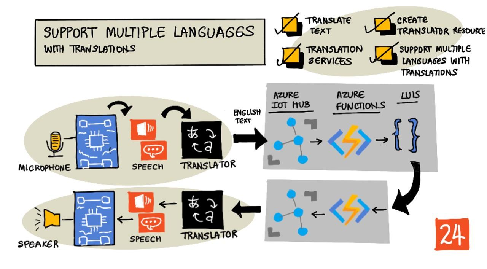

<!--
CO_OP_TRANSLATOR_METADATA:
{
  "original_hash": "c16de27b0074abe81d6a8bad5e5b1a6b",
  "translation_date": "2025-08-27T22:57:04+00:00",
  "source_file": "6-consumer/lessons/4-multiple-language-support/README.md",
  "language_code": "vi"
}
-->
# Hỗ trợ nhiều ngôn ngữ



> Sketchnote bởi [Nitya Narasimhan](https://github.com/nitya). Nhấn vào hình ảnh để xem phiên bản lớn hơn.

Video này cung cấp cái nhìn tổng quan về dịch vụ giọng nói của Azure, bao gồm chuyển đổi giọng nói thành văn bản và văn bản thành giọng nói từ các bài học trước, cũng như dịch giọng nói, một chủ đề được đề cập trong bài học này:

[](https://www.youtube.com/watch?v=h6xbpMPSGEA)

> 🎥 Nhấn vào hình ảnh trên để xem video

## Câu hỏi trước bài học

[Câu hỏi trước bài học](https://black-meadow-040d15503.1.azurestaticapps.net/quiz/47)

## Giới thiệu

Trong 3 bài học trước, bạn đã học về chuyển đổi giọng nói thành văn bản, hiểu ngôn ngữ, và chuyển đổi văn bản thành giọng nói, tất cả đều được hỗ trợ bởi AI. Một lĩnh vực khác trong giao tiếp của con người mà AI có thể hỗ trợ là dịch ngôn ngữ - chuyển đổi từ ngôn ngữ này sang ngôn ngữ khác, chẳng hạn từ tiếng Anh sang tiếng Pháp.

Trong bài học này, bạn sẽ học cách sử dụng AI để dịch văn bản, cho phép bộ hẹn giờ thông minh của bạn tương tác với người dùng bằng nhiều ngôn ngữ.

Trong bài học này, chúng ta sẽ đề cập đến:

* [Dịch văn bản](../../../../../6-consumer/lessons/4-multiple-language-support)
* [Dịch vụ dịch thuật](../../../../../6-consumer/lessons/4-multiple-language-support)
* [Tạo tài nguyên dịch thuật](../../../../../6-consumer/lessons/4-multiple-language-support)
* [Hỗ trợ nhiều ngôn ngữ trong ứng dụng với dịch thuật](../../../../../6-consumer/lessons/4-multiple-language-support)
* [Dịch văn bản bằng dịch vụ AI](../../../../../6-consumer/lessons/4-multiple-language-support)

> 🗑 Đây là bài học cuối cùng trong dự án này, vì vậy sau khi hoàn thành bài học và bài tập, đừng quên dọn dẹp các dịch vụ đám mây của bạn. Bạn sẽ cần các dịch vụ này để hoàn thành bài tập, vì vậy hãy đảm bảo hoàn thành trước.
>
> Tham khảo [hướng dẫn dọn dẹp dự án của bạn](../../../clean-up.md) nếu cần hướng dẫn cách thực hiện.

## Dịch văn bản

Dịch văn bản là một vấn đề trong khoa học máy tính đã được nghiên cứu hơn 70 năm, và chỉ đến bây giờ, nhờ vào những tiến bộ trong AI và sức mạnh tính toán, nó mới gần như được giải quyết đến mức gần bằng với các dịch giả con người.

> 💁 Nguồn gốc có thể được truy ngược xa hơn, đến [Al-Kindi](https://wikipedia.org/wiki/Al-Kindi), một nhà mật mã học Ả Rập thế kỷ 9, người đã phát triển các kỹ thuật dịch ngôn ngữ.

### Dịch máy

Dịch văn bản bắt đầu như một công nghệ được gọi là Dịch Máy (Machine Translation - MT), có thể dịch giữa các cặp ngôn ngữ khác nhau. MT hoạt động bằng cách thay thế các từ trong một ngôn ngữ bằng từ tương ứng trong ngôn ngữ khác, thêm các kỹ thuật để chọn cách dịch đúng cho các cụm từ hoặc phần của câu khi dịch từng từ một không có ý nghĩa.

> 🎓 Khi các công cụ dịch hỗ trợ dịch giữa một ngôn ngữ và một ngôn ngữ khác, chúng được gọi là *cặp ngôn ngữ*. Các công cụ khác nhau hỗ trợ các cặp ngôn ngữ khác nhau, và không phải lúc nào cũng đầy đủ. Ví dụ, một công cụ dịch có thể hỗ trợ cặp ngôn ngữ Anh - Tây Ban Nha, và Tây Ban Nha - Ý, nhưng không hỗ trợ Anh - Ý.

Ví dụ, dịch "Hello world" từ tiếng Anh sang tiếng Pháp có thể được thực hiện bằng cách thay thế - "Bonjour" cho "Hello", và "le monde" cho "world", dẫn đến bản dịch đúng là "Bonjour le monde".

Thay thế từ không hiệu quả khi các ngôn ngữ khác nhau sử dụng các cách diễn đạt khác nhau để nói cùng một điều. Ví dụ, câu tiếng Anh "My name is Jim" được dịch sang tiếng Pháp là "Je m'appelle Jim" - nghĩa đen là "Tôi tự gọi mình là Jim". "Je" là tiếng Pháp cho "Tôi", "moi" là "tôi", nhưng được nối với động từ vì nó bắt đầu bằng một nguyên âm, nên trở thành "m'", "appelle" là "gọi", và "Jim" không được dịch vì đó là tên riêng, không phải từ có thể dịch. Thứ tự từ cũng trở thành vấn đề - một sự thay thế đơn giản của "Je m'appelle Jim" trở thành "I myself call Jim", với thứ tự từ khác so với tiếng Anh.

> 💁 Một số từ không bao giờ được dịch - tên của tôi là Jim bất kể ngôn ngữ nào được sử dụng để giới thiệu tôi. Khi dịch sang các ngôn ngữ sử dụng bảng chữ cái khác, hoặc sử dụng các chữ cái khác cho các âm khác nhau, thì các từ có thể được *phiên âm*, tức là chọn các chữ cái hoặc ký tự phù hợp để tạo ra âm thanh giống như từ gốc.

Thành ngữ cũng là một vấn đề trong dịch thuật. Đây là những cụm từ có ý nghĩa được hiểu khác với cách diễn giải trực tiếp của các từ. Ví dụ, trong tiếng Anh, thành ngữ "I've got ants in my pants" không thực sự ám chỉ việc có kiến trong quần áo, mà là đang bồn chồn. Nếu bạn dịch câu này sang tiếng Đức, bạn sẽ làm người nghe bối rối, vì phiên bản tiếng Đức là "I have bumble bees in the bottom".

> 💁 Các địa phương khác nhau thêm vào các phức tạp khác nhau. Với thành ngữ "ants in your pants", trong tiếng Anh Mỹ "pants" ám chỉ quần ngoài, trong tiếng Anh Anh, "pants" là đồ lót.

✅ Nếu bạn nói được nhiều ngôn ngữ, hãy nghĩ đến một số cụm từ không thể dịch trực tiếp.

Hệ thống dịch máy dựa vào các cơ sở dữ liệu lớn chứa các quy tắc mô tả cách dịch các cụm từ và thành ngữ nhất định, cùng với các phương pháp thống kê để chọn bản dịch phù hợp nhất từ các tùy chọn có thể. Các phương pháp thống kê này sử dụng cơ sở dữ liệu khổng lồ các tác phẩm được dịch bởi con người sang nhiều ngôn ngữ để chọn bản dịch có khả năng nhất, một kỹ thuật gọi là *dịch máy thống kê*. Một số hệ thống sử dụng các biểu diễn trung gian của ngôn ngữ, cho phép một ngôn ngữ được dịch sang trung gian, sau đó từ trung gian sang ngôn ngữ khác. Bằng cách này, việc thêm nhiều ngôn ngữ chỉ cần dịch sang và từ trung gian, không cần dịch sang và từ tất cả các ngôn ngữ khác.

### Dịch bằng mạng nơ-ron

Dịch bằng mạng nơ-ron sử dụng sức mạnh của AI để dịch, thường dịch toàn bộ câu bằng một mô hình duy nhất. Các mô hình này được huấn luyện trên các tập dữ liệu khổng lồ đã được con người dịch, chẳng hạn như các trang web, sách và tài liệu của Liên Hợp Quốc.

Các mô hình dịch bằng mạng nơ-ron thường nhỏ hơn các mô hình dịch máy do không cần cơ sở dữ liệu lớn chứa các cụm từ và thành ngữ. Các dịch vụ AI hiện đại cung cấp dịch thuật thường kết hợp nhiều kỹ thuật, pha trộn giữa dịch máy thống kê và dịch bằng mạng nơ-ron.

Không có bản dịch 1:1 cho bất kỳ cặp ngôn ngữ nào. Các mô hình dịch khác nhau sẽ tạo ra các kết quả hơi khác nhau tùy thuộc vào dữ liệu được sử dụng để huấn luyện mô hình. Các bản dịch không phải lúc nào cũng đối xứng - nghĩa là nếu bạn dịch một câu từ ngôn ngữ này sang ngôn ngữ khác, sau đó dịch ngược lại ngôn ngữ ban đầu, bạn có thể thấy một câu hơi khác so với câu ban đầu.

✅ Thử nghiệm với các công cụ dịch trực tuyến khác nhau như [Bing Translate](https://www.bing.com/translator), [Google Translate](https://translate.google.com), hoặc ứng dụng dịch của Apple. So sánh các phiên bản dịch của một vài câu. Cũng thử dịch trong một công cụ, sau đó dịch ngược lại trong công cụ khác.

## Dịch vụ dịch thuật

Có một số dịch vụ AI có thể được sử dụng từ ứng dụng của bạn để dịch giọng nói và văn bản.

### Dịch vụ giọng nói của Cognitive Services


Dịch vụ giọng nói mà bạn đã sử dụng trong các bài học trước có khả năng dịch thuật cho nhận diện giọng nói. Khi bạn nhận diện giọng nói, bạn có thể yêu cầu không chỉ văn bản của giọng nói bằng cùng ngôn ngữ, mà còn bằng các ngôn ngữ khác.

> 💁 Điều này chỉ khả dụng từ SDK giọng nói, API REST không có tính năng dịch thuật tích hợp.

### Dịch vụ Translator của Cognitive Services


Dịch vụ Translator là một dịch vụ dịch thuật chuyên dụng có thể dịch văn bản từ một ngôn ngữ sang một hoặc nhiều ngôn ngữ đích. Ngoài việc dịch, nó hỗ trợ một loạt các tính năng bổ sung bao gồm che giấu từ ngữ tục tĩu. Nó cũng cho phép bạn cung cấp một bản dịch cụ thể cho một từ hoặc câu cụ thể, để làm việc với các thuật ngữ bạn không muốn dịch, hoặc có một bản dịch cụ thể đã được biết đến.

Ví dụ, khi dịch câu "I have a Raspberry Pi", ám chỉ đến máy tính bảng đơn, sang một ngôn ngữ khác như tiếng Pháp, bạn sẽ muốn giữ nguyên tên "Raspberry Pi" và không dịch nó, dẫn đến "J’ai un Raspberry Pi" thay vì "J’ai une pi aux framboises".

## Tạo tài nguyên dịch thuật

Trong bài học này, bạn sẽ cần một tài nguyên Translator. Bạn sẽ sử dụng API REST để dịch văn bản.

### Nhiệm vụ - tạo tài nguyên dịch thuật

1. Từ terminal hoặc command prompt của bạn, chạy lệnh sau để tạo tài nguyên Translator trong nhóm tài nguyên `smart-timer`.

    ```sh
    az cognitiveservices account create --name smart-timer-translator \
                                        --resource-group smart-timer \
                                        --kind TextTranslation \
                                        --sku F0 \
                                        --yes \
                                        --location <location>
    ```

    Thay thế `<location>` bằng vị trí bạn đã sử dụng khi tạo Nhóm Tài Nguyên.

1. Lấy khóa cho dịch vụ Translator:

    ```sh
    az cognitiveservices account keys list --name smart-timer-translator \
                                           --resource-group smart-timer \
                                           --output table
    ```

    Sao chép một trong các khóa.

## Hỗ trợ nhiều ngôn ngữ trong ứng dụng với dịch thuật

Trong một thế giới lý tưởng, toàn bộ ứng dụng của bạn nên hiểu càng nhiều ngôn ngữ khác nhau càng tốt, từ việc lắng nghe giọng nói, đến hiểu ngôn ngữ, đến phản hồi bằng giọng nói. Đây là một công việc lớn, vì vậy các dịch vụ dịch thuật có thể tăng tốc thời gian triển khai ứng dụng của bạn.


Hãy tưởng tượng bạn đang xây dựng một bộ hẹn giờ thông minh sử dụng tiếng Anh từ đầu đến cuối, hiểu giọng nói tiếng Anh và chuyển đổi nó thành văn bản, chạy hiểu ngôn ngữ bằng tiếng Anh, xây dựng các phản hồi bằng tiếng Anh và trả lời bằng giọng nói tiếng Anh. Nếu bạn muốn thêm hỗ trợ cho tiếng Nhật, bạn có thể bắt đầu bằng cách dịch giọng nói tiếng Nhật sang văn bản tiếng Anh, sau đó giữ nguyên lõi của ứng dụng, rồi dịch văn bản phản hồi sang tiếng Nhật trước khi phát âm phản hồi. Điều này sẽ cho phép bạn nhanh chóng thêm hỗ trợ tiếng Nhật, và bạn có thể mở rộng để cung cấp hỗ trợ tiếng Nhật toàn diện sau này.

> 💁 Nhược điểm của việc dựa vào dịch máy là các ngôn ngữ và văn hóa khác nhau có các cách diễn đạt khác nhau, vì vậy bản dịch có thể không khớp với cách diễn đạt mà bạn mong đợi.

Dịch máy cũng mở ra các khả năng cho các ứng dụng và thiết bị có thể dịch nội dung do người dùng tạo ra khi nó được tạo. Khoa học viễn tưởng thường xuyên xuất hiện các 'bộ dịch thuật phổ quát', các thiết bị có thể dịch từ ngôn ngữ ngoài hành tinh sang (thường là) tiếng Anh Mỹ. Những thiết bị này không còn là khoa học viễn tưởng, mà là khoa học thực tế, nếu bạn bỏ qua phần ngoài hành tinh. Hiện đã có các ứng dụng và thiết bị cung cấp dịch thuật thời gian thực cho giọng nói và văn bản, sử dụng sự kết hợp giữa dịch vụ giọng nói và dịch thuật.

Một ví dụ là ứng dụng di động [Microsoft Translator](https://www.microsoft.com/translator/apps/?WT.mc_id=academic-17441-jabenn), được minh họa trong video này:

[](https://www.youtube.com/watch?v=16yAGeP2FuM)

> 🎥 Nhấn vào hình ảnh trên để xem video

Hãy tưởng tượng có một thiết bị như vậy trong tay bạn, đặc biệt khi đi du lịch hoặc tương tác với những người mà bạn không biết ngôn ngữ của họ. Có các thiết bị dịch tự động trong sân bay hoặc bệnh viện sẽ mang lại những cải tiến lớn về khả năng tiếp cận.

✅ Nghiên cứu: Có thiết bị IoT dịch thuật nào được bán trên thị trường không? Còn các khả năng dịch thuật được tích hợp vào các thiết bị thông minh thì sao?

> 👽 Mặc dù không có bộ dịch thuật phổ quát thực sự nào cho phép chúng ta nói chuyện với người ngoài hành tinh, nhưng [Microsoft Translator hỗ trợ tiếng Klingon](https://www.microsoft.com/translator/blog/2013/05/14/announcing-klingon-for-bing-translator/?WT.mc_id=academic-17441-jabenn). Qapla’!

## Dịch văn bản bằng dịch vụ AI

Bạn có thể sử dụng một dịch vụ AI để thêm khả năng dịch thuật này vào bộ hẹn giờ thông minh của mình.

### Nhiệm vụ - dịch văn bản bằng dịch vụ AI

Thực hiện theo hướng dẫn phù hợp để dịch văn bản trên thiết bị IoT của bạn:

* [Arduino - Wio Terminal](wio-terminal-translate-speech.md)
* [Máy tính bảng đơn - Raspberry Pi](pi-translate-speech.md)
* [Máy tính bảng đơn - Thiết bị ảo](virtual-device-translate-speech.md)

---

## 🚀 Thử thách

Làm thế nào dịch máy có thể mang lại lợi ích cho các ứng dụng IoT khác ngoài các thiết bị thông minh? Hãy nghĩ đến các cách khác nhau mà dịch thuật có thể giúp ích, không chỉ với lời nói mà còn với văn bản.

## Câu hỏi sau bài học

[Câu hỏi sau bài học](https://black-meadow-040d15503.1.azurestaticapps.net/quiz/48)

## Ôn tập & Tự học

* Đọc thêm về dịch máy trên [trang dịch máy trên Wikipedia](https://wikipedia.org/wiki/Machine_translation)
* Đọc thêm về dịch máy bằng mạng nơ-ron trên [trang dịch máy bằng mạng nơ-ron trên Wikipedia](https://wikipedia.org/wiki/Neural_machine_translation)
* Xem danh sách các ngôn ngữ được hỗ trợ cho dịch vụ giọng nói của Microsoft trong [tài liệu hỗ trợ ngôn ngữ và giọng nói cho dịch vụ giọng nói trên Microsoft Docs](https://docs.microsoft.com/azure/cognitive-services/speech-service/language-support?WT.mc_id=academic-17441-jabenn)

## Bài tập

[Xây dựng một bộ dịch thuật phổ quát](assignment.md)

---

**Tuyên bố miễn trừ trách nhiệm**:  
Tài liệu này đã được dịch bằng dịch vụ dịch thuật AI [Co-op Translator](https://github.com/Azure/co-op-translator). Mặc dù chúng tôi cố gắng đảm bảo độ chính xác, xin lưu ý rằng các bản dịch tự động có thể chứa lỗi hoặc không chính xác. Tài liệu gốc bằng ngôn ngữ bản địa nên được coi là nguồn thông tin chính thức. Đối với các thông tin quan trọng, khuyến nghị sử dụng dịch vụ dịch thuật chuyên nghiệp bởi con người. Chúng tôi không chịu trách nhiệm về bất kỳ sự hiểu lầm hoặc diễn giải sai nào phát sinh từ việc sử dụng bản dịch này.