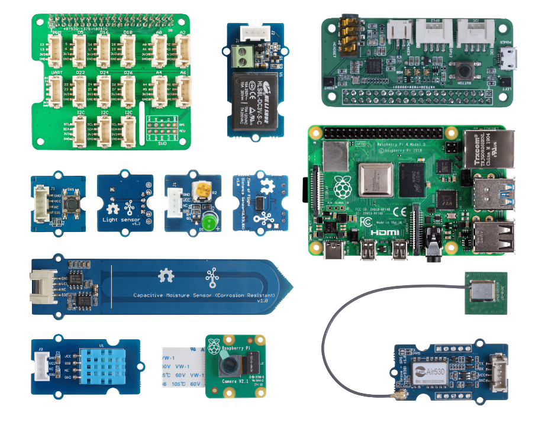

<!--
CO_OP_TRANSLATOR_METADATA:
{
  "original_hash": "3dce18fab38adf93ff30b8c221b1eec5",
  "translation_date": "2025-08-27T20:34:54+00:00",
  "source_file": "hardware.md",
  "language_code": "vi"
}
-->
# Phần cứng

**T** trong IoT là **Things** (Vật thể) và đề cập đến các thiết bị tương tác với thế giới xung quanh chúng ta. Mỗi dự án đều dựa trên phần cứng thực tế có sẵn cho học sinh và người đam mê. Chúng ta có hai lựa chọn phần cứng IoT tùy thuộc vào sở thích cá nhân, kiến thức hoặc sở thích về ngôn ngữ lập trình, mục tiêu học tập và khả năng tiếp cận. Chúng tôi cũng cung cấp một phiên bản 'phần cứng ảo' cho những ai không có phần cứng hoặc muốn tìm hiểu thêm trước khi quyết định mua.

> 💁 Bạn không cần phải mua bất kỳ phần cứng IoT nào để hoàn thành các bài tập. Bạn có thể làm mọi thứ bằng phần cứng IoT ảo.

Các lựa chọn phần cứng vật lý là Arduino hoặc Raspberry Pi. Mỗi nền tảng có những ưu và nhược điểm riêng, và tất cả đều được đề cập trong một trong những bài học đầu tiên. Nếu bạn chưa quyết định chọn nền tảng phần cứng nào, bạn có thể xem lại [bài học thứ hai của dự án đầu tiên](./1-getting-started/lessons/2-deeper-dive/README.md) để quyết định nền tảng phần cứng mà bạn quan tâm nhất.

Phần cứng cụ thể được chọn để giảm bớt sự phức tạp của các bài học và bài tập. Mặc dù các phần cứng khác có thể hoạt động, chúng tôi không thể đảm bảo tất cả các bài tập sẽ được hỗ trợ trên thiết bị của bạn mà không cần thêm phần cứng. Ví dụ, nhiều thiết bị Arduino không có WiFi, điều này cần thiết để kết nối với đám mây - Wio Terminal được chọn vì nó có WiFi tích hợp.

Bạn cũng sẽ cần một số vật dụng không mang tính kỹ thuật, chẳng hạn như đất hoặc cây trồng trong chậu, và trái cây hoặc rau củ.

## Mua bộ kit

Seeed Studios đã rất hào phóng cung cấp tất cả phần cứng dưới dạng các bộ kit dễ mua:

### Arduino - Wio Terminal

**[IoT cho người mới bắt đầu với Seeed và Microsoft - Bộ khởi động Wio Terminal](https://www.seeedstudio.com/IoT-for-beginners-with-Seeed-and-Microsoft-Wio-Terminal-Starter-Kit-p-5006.html)**

### Raspberry Pi

**[IoT cho người mới bắt đầu với Seeed và Microsoft - Bộ khởi động Raspberry Pi 4](https://www.seeedstudio.com/IoT-for-beginners-with-Seeed-and-Microsoft-Raspberry-Pi-Starter-Kit-p-5004.html)**

## Arduino

Tất cả mã thiết bị cho Arduino được viết bằng C++. Để hoàn thành tất cả các bài tập, bạn sẽ cần:

### Phần cứng Arduino

* [Wio Terminal](https://www.seeedstudio.com/Wio-Terminal-p-4509.html)
* *Tùy chọn* - Cáp USB-C hoặc bộ chuyển đổi USB-A sang USB-C. Wio Terminal có cổng USB-C và đi kèm với cáp USB-C sang USB-A. Nếu PC hoặc Mac của bạn chỉ có cổng USB-C, bạn sẽ cần một cáp USB-C hoặc bộ chuyển đổi USB-A sang USB-C.

### Cảm biến và bộ truyền động dành riêng cho Arduino

Những thiết bị này chỉ dành riêng cho việc sử dụng thiết bị Arduino Wio Terminal và không liên quan đến Raspberry Pi.

* [ArduCam Mini 2MP Plus - OV2640](https://www.arducam.com/product/arducam-2mp-spi-camera-b0067-arduino/)
* [ReSpeaker 2-Mics Pi HAT](https://www.seeedstudio.com/ReSpeaker-2-Mics-Pi-HAT.html)
* [Dây nhảy Breadboard](https://www.seeedstudio.com/Breadboard-Jumper-Wire-Pack-241mm-200mm-160mm-117m-p-234.html)
* Tai nghe hoặc loa khác có giắc cắm 3.5mm, hoặc loa JST như:
  * [Loa Mono Enclosed - 2W 6 Ohm](https://www.seeedstudio.com/Mono-Enclosed-Speaker-2W-6-Ohm-p-2832.html)
* Thẻ microSD 16GB hoặc nhỏ hơn, cùng với đầu nối để sử dụng thẻ SD với máy tính của bạn nếu bạn không có sẵn. **LƯU Ý** - Wio Terminal chỉ hỗ trợ thẻ SD tối đa 16GB, không hỗ trợ dung lượng cao hơn.

## Raspberry Pi

Tất cả mã thiết bị cho Raspberry Pi được viết bằng Python. Để hoàn thành tất cả các bài tập, bạn sẽ cần:

### Phần cứng Raspberry Pi

* [Raspberry Pi](https://www.raspberrypi.org/products/raspberry-pi-4-model-b/)
  > 💁 Các phiên bản từ Pi 2B trở lên đều có thể hoạt động với các bài tập trong các bài học này. Nếu bạn dự định chạy VS Code trực tiếp trên Pi, thì cần một Pi 4 với RAM 2GB hoặc nhiều hơn. Nếu bạn truy cập Pi từ xa, thì bất kỳ Pi 2B trở lên đều hoạt động.
* Thẻ microSD (Bạn có thể mua các bộ Raspberry Pi đi kèm với thẻ microSD), cùng với đầu nối để sử dụng thẻ SD với máy tính của bạn nếu bạn không có sẵn.
* Bộ cấp nguồn USB (Bạn có thể mua các bộ Raspberry Pi 4 đi kèm với bộ cấp nguồn). Nếu bạn sử dụng Raspberry Pi 4, bạn cần bộ cấp nguồn USB-C, các thiết bị trước đó cần bộ cấp nguồn micro-USB.

### Cảm biến và bộ truyền động dành riêng cho Raspberry Pi

Những thiết bị này chỉ dành riêng cho việc sử dụng Raspberry Pi và không liên quan đến thiết bị Arduino.

* [Grove Pi base hat](https://www.seeedstudio.com/Grove-Base-Hat-for-Raspberry-Pi.html)
* [Mô-đun camera Raspberry Pi](https://www.raspberrypi.org/products/camera-module-v2/)
* Micro và loa:

  Sử dụng một trong các thiết bị sau (hoặc tương đương):
  * Bất kỳ micro USB nào với bất kỳ loa USB nào, hoặc loa có cáp giắc cắm 3.5mm, hoặc sử dụng âm thanh HDMI nếu Raspberry Pi của bạn được kết nối với màn hình hoặc TV có loa
  * Bất kỳ tai nghe USB nào có micro tích hợp
  * [ReSpeaker 2-Mics Pi HAT](https://www.seeedstudio.com/ReSpeaker-2-Mics-Pi-HAT.html) với
    * Tai nghe hoặc loa khác có giắc cắm 3.5mm, hoặc loa JST như:
    * [Loa Mono Enclosed - 2W 6 Ohm](https://www.seeedstudio.com/Mono-Enclosed-Speaker-2W-6-Ohm-p-2832.html)
  * [Loa hội nghị USB](https://www.amazon.com/USB-Speakerphone-Conference-Business-Microphones/dp/B07Q3D7F8S/ref=sr_1_1?dchild=1&keywords=m0&qid=1614647389&sr=8-1)
* [Cảm biến ánh sáng Grove](https://www.seeedstudio.com/Grove-Light-Sensor-v1-2-LS06-S-phototransistor.html)
* [Nút bấm Grove](https://www.seeedstudio.com/Grove-Button.html)

## Cảm biến và bộ truyền động

Hầu hết các cảm biến và bộ truyền động cần thiết được sử dụng bởi cả hai lộ trình học tập Arduino và Raspberry Pi:

* [Grove LED](https://www.seeedstudio.com/Grove-LED-Pack-p-4364.html) x 2
* [Cảm biến độ ẩm và nhiệt độ Grove](https://www.seeedstudio.com/Grove-Temperature-Humidity-Sensor-DHT11.html)
* [Cảm biến độ ẩm đất điện dung Grove](https://www.seeedstudio.com/Grove-Capacitive-Moisture-Sensor-Corrosion-Resistant.html)
* [Rơ le Grove](https://www.seeedstudio.com/Grove-Relay.html)
* [Grove GPS (Air530)](https://www.seeedstudio.com/Grove-GPS-Air530-p-4584.html)
* [Cảm biến khoảng cách Time of Flight Grove](https://www.seeedstudio.com/Grove-Time-of-Flight-Distance-Sensor-VL53L0X.html)

## Phần cứng tùy chọn

Các bài học về tưới nước tự động hoạt động bằng cách sử dụng rơ le. Là một tùy chọn, bạn có thể kết nối rơ le này với một máy bơm nước chạy bằng USB bằng phần cứng được liệt kê dưới đây.

* [Máy bơm nước 6V](https://www.seeedstudio.com/6V-Mini-Water-Pump-p-1945.html)
* [Đầu nối USB](https://www.adafruit.com/product/3628)
* Ống silicon
* Dây đỏ và đen
* Tua vít đầu dẹt nhỏ

## Phần cứng ảo

Lộ trình phần cứng ảo sẽ cung cấp các trình mô phỏng cho cảm biến và bộ truyền động, được triển khai bằng Python. Tùy thuộc vào khả năng phần cứng của bạn, bạn có thể chạy điều này trên thiết bị phát triển thông thường của mình, chẳng hạn như Mac, PC, hoặc chạy trên Raspberry Pi và chỉ mô phỏng phần cứng mà bạn không có. Ví dụ, nếu bạn có camera Raspberry Pi nhưng không có cảm biến Grove, bạn có thể chạy mã thiết bị ảo trên Pi của mình và mô phỏng các cảm biến Grove, nhưng sử dụng camera vật lý.

Phần cứng ảo sẽ sử dụng [dự án CounterFit](https://github.com/CounterFit-IoT/CounterFit).

Để hoàn thành các bài học này, bạn cần có webcam, micro và thiết bị đầu ra âm thanh như loa hoặc tai nghe. Những thiết bị này có thể là tích hợp hoặc bên ngoài, và cần được cấu hình để hoạt động với hệ điều hành của bạn và sẵn sàng sử dụng từ tất cả các ứng dụng.

---

**Tuyên bố miễn trừ trách nhiệm**:  
Tài liệu này đã được dịch bằng dịch vụ dịch thuật AI [Co-op Translator](https://github.com/Azure/co-op-translator). Mặc dù chúng tôi cố gắng đảm bảo độ chính xác, xin lưu ý rằng các bản dịch tự động có thể chứa lỗi hoặc không chính xác. Tài liệu gốc bằng ngôn ngữ bản địa nên được coi là nguồn thông tin chính thức. Đối với các thông tin quan trọng, khuyến nghị sử dụng dịch vụ dịch thuật chuyên nghiệp bởi con người. Chúng tôi không chịu trách nhiệm cho bất kỳ sự hiểu lầm hoặc diễn giải sai nào phát sinh từ việc sử dụng bản dịch này.