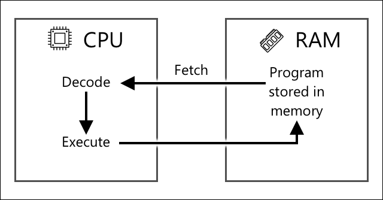

<!--
CO_OP_TRANSLATOR_METADATA:
{
  "original_hash": "9dd7f645ad1c6f20b72fee512987f772",
  "translation_date": "2025-08-24T23:40:38+00:00",
  "source_file": "1-getting-started/lessons/2-deeper-dive/README.md",
  "language_code": "zh"
}
-->
# 深入了解物联网

> 手绘笔记由 [Nitya Narasimhan](https://github.com/nitya) 提供。点击图片查看更大版本。

本课程是 [Microsoft Reactor](https://developer.microsoft.com/reactor/?WT.mc_id=academic-17441-jabenn) 的 [Hello IoT 系列](https://youtube.com/playlist?list=PLmsFUfdnGr3xRts0TIwyaHyQuHaNQcb6-) 的一部分。课程分为两段视频讲授——一个1小时的课程和一个1小时的答疑环节，深入探讨课程内容并回答问题。

> 🎥 点击上方图片观看视频

## 课前测验

[课前测验](https://black-meadow-040d15503.1.azurestaticapps.net/quiz/3)

## 简介

本课程将深入探讨上一课中介绍的一些概念。

在本课程中，我们将学习：

* [物联网应用的组成部分](../../../../../1-getting-started/lessons/2-deeper-dive)
* [深入了解微控制器](../../../../../1-getting-started/lessons/2-deeper-dive)
* [深入了解单板计算机](../../../../../1-getting-started/lessons/2-deeper-dive)

## 物联网应用的组成部分

物联网应用的两个组成部分是 *互联网* 和 *设备*。让我们更详细地了解这两个部分。

### 设备

物联网中的 **设备** 指的是能够与物理世界交互的设备。这些设备通常是小型、低成本的计算机，运行速度较低且功耗较低——例如，简单的微控制器，只有几千字节的内存（而不是 PC 的几千兆字节），运行速度只有几百兆赫兹（而不是 PC 的几千兆赫兹），但功耗极低，有时可以用电池运行数周、数月甚至数年。

这些设备通过传感器从周围环境中收集数据，或者通过控制输出或执行器来进行物理改变，从而与物理世界交互。一个典型的例子是智能恒温器——一种具有温度传感器、设置目标温度的方式（如旋钮或触摸屏）以及连接到加热或冷却系统的设备。当检测到的温度超出目标范围时，它可以打开加热或冷却系统。温度传感器检测到房间太冷，执行器则打开加热系统。

可以充当物联网设备的“设备”种类繁多，从专用硬件到通用设备，甚至包括你的智能手机！智能手机可以使用传感器检测周围环境，并使用执行器与世界交互——例如，使用 GPS 传感器检测位置，并通过扬声器提供导航指令。

✅ 想想你周围还有哪些系统可以通过传感器读取数据并据此做出决策。例如，烤箱上的恒温器就是一个例子。你还能找到更多吗？

### 互联网

物联网应用中的 **互联网** 部分包括物联网设备可以连接以发送和接收数据的应用程序，以及可以处理物联网设备数据并帮助做出决策的其他应用程序。

一个典型的设置是物联网设备连接到某种云服务，该云服务处理安全性、接收来自物联网设备的消息并将消息发送回设备。然后，这个云服务连接到其他应用程序，这些应用程序可以处理或存储传感器数据，或者结合其他系统的数据来做出决策。

设备并不总是通过 WiFi 或有线连接直接连接到互联网。有些设备使用网状网络，通过蓝牙等技术相互通信，并通过一个具有互联网连接的集线器设备进行连接。

以智能恒温器为例，恒温器通过家庭 WiFi 连接到云服务。它将温度数据发送到云服务，云服务将数据写入某种数据库，允许房主通过手机应用查看当前和过去的温度。云中的另一个服务知道房主想要的温度，并通过云服务将消息发送回物联网设备，告诉加热系统打开或关闭。

更智能的版本可以使用云中的 AI，结合其他物联网设备（如占用传感器）连接的其他传感器数据，以及天气和日历等数据，智能地设置温度。例如，它可以读取你的日历显示你正在度假时关闭加热，或者根据你使用的房间逐个关闭加热，并从数据中学习以变得越来越准确。

✅ 还有哪些数据可以帮助使联网恒温器变得更智能？

### 边缘上的物联网

尽管物联网中的 I 代表互联网，但这些设备并不一定要连接到互联网。在某些情况下，设备可以连接到“边缘”设备——运行在本地网络上的网关设备，这意味着可以在不通过互联网的情况下处理数据。这在数据量大或互联网连接较慢时会更快，允许在无法连接互联网的情况下运行，例如在船上或在响应人道主义危机的灾区，并且可以保持数据隐私。一些设备会包含使用云工具创建的处理代码，并在本地运行以收集和响应数据，而无需通过互联网连接来做出决策。

一个例子是智能家居设备，例如 Apple HomePod、Amazon Alexa 或 Google Home，它们使用在云中训练的 AI 模型来监听你的语音，但在设备上本地运行。这些设备在听到某个词或短语时会“唤醒”，然后将你的语音发送到互联网进行处理。设备会在检测到语音中的停顿时停止发送语音。在唤醒设备之前说的所有内容，以及设备停止监听后说的所有内容，都不会发送到设备提供商的互联网，因此是私密的。

✅ 想想还有哪些场景隐私很重要，因此数据处理最好在边缘而不是云中进行。提示：想想带有摄像头或其他成像设备的物联网设备。

### 物联网安全

任何互联网连接都需要考虑安全性。有一个老笑话说“物联网中的 S 代表安全”——物联网中没有“S”，暗示它不安全。

物联网设备连接到云服务，因此它的安全性取决于云服务的安全性——如果你的云服务允许任何设备连接，那么可能会发送恶意数据或发生病毒攻击。这可能会产生非常现实的后果，因为物联网设备会与其他设备交互并进行控制。例如，[Stuxnet 蠕虫](https://wikipedia.org/wiki/Stuxnet) 操纵离心机中的阀门以损坏它们。黑客还利用[安全性差访问婴儿监视器](https://www.npr.org/sections/thetwo-way/2018/06/05/617196788/s-c-mom-says-baby-monitor-was-hacked-experts-say-many-devices-are-vulnerable)和其他家庭监控设备。

> 💁 有时物联网设备和边缘设备运行在完全与互联网隔离的网络上，以保持数据的隐私和安全。这被称为[隔离网络](https://wikipedia.org/wiki/Air_gap_(networking))。

## 深入了解微控制器

在上一课中，我们介绍了微控制器。现在让我们更深入地了解它们。

### CPU

CPU 是微控制器的“核心”。它是运行代码的处理器，可以向任何连接的设备发送数据并接收数据。CPU 可以包含一个或多个核心——本质上是一个或多个可以协同工作运行代码的 CPU。

CPU 依赖时钟以每秒数百万或数十亿次的频率进行计时。每次计时或周期都会同步 CPU 可以执行的操作。每次计时，CPU 可以执行程序中的一条指令，例如从外部设备检索数据或执行数学计算。这种规律的周期允许所有操作在处理下一条指令之前完成。

时钟周期越快，每秒可以处理的指令越多，因此 CPU 的速度越快。CPU 的速度以[赫兹 (Hz)](https://wikipedia.org/wiki/Hertz)为单位测量，1 Hz 表示每秒一个周期或时钟计时。

> 🎓 CPU 速度通常以 MHz 或 GHz 表示。1MHz 是 1 百万 Hz，1GHz 是 1 十亿 Hz。

> 💁 CPU 使用[取指-译码-执行周期](https://wikipedia.org/wiki/Instruction_cycle)执行程序。对于每次时钟计时，CPU 会从内存中取指令，译码，然后执行，例如使用算术逻辑单元 (ALU) 加两个数字。一些执行需要多个计时才能完成，因此下一周期将在指令完成后的下一次计时运行。

微控制器的时钟速度远低于台式机或笔记本电脑，甚至大多数智能手机。例如，Wio Terminal 的 CPU 运行速度为 120MHz，即每秒 120,000,000 次周期。

✅ 一台普通的 PC 或 Mac 的 CPU 有多个核心，运行速度为多个 GHz，即时钟每秒计时数十亿次。研究一下你电脑的时钟速度，并与 Wio Terminal 的速度进行比较。

每次时钟周期都会消耗电力并产生热量。计时越快，消耗的电力越多，产生的热量也越多。PC 有散热片和风扇来散热，否则它们会在几秒钟内过热并关闭。微控制器通常没有这些，因为它们运行得更凉，因此速度更慢。PC 使用主电源或大电池运行几个小时，而微控制器可以使用小电池运行数天、数月甚至数年。微控制器还可以有以不同速度运行的核心，当 CPU 的需求较低时切换到较慢的低功耗核心以减少功耗。

> 💁 一些 PC 和 Mac 也采用了这种快速高功耗核心和较慢低功耗核心的组合，根据运行的任务在电池寿命和速度之间切换。例如，最新 Apple 笔记本电脑中的 M1 芯片可以在 4 个性能核心和 4 个效率核心之间切换，以根据运行的任务优化电池寿命或速度。

✅ 做一些研究：阅读[Wikipedia CPU 文章](https://wikipedia.org/wiki/Central_processing_unit)了解更多关于 CPU 的信息。

#### 任务

调查 Wio Terminal。

如果你正在使用 Wio Terminal 学习这些课程，试着找到 CPU。在 [Wio Terminal 产品页面](https://www.seeedstudio.com/Wio-Terminal-p-4509.html)的 *硬件概览* 部分找到内部图片，并通过背面的透明塑料窗口找到 CPU。

### 内存

微控制器通常有两种类型的内存——程序内存和随机存取内存 (RAM)。

程序内存是非易失性的，这意味着写入其中的内容在设备断电时仍然保留。这是存储程序代码的内存。

RAM 是程序运行时使用的内存，包含程序分配的变量和从外设收集的数据。RAM 是易失性的，当断电时内容会丢失，程序会被有效地重置。
🎓 程序存储器保存您的代码，即使断电也会保留。
🎓 RAM用于运行程序，当断电时会被重置。

与CPU类似，微控制器上的内存比PC或Mac小得多。一个典型的PC可能有8GB（8,000,000,000字节）的RAM，每个字节足够存储一个字母或0-255之间的一个数字。而微控制器通常只有千字节（KB）的RAM，一个千字节是1,000字节。上面提到的Wio Terminal有192KB的RAM，即192,000字节——比普通PC少了超过40,000倍！

下图展示了192KB与8GB之间的相对大小差异——中心的小点代表192KB。

程序存储空间也比PC小。一个典型的PC可能有500GB的硬盘用于存储程序，而微控制器可能只有几千字节或几兆字节（MB）的存储空间（1MB是1,000KB或1,000,000字节）。Wio Terminal有4MB的程序存储空间。

✅ 做一些研究：你正在使用的电脑有多少RAM和存储空间？与微控制器相比如何？

### 输入/输出

微控制器需要输入和输出（I/O）连接来从传感器读取数据并向执行器发送控制信号。它们通常包含一些通用输入/输出（GPIO）引脚。这些引脚可以通过软件配置为输入（接收信号）或输出（发送信号）。

🧠⬅️ 输入引脚用于从传感器读取值。

🧠➡️ 输出引脚向执行器发送指令。

✅ 你将在后续课程中学习更多相关内容。

#### 任务

研究Wio Terminal。

如果你在这些课程中使用Wio Terminal，请找到GPIO引脚。在[Wio Terminal产品页面](https://www.seeedstudio.com/Wio-Terminal-p-4509.html)的*引脚图*部分，了解每个引脚的功能。Wio Terminal附带一个可以贴在背面的贴纸，上面标有引脚编号，如果还没贴上，请现在贴上。

### 物理尺寸

微控制器通常体积很小，最小的一个[Freescale Kinetis KL03 MCU可以小到放进高尔夫球的凹槽里](https://www.edn.com/tiny-arm-cortex-m0-based-mcu-shrinks-package/)。而PC中的CPU可能有40mm x 40mm的尺寸，这还不包括为了防止过热而需要的散热器和风扇，这使得CPU的尺寸远大于一个完整的微控制器。带有微控制器、外壳、屏幕以及一系列连接和组件的Wio Terminal开发套件的体积甚至比裸露的Intel i9 CPU还要小，更不用说加上散热器和风扇后的尺寸了！

| 设备                           | 尺寸                  |
| ------------------------------ | --------------------- |
| Freescale Kinetis KL03         | 1.6mm x 2mm x 1mm     |
| Wio Terminal                   | 72mm x 57mm x 12mm    |
| Intel i9 CPU，散热器和风扇     | 136mm x 145mm x 103mm |

### 框架和操作系统

由于速度和内存较低，微控制器不会运行桌面意义上的操作系统（OS）。使你的电脑运行的操作系统（Windows、Linux或macOS）需要大量内存和处理能力来运行一些对微控制器完全不必要的任务。记住，微控制器通常被编程为执行一个或多个非常具体的任务，而不像PC或Mac这样的通用计算机需要支持用户界面、播放音乐或电影、提供文档或代码编写工具、玩游戏或浏览互联网。

要在没有操作系统的情况下编程微控制器，你需要一些工具来构建代码，使其能够运行在微控制器上，并使用API与任何外设通信。每个微控制器都不同，因此制造商通常支持标准框架，允许你遵循标准“配方”来构建代码，并使其能够运行在支持该框架的任何微控制器上。

你可以使用操作系统来编程微控制器——通常称为实时操作系统（RTOS），因为它们设计用于实时处理与外设之间的数据传输。这些操作系统非常轻量化，并提供以下功能：

* 多线程，允许代码同时运行多个代码块，可以在多个核心上运行，也可以在一个核心上轮流运行。
* 网络功能，支持安全的互联网通信。
* 图形用户界面（GUI）组件，用于在带屏幕的设备上构建用户界面（UI）。

✅ 阅读一些不同的RTOS：[Azure RTOS](https://azure.microsoft.com/services/rtos/?WT.mc_id=academic-17441-jabenn)、[FreeRTOS](https://www.freertos.org)、[Zephyr](https://www.zephyrproject.org)

#### Arduino

[Arduino](https://www.arduino.cc)可能是最受欢迎的微控制器框架，尤其是在学生、爱好者和创客中。Arduino是一个开源电子平台，结合了软件和硬件。你可以从Arduino或其他制造商购买兼容的Arduino板，然后使用Arduino框架进行编程。

Arduino板使用C或C++进行编程。使用C/C++可以使代码编译得非常小并运行得非常快，这是微控制器这种受限设备所需要的。Arduino应用的核心被称为“草图”，是包含两个函数的C/C++代码——`setup`和`loop`。当板启动时，Arduino框架代码会运行一次`setup`函数，然后会不断运行`loop`函数，直到断电为止。

你会在`setup`函数中编写初始化代码，例如连接WiFi和云服务或初始化输入和输出引脚。然后在`loop`函数中编写处理代码，例如从传感器读取数据并将值发送到云端。通常会在每个循环中加入一个延迟，例如，如果你只希望每10秒发送一次传感器数据，可以在循环末尾加入10秒的延迟，这样微控制器可以进入休眠状态以节省电力，然后在10秒后再次运行循环。

✅ 这种程序架构被称为*事件循环*或*消息循环*。许多应用程序在底层使用这种架构，并且是大多数运行在Windows、macOS或Linux等操作系统上的桌面应用程序的标准。`loop`监听来自用户界面组件（如按钮）或设备（如键盘）的消息，并对其作出响应。你可以在这篇[关于事件循环的文章](https://wikipedia.org/wiki/Event_loop)中阅读更多内容。

Arduino提供了与微控制器和I/O引脚交互的标准库，底层有不同的实现以支持不同的微控制器。例如，[`delay`函数](https://www.arduino.cc/reference/en/language/functions/time/delay/)会暂停程序一段时间，[`digitalRead`函数](https://www.arduino.cc/reference/en/language/functions/digital-io/digitalread/)会从指定引脚读取`HIGH`或`LOW`值，无论代码运行在哪个板上。这些标准库意味着为一个板编写的Arduino代码可以重新编译到任何其他Arduino板上并运行，只要引脚相同且板支持相同的功能。

Arduino还有一个庞大的第三方库生态系统，允许你为Arduino项目添加额外功能，例如使用传感器和执行器或连接到云端IoT服务。

##### 任务

研究Wio Terminal。

如果你在这些课程中使用Wio Terminal，请重新阅读你在上一课中编写的代码。找到`setup`和`loop`函数。监控串口输出，观察`loop`函数被反复调用。尝试在`setup`函数中添加代码以写入串口，并观察这些代码在每次重启时只被调用一次。尝试使用侧面的电源开关重启设备，观察这些代码在每次设备重启时都会被调用。

## 深入了解单板计算机

在上一课中，我们介绍了单板计算机。现在让我们深入了解它们。

### 树莓派

[树莓派基金会](https://www.raspberrypi.org)是一个来自英国的慈善机构，成立于2009年，旨在促进计算机科学的学习，特别是在学校层面。作为这一使命的一部分，他们开发了一种单板计算机，称为树莓派。目前树莓派有3种型号——全尺寸版本、更小的Pi Zero，以及可以嵌入最终IoT设备的计算模块。

最新的全尺寸树莓派是树莓派4B。它拥有一个四核（4核）CPU，运行速度为1.5GHz，2GB、4GB或8GB的RAM，千兆以太网，WiFi，2个支持4K屏幕的HDMI端口，一个音频和复合视频输出端口，USB端口（2个USB 2.0，2个USB 3.0），40个GPIO引脚，一个用于树莓派摄像头模块的摄像头连接器，以及一个SD卡插槽。所有这些都集成在一个88mm x 58mm x 19.5mm的板上，并由一个3A的USB-C电源供电。起售价为35美元，比PC或Mac便宜得多。

> 💁 还有一个Pi400一体机，带有内置键盘的Pi4。

Pi Zero更小，功耗更低。它拥有一个单核1GHz CPU，512MB的RAM，WiFi（在Zero W型号中），一个HDMI端口，一个micro-USB端口，40个GPIO引脚，一个用于树莓派摄像头模块的摄像头连接器，以及一个SD卡插槽。它的尺寸为65mm x 30mm x 5mm，功耗非常低。Zero售价为5美元，带WiFi的W版本售价为10美元。

> 🎓 这两款设备的CPU都是ARM处理器，而不是大多数PC和Mac中使用的Intel/AMD x86或x64处理器。这些处理器类似于一些微控制器中的CPU，以及几乎所有手机、Microsoft Surface X和新的Apple Silicon Mac中使用的处理器。

所有树莓派型号都运行一个基于Debian Linux的操作系统，称为树莓派OS。它有一个精简版，没有桌面，非常适合不需要屏幕的“无头”项目，也有一个完整版，带有完整的桌面环境，包括网页浏览器、办公应用、编程工具和游戏。由于操作系统是Debian Linux的一个版本，你可以安装任何运行在Debian上的应用或工具，只要它们是为树莓派的ARM处理器构建的。

#### 任务

研究树莓派。

如果你在这些课程中使用树莓派，请阅读板上的不同硬件组件。

* 你可以在[树莓派硬件文档页面](https://www.raspberrypi.org/documentation/hardware/raspberrypi/)上找到处理器的详细信息。阅读你正在使用的树莓派的处理器信息。
* 找到GPIO引脚。在[树莓派GPIO文档](https://www.raspberrypi.org/documentation/hardware/raspberrypi/gpio/README.md)中阅读更多相关内容。使用[GPIO引脚使用指南](https://www.raspberrypi.org/documentation/usage/gpio/README.md)识别树莓派上的不同引脚。

### 编程单板计算机

单板计算机是完整的计算机，运行完整的操作系统。这意味着你可以使用广泛的编程语言、框架和工具来编写代码，而不像微控制器那样依赖于Arduino等框架对板的支持。大多数编程语言都有库可以访问GPIO引脚，以便从传感器和执行器发送和接收数据。

✅ 你熟悉哪些编程语言？它们是否支持Linux？

在树莓派上构建IoT应用最常用的编程语言是Python。树莓派有一个庞大的硬件生态系统，几乎所有这些硬件都包含相关的Python库代码，使其能够使用。这些生态系统中的一些基于“帽子”——之所以称为“帽子”，是因为它们像帽子一样安装在树莓派顶部，并通过一个大插座连接到40个GPIO引脚。这些帽子提供额外的功能，例如屏幕、传感器、遥控车或适配器，用于连接带有标准化电缆的传感器。
### 单板计算机在专业物联网部署中的应用

单板计算机不仅仅作为开发套件，还被用于专业的物联网部署。它们可以提供强大的功能来控制硬件并运行复杂任务，例如运行机器学习模型。例如，[Raspberry Pi 4计算模块](https://www.raspberrypi.org/blog/raspberry-pi-compute-module-4/)提供了Raspberry Pi 4的全部性能，但采用了更紧凑、更便宜的形式，没有大多数端口，专为安装到定制硬件中而设计。

---

## 🚀 挑战

上一课的挑战是列出尽可能多的你家里、学校或工作场所中的物联网设备。对于这个列表中的每个设备，你认为它们是基于微控制器、单板计算机，还是两者的混合？

## 课后测验

[课后测验](https://black-meadow-040d15503.1.azurestaticapps.net/quiz/4)

## 复习与自学

* 阅读 [Arduino入门指南](https://www.arduino.cc/en/Guide/Introduction)，了解更多关于Arduino平台的信息。
* 阅读 [Raspberry Pi 4简介](https://www.raspberrypi.org/products/raspberry-pi-4-model-b/)，学习更多关于Raspberry Pi的知识。
* 在《[什么是CPU、MPU、MCU和GPU？](https://www.eejournal.com/article/what-the-faq-are-cpus-mpus-mcus-and-gpus/)》这篇文章中，了解更多相关概念和缩略词。

✅ 使用这些指南，以及通过[硬件指南](../../../hardware.md)中的链接显示的成本，决定你想使用什么硬件平台，或者是否更愿意使用虚拟设备。

## 作业

[比较和对比微控制器与单板计算机](assignment.md)

**免责声明**：  
本文档使用AI翻译服务 [Co-op Translator](https://github.com/Azure/co-op-translator) 进行翻译。尽管我们努力确保翻译的准确性，但请注意，自动翻译可能包含错误或不准确之处。应以原始语言的文档作为权威来源。对于关键信息，建议使用专业人工翻译。因使用本翻译而引起的任何误解或误读，我们概不负责。