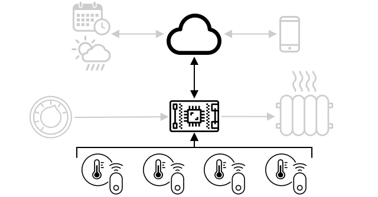
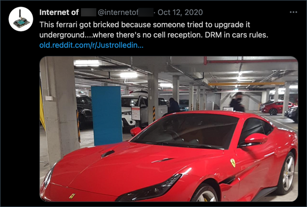

<!--
CO_OP_TRANSLATOR_METADATA:
{
  "original_hash": "71b5040e0b3472f1c0949c9b55f224c0",
  "translation_date": "2025-08-24T23:01:27+00:00",
  "source_file": "1-getting-started/lessons/4-connect-internet/README.md",
  "language_code": "zh"
}
-->
# 将设备连接到互联网


> 手绘笔记由 [Nitya Narasimhan](https://github.com/nitya) 提供。点击图片查看更大版本。

本课是 [Microsoft Reactor](https://developer.microsoft.com/reactor/?WT.mc_id=academic-17441-jabenn) 的 [Hello IoT 系列](https://youtube.com/playlist?list=PLmsFUfdnGr3xRts0TIwyaHyQuHaNQcb6-) 的一部分。课程分为两部分：一个小时的课程视频，以及一个小时的答疑视频，深入探讨课程内容并回答问题。

[](https://youtu.be/O4dd172mZhs)

[](https://youtu.be/j-cVCzRDE2Q)

> 🎥 点击上方图片观看视频

## 课前测验

[课前测验](https://black-meadow-040d15503.1.azurestaticapps.net/quiz/7)

## 简介

IoT 中的 **I** 代表 **Internet**（互联网）——云连接和服务使 IoT 设备的许多功能得以实现，例如从连接到设备的传感器收集数据，或发送消息控制执行器。IoT 设备通常使用标准通信协议连接到单一的云 IoT 服务，而该服务则连接到 IoT 应用的其他部分，例如 AI 服务用于智能决策，或用于控制和报告的 Web 应用。

> 🎓 从传感器收集并发送到云的数据称为遥测数据。

IoT 设备可以接收来自云的消息。这些消息通常包含命令——即指示设备执行某些操作的指令，可以是内部操作（如重启或更新固件），也可以是使用执行器（如打开灯）。

本课将介绍 IoT 设备连接到云时可以使用的一些通信协议，以及它们可能发送或接收的数据类型。您还将亲自动手实践，将互联网控制功能添加到您的夜灯中，并将 LED 控制逻辑移至本地运行的“服务器”代码。

在本课中，我们将学习：

* [通信协议](../../../../../1-getting-started/lessons/4-connect-internet)
* [消息队列遥测传输 (MQTT)](../../../../../1-getting-started/lessons/4-connect-internet)
* [遥测数据](../../../../../1-getting-started/lessons/4-connect-internet)
* [命令](../../../../../1-getting-started/lessons/4-connect-internet)

## 通信协议

IoT 设备与互联网通信时有许多流行的通信协议。最流行的协议基于通过某种代理进行发布/订阅消息传递。IoT 设备连接到代理并发布遥测数据，同时订阅命令。云服务也连接到代理，订阅所有遥测消息，并发布命令给特定设备或设备组。


MQTT 是 IoT 设备最流行的通信协议之一，本课将重点介绍它。其他协议包括 AMQP 和 HTTP/HTTPS。

## 消息队列遥测传输 (MQTT)

[MQTT](http://mqtt.org) 是一种轻量级、开放标准的消息传递协议，可在设备之间发送消息。它最初于 1999 年设计用于监控石油管道，15 年后由 IBM 发布为开放标准。

MQTT 有一个单一的代理和多个客户端。所有客户端都连接到代理，代理根据需要将消息路由到相关客户端。消息通过命名主题进行路由，而不是直接发送到单个客户端。客户端可以发布到某个主题，订阅该主题的任何客户端都会收到消息。


✅ 做一些研究。如果您有大量 IoT 设备，如何确保您的 MQTT 代理能够处理所有消息？

### 将 IoT 设备连接到 MQTT

为夜灯添加互联网控制的第一步是将其连接到 MQTT 代理。

#### 任务

将设备连接到 MQTT 代理。

在本课的这一部分，您将把 IoT 夜灯连接到互联网，以便远程控制它。在本课的后续部分，您的 IoT 设备将通过 MQTT 将光线强度的遥测消息发送到公共 MQTT 代理，您将编写一些服务器代码来接收这些消息。该代码将检查光线强度，并发送命令消息回设备，指示它打开或关闭 LED。

这种设置的实际应用场景可能是从多个光传感器收集数据后再决定是否打开灯光，例如在有大量灯光的场所（如体育场）。这样可以避免仅因一个传感器被云层或鸟遮挡而打开灯光，而其他传感器检测到足够的光线。

✅ 还有哪些情况需要评估多个传感器的数据后再发送命令？

为了简化本次作业中设置 MQTT 代理的复杂性，您可以使用运行 [Eclipse Mosquitto](https://www.mosquitto.org) 的公共测试服务器，这是一个开源的 MQTT 代理。此测试代理可通过 [test.mosquitto.org](https://test.mosquitto.org) 公开访问，无需设置账户，是测试 MQTT 客户端和服务器的绝佳工具。

> 💁 此测试代理是公开的且不安全。任何人都可以监听您发布的内容，因此不应用于需要保密的数据。


按照以下相关步骤将设备连接到 MQTT 代理：

* [Arduino - Wio Terminal](wio-terminal-mqtt.md)
* [单板计算机 - Raspberry Pi/虚拟 IoT 设备](single-board-computer-mqtt.md)

### 深入了解 MQTT

主题可以有层级结构，客户端可以使用通配符订阅不同层级。例如，您可以将温度遥测消息发送到 `/telemetry/temperature` 主题，将湿度消息发送到 `/telemetry/humidity` 主题，然后在云应用中订阅 `/telemetry/*` 主题以接收温度和湿度的遥测消息。

消息可以设置服务质量 (QoS)，以确定消息接收的保证级别。

* 最多一次 - 消息仅发送一次，客户端和代理不采取额外步骤确认交付（即发出后不管）。
* 至少一次 - 发送方会多次重试发送消息，直到收到确认（即确认交付）。
* 仅一次 - 发送方和接收方进行两级握手，以确保消息仅接收一次（即保证交付）。

✅ 哪些情况下需要保证交付的消息，而不是发出后不管的消息？

尽管 MQTT 的名称中有“消息队列”（Message Queueing），但它实际上并不支持消息队列。这意味着如果客户端断开连接然后重新连接，它不会接收到断开期间发送的消息，除非这些消息已经通过 QoS 过程开始处理。消息可以设置保留标志。如果设置了该标志，MQTT 代理会存储该主题上最后发送的消息，并将其发送给后来订阅该主题的客户端。这样，客户端总能获得最新消息。

MQTT 还支持保持连接功能，在消息间隔较长时检查连接是否仍然有效。

> 🦟 [Eclipse Foundation 的 Mosquitto](https://mosquitto.org) 提供了一个免费的 MQTT 代理，您可以自己运行以实验 MQTT，还提供了一个公共 MQTT 代理供您测试代码，地址为 [test.mosquitto.org](https://test.mosquitto.org)。

MQTT 连接可以是公开和开放的，也可以通过用户名和密码或证书进行加密和安全保护。

> 💁 MQTT 通过 TCP/IP 通信，与 HTTP 使用相同的底层网络协议，但端口不同。您还可以通过 WebSocket 使用 MQTT，与运行在浏览器中的 Web 应用通信，或在防火墙或其他网络规则阻止标准 MQTT 连接的情况下使用。

## 遥测数据

“遥测”一词源于希腊语，意为远程测量。遥测是从传感器收集数据并将其发送到云的过程。

> 💁 最早的遥测设备之一于 1874 年在法国发明，它通过物理电线将实时天气和雪深数据从勃朗峰发送到巴黎，当时尚未有无线技术。

让我们回顾一下第 1 课中的智能恒温器示例。



恒温器有温度传感器用于收集遥测数据。它可能内置一个温度传感器，并可能通过无线协议（如 [蓝牙低功耗](https://wikipedia.org/wiki/Bluetooth_Low_Energy)）连接到多个外部温度传感器。

它发送的遥测数据示例如下：

| 名称 | 值 | 描述 |
| ---- | ----- | ----------- |
| `thermostat_temperature` | 18°C | 恒温器内置温度传感器测量的温度 |
| `livingroom_temperature` | 19°C | 一个远程温度传感器测量的温度，该传感器被命名为 `livingroom` 以标识它所在的房间 |
| `bedroom_temperature` | 21°C | 一个远程温度传感器测量的温度，该传感器被命名为 `bedroom` 以标识它所在的房间 |

云服务可以使用这些遥测数据来决定发送哪些命令以控制加热。

### 从 IoT 设备发送遥测数据

为夜灯添加互联网控制的下一步是将光线强度的遥测数据发送到 MQTT 代理的遥测主题。

#### 任务 - 从 IoT 设备发送遥测数据

将光线强度的遥测数据发送到 MQTT 代理。

数据以 JSON 格式编码——JSON 是 JavaScript 对象表示法的缩写，是一种使用键值对以文本形式编码数据的标准。

✅ 如果您之前没有接触过 JSON，可以在 [JSON.org 文档](https://www.json.org/) 中了解更多信息。

按照以下相关步骤从设备发送遥测数据到 MQTT 代理：

* [Arduino - Wio Terminal](wio-terminal-telemetry.md)
* [单板计算机 - Raspberry Pi/虚拟 IoT 设备](single-board-computer-telemetry.md)

### 从 MQTT 代理接收遥测数据

发送遥测数据的意义在于有接收端来监听它。光线强度的遥测数据需要有程序监听并处理这些数据。这个“服务器”代码是您将在更大的 IoT 应用中部署到云服务的代码，但在这里，您将本地运行该代码（或直接在您的 Pi 上运行）。服务器代码由一个 Python 应用组成，它通过 MQTT 监听光线强度的遥测消息。在本课的后续部分，您将让它回复命令消息，指示 LED 开启或关闭。

✅ 做一些研究：如果没有监听器，MQTT 消息会发生什么？

#### 安装 Python 和 VS Code

如果您本地没有安装 Python 和 VS Code，您需要安装它们以编写服务器代码。如果您使用虚拟 IoT 设备或在 Raspberry Pi 上工作，可以跳过此步骤，因为您应该已经安装并配置了这些工具。

##### 任务 - 安装 Python 和 VS Code

安装 Python 和 VS Code。

1. 安装 Python。请参考 [Python 下载页面](https://www.python.org/downloads/) 以获取安装最新版本 Python 的说明。

2. 安装 Visual Studio Code (VS Code)。这是您将用来编写 Python 虚拟设备代码的编辑器。请参考 [VS Code 文档](https://code.visualstudio.com?WT.mc_id=academic-17441-jabenn) 以获取安装 VS Code 的说明。
💁 如果你有自己喜欢的工具，可以自由使用任何 Python IDE 或编辑器来完成这些课程，但课程中的指示将基于使用 VS Code。
1. 安装 VS Code 的 Pylance 扩展。这是一个为 VS Code 提供 Python 语言支持的扩展。请参考 [Pylance 扩展文档](https://marketplace.visualstudio.com/items?WT.mc_id=academic-17441-jabenn&itemName=ms-python.vscode-pylance) 了解如何在 VS Code 中安装此扩展。

#### 配置 Python 虚拟环境

Python 的一个强大功能是可以安装 [pip 包](https://pypi.org)——这些是由其他人编写并发布到互联网的代码包。你可以通过一个命令将 pip 包安装到你的电脑上，然后在代码中使用该包。接下来你将使用 pip 安装一个用于通过 MQTT 通信的包。

默认情况下，当你安装一个包时，它会在你的电脑上全局可用，这可能会导致包版本冲突的问题——例如，一个应用程序依赖于某个版本的包，而另一个应用程序安装了新版本后可能会导致前一个应用程序无法正常运行。为了解决这个问题，你可以使用 [Python 虚拟环境](https://docs.python.org/3/library/venv.html)，它本质上是一个专用文件夹中的 Python 副本，当你安装 pip 包时，它们只会安装到该文件夹中。

##### 任务 - 配置 Python 虚拟环境

配置一个 Python 虚拟环境并安装 MQTT 的 pip 包。

1. 在终端或命令行中，运行以下命令，在你选择的位置创建并导航到一个新目录：

    ```sh
    mkdir nightlight-server
    cd nightlight-server
    ```

1. 现在运行以下命令，在 `.venv` 文件夹中创建一个虚拟环境：

    ```sh
    python3 -m venv .venv
    ```

    > 💁 你需要显式调用 `python3` 来创建虚拟环境，以防你的系统同时安装了 Python 2 和 Python 3（最新版本）。如果安装了 Python 2，调用 `python` 会使用 Python 2 而不是 Python 3。

1. 激活虚拟环境：

    * 在 Windows 上：
        * 如果你使用的是命令提示符或通过 Windows Terminal 使用命令提示符，请运行：

            ```cmd
            .venv\Scripts\activate.bat
            ```

        * 如果你使用的是 PowerShell，请运行：

            ```powershell
            .\.venv\Scripts\Activate.ps1
            ```

    * 在 macOS 或 Linux 上，请运行：

        ```cmd
        source ./.venv/bin/activate
        ```

    > 💁 这些命令应该在你运行创建虚拟环境的命令的同一位置运行。你永远不需要导航到 `.venv` 文件夹中，你应该始终从创建虚拟环境时所在的文件夹运行激活命令以及安装包或运行代码的命令。

1. 激活虚拟环境后，默认的 `python` 命令将运行用于创建虚拟环境的 Python 版本。运行以下命令查看版本：

    ```sh
    python --version
    ```

    输出将类似于以下内容：

    ```output
    (.venv) ➜  nightlight-server python --version
    Python 3.9.1
    ```

    > 💁 你的 Python 版本可能不同——只要是 3.6 或更高版本即可。如果不是，请删除此文件夹，安装更新版本的 Python，然后重试。

1. 运行以下命令安装 [Paho-MQTT](https://pypi.org/project/paho-mqtt/) 的 pip 包，这是一个流行的 MQTT 库。

    ```sh
    pip install paho-mqtt
    ```

    此 pip 包将仅安装在虚拟环境中，无法在虚拟环境之外使用。

#### 编写服务器代码

现在可以用 Python 编写服务器代码。

##### 任务 - 编写服务器代码

编写服务器代码。

1. 在虚拟环境中，从终端或命令行运行以下命令创建一个名为 `app.py` 的 Python 文件：

    * 在 Windows 上运行：

        ```cmd
        type nul > app.py
        ```

    * 在 macOS 或 Linux 上运行：

        ```cmd
        touch app.py
        ```

1. 在 VS Code 中打开当前文件夹：

    ```sh
    code .
    ```

1. 当 VS Code 启动时，它会激活 Python 虚拟环境。这将在底部状态栏中显示：

    

1. 如果 VS Code 启动时终端已经运行，它不会在终端中激活虚拟环境。最简单的方法是使用 **终止活动终端实例** 按钮关闭终端：

    

1. 通过选择 *终端 -> 新终端* 或按 `` CTRL+` `` 启动一个新的 VS Code 终端。新终端将加载虚拟环境，激活命令会显示在终端中。虚拟环境的名称（`.venv`）也会显示在提示符中：

    ```output
    ➜  nightlight-server source .venv/bin/activate
    (.venv) ➜  nightlight 
    ```

1. 从 VS Code 的资源管理器中打开 `app.py` 文件并添加以下代码：

    ```python
    import json
    import time
    
    import paho.mqtt.client as mqtt
    
    id = '<ID>'
    
    client_telemetry_topic = id + '/telemetry'
    client_name = id + 'nightlight_server'
    
    mqtt_client = mqtt.Client(client_name)
    mqtt_client.connect('test.mosquitto.org')
    
    mqtt_client.loop_start()
    
    def handle_telemetry(client, userdata, message):
        payload = json.loads(message.payload.decode())
        print("Message received:", payload)
    
    mqtt_client.subscribe(client_telemetry_topic)
    mqtt_client.on_message = handle_telemetry
    
    while True:
        time.sleep(2)
    ```

    将第 6 行中的 `<ID>` 替换为你创建设备代码时使用的唯一 ID。

    ⚠️ 这 **必须** 是你在设备上使用的相同 ID，否则服务器代码将无法订阅或发布到正确的主题。

    此代码创建了一个具有唯一名称的 MQTT 客户端，并连接到 *test.mosquitto.org* 代理。然后它启动一个处理循环，在后台线程中运行，监听任何订阅主题上的消息。

    客户端随后订阅遥测主题上的消息，并定义一个函数，当接收到消息时调用该函数。当接收到遥测消息时，将调用 `handle_telemetry` 函数，将接收到的消息打印到控制台。

    最后，一个无限循环保持应用程序运行。MQTT 客户端在后台线程中监听消息，并在主应用程序运行时始终运行。

1. 从 VS Code 终端运行以下命令以运行你的 Python 应用程序：

    ```sh
    python app.py
    ```

    应用程序将开始监听来自 IoT 设备的消息。

1. 确保你的设备正在运行并发送遥测消息。调整物理或虚拟设备检测到的光线水平。接收到的消息将打印到终端。

    ```output
    (.venv) ➜  nightlight-server python app.py
    Message received: {'light': 0}
    Message received: {'light': 400}
    ```

    nightlight 虚拟环境中的 app.py 文件必须运行，nightlight-server 虚拟环境中的 app.py 文件才能接收发送的消息。

> 💁 你可以在 [code-server/server](../../../../../1-getting-started/lessons/4-connect-internet/code-server/server) 文件夹中找到此代码。

### 遥测数据应该多久发送一次？

关于遥测数据的一个重要考虑是应该多久测量并发送一次数据？答案是——视情况而定。如果频繁测量，你可以更快地响应测量变化，但会消耗更多电量、带宽，生成更多数据，并需要更多云资源来处理。你需要测量得足够频繁，但不能过于频繁。

对于恒温器，每隔几分钟测量一次可能已经足够，因为温度变化并不频繁。如果你一天只测量一次，那么可能会在阳光明媚的白天因夜间温度而加热房屋，而如果你每秒测量一次，你将生成数千个不必要的重复温度测量，这会占用用户的互联网速度和带宽（对于有限带宽计划的用户来说是个问题），消耗更多电量，这对像远程传感器这样的电池供电设备来说可能是个问题，并增加提供商处理和存储云计算资源的成本。

如果你在监控工厂中某台机器的数据，而如果它发生故障可能会造成灾难性损失和数百万美元的收入损失，那么可能需要每秒多次测量。浪费带宽总比错过表明机器需要停止并修复的遥测数据要好。

> 💁 在这种情况下，你可能会考虑使用边缘设备先处理遥测数据，以减少对互联网的依赖。

### 连接丢失

互联网连接可能不可靠，断网是常见现象。在这种情况下，IoT 设备应该怎么做——是丢失数据，还是存储数据直到连接恢复？答案同样是视情况而定。

对于恒温器，数据可以在新的温度测量完成后立即丢弃。加热系统不关心 20 分钟前的温度是 20.5°C，如果现在的温度是 19°C，那么当前的温度决定了加热是否应该开启或关闭。

对于机器，你可能希望保留数据，尤其是如果数据用于趋势分析。有些机器学习模型可以通过查看定义时间段（例如过去一小时）的数据流并发现异常数据来检测异常。这通常用于预测性维护，寻找可能即将发生故障的迹象，以便在故障发生前进行修复或更换。你可能希望发送机器的每一条遥测数据，以便处理异常检测，因此一旦 IoT 设备可以重新连接，它将发送断网期间生成的所有遥测数据。

IoT 设备设计者还应该考虑 IoT 设备在断网或因位置导致信号丢失时是否可以使用。智能恒温器应该能够在无法将遥测数据发送到云端时做出一些有限的决策来控制加热。

[](https://twitter.com/internetofshit/status/1315736960082808832)

对于 MQTT 来处理连接丢失，设备和服务器代码需要负责确保消息传递的可靠性，例如要求所有发送的消息都通过回复主题上的额外消息进行回复，如果没有，则手动排队以便稍后重播。

## 命令

命令是从云端发送到设备的消息，指示设备执行某些操作。大多数情况下，这涉及通过执行器提供某种输出，但也可以是设备本身的指令，例如重启或收集额外的遥测数据并将其作为命令的响应返回。


恒温器可以从云端接收到打开加热的命令。根据所有传感器的遥测数据，如果云服务决定加热应该开启，它会发送相关命令。

### 向 MQTT 代理发送命令

我们下一步的互联网控制夜灯是让服务器代码根据检测到的光线水平向 IoT 设备发送命令以控制灯光。

1. 在 VS Code 中打开服务器代码

1. 在声明 `client_telemetry_topic` 后添加以下行以定义发送命令的主题：

    ```python
    server_command_topic = id + '/commands'
    ```

1. 在 `handle_telemetry` 函数末尾添加以下代码：

    ```python
    command = { 'led_on' : payload['light'] < 300 }
    print("Sending message:", command)
    
    client.publish(server_command_topic, json.dumps(command))
    ```

    这会向命令主题发送一个 JSON 消息，其中 `led_on` 的值根据光线是否小于 300 设置为 true 或 false。如果光线小于 300，则发送 true 指示设备打开 LED。

1. 像之前一样运行代码

1. 调整物理或虚拟设备检测到的光线水平。接收到的消息和发送的命令将写入终端：

    ```output
    (.venv) ➜  nightlight-server python app.py
    Message received: {'light': 0}
    Sending message: {'led_on': True}
    Message received: {'light': 400}
    Sending message: {'led_on': False}
    ```

> 💁 遥测数据和命令分别在单个主题上发送。这意味着来自多个设备的遥测数据将出现在同一个遥测主题上，而发送给多个设备的命令将出现在同一个命令主题上。如果你想向特定设备发送命令，可以使用多个主题，以唯一设备 ID 命名，例如 `/commands/device1`，`/commands/device2`。这样设备可以只监听专门为该设备发送的消息。

> 💁 你可以在 [code-commands/server](../../../../../1-getting-started/lessons/4-connect-internet/code-commands/server) 文件夹中找到此代码。

### 在 IoT 设备上处理命令

现在服务器已经开始发送命令，你可以在 IoT 设备上添加代码来处理这些命令并控制 LED。

按照以下相关步骤从 MQTT 代理监听命令：

* [Arduino - Wio Terminal](wio-terminal-commands.md)
* [单板计算机 - Raspberry Pi/虚拟 IoT 设备](single-board-computer-commands.md)

一旦代码编写并运行，尝试改变光线水平。观察服务器和设备的输出，并在改变光线水平时观察 LED 的变化。

### 连接丢失

如果云服务需要向离线的 IoT 设备发送命令，它应该怎么做？答案同样是视情况而定。

如果最新命令覆盖了较早的命令，那么较早的命令可能可以忽略。如果云服务发送了一个打开加热的命令，然后发送了一个关闭加热的命令，那么可以忽略打开命令而不重新发送。

如果命令需要按顺序处理，例如移动机器人手臂向上，然后关闭抓手，那么它们需要在连接恢复后按顺序发送。

✅ 设备或服务器代码如何确保命令始终按顺序发送和处理（如果需要）？

---

## 🚀 挑战

在过去三节课的挑战中，列出你家里、学校或工作场所中的尽可能多的 IoT 设备，并判断它们是基于微控制器还是单板计算机，或者两者的混合体，并思考它们使用了哪些传感器和执行器。
对于这些设备，思考它们可能发送或接收什么消息。它们发送什么遥测数据？可能接收什么消息或命令？你认为它们安全吗？

## 课后测验

[课后测验](https://black-meadow-040d15503.1.azurestaticapps.net/quiz/8)

## 复习与自学

阅读更多关于MQTT的信息，请访问 [MQTT维基百科页面](https://wikipedia.org/wiki/MQTT)。

尝试自己运行一个MQTT代理，使用 [Mosquitto](https://www.mosquitto.org)，并从你的物联网设备和服务器代码连接到它。

> 💁 提示 - 默认情况下，Mosquitto不允许匿名连接（即没有用户名和密码的连接），也不允许来自运行它的计算机外部的连接。
> 你可以通过一个 [`mosquitto.conf` 配置文件](https://www.mosquitto.org/man/mosquitto-conf-5.html)解决这个问题，内容如下：
>
> ```sh
> listener 1883 0.0.0.0
> allow_anonymous true
> ```

## 作业

[比较和对比MQTT与其他通信协议](assignment.md)

**免责声明**：  
本文档使用AI翻译服务 [Co-op Translator](https://github.com/Azure/co-op-translator) 进行翻译。尽管我们努力确保翻译的准确性，但请注意，自动翻译可能包含错误或不准确之处。应以原始语言的文档作为权威来源。对于关键信息，建议使用专业人工翻译。我们对因使用此翻译而引起的任何误解或误读不承担责任。