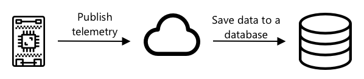

<!--
CO_OP_TRANSLATOR_METADATA:
{
  "original_hash": "d105b44deae539165855c976dcdeca99",
  "translation_date": "2025-08-24T21:57:31+00:00",
  "source_file": "2-farm/lessons/1-predict-plant-growth/README.md",
  "language_code": "zh"
}
-->
## 使用物联网预测植物生长


> 手绘图由 [Nitya Narasimhan](https://github.com/nitya) 提供。点击图片查看更大版本。

## 课前测验

[课前测验](https://black-meadow-040d15503.1.azurestaticapps.net/quiz/9)

## 简介

植物需要一些基本条件才能生长——水、二氧化碳、养分、光和热。在本课中，您将学习如何通过测量空气温度来计算植物的生长和成熟速度。

本课内容包括：

* [数字农业](../../../../../2-farm/lessons/1-predict-plant-growth)
* [为什么温度对农业很重要？](../../../../../2-farm/lessons/1-predict-plant-growth)
* [测量环境温度](../../../../../2-farm/lessons/1-predict-plant-growth)
* [生长度日 (GDD)](../../../../../2-farm/lessons/1-predict-plant-growth)
* [使用温度传感器数据计算 GDD](../../../../../2-farm/lessons/1-predict-plant-growth)

## 数字农业

数字农业正在改变我们的耕作方式，通过工具收集、存储和分析农业数据。我们目前正处于世界经济论坛所描述的“第四次工业革命”时期，而数字农业的兴起被称为“第四次农业革命”或“农业 4.0”。

> 🎓 数字农业这一术语还包括整个“农业价值链”，即从农场到餐桌的整个过程。这包括在食品运输和加工过程中跟踪产品质量、仓储和电子商务系统，甚至包括拖拉机租赁应用程序！

这些变化使农民能够提高产量，减少化肥和农药的使用，并更高效地利用水资源。虽然这些技术主要应用于较富裕的国家，但传感器和其他设备的价格正在逐渐下降，使其在发展中国家也变得更加可负担。

数字农业支持的一些技术包括：

* 温度测量——通过测量温度，农民可以预测植物的生长和成熟。
* 自动灌溉——通过测量土壤湿度并在土壤过于干燥时启动灌溉系统，而不是定时灌溉。定时灌溉可能导致在炎热干燥的天气下作物缺水，或在下雨时过度灌溉。通过仅在土壤需要时进行灌溉，农民可以优化水资源的使用。
* 害虫控制——农民可以使用自动机器人或无人机上的摄像头检查害虫，然后仅在需要的地方喷洒农药，从而减少农药的使用量，并减少农药流入当地水源的风险。

✅ 做一些研究。还有哪些技术可以用来提高农业产量？

> 🎓 “精准农业”这一术语用于定义基于每块田地甚至田地的部分进行观察、测量和响应。这包括测量水分、养分和害虫水平，并准确地做出反应，例如仅对田地的一小部分进行灌溉。

## 为什么温度对农业很重要？

在学习植物时，大多数学生都会了解到水、光、二氧化碳和养分的重要性。植物还需要温暖才能生长——这就是为什么植物会在春天随着气温升高而开花，为什么雪花莲或水仙花会因短暂的暖和天气而提前发芽，以及为什么温室和暖房能促进植物生长。

> 🎓 温室和暖房的功能类似，但有一个重要区别。暖房通过人工加热使农民能够更精确地控制温度，而温室依赖太阳提供热量，通常只能通过窗户或其他开口来调节温度。

植物有一个基础或最低温度、最佳温度和最高温度，这些都基于每日平均温度。

* 基础温度——这是植物生长所需的最低每日平均温度。
* 最佳温度——这是植物生长最快的最佳每日平均温度。
* 最高温度——这是植物能够承受的最高温度。超过这个温度，植物会停止生长以节约水分并维持生命。

> 💁 这些是平均温度，是日间和夜间温度的平均值。植物还需要昼夜不同的温度，以便更高效地进行光合作用并在夜间节约能量。

每种植物的基础、最佳和最高温度值都不同。这就是为什么有些植物在热带国家生长良好，而另一些植物在寒冷国家更适合。

✅ 做一些研究。对于您花园、学校或当地公园中的植物，看看是否能找到它们的基础温度。


上图显示了一个生长率与温度的示例图表。在基础温度以下没有生长。生长率在达到最佳温度之前逐渐增加，然后在达到峰值后下降。在最高温度时，生长停止。

这种图表的形状因植物种类而异。有些植物在最佳温度以上的下降更陡峭，有些从基础到最佳的增长更缓慢。

> 💁 农民要想获得最佳生长效果，需要了解植物的三个温度值，并理解它们的图表形状。

如果农民能够控制温度，例如在商业暖房中，他们就可以为植物优化环境。例如，一个商业暖房种植番茄时，白天的温度会设置在约25°C，夜间则设置在约20°C，以获得最快的生长速度。

> 🍅 将这些温度与人工光源、化肥和控制的二氧化碳水平结合起来，商业种植者可以全年种植和收获。

## 测量环境温度

温度传感器可以与物联网设备结合使用来测量环境温度。

### 任务 - 测量温度

按照相关指南使用您的物联网设备监测温度：

* [Arduino - Wio Terminal](wio-terminal-temp.md)
* [单板计算机 - Raspberry Pi](pi-temp.md)
* [单板计算机 - 虚拟设备](virtual-device-temp.md)

## 生长度日 (GDD)

生长度日（也称为生长度单位）是一种基于温度来衡量植物生长的方法。假设植物有足够的水分、养分和二氧化碳，温度决定了生长速度。

生长度日（GDD）每天计算为当天的平均温度（以摄氏度为单位）减去植物的基础温度。每种植物需要一定数量的 GDD 才能生长、开花或成熟并产出作物。每天的 GDD 越多，植物生长得越快。

> 🇺🇸 对于美国人来说，生长度日也可以用华氏度计算。5 GDD（以摄氏度计算）相当于9 GDD（以华氏度计算）。

完整的 GDD 公式稍显复杂，但通常使用一个简化的公式作为良好的近似值：


* **GDD** - 这是生长度日的数量
* **T max** - 这是当天的最高温度（摄氏度）
* **T min** - 这是当天的最低温度（摄氏度）
* **T base** - 这是植物的基础温度（摄氏度）

> 💁 有些公式会处理 T max 超过 30°C 或 T min 低于 T base 的情况，但我们暂时忽略这些。

### 示例 - 玉米 🌽

根据品种不同，玉米（或称为苞谷）需要 800 到 2,700 GDD 才能成熟，其基础温度为 10°C。

在基础温度以上的第一天，测得以下温度：

| 测量值   | 温度 °C |
| :------- | :-----: |
| 最高温度 | 16      |
| 最低温度 | 12      |

将这些数值代入公式：

* T max = 16
* T min = 12
* T base = 10

计算结果为：


当天玉米获得了 4 GDD。假设一种需要 800 GDD 才能成熟的玉米品种，还需要 796 GDD 才能达到成熟。

✅ 做一些研究。对于您花园、学校或当地公园中的植物，看看是否能找到它们达到成熟或产出作物所需的 GDD 数量。

## 使用温度传感器数据计算 GDD

植物的生长并不是固定日期的——例如，您不能种下一颗种子并准确知道它会在 100 天后结果。农民通常会大致估算植物的生长时间，然后每天检查作物是否成熟。

在大型农场，这会对劳动力产生巨大影响，并且农民可能会错过意外提前成熟的作物。通过测量温度，农民可以计算植物获得的 GDD，从而只需在接近预期成熟时检查作物。

通过使用物联网设备收集温度数据，农民可以在植物接近成熟时自动收到通知。一个典型的架构是物联网设备测量温度，然后通过类似 MQTT 的方式将这些遥测数据发布到互联网。服务器代码监听这些数据并将其保存到某处，例如数据库。这意味着数据可以稍后进行分析，例如夜间作业计算当天的 GDD，总结每种作物到目前为止的 GDD，并在植物接近成熟时发出警报。



服务器代码还可以增强数据，例如添加额外信息。物联网设备可以发布一个标识符来指示设备的身份，服务器代码可以使用此标识符查找设备的位置以及它正在监测的作物。它还可以添加基本数据，例如当前时间，因为某些物联网设备没有必要的硬件来准确跟踪时间，或者需要额外的代码通过互联网读取当前时间。

✅ 您认为为什么不同的田地可能会有不同的温度？

### 任务 - 发布温度信息

按照相关指南通过您的物联网设备使用 MQTT 发布温度数据，以便稍后进行分析：

* [Arduino - Wio Terminal](wio-terminal-temp-publish.md)
* [单板计算机 - Raspberry Pi/虚拟物联网设备](single-board-computer-temp-publish.md)

### 任务 - 捕获并存储温度信息

一旦物联网设备开始发布遥测数据，服务器代码可以编写订阅这些数据并存储它们。与将数据保存到数据库不同，服务器代码会将数据保存到逗号分隔值 (CSV) 文件中。CSV 文件以文本形式存储数据，每行记录一个值，每个值之间用逗号分隔。它是一种方便、可读性强且广泛支持的文件存储方式。

CSV 文件将有两列——*日期* 和 *温度*。*日期* 列设置为服务器接收到消息的当前日期和时间，*温度* 列来自遥测消息。

1. 重复第 4 课中的步骤，创建订阅遥测数据的服务器代码。您无需添加发布命令的代码。

    这些步骤包括：

    * 配置并激活 Python 虚拟环境

    * 安装 paho-mqtt pip 包

    * 编写代码以监听发布到遥测主题的 MQTT 消息

      > ⚠️ 如果需要，可以参考 [第 4 课中创建 Python 应用程序以接收遥测数据的说明](../../../1-getting-started/lessons/4-connect-internet/README.md#receive-telemetry-from-the-mqtt-broker)。

    将此项目的文件夹命名为 `temperature-sensor-server`。

1. 确保 `client_name` 反映此项目：

    ```cpp
    client_name = id + 'temperature_sensor_server'
    ```

1. 在文件顶部的现有导入代码下添加以下导入：

    ```python
    from os import path
    import csv
    from datetime import datetime
    ```

    这将导入一个用于读取文件的库、一个与 CSV 文件交互的库以及一个帮助处理日期和时间的库。

1. 在 `handle_telemetry` 函数之前添加以下代码：

    ```python
    temperature_file_name = 'temperature.csv'
    fieldnames = ['date', 'temperature']
    
    if not path.exists(temperature_file_name):
        with open(temperature_file_name, mode='w') as csv_file:
            writer = csv.DictWriter(csv_file, fieldnames=fieldnames)
            writer.writeheader()
    ```

    此代码声明了一些常量，用于指定要写入的文件名和 CSV 文件的列标题名称。CSV 文件的第一行通常包含用逗号分隔的列标题。

    然后代码检查 CSV 文件是否已经存在。如果不存在，则创建一个包含列标题的第一行。

1. 在 `handle_telemetry` 函数末尾添加以下代码：

    ```python
    with open(temperature_file_name, mode='a') as temperature_file:        
        temperature_writer = csv.DictWriter(temperature_file, fieldnames=fieldnames)
        temperature_writer.writerow({'date' : datetime.now().astimezone().replace(microsecond=0).isoformat(), 'temperature' : payload['temperature']})
    ```
此代码打开CSV文件，然后在末尾添加一行新数据。新行包含当前日期和时间（格式为易于阅读的形式），以及从IoT设备接收到的温度数据。数据以[ISO 8601格式](https://wikipedia.org/wiki/ISO_8601)存储，包含时区信息，但不包括微秒。

1. 像之前一样运行此代码，确保您的IoT设备正在发送数据。一个名为`temperature.csv`的CSV文件将在同一文件夹中创建。如果查看该文件，您会看到日期/时间和温度测量值：

    ```output
    date,temperature
    2021-04-19T17:21:36-07:00,25
    2021-04-19T17:31:36-07:00,24
    2021-04-19T17:41:36-07:00,25
    ```

1. 运行此代码一段时间以捕获数据。理想情况下，您应该运行一整天以收集足够的数据用于GDD计算。

    
> 💁 如果您使用的是虚拟IoT设备，请勾选随机选项框并设置一个范围，以避免每次返回的温度值都相同。
     

    > 💁 如果您想运行一整天，那么您需要确保运行服务器代码的计算机不会进入睡眠状态，可以通过更改电源设置或运行类似[这个保持系统活跃的Python脚本](https://github.com/jaqsparow/keep-system-active)来实现。
    
> 💁 您可以在[code-server/temperature-sensor-server](../../../../../2-farm/lessons/1-predict-plant-growth/code-server/temperature-sensor-server)文件夹中找到此代码。

### 任务 - 使用存储的数据计算GDD

一旦服务器捕获了温度数据，就可以计算植物的GDD。

手动执行此操作的步骤如下：

1. 找到植物的基准温度。例如，对于草莓，基准温度是10°C。

1. 从`temperature.csv`中找到当天的最高和最低温度。

1. 使用之前给出的GDD计算公式计算GDD。

例如，如果当天的最高温度是25°C，最低温度是12°C：


* 25 + 12 = 37
* 37 / 2 = 18.5
* 18.5 - 10 = 8.5

因此，草莓获得了**8.5** GDD。草莓需要大约250 GDD才能结果，所以还需要一段时间。

---

## 🚀 挑战

植物的生长不仅需要热量，还需要其他条件。还有哪些因素是必需的？

对于这些因素，寻找是否有传感器可以测量它们。是否有执行器可以控制这些水平？您会如何组合一个或多个IoT设备来优化植物生长？

## 课后测验

[课后测验](https://black-meadow-040d15503.1.azurestaticapps.net/quiz/10)

## 复习与自学

* 在[数字农业维基百科页面](https://wikipedia.org/wiki/Digital_agriculture)上阅读更多关于数字农业的内容。还可以在[精准农业维基百科页面](https://wikipedia.org/wiki/Precision_agriculture)上了解更多关于精准农业的内容。
* 完整的生长度日计算比这里给出的简化公式更复杂。阅读更多关于更复杂的公式以及如何处理低于基准温度的情况，请参阅[生长度日维基百科页面](https://wikipedia.org/wiki/Growing_degree-day)。
* 如果我们仍然使用相同的耕作方法，未来可能会面临粮食短缺问题。了解更多关于高科技农业技术的信息，请观看这个[未来高科技农场视频](https://www.youtube.com/watch?v=KIEOuKD9KX8)。

## 作业

[使用Jupyter Notebook可视化GDD数据](assignment.md)

**免责声明**：  
本文档使用AI翻译服务 [Co-op Translator](https://github.com/Azure/co-op-translator) 进行翻译。尽管我们努力确保翻译的准确性，但请注意，自动翻译可能包含错误或不准确之处。应以原文档的原始语言版本为权威来源。对于关键信息，建议使用专业人工翻译。我们对因使用此翻译而引起的任何误解或误读不承担责任。