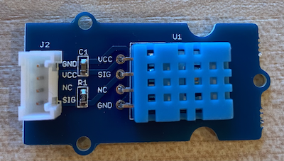

<!--
CO_OP_TRANSLATOR_METADATA:
{
  "original_hash": "7678f7c67b97ee52d5727496dcd7d346",
  "translation_date": "2025-08-24T22:07:55+00:00",
  "source_file": "2-farm/lessons/1-predict-plant-growth/pi-temp.md",
  "language_code": "zh"
}
-->
# 测量温度 - 树莓派

在本节课程中，您将为树莓派添加一个温度传感器。

## 硬件

您将使用的传感器是 [DHT11 湿度和温度传感器](https://www.seeedstudio.com/Grove-Temperature-Humidity-Sensor-DHT11.html)，它将两个传感器集成在一个模块中。这是一款相当流行的传感器，许多市售传感器都将温度、湿度，有时还包括大气压力结合在一起。温度传感器部分是一个负温度系数（NTC）热敏电阻，这是一种电阻随温度升高而减小的热敏电阻。

这是一个数字传感器，因此它内置了一个 ADC（模数转换器），可以生成包含温度和湿度数据的数字信号，供微控制器读取。

### 连接温度传感器

Grove 温度传感器可以连接到树莓派。

#### 任务

连接温度传感器



1. 将 Grove 电缆的一端插入湿度和温度传感器上的插座。它只能以一种方式插入。

1. 在树莓派断电的情况下，将 Grove 电缆的另一端连接到安装在树莓派上的 Grove Base Hat 上标记为 **D5** 的数字插座。这个插座位于 GPIO 引脚旁边的一排插座中，从左数第二个。


## 编程温度传感器

现在可以为设备编程以使用连接的温度传感器。

### 任务

为设备编程。

1. 启动树莓派并等待其启动完成。

1. 启动 VS Code，可以直接在树莓派上运行，也可以通过 Remote SSH 扩展连接。

    > ⚠️ 如果需要，可以参考[第 1 课中设置和启动 VS Code 的说明](../../../1-getting-started/lessons/1-introduction-to-iot/pi.md)。

1. 在终端中，在 `pi` 用户的主目录下创建一个名为 `temperature-sensor` 的新文件夹。在该文件夹中创建一个名为 `app.py` 的文件：

    ```sh
    mkdir temperature-sensor
    cd temperature-sensor
    touch app.py
    ```

1. 在 VS Code 中打开这个文件夹。

1. 要使用温度和湿度传感器，需要安装一个额外的 Pip 包。在 VS Code 的终端中运行以下命令，在树莓派上安装该 Pip 包：

    ```sh
    pip3 install seeed-python-dht
    ```

1. 将以下代码添加到 `app.py` 文件中以导入所需的库：

    ```python
    import time
    from seeed_dht import DHT
    ```

    `from seeed_dht import DHT` 语句从 `seeed_dht` 模块中导入 `DHT` 传感器类，用于与 Grove 温度传感器交互。

1. 在上述代码之后添加以下代码，以创建一个管理温度传感器的类实例：

    ```python
    sensor = DHT("11", 5)
    ```

    这声明了一个 `DHT` 类的实例，用于管理**数字湿度和温度传感器**。第一个参数告诉代码使用的是 *DHT11* 传感器——您使用的库还支持该传感器的其他变体。第二个参数告诉代码传感器连接到 Grove Base Hat 的数字端口 `D5`。

    > ✅ 请记住，所有插座都有唯一的引脚编号。引脚 0、2、4 和 6 是模拟引脚，引脚 5、16、18、22、24 和 26 是数字引脚。

1. 在上述代码之后添加一个无限循环，用于轮询温度传感器的值并将其打印到控制台：

    ```python
    while True:
        _, temp = sensor.read()
        print(f'Temperature {temp}°C')
    ```

    调用 `sensor.read()` 会返回一个包含湿度和温度的元组。您只需要温度值，因此可以忽略湿度值。然后将温度值打印到控制台。

1. 在循环末尾添加一个 10 秒的小延迟，因为不需要连续检查温度水平。延迟可以减少设备的功耗。

    ```python
    time.sleep(10)
    ```

1. 在 VS Code 的终端中运行以下命令以运行您的 Python 应用程序：

    ```sh
    python3 app.py
    ```

    您应该会看到温度值输出到控制台。可以通过用手指按住传感器或使用风扇来加热传感器，观察值的变化：

    ```output
    pi@raspberrypi:~/temperature-sensor $ python3 app.py 
    Temperature 26°C
    Temperature 26°C
    Temperature 28°C
    Temperature 30°C
    Temperature 32°C
    ```

> 💁 您可以在 [code-temperature/pi](../../../../../2-farm/lessons/1-predict-plant-growth/code-temperature/pi) 文件夹中找到此代码。

😀 您的温度传感器程序运行成功！

**免责声明**：  
本文档使用AI翻译服务[Co-op Translator](https://github.com/Azure/co-op-translator)进行翻译。尽管我们努力确保翻译的准确性，但请注意，自动翻译可能包含错误或不准确之处。应以原始语言的文档作为权威来源。对于关键信息，建议使用专业人工翻译。我们对于因使用此翻译而引起的任何误解或误读不承担责任。