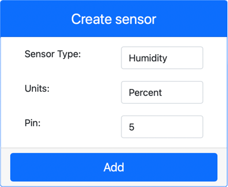

<!--
CO_OP_TRANSLATOR_METADATA:
{
  "original_hash": "70e5a428b607cd5a9a4f422c2a4df03d",
  "translation_date": "2025-08-24T22:06:19+00:00",
  "source_file": "2-farm/lessons/1-predict-plant-growth/virtual-device-temp.md",
  "language_code": "zh"
}
-->
# 测量温度 - 虚拟物联网硬件

在本节课程中，您将为虚拟物联网设备添加一个温度传感器。

## 虚拟硬件

虚拟物联网设备将使用模拟的 Grove 数字湿度和温度传感器。这使得本实验与使用带有物理 Grove DHT11 传感器的树莓派保持一致。

该传感器结合了一个**温度传感器**和一个**湿度传感器**，但在本实验中，您只需关注温度传感器部分。在物理物联网设备中，温度传感器通常是一个[热敏电阻](https://wikipedia.org/wiki/Thermistor)，通过感知电阻随温度变化而变化来测量温度。温度传感器通常是数字传感器，它会在内部将测得的电阻转换为摄氏度（或开尔文、华氏度）的温度。

### 将传感器添加到 CounterFit

要使用虚拟湿度和温度传感器，您需要将这两个传感器添加到 CounterFit 应用中。

#### 任务 - 将传感器添加到 CounterFit

将湿度和温度传感器添加到 CounterFit 应用中。

1. 在您的计算机上创建一个名为 `temperature-sensor` 的文件夹，并在其中创建一个名为 `app.py` 的单文件 Python 应用，同时创建一个 Python 虚拟环境，并添加 CounterFit 的 pip 包。

    > ⚠️ 如果需要，您可以参考[第 1 课中创建和设置 CounterFit Python 项目的说明](../../../1-getting-started/lessons/1-introduction-to-iot/virtual-device.md)。

1. 安装一个额外的 Pip 包，用于安装 DHT11 传感器的 CounterFit shim。确保您是在激活虚拟环境的终端中安装的。

    ```sh
    pip install counterfit-shims-seeed-python-dht
    ```

1. 确保 CounterFit Web 应用正在运行。

1. 创建一个湿度传感器：

    1. 在 *Sensors* 面板的 *Create sensor* 框中，点击 *Sensor type* 下拉框并选择 *Humidity*。

    1. 将 *Units* 保持为 *Percentage*。

    1. 确保 *Pin* 设置为 *5*。

    1. 点击 **Add** 按钮，在 Pin 5 上创建湿度传感器。

    

    湿度传感器将被创建并显示在传感器列表中。

    

1. 创建一个温度传感器：

    1. 在 *Sensors* 面板的 *Create sensor* 框中，点击 *Sensor type* 下拉框并选择 *Temperature*。

    1. 将 *Units* 保持为 *Celsius*。

    1. 确保 *Pin* 设置为 *6*。

    1. 点击 **Add** 按钮，在 Pin 6 上创建温度传感器。

    

    温度传感器将被创建并显示在传感器列表中。

    

## 编写温度传感器应用程序

现在可以使用 CounterFit 传感器编写温度传感器应用程序。

### 任务 - 编写温度传感器应用程序

编写温度传感器应用程序。

1. 确保在 VS Code 中打开了 `temperature-sensor` 应用。

1. 打开 `app.py` 文件。

1. 在 `app.py` 文件顶部添加以下代码，将应用程序连接到 CounterFit：

    ```python
    from counterfit_connection import CounterFitConnection
    CounterFitConnection.init('127.0.0.1', 5000)
    ```

1. 在 `app.py` 文件中添加以下代码以导入所需的库：

    ```python
    import time
    from counterfit_shims_seeed_python_dht import DHT
    ```

    `from seeed_dht import DHT` 语句导入了 `DHT` 传感器类，用于通过 `counterfit_shims_seeed_python_dht` 模块的 shim 与虚拟 Grove 温度传感器交互。

1. 在上述代码之后添加以下代码，以创建管理虚拟湿度和温度传感器的类实例：

    ```python
    sensor = DHT("11", 5)
    ```

    这声明了一个 `DHT` 类的实例，用于管理虚拟的**数字湿度和温度传感器**。第一个参数告诉代码使用的是虚拟 *DHT11* 传感器。第二个参数告诉代码传感器连接到端口 `5`。

    > 💁 CounterFit 通过连接两个传感器来模拟这个组合的湿度和温度传感器，一个湿度传感器连接到创建 `DHT` 类时给定的引脚，另一个温度传感器运行在下一个引脚上。如果湿度传感器在引脚 5 上，shim 会期望温度传感器在引脚 6 上。

1. 在上述代码之后添加一个无限循环，以轮询温度传感器的值并将其打印到控制台：

    ```python
    while True:
        _, temp = sensor.read()
        print(f'Temperature {temp}°C')
    ```

    调用 `sensor.read()` 会返回一个包含湿度和温度的元组。您只需要温度值，因此可以忽略湿度值。然后将温度值打印到控制台。

1. 在循环末尾添加一个 10 秒的小延迟，因为温度水平不需要连续检查。延迟可以减少设备的功耗。

    ```python
    time.sleep(10)
    ```

1. 在 VS Code 的终端中，激活虚拟环境后运行以下命令以运行您的 Python 应用程序：

    ```sh
    python app.py
    ```

1. 在 CounterFit 应用中更改温度传感器的值，以便应用读取该值。您可以通过以下两种方式之一进行更改：

    * 在温度传感器的 *Value* 框中输入一个数字，然后点击 **Set** 按钮。您输入的数字将是传感器返回的值。

    * 勾选 *Random* 复选框，并输入 *Min* 和 *Max* 值，然后点击 **Set** 按钮。每次传感器读取值时，它将读取一个介于 *Min* 和 *Max* 之间的随机数。

    您应该会在控制台中看到您设置的值。更改 *Value* 或 *Random* 设置以查看值的变化。

    ```output
    (.venv) ➜  temperature-sensor python app.py
    Temperature 28.25°C
    Temperature 30.71°C
    Temperature 25.17°C
    ```

> 💁 您可以在 [code-temperature/virtual-device](../../../../../2-farm/lessons/1-predict-plant-growth/code-temperature/virtual-device) 文件夹中找到此代码。

😀 您的温度传感器程序运行成功！

**免责声明**：  
本文档使用AI翻译服务[Co-op Translator](https://github.com/Azure/co-op-translator)进行翻译。尽管我们努力确保翻译的准确性，但请注意，自动翻译可能包含错误或不准确之处。应以原始语言的文档作为权威来源。对于关键信息，建议使用专业人工翻译。因使用本翻译而引起的任何误解或误读，我们概不负责。