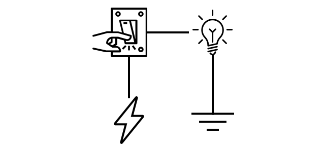

<!--
CO_OP_TRANSLATOR_METADATA:
{
  "original_hash": "f7bb24ba53fb627ddb38a8b24a05e594",
  "translation_date": "2025-08-24T22:09:20+00:00",
  "source_file": "2-farm/lessons/3-automated-plant-watering/README.md",
  "language_code": "zh"
}
-->
# 自动植物浇水


> 手绘笔记由 [Nitya Narasimhan](https://github.com/nitya) 提供。点击图片查看大图。

本课程是 [Microsoft Reactor](https://developer.microsoft.com/reactor/?WT.mc_id=academic-17441-jabenn) 的 [IoT 初学者项目 2 - 数字农业系列](https://youtube.com/playlist?list=PLmsFUfdnGr3yCutmcVg6eAUEfsGiFXgcx) 的一部分。

[](https://youtu.be/g9FfZwv9R58)

## 课前测验

[课前测验](https://black-meadow-040d15503.1.azurestaticapps.net/quiz/13)

## 简介

在上一课中，你学习了如何监测土壤湿度。在本课中，你将学习如何构建一个响应土壤湿度的自动浇水系统的核心组件。你还将了解有关时间的知识——传感器可能需要一些时间来响应变化，而执行器可能需要时间来改变传感器测量的属性。

本课内容包括：

* [从低功率物联网设备控制高功率设备](../../../../../2-farm/lessons/3-automated-plant-watering)
* [控制继电器](../../../../../2-farm/lessons/3-automated-plant-watering)
* [通过 MQTT 控制你的植物](../../../../../2-farm/lessons/3-automated-plant-watering)
* [传感器和执行器的时间延迟](../../../../../2-farm/lessons/3-automated-plant-watering)
* [为植物控制服务器添加时间功能](../../../../../2-farm/lessons/3-automated-plant-watering)

## 从低功率物联网设备控制高功率设备

物联网设备使用低电压。这足以驱动传感器和低功率执行器（如 LED），但不足以控制更大的硬件，例如用于灌溉的水泵。即使是用于室内植物的小型水泵，其电流需求也会超出物联网开发板的承受范围，可能会烧毁电路板。

> 🎓 电流以安培 (A) 为单位测量，表示电路中流动的电量。电压提供推动力，而电流表示被推动的电量。你可以在 [维基百科的电流页面](https://wikipedia.org/wiki/Electric_current) 上了解更多。

解决方案是将水泵连接到外部电源，并使用执行器来打开水泵，就像你用手指打开灯一样。打开开关所需的能量很小（来自你身体的能量），而这会将灯连接到 110v/240v 的市电。



> 🎓 [市电](https://wikipedia.org/wiki/Mains_electricity) 指的是通过国家基础设施输送到家庭和企业的电力。

✅ 物联网设备通常提供 3.3V 或 5V，电流小于 1 安培 (1A)。相比之下，市电通常为 230V（北美为 120V，日本为 100V），可以为需要 30A 电流的设备供电。

有许多执行器可以完成这一任务，包括可以附加到现有开关上的机械设备，模拟手指打开开关的动作。其中最常见的是继电器。

### 继电器

继电器是一种机电开关，它将电信号转换为机械运动，从而打开或关闭开关。继电器的核心是一个电磁铁。

> 🎓 [电磁铁](https://wikipedia.org/wiki/Electromagnet) 是通过电流流过线圈产生磁场的磁铁。当电流开启时，线圈被磁化；当电流关闭时，线圈失去磁性。


在继电器中，控制电路为电磁铁供电。当电磁铁通电时，它会拉动一个杠杆，移动开关，闭合一对触点，从而完成输出电路。


当控制电路断电时，电磁铁关闭，释放杠杆并打开触点，从而关闭输出电路。继电器是一种数字执行器——高电平信号打开继电器，低电平信号关闭继电器。

输出电路可以用来为额外的硬件供电，例如灌溉系统。物联网设备可以打开继电器，完成为灌溉系统供电的输出电路，植物就会被浇水。然后物联网设备可以关闭继电器，切断灌溉系统的电源，停止供水。


在上面的视频中，继电器被打开。继电器上的 LED 灯亮起，表示继电器已打开（某些继电器板上有 LED 指示灯显示继电器的状态），电源被送到水泵，启动水泵向植物供水。

> 💁 继电器还可以用于在两个输出电路之间切换，而不是简单地打开或关闭一个电路。当杠杆移动时，它会将开关从一个输出电路切换到另一个输出电路，通常共享一个公共电源连接或公共接地连接。

✅ 做一些研究：继电器有多种类型，差异包括控制电路在通电时是打开还是关闭继电器，或者是否有多个输出电路。了解这些不同类型的继电器。

当杠杆移动时，你通常可以听到它与电磁铁接触时发出的清脆的点击声。

> 💁 继电器可以被接线成在连接时实际上切断继电器的电源，从而关闭继电器，然后再次为继电器供电，如此循环。这会使继电器以极快的速度点击，发出嗡嗡声。这是一些早期电动门铃中蜂鸣器的工作原理。

### 继电器的功率

电磁铁所需的功率很小，可以通过物联网开发板的 3.3V 或 5V 输出控制。输出电路可以承载更多功率，具体取决于继电器，包括市电电压甚至更高的工业电压。这使得物联网开发板可以控制灌溉系统，从单个植物的小型水泵到整个商业农场的大型工业系统。


上图显示了一个 Grove 继电器。控制电路连接到物联网设备，并使用 3.3V 或 5V 打开或关闭继电器。输出电路有两个端子，任意一个可以是电源或接地。输出电路可以处理高达 250V、10A 的电流，足以驱动一系列市电设备。你还可以找到能够处理更高功率的继电器。


在上图中，电源通过继电器供给水泵。一根红线将 USB 电源的 +5V 端子连接到继电器输出电路的一个端子，另一根红线将输出电路的另一个端子连接到水泵。一根黑线将水泵连接到 USB 电源的接地端。当继电器打开时，它完成电路，将 5V 送到水泵，启动水泵。

## 控制继电器

你可以通过物联网开发板控制继电器。

### 任务 - 控制继电器

按照相关指南，通过你的物联网设备控制继电器：

* [Arduino - Wio Terminal](wio-terminal-relay.md)
* [单板计算机 - Raspberry Pi](pi-relay.md)
* [单板计算机 - 虚拟设备](virtual-device-relay.md)

## 通过 MQTT 控制你的植物

目前，你的继电器是由物联网设备直接根据单个土壤湿度读数控制的。在商业灌溉系统中，控制逻辑通常是集中化的，这样可以使用多个传感器的数据来决定是否浇水，并且可以在一个地方更改所有配置。为了模拟这一点，你可以通过 MQTT 控制继电器。

### 任务 - 通过 MQTT 控制继电器

1. 在你的 `soil-moisture-sensor` 项目中添加相关的 MQTT 库/pip 包和代码以连接到 MQTT。将客户端 ID 命名为 `soilmoisturesensor_client`，并在前面加上你的 ID。

    > ⚠️ 如果需要，可以参考 [项目 1，第 4 课中连接到 MQTT 的说明](../../../1-getting-started/lessons/4-connect-internet/README.md#connect-your-iot-device-to-mqtt)。

1. 添加相关设备代码以发送带有土壤湿度设置的遥测数据。对于遥测消息，将属性命名为 `soil_moisture`。

    > ⚠️ 如果需要，可以参考 [项目 1，第 4 课中发送遥测数据到 MQTT 的说明](../../../1-getting-started/lessons/4-connect-internet/README.md#send-telemetry-from-your-iot-device)。

1. 在名为 `soil-moisture-sensor-server` 的文件夹中创建一些本地服务器代码，用于订阅遥测数据并发送命令以控制继电器。将命令消息中的属性命名为 `relay_on`，并将客户端 ID 命名为 `soilmoisturesensor_server`，在前面加上你的 ID。保持与项目 1，第 4 课中编写的服务器代码相同的结构，因为你将在本课后续部分中添加到此代码。

    > ⚠️ 如果需要，可以参考 [发送遥测数据到 MQTT 的说明](../../../1-getting-started/lessons/4-connect-internet/README.md#write-the-server-code) 和 [通过 MQTT 发送命令](../../../1-getting-started/lessons/4-connect-internet/README.md#send-commands-to-the-mqtt-broker) 的说明。

1. 添加相关设备代码以根据接收到的命令控制继电器，使用消息中的 `relay_on` 属性。如果 `soil_moisture` 大于 450，则发送 true 给 `relay_on`，否则发送 false，与之前为物联网设备添加的逻辑相同。

    > ⚠️ 如果需要，可以参考 [项目 1，第 4 课中响应 MQTT 命令的说明](../../../1-getting-started/lessons/4-connect-internet/README.md#handle-commands-on-the-iot-device)。

> 💁 你可以在 [code-mqtt](../../../../../2-farm/lessons/3-automated-plant-watering/code-mqtt) 文件夹中找到此代码。

确保代码在你的设备和本地服务器上运行，并通过更改土壤湿度水平进行测试，无论是通过更改虚拟传感器发送的值，还是通过向土壤中添加水或将传感器从土壤中移除来改变湿度。

## 传感器和执行器的时间延迟

在第 3 课中，你构建了一个夜灯——当光传感器检测到低光水平时，LED 会立即点亮。光传感器能够即时检测光线变化，设备也能快速响应，仅受 `loop` 函数或 `while True:` 循环中延迟的限制。作为物联网开发者，你不能总是依赖如此快速的反馈循环。

### 土壤湿度的时间延迟

如果你在上一课中使用了物理传感器测量土壤湿度，你可能注意到在给植物浇水后，土壤湿度读数需要几秒钟才会下降。这并不是因为传感器反应慢，而是因为水需要时间渗透到土壤中。
💁 如果你在传感器附近浇水过多，可能会看到读数迅速下降，然后又回升——这是因为传感器附近的水分扩散到土壤的其他部分，导致传感器附近的土壤湿度降低。


在上图中，土壤湿度的读数为658。植物被浇水，但这个读数不会立即变化，因为水还没有到达传感器。甚至在水到达传感器之前，浇水可能已经结束，只有当水渗透到土壤后，读数才会下降以反映新的湿度水平。

如果你正在编写代码，通过继电器根据土壤湿度水平控制灌溉系统，你需要考虑这种延迟，并在你的物联网设备中构建更智能的时间控制。

✅ 花点时间思考一下你会如何处理这种情况。

### 控制传感器和执行器的时间

假设你被要求为一个农场构建一个灌溉系统。根据土壤类型，发现植物的理想土壤湿度水平对应于模拟电压读数为400-450。

你可以像夜灯一样编程——只要传感器读数高于450，就打开继电器启动水泵。问题在于，从水泵到土壤再到传感器，水需要一段时间。传感器在检测到450的水平时会停止供水，但由于泵送的水继续渗透到土壤中，湿度水平会继续下降。最终结果是浪费水，并可能损害植物根部。

✅ 记住——过多的水和过少的水对植物来说都可能是有害的，同时也浪费了宝贵的资源。

更好的解决方案是理解从执行器启动到传感器读数变化之间存在延迟。这意味着传感器不仅需要等待一段时间再测量值，执行器也需要在下一次传感器测量之前关闭一段时间。

每次继电器应该开启多长时间？最好谨慎行事，只让继电器开启很短的时间，然后等待水渗透，再重新检查湿度水平。毕竟，你可以随时再次打开继电器添加更多的水，但你无法从土壤中移除多余的水。

> 💁 这种时间控制非常具体，取决于你正在构建的物联网设备、测量的属性以及使用的传感器和执行器。


例如，我有一株草莓植物，配备了一个土壤湿度传感器和一个通过继电器控制的水泵。我观察到，当我加水时，土壤湿度读数需要大约20秒才能稳定。这意味着我需要关闭继电器并等待20秒，然后再检查湿度水平。我宁愿水少一点也不愿多——我可以随时再次打开水泵，但我无法从植物中移除多余的水。


这意味着最佳的浇水流程可能是这样的：

* 打开水泵5秒
* 等待20秒
* 检查土壤湿度
* 如果湿度水平仍然高于所需值，重复上述步骤

5秒可能对水泵来说太长，尤其是当湿度水平仅略高于所需值时。确定使用什么时间的最佳方法是尝试，然后根据传感器数据进行调整，形成一个持续的反馈循环。这甚至可以导致更精细的时间控制，例如每高于所需湿度100就打开水泵1秒，而不是固定的5秒。

✅ 做些研究：是否还有其他时间因素需要考虑？是否可以在任何时候浇水，只要土壤湿度过低，还是有特定的时间适合或不适合给植物浇水？

> 💁 在控制室外种植的自动灌溉系统时，还可以考虑天气预报。如果预计会下雨，那么可以暂停浇水，等到雨停后再决定是否需要浇水。这样可以更高效地利用水资源，而不是在下雨前浪费水。

## 为植物控制服务器添加时间控制

可以修改服务器代码，为浇水周期的时间控制和等待土壤湿度水平变化添加逻辑。控制继电器时间的服务器逻辑如下：

1. 接收到遥测消息
1. 检查土壤湿度水平
1. 如果湿度正常，则不做任何操作。如果读数过高（表示土壤湿度过低），则：
    1. 发送命令打开继电器
    1. 等待5秒
    1. 发送命令关闭继电器
    1. 等待20秒，让土壤湿度水平稳定

浇水周期，从接收到遥测消息到准备再次处理土壤湿度水平，大约需要25秒。我们每10秒发送一次土壤湿度水平，因此在服务器等待土壤湿度水平稳定时，会有消息重叠，这可能会启动另一个浇水周期。

有两种方法可以解决这个问题：

* 更改物联网设备代码，使其每分钟只发送一次遥测数据，这样浇水周期会在下一条消息发送之前完成
* 在浇水周期期间取消订阅遥测数据

第一种方法并不总是适合大型农场。农民可能希望在浇水时捕获土壤湿度水平，以便稍后分析，例如了解农场不同区域的水流情况，从而指导更有针对性的浇水。第二种方法更好——代码只是忽略无法使用的遥测数据，但遥测数据仍然可以供其他订阅的服务使用。

> 💁 物联网数据并不是从一个设备发送到一个服务，而是许多设备可以将数据发送到一个代理，许多服务可以从代理中监听数据。例如，一个服务可以监听土壤湿度数据并将其存储到数据库中以供稍后分析。另一个服务也可以监听相同的遥测数据来控制灌溉系统。

### 任务 - 为植物控制服务器添加时间控制

更新你的服务器代码，使继电器运行5秒，然后等待20秒。

1. 如果尚未打开，请在 VS Code 中打开 `soil-moisture-sensor-server` 文件夹。确保虚拟环境已激活。

1. 打开 `app.py` 文件

1. 在现有导入语句下方，添加以下代码到 `app.py` 文件中：

    ```python
    import threading
    ```

    这条语句从 Python 库中导入 `threading`，它允许 Python 在等待时执行其他代码。

1. 在处理服务器代码接收的遥测消息的 `handle_telemetry` 函数之前，添加以下代码：

    ```python
    water_time = 5
    wait_time = 20
    ```

    这定义了继电器运行的时间（`water_time`）以及之后检查土壤湿度的等待时间（`wait_time`）。

1. 在这段代码下方，添加以下内容：

    ```python
    def send_relay_command(client, state):
        command = { 'relay_on' : state }
        print("Sending message:", command)
        client.publish(server_command_topic, json.dumps(command))
    ```

    这段代码定义了一个名为 `send_relay_command` 的函数，用于通过 MQTT 发送命令来控制继电器。遥测数据被创建为一个字典，然后转换为 JSON 字符串。传递给 `state` 的值决定继电器是打开还是关闭。

1. 在 `send_relay_code` 函数之后，添加以下代码：

    ```python
    def control_relay(client):
        print("Unsubscribing from telemetry")
        mqtt_client.unsubscribe(client_telemetry_topic)
    
        send_relay_command(client, True)
        time.sleep(water_time)
        send_relay_command(client, False)
    
        time.sleep(wait_time)
    
        print("Subscribing to telemetry")
        mqtt_client.subscribe(client_telemetry_topic)
    ```

    这定义了一个基于所需时间控制继电器的函数。它首先取消订阅遥测数据，以便在浇水期间不处理土壤湿度消息。接着发送命令打开继电器，然后等待 `water_time`，再发送命令关闭继电器。最后，它等待 `wait_time` 秒让土壤湿度水平稳定，然后重新订阅遥测数据。

1. 将 `handle_telemetry` 函数更改为以下内容：

    ```python
    def handle_telemetry(client, userdata, message):
        payload = json.loads(message.payload.decode())
        print("Message received:", payload)
    
        if payload['soil_moisture'] > 450:
            threading.Thread(target=control_relay, args=(client,)).start()
    ```

    这段代码检查土壤湿度水平。如果大于450，说明土壤需要浇水，于是调用 `control_relay` 函数。这个函数在一个单独的线程中运行，在后台执行。

1. 确保你的物联网设备正在运行，然后运行这段代码。更改土壤湿度水平，观察继电器的行为——它应该打开5秒，然后至少保持关闭20秒，只有在土壤湿度水平不足时才会再次打开。

    ```output
    (.venv) ➜  soil-moisture-sensor-server ✗ python app.py
    Message received: {'soil_moisture': 457}
    Unsubscribing from telemetry
    Sending message: {'relay_on': True}
    Sending message: {'relay_on': False}
    Subscribing to telemetry
    Message received: {'soil_moisture': 302}
    ```

    在模拟灌溉系统中测试这一点的一个好方法是使用干燥的土壤，然后在继电器打开时手动倒水，在继电器关闭时停止倒水。

> 💁 你可以在 [code-timing](../../../../../2-farm/lessons/3-automated-plant-watering/code-timing) 文件夹中找到这段代码。

> 💁 如果你想使用水泵构建一个真实的灌溉系统，可以使用 [6V 水泵](https://www.seeedstudio.com/6V-Mini-Water-Pump-p-1945.html) 和 [USB 端子电源](https://www.adafruit.com/product/3628)。确保泵的电源或输出通过继电器连接。

---

## 🚀 挑战

你能想到其他类似的问题吗？例如其他物联网设备或电气设备，它们的执行器作用需要一段时间才能影响传感器的读数。你家里或学校可能就有几个这样的例子。

* 它们测量什么属性？
* 执行器作用后，属性需要多长时间才能改变？
* 属性超过所需值是否可以接受？
* 如果需要，如何将属性恢复到所需值？

## 课后测验

[课后测验](https://black-meadow-040d15503.1.azurestaticapps.net/quiz/14)

## 复习与自学

* 阅读更多关于继电器的信息，包括它们在电话交换机中的历史用途：[继电器 - 维基百科](https://wikipedia.org/wiki/Relay)。

## 作业

[构建一个更高效的浇水周期](assignment.md)

**免责声明**：  
本文档使用AI翻译服务[Co-op Translator](https://github.com/Azure/co-op-translator)进行翻译。尽管我们努力确保翻译的准确性，但请注意，自动翻译可能包含错误或不准确之处。应以原文档的原始语言版本为权威来源。对于关键信息，建议使用专业人工翻译。我们对因使用此翻译而引起的任何误解或误读不承担责任。