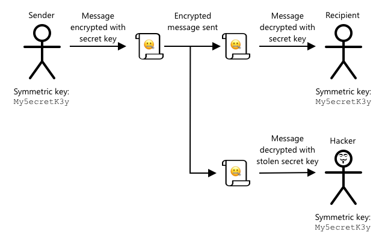

<!--
CO_OP_TRANSLATOR_METADATA:
{
  "original_hash": "81c437c568eee1b0dda1f04e88150d37",
  "translation_date": "2025-08-24T22:51:35+00:00",
  "source_file": "2-farm/lessons/6-keep-your-plant-secure/README.md",
  "language_code": "zh"
}
-->
# 保持植物安全


> 手绘图由 [Nitya Narasimhan](https://github.com/nitya) 提供。点击图片查看更大版本。

## 课前测验

[课前测验](https://black-meadow-040d15503.1.azurestaticapps.net/quiz/19)

## 简介

在之前的课程中，你已经创建了一个土壤监测物联网设备并将其连接到云端。但如果竞争农场的黑客控制了你的物联网设备会怎样？如果他们发送虚假的高土壤湿度数据，让你的植物永远得不到浇水，或者让你的灌溉系统一直运行，导致植物因过度浇水而死亡，同时让你在水费上损失惨重呢？

在本课中，你将学习如何保护物联网设备的安全。由于这是本项目的最后一课，你还将学习如何清理云资源，以减少潜在的成本。

本课将涵盖以下内容：

* [为什么需要保护物联网设备的安全？](../../../../../2-farm/lessons/6-keep-your-plant-secure)
* [加密技术](../../../../../2-farm/lessons/6-keep-your-plant-secure)
* [保护你的物联网设备](../../../../../2-farm/lessons/6-keep-your-plant-secure)
* [生成并使用 X.509 证书](../../../../../2-farm/lessons/6-keep-your-plant-secure)

> 🗑 这是本项目的最后一课，因此在完成本课和作业后，不要忘记清理你的云服务。你需要这些服务来完成作业，所以请确保先完成作业。
>
> 如果需要，请参考[项目清理指南](../../../clean-up.md)以获取相关操作说明。

## 为什么需要保护物联网设备的安全？

物联网安全涉及确保只有预期的设备可以连接到你的云物联网服务并发送遥测数据，同时只有你的云服务可以向设备发送命令。物联网数据可能包含个人信息，包括医疗或隐私数据，因此整个应用程序需要考虑安全性，以防止数据泄露。

如果你的物联网应用程序不安全，会面临以下风险：

* 假设备可能发送错误数据，导致你的应用程序做出错误响应。例如，它们可能发送持续的高土壤湿度数据，导致你的灌溉系统永远不启动，植物因缺水而死亡。
* 未授权用户可能读取物联网设备的数据，包括个人或业务关键数据。
* 黑客可能发送命令以控制设备，从而对设备或连接的硬件造成损害。
* 通过连接到物联网设备，黑客可能利用此设备访问其他网络，从而进入私人系统。
* 恶意用户可能访问个人数据并利用这些数据进行勒索。

这些都是现实中的场景，并且经常发生。之前的课程中已经提到了一些例子，以下是更多案例：

* 2018年，黑客利用鱼缸温控器的开放WiFi接入点进入一家赌场的网络并窃取数据。[The Hacker News - Casino Gets Hacked Through Its Internet-Connected Fish Tank Thermometer](https://thehackernews.com/2018/04/iot-hacking-thermometer.html)
* 2016年，Mirai僵尸网络对互联网服务提供商Dyn发起了拒绝服务攻击，导致大部分互联网瘫痪。该僵尸网络利用恶意软件连接到使用默认用户名和密码的物联网设备（如DVR和摄像头），并从那里发起攻击。[The Guardian - DDoS attack that disrupted internet was largest of its kind in history, experts say](https://www.theguardian.com/technology/2016/oct/26/ddos-attack-dyn-mirai-botnet)
* Spiral Toys的CloudPets连接玩具用户数据库在互联网上公开可访问。[Troy Hunt - Data from connected CloudPets teddy bears leaked and ransomed, exposing kids' voice messages](https://www.troyhunt.com/data-from-connected-cloudpets-teddy-bears-leaked-and-ransomed-exposing-kids-voice-messages/)
* Strava标记了你跑步时经过的其他跑者，并显示他们的路线，使陌生人能够看到你住在哪里。[Kim Komndo - Fitness app could lead a stranger right to your home — change this setting](https://www.komando.com/security-privacy/strava-fitness-app-privacy/755349/)

✅ 做一些研究：搜索更多物联网数据泄露或黑客攻击的例子，尤其是与个人物品相关的案例，例如联网牙刷或体重秤。思考这些攻击可能对受害者或客户造成的影响。

> 💁 安全是一个非常广泛的话题，本课只会涉及设备连接到云端的一些基础知识。未涵盖的主题包括监控数据在传输中的变化、直接攻击设备或更改设备配置。物联网黑客威胁如此之大，以至于像 [Azure Defender for IoT](https://azure.microsoft.com/services/azure-defender-for-iot/?WT.mc_id=academic-17441-jabenn) 这样的工具已经被开发出来。这些工具类似于你电脑上的杀毒和安全工具，但专为小型、低功耗的物联网设备设计。

## 加密技术

当设备连接到物联网服务时，它会使用一个ID来标识自己。问题是这个ID可能会被克隆——黑客可以设置一个恶意设备，使用与真实设备相同的ID，但发送虚假数据。


解决方法是将发送的数据转换为一种加密格式，使用设备和云端都知道的某种值来加密数据。这一过程称为*加密*，用于加密数据的值称为*加密密钥*。


云服务可以使用一个称为*解密*的过程将数据转换回可读格式，使用相同的加密密钥或一个*解密密钥*。如果加密消息无法通过密钥解密，则说明设备已被黑客攻击，消息会被拒绝。

执行加密和解密的技术称为*密码学*。

### 早期密码学

最早的密码学类型是替换密码，最早可追溯到3500年前。替换密码涉及用一个字母替换另一个字母。例如，[凯撒密码](https://wikipedia.org/wiki/Caesar_cipher)通过定义的数量来移动字母表，只有加密消息的发送者和接收者知道移动了多少个字母。

[维吉尼亚密码](https://wikipedia.org/wiki/Vigenère_cipher)进一步发展，通过使用单词来加密文本，使原始文本中的每个字母移动的数量不同，而不是始终移动相同数量的字母。

密码学被广泛用于各种目的，例如在古代美索不达米亚保护陶工釉料配方、在印度写秘密情书或在古埃及保护魔法咒语。

### 现代密码学

现代密码学更加先进，比早期方法更难破解。现代密码学使用复杂的数学方法加密数据，可能的密钥数量多到无法通过暴力破解。

密码学在安全通信中有很多用途。如果你正在GitHub上阅读此页面，你可能会注意到网站地址以*HTTPS*开头，这意味着你的浏览器与GitHub的网络服务器之间的通信是加密的。如果有人能够读取你浏览器与GitHub之间的互联网流量，他们也无法读取数据，因为数据是加密的。你的电脑甚至可能加密硬盘上的所有数据，这样如果有人偷走了你的电脑，他们无法在没有密码的情况下读取任何数据。

> 🎓 HTTPS代表超文本传输协议**安全**

不幸的是，并非所有设备都是安全的。有些设备没有任何安全措施，有些设备使用容易破解的密钥，有些设备甚至所有同类型设备都使用相同的密钥。有些非常个人化的物联网设备被发现所有设备的WiFi或蓝牙连接密码都是一样的。如果你能连接到自己的设备，你也能连接到别人的设备。一旦连接，你可能访问非常隐私的数据，甚至控制他们的设备。

> 💁 尽管现代密码学复杂且声称破解加密可能需要数十亿年，但量子计算的兴起使得在极短时间内破解所有已知加密成为可能！

### 对称密钥和非对称密钥

加密分为两种类型——对称加密和非对称加密。

**对称加密**使用相同的密钥来加密和解密数据。发送者和接收者都需要知道相同的密钥。这种方式安全性较低，因为密钥需要以某种方式共享。发送者在发送加密消息给接收者之前，可能需要先将密钥发送给接收者。


如果密钥在传输过程中被盗，或者发送者或接收者被黑客攻击并泄露了密钥，加密就会被破解。



**非对称加密**使用两个密钥——一个加密密钥和一个解密密钥，称为公钥/私钥对。公钥用于加密消息，但不能用于解密；私钥用于解密消息，但不能用于加密。


接收者共享他们的公钥，发送者使用公钥加密消息。一旦消息发送，接收者使用私钥解密消息。非对称加密更安全，因为私钥由接收者保密，从不共享。任何人都可以拥有公钥，因为它只能用于加密消息。

对称加密比非对称加密速度更快，而非对称加密更安全。一些系统会同时使用两者——使用非对称加密来加密和共享对称密钥，然后使用对称密钥加密所有数据。这种方式使得共享对称密钥更安全，同时在加密和解密数据时更快。

## 保护你的物联网设备

物联网设备可以使用对称或非对称加密进行保护。对称加密更简单，但安全性较低。

### 对称密钥

当你设置物联网设备与IoT Hub交互时，你使用了一个连接字符串。一个示例连接字符串如下：

```output
HostName=soil-moisture-sensor.azure-devices.net;DeviceId=soil-moisture-sensor;SharedAccessKey=Bhry+ind7kKEIDxubK61RiEHHRTrPl7HUow8cEm/mU0=
```

这个连接字符串由三个部分组成，用分号分隔，每部分包含一个键和值：

| 键 | 值 | 描述 |
| --- | ----- | ----------- |
| HostName | `soil-moisture-sensor.azure-devices.net` | IoT Hub的URL |
| DeviceId | `soil-moisture-sensor` | 设备的唯一ID |
| SharedAccessKey | `Bhry+ind7kKEIDxubK61RiEHHRTrPl7HUow8cEm/mU0=` | 设备和IoT Hub都知道的对称密钥 |

连接字符串的最后一部分`SharedAccessKey`是设备和IoT Hub都知道的对称密钥。这个密钥不会从设备发送到云端，也不会从云端发送到设备，而是用于加密发送或接收的数据。

✅ 做一个实验：如果你在连接物联网设备时更改连接字符串中的`SharedAccessKey`部分，会发生什么？试试看。

当设备首次尝试连接时，它会发送一个共享访问签名（SAS）令牌，该令牌由IoT Hub的URL、访问签名的过期时间戳（通常是当前时间起1天）和一个签名组成。这个签名由URL和过期时间通过连接字符串中的共享访问密钥加密而成。

IoT Hub使用共享访问密钥解密这个签名，如果解密后的值与URL和过期时间匹配，设备就被允许连接。它还会验证当前时间是否在过期时间之前，以防止恶意设备捕获真实设备的SAS令牌并使用它。

这是验证发送者是否为正确设备的一种优雅方式。通过同时发送一些已知数据的未加密和加密版本，服务器可以通过解密加密数据并确保结果与发送的未加密版本匹配来验证设备。如果匹配，则说明发送者和接收者拥有相同的对称加密密钥。
💁 由于到期时间的限制，您的 IoT 设备需要知道准确的时间，通常从 [NTP](https://wikipedia.org/wiki/Network_Time_Protocol) 服务器读取。如果时间不准确，连接将会失败。
连接后，从设备发送到 IoT Hub 或从 IoT Hub 发送到设备的所有数据都将使用共享访问密钥进行加密。

✅ 你认为如果多个设备共享相同的连接字符串会发生什么？

> 💁 将密钥存储在代码中是一种不好的安全实践。如果黑客获取了你的源代码，他们就能获取你的密钥。此外，在发布代码时也会更加困难，因为你需要为每个设备使用更新的密钥重新编译代码。更好的做法是从硬件安全模块加载密钥——这是一个存储加密值的 IoT 设备芯片，代码可以读取这些值。
>
> 在学习 IoT 时，将密钥放入代码中通常更容易，就像你在之前的课程中所做的那样，但你必须确保这个密钥不会被提交到公共的源代码控制中。

设备有两个密钥和两个对应的连接字符串。这使得你可以轮换密钥——也就是说，如果第一个密钥被泄露，可以切换到另一个密钥，并重新生成第一个密钥。

### X.509 证书

当你使用公钥/私钥对进行非对称加密时，你需要将公钥提供给任何想要向你发送数据的人。问题是，接收者如何确定这确实是你的公钥，而不是某人冒充你的？与其直接提供密钥，你可以将公钥包含在一个由可信第三方验证的证书中，这种证书被称为 X.509 证书。

X.509 证书是包含公钥部分的数字文档。它们通常由被称为[认证机构](https://wikipedia.org/wiki/Certificate_authority) (CAs) 的可信组织之一颁发，并由 CA 数字签名以表明密钥是有效的并且确实来自你。你信任证书以及证书中公钥的来源，因为你信任 CA，这类似于你信任护照或驾驶执照，因为你信任颁发它的国家。证书是需要付费的，但你也可以“自签名”，即自己创建一个由你签名的证书，用于测试目的。

> 💁 你绝不应该在生产环境中使用自签名证书。

这些证书包含许多字段，包括公钥的来源、颁发证书的 CA 的详细信息、证书的有效期以及公钥本身。在使用证书之前，最好通过检查它是否由原始 CA 签名来验证它。

✅ 你可以在 [Microsoft 关于 X.509 公钥证书的教程](https://docs.microsoft.com/azure/iot-hub/tutorial-x509-certificates?WT.mc_id=academic-17441-jabenn#certificate-fields) 中阅读证书字段的完整列表。

使用 X.509 证书时，发送方和接收方都会拥有自己的公钥和私钥，并且双方都会有包含公钥的 X.509 证书。然后，他们以某种方式交换 X.509 证书，使用对方的公钥加密发送的数据，并使用自己的私钥解密接收到的数据。


使用 X.509 证书的一个主要优势是它们可以在设备之间共享。你可以创建一个证书，将其上传到 IoT Hub，并将其用于所有设备。每个设备只需要知道私钥即可解密从 IoT Hub 接收到的消息。

设备用于加密发送到 IoT Hub 的消息的证书是由 Microsoft 发布的。这是许多 Azure 服务使用的相同证书，有时已经内置在 SDK 中。

> 💁 请记住，公钥就是“公开”的。Azure 公钥只能用于加密发送到 Azure 的数据，而不能用于解密，因此可以随处共享，包括在源代码中。例如，你可以在 [Azure IoT C SDK 源代码](https://github.com/Azure/azure-iot-sdk-c/blob/master/certs/certs.c) 中看到它。

✅ X.509 证书中有许多术语。你可以在 [X.509 证书术语的通俗指南](https://techcommunity.microsoft.com/t5/internet-of-things/the-layman-s-guide-to-x-509-certificate-jargon/ba-p/2203540?WT.mc_id=academic-17441-jabenn) 中阅读一些你可能遇到的术语的定义。

## 生成并使用 X.509 证书

生成 X.509 证书的步骤如下：

1. 创建一个公钥/私钥对。最广泛使用的生成公钥/私钥对的算法之一是 [Rivest–Shamir–Adleman](https://wikipedia.org/wiki/RSA_(cryptosystem)) (RSA)。

1. 提交公钥及相关数据以供签名，可以由 CA 签名，也可以自签名。

Azure CLI 提供了在 IoT Hub 中创建新设备标识并自动生成公钥/私钥对以及创建自签名证书的命令。

> 💁 如果你想了解详细步骤，而不是使用 Azure CLI，你可以在 [Microsoft IoT Hub 文档中关于使用 OpenSSL 创建自签名证书的教程](https://docs.microsoft.com/azure/iot-hub/tutorial-x509-self-sign?WT.mc_id=academic-17441-jabenn) 中找到。

### 任务 - 使用 X.509 证书创建设备标识

1. 运行以下命令注册新的设备标识，并自动生成密钥和证书：

    ```sh
    az iot hub device-identity create --device-id soil-moisture-sensor-x509 \
                                      --am x509_thumbprint \
                                      --output-dir . \
                                      --hub-name <hub_name>
    ```

    将 `<hub_name>` 替换为你为 IoT Hub 使用的名称。

    这将创建一个 ID 为 `soil-moisture-sensor-x509` 的设备，以区别于你在上一课中创建的设备标识。此命令还将在当前目录中创建两个文件：

    * `soil-moisture-sensor-x509-key.pem` - 此文件包含设备的私钥。
    * `soil-moisture-sensor-x509-cert.pem` - 这是设备的 X.509 证书文件。

    请妥善保管这些文件！私钥文件不应被提交到公共的源代码控制中。

### 任务 - 在设备代码中使用 X.509 证书

按照相关指南，通过 X.509 证书将你的 IoT 设备连接到云端：

* [Arduino - Wio Terminal](wio-terminal-x509.md)
* [单板计算机 - Raspberry Pi/虚拟 IoT 设备](single-board-computer-x509.md)

---

## 🚀 挑战

创建、管理和删除 Azure 服务（如资源组和 IoT Hub）有多种方法。其中一种方法是 [Azure Portal](https://portal.azure.com?WT.mc_id=academic-17441-jabenn)——一个基于 Web 的界面，提供 GUI 来管理你的 Azure 服务。

访问 [portal.azure.com](https://portal.azure.com?WT.mc_id=academic-17441-jabenn) 并探索门户。看看你是否可以使用门户创建一个 IoT Hub，然后将其删除。

**提示** - 通过门户创建服务时，你不需要提前创建资源组，可以在创建服务时创建资源组。完成后，请确保将其删除！

你可以在 [Azure Portal 文档](https://docs.microsoft.com/azure/azure-portal/?WT.mc_id=academic-17441-jabenn) 中找到大量文档、教程和指南。

## 课后测验

[课后测验](https://black-meadow-040d15503.1.azurestaticapps.net/quiz/20)

## 复习与自学

* 阅读 [Wikipedia 上的密码学历史页面](https://wikipedia.org/wiki/History_of_cryptography) 了解密码学的历史。
* 阅读 [Wikipedia 上的 X.509 页面](https://wikipedia.org/wiki/X.509) 了解 X.509 证书。

## 作业

[构建一个新的 IoT 设备](assignment.md)

**免责声明**：  
本文档使用AI翻译服务[Co-op Translator](https://github.com/Azure/co-op-translator)进行翻译。尽管我们努力确保翻译的准确性，但请注意，自动翻译可能包含错误或不准确之处。原始语言的文档应被视为权威来源。对于关键信息，建议使用专业人工翻译。我们不对因使用此翻译而产生的任何误解或误读承担责任。