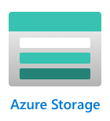

<!--
CO_OP_TRANSLATOR_METADATA:
{
  "original_hash": "e345843ccfeb7261d81500d19c64d476",
  "translation_date": "2025-08-25T01:00:18+00:00",
  "source_file": "3-transport/lessons/2-store-location-data/README.md",
  "language_code": "zh"
}
-->
# 存储位置信息数据


> 手绘笔记由 [Nitya Narasimhan](https://github.com/nitya) 提供。点击图片查看大图。

## 课前测验

[课前测验](https://black-meadow-040d15503.1.azurestaticapps.net/quiz/23)

## 简介

在上一课中，你学习了如何使用 GPS 传感器捕获位置信息数据。为了将这些数据用于可视化一辆满载食物的卡车的位置及其行程，需要将数据发送到云端的 IoT 服务，并存储在某个地方。

在本课中，你将学习存储 IoT 数据的不同方法，并学习如何使用无服务器代码存储来自 IoT 服务的数据。

本课内容包括：

* [结构化数据和非结构化数据](../../../../../3-transport/lessons/2-store-location-data)
* [将 GPS 数据发送到 IoT Hub](../../../../../3-transport/lessons/2-store-location-data)
* [热路径、温路径和冷路径](../../../../../3-transport/lessons/2-store-location-data)
* [使用无服务器代码处理 GPS 事件](../../../../../3-transport/lessons/2-store-location-data)
* [Azure 存储账户](../../../../../3-transport/lessons/2-store-location-data)
* [将无服务器代码连接到存储](../../../../../3-transport/lessons/2-store-location-data)

## 结构化数据和非结构化数据

计算机系统处理数据，而这些数据的形状和大小各不相同。数据可以是单个数字、大量文本、视频和图像，或者 IoT 数据。通常，数据可以分为两类——*结构化数据* 和 *非结构化数据*。

* **结构化数据** 是具有明确、固定结构的数据，通常映射到具有关系的数据表。例如，一个人的详细信息，包括姓名、出生日期和地址。

* **非结构化数据** 是没有明确、固定结构的数据，包括结构可能经常变化的数据。例如，文档如书面文件或电子表格。

✅ 进行一些研究：你能想到其他结构化和非结构化数据的例子吗？

> 💁 还有一种半结构化数据，它是有结构的，但不适合固定的数据表。

IoT 数据通常被认为是非结构化数据。

想象一下，你为一个大型商业农场的车队添加了 IoT 设备。你可能希望为不同类型的车辆使用不同的设备。例如：

* 对于像拖拉机这样的农用车辆，你需要 GPS 数据以确保它们在正确的田地上工作。
* 对于将食物运送到仓库的送货卡车，你需要 GPS 数据以及速度和加速度数据，以确保司机安全驾驶，还需要驾驶员身份和启动/停止数据，以确保司机遵守当地的工作时间法律。
* 对于冷藏卡车，你还需要温度数据，以确保食物在运输过程中不会过热或过冷而变质。

这些数据可能会不断变化。例如，如果 IoT 设备位于卡车驾驶室中，那么它发送的数据可能会随着挂车的变化而变化，例如只有在使用冷藏挂车时才发送温度数据。

✅ 还有哪些 IoT 数据可能会被捕获？想一想卡车可能运输的货物类型，以及维护数据。

这些数据因车辆而异，但它们都会被发送到同一个 IoT 服务进行处理。IoT 服务需要能够处理这些非结构化数据，并以一种既能搜索或分析，又能适应数据不同结构的方式存储它们。

### SQL 与 NoSQL 存储

数据库是允许你存储和查询数据的服务。数据库分为两种类型——SQL 和 NoSQL。

#### SQL 数据库

最早的数据库是关系型数据库管理系统（RDBMS），也称为关系型数据库。这些数据库也被称为 SQL 数据库，因为它们使用结构化查询语言（SQL）来添加、删除、更新或查询数据。这些数据库由一个模式组成——一组定义良好的数据表，类似于电子表格。每个表有多个命名列。当你插入数据时，你会向表中添加一行，将值放入每列中。这种方式使数据保持非常严格的结构——尽管你可以留空某些列，但如果你想添加新列，则必须在数据库中执行此操作，并为现有行填充值。这些数据库是关系型的——一个表可以与另一个表有关系。


例如，如果你在一个表中存储用户的个人详细信息，你会为每个用户分配某种内部唯一 ID，该 ID 用于包含用户姓名和地址的表中的一行。如果你想在另一个表中存储该用户的其他详细信息，例如他们的购买记录，你会在新表中为该用户的 ID 添加一列。当你查找用户时，可以使用他们的 ID 从一个表中获取他们的个人详细信息，从另一个表中获取他们的购买记录。

SQL 数据库非常适合存储结构化数据，并且当你希望确保数据符合你的模式时非常有用。

✅ 如果你之前没有使用过 SQL，请花点时间阅读 [Wikipedia 上的 SQL 页面](https://wikipedia.org/wiki/SQL)。

一些知名的 SQL 数据库包括 Microsoft SQL Server、MySQL 和 PostgreSQL。

✅ 进行一些研究：阅读这些 SQL 数据库及其功能。

#### NoSQL 数据库

NoSQL 数据库之所以被称为 NoSQL，是因为它们没有 SQL 数据库的严格结构。它们也被称为文档数据库，因为它们可以存储非结构化数据，例如文档。

> 💁 尽管名字叫 NoSQL，但一些 NoSQL 数据库允许你使用 SQL 查询数据。


NoSQL 数据库没有预定义的模式来限制数据的存储方式，你可以插入任何非结构化数据，通常使用 JSON 文档。这些文档可以像计算机上的文件一样组织成文件夹。每个文档可以与其他文档有不同的字段——例如，如果你存储农用车辆的 IoT 数据，有些可能有加速度计和速度数据的字段，另一些可能有挂车温度的字段。如果你想添加一种新型卡车，例如带有内置秤以跟踪所载货物重量的卡车，那么你的 IoT 设备可以添加这个新字段，并且可以在无需更改数据库的情况下存储它。

一些知名的 NoSQL 数据库包括 Azure CosmosDB、MongoDB 和 CouchDB。

✅ 进行一些研究：阅读这些 NoSQL 数据库及其功能。

在本课中，你将使用 NoSQL 存储来存储 IoT 数据。

## 将 GPS 数据发送到 IoT Hub

在上一课中，你从连接到 IoT 设备的 GPS 传感器捕获了 GPS 数据。为了在云端存储这些 IoT 数据，你需要将其发送到 IoT 服务。你将再次使用 Azure IoT Hub，这是你在前一个项目中使用的同一个 IoT 云服务。


### 任务 - 将 GPS 数据发送到 IoT Hub

1. 使用免费层创建一个新的 IoT Hub。

    > ⚠️ 如果需要，可以参考 [项目 2，第 4 课中创建 IoT Hub 的说明](../../../2-farm/lessons/4-migrate-your-plant-to-the-cloud/README.md#create-an-iot-service-in-the-cloud)。

    记得创建一个新的资源组。将新资源组命名为 `gps-sensor`，并为新的 IoT Hub 取一个基于 `gps-sensor` 的唯一名称，例如 `gps-sensor-<你的名字>`。

    > 💁 如果你仍然保留了前一个项目中的 IoT Hub，可以重复使用它。记得在创建其他服务时使用该 IoT Hub 的名称及其所在的资源组。

1. 在 IoT Hub 中添加一个新设备。将此设备命名为 `gps-sensor`。获取该设备的连接字符串。

1. 更新你的设备代码，使用上一步中的设备连接字符串将 GPS 数据发送到新的 IoT Hub。

    > ⚠️ 如果需要，可以参考 [项目 2，第 4 课中将设备连接到 IoT 的说明](../../../2-farm/lessons/4-migrate-your-plant-to-the-cloud/README.md#connect-your-device-to-the-iot-service)。

1. 发送 GPS 数据时，请以以下 JSON 格式发送：

    ```json
    {
        "gps" :
        {
            "lat" : <latitude>,
            "lon" : <longitude>
        }
    }
    ```

1. 每分钟发送一次 GPS 数据，以免用完每日消息配额。

如果你使用的是 Wio Terminal，请记得添加所有必要的库，并使用 NTP 服务器设置时间。你的代码还需要确保在发送 GPS 位置之前已从串口读取所有数据，使用上一课中的现有代码。使用以下代码构建 JSON 文档：

```cpp
DynamicJsonDocument doc(1024);
doc["gps"]["lat"] = gps.location.lat();
doc["gps"]["lon"] = gps.location.lng();
```

如果你使用的是虚拟 IoT 设备，请记得使用虚拟环境安装所有必要的库。

对于 Raspberry Pi 和虚拟 IoT 设备，请使用上一课中的现有代码获取纬度和经度值，然后使用以下代码以正确的 JSON 格式发送它们：

```python
message_json = { "gps" : { "lat":lat, "lon":lon } }
print("Sending telemetry", message_json)
message = Message(json.dumps(message_json))
```

> 💁 你可以在 [code/wio-terminal](../../../../../3-transport/lessons/2-store-location-data/code/wio-terminal)、[code/pi](../../../../../3-transport/lessons/2-store-location-data/code/pi) 或 [code/virtual-device](../../../../../3-transport/lessons/2-store-location-data/code/virtual-device) 文件夹中找到此代码。

运行你的设备代码，并使用 `az iot hub monitor-events` CLI 命令确保消息正在流入 IoT Hub。

## 热路径、温路径和冷路径

从 IoT 设备流向云端的数据并不总是实时处理的。有些数据需要实时处理，有些数据可以稍后处理，还有些数据可以更晚处理。数据流向不同服务以在不同时间处理的方式被称为热路径、温路径和冷路径。

### 热路径

热路径指需要实时或接近实时处理的数据。你可以使用热路径数据进行警报，例如当车辆接近仓库时，或者冷藏卡车的温度过高时发出警报。

要使用热路径数据，你的代码需要在云服务接收到事件时立即响应。

### 温路径

温路径指可以在接收到数据后稍作延迟再处理的数据，例如用于报告或短期分析。你可以使用温路径数据生成每日车辆里程报告，使用前一天收集的数据。

温路径数据在被云服务接收后会存储在某种可以快速访问的存储中。

### 冷路径

冷路径指历史数据，长期存储的数据可以在需要时处理。例如，你可以使用冷路径生成年度车辆里程报告，或者对路线进行分析以找到减少燃料成本的最优路线。

冷路径数据存储在数据仓库中——这些数据库专为存储大量不会更改的数据而设计，可以快速轻松地查询。通常，你的云应用程序会定期运行一个任务（每天、每周或每月）将数据从温路径存储移动到数据仓库。

✅ 回想一下你在这些课程中捕获的数据。它是热路径、温路径还是冷路径数据？

## 使用无服务器代码处理 GPS 事件

一旦数据流入你的 IoT Hub，你可以编写一些无服务器代码来监听发布到 Event-Hub 兼容端点的事件。这是温路径——这些数据将被存储，并在下一课中用于报告行程。


### 任务 - 使用无服务器代码处理 GPS 事件

1. 使用 Azure Functions CLI 创建一个 Azure Functions 应用。使用 Python 运行时，并在名为 `gps-trigger` 的文件夹中创建它，同时将 Functions App 项目名称也命名为 `gps-trigger`。确保创建一个虚拟环境以供使用。
> ⚠️ 如果需要，可以参考[从项目 2，第 5 课创建 Azure Functions 项目的说明](../../../2-farm/lessons/5-migrate-application-to-the-cloud/README.md#create-a-serverless-application)。
1. 添加一个 IoT Hub 事件触发器，使用 IoT Hub 的 Event Hub 兼容端点。

    > ⚠️ 如果需要，可以参考[项目 2，第 5 课中创建 IoT Hub 事件触发器的说明](../../../2-farm/lessons/5-migrate-application-to-the-cloud/README.md#create-an-iot-hub-event-trigger)。

1. 在 `local.settings.json` 文件中设置 Event Hub 兼容端点的连接字符串，并在 `function.json` 文件中使用该条目的键。

1. 使用 Azurite 应用作为本地存储模拟器。

1. 运行你的 Functions 应用，确保它能够接收来自 GPS 设备的事件。确保你的 IoT 设备也在运行并发送 GPS 数据。

    ```output
    Python EventHub trigger processed an event: {"gps": {"lat": 47.73481, "lon": -122.25701}}
    ```

## Azure 存储账户



Azure 存储账户是一种通用存储服务，可以以多种方式存储数据。你可以将数据存储为 Blob、队列、表或文件，并且可以同时使用这些方式。

### Blob 存储

*Blob* 这个词的意思是二进制大对象，但它已经成为任何非结构化数据的代名词。你可以将任何数据存储在 Blob 存储中，从包含 IoT 数据的 JSON 文档到图片和视频文件。Blob 存储有 *容器* 的概念，容器是命名的存储桶，用于存储数据，类似于关系数据库中的表。这些容器可以包含一个或多个文件夹来存储 Blob，每个文件夹还可以包含其他文件夹，类似于计算机硬盘上的文件存储方式。

在本课中，你将使用 Blob 存储来存储 IoT 数据。

✅ 做一些研究：阅读 [Azure Blob 存储](https://docs.microsoft.com/azure/storage/blobs/storage-blobs-overview?WT.mc_id=academic-17441-jabenn)

### 表存储

表存储允许你存储半结构化数据。表存储实际上是一个 NoSQL 数据库，因此不需要预先定义表集，但它被设计为在一个或多个表中存储数据，每行都有唯一的键。

✅ 做一些研究：阅读 [Azure 表存储](https://docs.microsoft.com/azure/storage/tables/table-storage-overview?WT.mc_id=academic-17441-jabenn)

### 队列存储

队列存储允许你在队列中存储大小最多为 64KB 的消息。你可以将消息添加到队列的末尾，并从队列的开头读取。只要存储空间足够，队列会无限期存储消息，因此可以长期存储消息，然后在需要时读取。例如，如果你想运行一个每月的任务来处理 GPS 数据，可以每天将数据添加到队列中，然后在月底处理队列中的所有消息。

✅ 做一些研究：阅读 [Azure 队列存储](https://docs.microsoft.com/azure/storage/queues/storage-queues-introduction?WT.mc_id=academic-17441-jabenn)

### 文件存储

文件存储是云中的文件存储，任何应用程序或设备都可以使用行业标准协议连接。你可以将文件写入文件存储，然后将其挂载为 PC 或 Mac 上的驱动器。

✅ 做一些研究：阅读 [Azure 文件存储](https://docs.microsoft.com/azure/storage/files/storage-files-introduction?WT.mc_id=academic-17441-jabenn)

## 将无服务器代码连接到存储

你的 Functions 应用现在需要连接到 Blob 存储，以存储来自 IoT Hub 的消息。有两种方法可以实现：

* 在函数代码中，使用 Blob 存储的 Python SDK 连接到 Blob 存储并将数据写入 Blob。
* 使用输出函数绑定，将函数的返回值绑定到 Blob 存储，并自动保存 Blob。

在本课中，你将使用 Python SDK 来了解如何与 Blob 存储交互。


数据将以以下格式保存为 JSON Blob：

```json
{
    "device_id": <device_id>,
    "timestamp" : <time>,
    "gps" :
    {
        "lat" : <latitude>,
        "lon" : <longitude>
    }
}
```

### 任务 - 将无服务器代码连接到存储

1. 创建一个 Azure 存储账户。命名为类似 `gps<你的名字>` 的名称。

    > ⚠️ 如果需要，可以参考[项目 2，第 5 课中创建存储账户的说明](../../../2-farm/lessons/5-migrate-application-to-the-cloud/README.md#task---create-the-cloud-resources)。

    如果你在之前的项目中已经创建了存储账户，可以重复使用。

    > 💁 你可以在本课稍后将 Azure Functions 应用部署到同一个存储账户。

1. 运行以下命令以获取存储账户的连接字符串：

    ```sh
    az storage account show-connection-string --output table \
                                              --name <storage_name>
    ```

    将 `<storage_name>` 替换为你在上一步中创建的存储账户名称。

1. 在 `local.settings.json` 文件中为存储账户连接字符串添加一个新条目，使用上一步的值。命名为 `STORAGE_CONNECTION_STRING`。

1. 在 `requirements.txt` 文件中添加以下内容以安装 Azure 存储的 Pip 包：

    ```sh
    azure-storage-blob
    ```

    在你的虚拟环境中从该文件安装这些包。

    > 如果遇到错误，请在虚拟环境中运行以下命令将 Pip 版本升级到最新版本，然后重试：
    >
    > ```sh
    > pip install --upgrade pip
    > ```

1. 在 `iot-hub-trigger` 的 `__init__.py` 文件中，添加以下导入语句：

    ```python
    import json
    import os
    import uuid
    from azure.storage.blob import BlobServiceClient, PublicAccess
    ```

    `json` 系统模块将用于读取和写入 JSON，`os` 系统模块将用于读取连接字符串，`uuid` 系统模块将用于为 GPS 读取生成唯一 ID。

    `azure.storage.blob` 包包含用于操作 Blob 存储的 Python SDK。

1. 在 `main` 方法之前，添加以下辅助函数：

    ```python
    def get_or_create_container(name):
        connection_str = os.environ['STORAGE_CONNECTION_STRING']
        blob_service_client = BlobServiceClient.from_connection_string(connection_str)
    
        for container in blob_service_client.list_containers():
            if container.name == name:
                return blob_service_client.get_container_client(container.name)
        
        return blob_service_client.create_container(name, public_access=PublicAccess.Container)
    ```

    Python Blob SDK 没有辅助方法来在容器不存在时创建容器。此代码将从 `local.settings.json` 文件（或部署到云后从应用程序设置）加载连接字符串，然后从中创建一个 `BlobServiceClient` 类以与 Blob 存储账户交互。接着，它会遍历 Blob 存储账户的所有容器，查找具有提供名称的容器——如果找到，将返回一个可以与容器交互以创建 Blob 的 `ContainerClient` 类。如果未找到，则创建容器并返回新容器的客户端。

    创建新容器时，将授予查询容器中 Blob 的公共访问权限。在下一课中，这将用于在地图上可视化 GPS 数据。

1. 与土壤湿度不同，此代码需要存储每个事件，因此在 `main` 函数的 `for event in events:` 循环中，在 `logging` 语句下方添加以下代码：

    ```python
    device_id = event.iothub_metadata['connection-device-id']
    blob_name = f'{device_id}/{str(uuid.uuid1())}.json'
    ```

    此代码从事件元数据中获取设备 ID，然后使用它创建一个 Blob 名称。Blob 可以存储在文件夹中，设备 ID 将用作文件夹名称，因此每个设备的所有 GPS 事件都存储在一个文件夹中。Blob 名称是该文件夹后跟文档名称，用正斜杠分隔，类似于 Linux 和 macOS 的路径（也类似于 Windows，但 Windows 使用反斜杠）。文档名称是使用 Python `uuid` 模块生成的唯一 ID，文件类型为 `json`。

    例如，对于设备 ID 为 `gps-sensor`，Blob 名称可能是 `gps-sensor/a9487ac2-b9cf-11eb-b5cd-1e00621e3648.json`。

1. 在此代码下方添加以下内容：

    ```python
    container_client = get_or_create_container('gps-data')
    blob = container_client.get_blob_client(blob_name)
    ```

    此代码使用 `get_or_create_container` 辅助类获取容器客户端，然后使用 Blob 名称获取一个 Blob 客户端对象。这些 Blob 客户端可以引用现有 Blob，或者像此处一样引用新 Blob。

1. 在此代码之后添加以下内容：

    ```python
    event_body = json.loads(event.get_body().decode('utf-8'))
    blob_body = {
        'device_id' : device_id,
        'timestamp' : event.iothub_metadata['enqueuedtime'],
        'gps': event_body['gps']
    }
    ```

    这将构建将写入 Blob 存储的 Blob 的主体。它是一个包含设备 ID、消息发送到 IoT Hub 的时间以及遥测中的 GPS 坐标的 JSON 文档。

    > 💁 使用消息的入队时间而不是当前时间来获取消息发送的时间非常重要。如果 Functions 应用未运行，消息可能会在 Hub 上停留一段时间。

1. 在此代码下方添加以下内容：

    ```python
    logging.info(f'Writing blob to {blob_name} - {blob_body}')
    blob.upload_blob(json.dumps(blob_body).encode('utf-8'))
    ```

    此代码记录即将写入的 Blob 及其详细信息，然后将 Blob 主体上传为新 Blob 的内容。

1. 运行 Functions 应用。你将在输出中看到为所有 GPS 事件写入的 Blob：

    ```output
    [2021-05-21T01:31:14.325Z] Python EventHub trigger processed an event: {"gps": {"lat": 47.73092, "lon": -122.26206}}
    ...
    [2021-05-21T01:31:14.351Z] Writing blob to gps-sensor/4b6089fe-ba8d-11eb-bc7b-1e00621e3648.json - {'device_id': 'gps-sensor', 'timestamp': '2021-05-21T00:57:53.878Z', 'gps': {'lat': 47.73092, 'lon': -122.26206}}
    ```

    > 💁 确保你没有同时运行 IoT Hub 事件监视器。

> 💁 你可以在 [code/functions](../../../../../3-transport/lessons/2-store-location-data/code/functions) 文件夹中找到此代码。

### 任务 - 验证上传的 Blob

1. 要查看创建的 Blob，你可以使用 [Azure Storage Explorer](https://azure.microsoft.com/features/storage-explorer/?WT.mc_id=academic-17441-jabenn)（一个免费的工具，用于查看和管理存储账户）或通过 CLI。

    1. 要使用 CLI，首先需要一个账户密钥。运行以下命令以获取此密钥：

        ```sh
        az storage account keys list --output table \
                                     --account-name <storage_name>
        ```

        将 `<storage_name>` 替换为存储账户的名称。

        复制 `key1` 的值。

    1. 运行以下命令列出容器中的 Blob：

        ```sh
        az storage blob list --container-name gps-data \
                             --output table \
                             --account-name <storage_name> \
                             --account-key <key1>
        ```

        将 `<storage_name>` 替换为存储账户的名称，将 `<key1>` 替换为上一步中复制的 `key1` 值。

        这将列出容器中的所有 Blob：

        ```output
        Name                                                  Blob Type    Blob Tier    Length    Content Type              Last Modified              Snapshot
        ----------------------------------------------------  -----------  -----------  --------  ------------------------  -------------------------  ----------
        gps-sensor/1810d55e-b9cf-11eb-9f5b-1e00621e3648.json  BlockBlob    Hot          45        application/octet-stream  2021-05-21T00:54:27+00:00
        gps-sensor/18293e46-b9cf-11eb-9f5b-1e00621e3648.json  BlockBlob    Hot          45        application/octet-stream  2021-05-21T00:54:28+00:00
        gps-sensor/1844549c-b9cf-11eb-9f5b-1e00621e3648.json  BlockBlob    Hot          45        application/octet-stream  2021-05-21T00:54:28+00:00
        gps-sensor/1894d714-b9cf-11eb-9f5b-1e00621e3648.json  BlockBlob    Hot          45        application/octet-stream  2021-05-21T00:54:28+00:00
        ```

    1. 使用以下命令下载其中一个 Blob：

        ```sh
        az storage blob download --container-name gps-data \
                                 --account-name <storage_name> \
                                 --account-key <key1> \
                                 --name <blob_name> \
                                 --file <file_name>
        ```

        将 `<storage_name>` 替换为存储账户的名称，将 `<key1>` 替换为之前步骤中复制的 `key1` 值。

        将 `<blob_name>` 替换为上一步输出中 `Name` 列的完整名称，包括文件夹名称。将 `<file_name>` 替换为保存 Blob 的本地文件名。

    下载后，你可以在 VS Code 中打开 JSON 文件，查看包含 GPS 位置详细信息的 Blob：

    ```json
    {"device_id": "gps-sensor", "timestamp": "2021-05-21T00:57:53.878Z", "gps": {"lat": 47.73092, "lon": -122.26206}}
    ```

### 任务 - 将 Functions 应用部署到云端

现在你的 Functions 应用已经可以正常工作，可以将其部署到云端。

1. 创建一个新的 Azure Functions 应用，使用你之前创建的存储账户。命名为类似 `gps-sensor-` 的名称，并在末尾添加一个唯一标识符，例如一些随机单词或你的名字。

    > ⚠️ 如果需要，可以参考[项目 2，第 5 课中创建 Functions 应用的说明](../../../2-farm/lessons/5-migrate-application-to-the-cloud/README.md#task---create-the-cloud-resources)。

1. 将 `IOT_HUB_CONNECTION_STRING` 和 `STORAGE_CONNECTION_STRING` 值上传到应用程序设置。

    > ⚠️ 如果需要，可以参考[项目 2，第 5 课中上传应用程序设置的说明](../../../2-farm/lessons/5-migrate-application-to-the-cloud/README.md#task---upload-your-application-settings)。

1. 将本地 Functions 应用部署到云端。
> ⚠️ 如果需要，可以参考[项目2，第5课中关于部署Functions应用的说明](../../../2-farm/lessons/5-migrate-application-to-the-cloud/README.md#task---deploy-your-functions-app-to-the-cloud)。
## 🚀 挑战

GPS 数据并非完全准确，检测到的位置可能会有几米的误差，尤其是在隧道和高楼密集的区域。

想一想卫星导航系统如何克服这个问题？你的导航系统拥有哪些数据可以用来更好地预测你的当前位置？

## 课后测验

[课后测验](https://black-meadow-040d15503.1.azurestaticapps.net/quiz/24)

## 复习与自学

* 阅读 [维基百科数据模型页面](https://wikipedia.org/wiki/Data_model) 了解结构化数据
* 阅读 [维基百科半结构化数据页面](https://wikipedia.org/wiki/Semi-structured_data) 了解半结构化数据
* 阅读 [维基百科非结构化数据页面](https://wikipedia.org/wiki/Unstructured_data) 了解非结构化数据
* 在 [Azure 存储文档](https://docs.microsoft.com/azure/storage/?WT.mc_id=academic-17441-jabenn) 中了解更多关于 Azure 存储及其不同存储类型的信息

## 作业

[研究函数绑定](assignment.md)

**免责声明**：  
本文档使用AI翻译服务[Co-op Translator](https://github.com/Azure/co-op-translator)进行翻译。虽然我们努力确保翻译的准确性，但请注意，自动翻译可能包含错误或不准确之处。原始语言的文档应被视为权威来源。对于重要信息，建议使用专业人工翻译。我们对因使用此翻译而产生的任何误解或误读不承担责任。