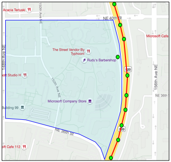

<!--
CO_OP_TRANSLATOR_METADATA:
{
  "original_hash": "078ae664c7b686bf069545e9a5fc95b2",
  "translation_date": "2025-08-25T00:36:23+00:00",
  "source_file": "3-transport/lessons/4-geofences/README.md",
  "language_code": "zh"
}
-->
# 地理围栏


> 手绘笔记由 [Nitya Narasimhan](https://github.com/nitya) 提供。点击图片查看大图。

这段视频概述了地理围栏以及如何在 Azure Maps 中使用它们，这是本课将要讲解的主题：

[](https://www.youtube.com/watch?v=nsrgYhaYNVY)

> 🎥 点击上方图片观看视频

## 课前测验

[课前测验](https://black-meadow-040d15503.1.azurestaticapps.net/quiz/27)

## 简介

在前面三节课中，你已经使用物联网技术定位了从农场运送农产品到加工中心的卡车。你捕获了 GPS 数据，将其发送到云端存储，并在地图上进行了可视化。接下来的步骤是提高供应链效率：当卡车即将到达加工中心时收到警报，以便卸货所需的工作人员可以提前准备好叉车和其他设备。一旦车辆到达，他们可以快速卸货，从而避免支付卡车和司机的等待费用。

在本课中，你将学习地理围栏——定义的地理空间区域，例如距离加工中心 2 公里车程范围内的区域，以及如何测试 GPS 坐标是否在地理围栏内或外，从而判断 GPS 传感器是否到达或离开某个区域。

本课将涵盖以下内容：

* [什么是地理围栏](../../../../../3-transport/lessons/4-geofences)
* [定义地理围栏](../../../../../3-transport/lessons/4-geofences)
* [测试点是否在地理围栏内](../../../../../3-transport/lessons/4-geofences)
* [在无服务器代码中使用地理围栏](../../../../../3-transport/lessons/4-geofences)

> 🗑 这是本项目的最后一课，因此在完成本课和作业后，不要忘记清理你的云服务。你需要这些服务来完成作业，所以请确保先完成作业。
>
> 如果需要，请参考[清理项目指南](../../../clean-up.md)获取相关说明。

## 什么是地理围栏

地理围栏是一个虚拟的边界，用于定义现实世界中的地理区域。地理围栏可以是以点和半径定义的圆形（例如围绕某建筑物 100 米范围的圆），也可以是覆盖某个区域的多边形，例如学校区域、城市边界或大学/办公园区。


> 💁 你可能已经在不知不觉中使用过地理围栏。如果你曾使用 iOS 提醒事项应用或 Google Keep 设置基于位置的提醒，那么你就使用过地理围栏。这些应用会根据提供的位置设置地理围栏，并在你的手机进入地理围栏时提醒你。

以下是一些需要知道车辆是否在地理围栏内或外的原因：

* **卸货准备** - 收到车辆到达现场的通知可以让工作人员提前准备卸货，从而减少车辆等待时间。这可以让司机在一天内完成更多的交付，减少等待时间。
* **税务合规** - 一些国家（如新西兰）对柴油车辆在公共道路上行驶的里程征收道路税，税额基于车辆重量。使用地理围栏可以区分车辆在公共道路和私人道路（如农场或伐木区）上的行驶里程。
* **防盗监控** - 如果车辆应该只停留在某个区域（如农场），但离开了地理围栏，则可能被盗。
* **位置合规** - 工作场所、农场或工厂的某些区域可能禁止特定车辆进入，例如防止携带人工肥料和农药的车辆进入种植有机农产品的田地。如果进入地理围栏，则车辆不符合规定，司机可以收到通知。

✅ 你能想到其他地理围栏的用途吗？

Azure Maps（你在上一课中用来可视化 GPS 数据的服务）允许你定义地理围栏，并测试某个点是否在地理围栏内或外。

## 定义地理围栏

地理围栏使用 GeoJSON 定义，与上一课中添加到地图上的点相同。不过，这次不是 `Point` 值的 `FeatureCollection`，而是包含 `Polygon` 的 `FeatureCollection`。

```json
{
   "type": "FeatureCollection",
   "features": [
     {
       "type": "Feature",
       "geometry": {
         "type": "Polygon",
         "coordinates": [
           [
             [
               -122.13393688201903,
               47.63829579223815
             ],
             [
               -122.13389128446579,
               47.63782047131512
             ],
             [
               -122.13240802288054,
               47.63783312249837
             ],
             [
               -122.13238388299942,
               47.63829037035086
             ],
             [
               -122.13393688201903,
               47.63829579223815
             ]
           ]
         ]
       },
       "properties": {
         "geometryId": "1"
       }
     }
   ]
}
```

多边形的每个点由一个经度和纬度对组成，并以数组形式定义，这些点的数组被设置为 `coordinates`。在上一课的 `Point` 中，`coordinates` 是一个包含两个值（纬度和经度）的数组，而在 `Polygon` 中，它是一个包含多个数组的数组，每个数组包含两个值（经度和纬度）。

> 💁 请记住，GeoJSON 使用 `经度, 纬度` 的顺序，而不是 `纬度, 经度`。

多边形坐标数组的条目数总是比多边形的点数多 1，最后一个条目与第一个条目相同，用于闭合多边形。例如，对于一个矩形，会有 5 个点。


在上图中，有一个矩形。多边形坐标从左上角的 47,-122 开始，然后向右移动到 47,-121，再向下到 46,-121，然后向左到 46,-122，最后回到起点 47,-122。这样多边形就有 5 个点：左上角、右上角、右下角、左下角，以及闭合的左上角。

✅ 尝试创建一个围绕你家或学校的 GeoJSON 多边形。可以使用 [GeoJSON.io](https://geojson.io/) 这样的工具。

### 任务 - 定义地理围栏

要在 Azure Maps 中使用地理围栏，首先需要将其上传到你的 Azure Maps 账户。一旦上传，你将获得一个唯一的 ID，用于测试点是否在地理围栏内。要将地理围栏上传到 Azure Maps，你需要使用 Maps Web API。可以使用名为 [curl](https://curl.se) 的工具调用 Azure Maps Web API。

> 🎓 Curl 是一个命令行工具，用于对 Web 端点发起请求。

1. 如果你使用的是 Linux、macOS 或较新的 Windows 10 版本，你可能已经安装了 curl。运行以下命令检查：

    ```sh
    curl --version
    ```

    如果没有看到 curl 的版本信息，你需要从 [curl 下载页面](https://curl.se/download.html) 安装它。

    > 💁 如果你熟悉 Postman，也可以选择使用它。

1. 创建一个包含多边形的 GeoJSON 文件。你将使用你的 GPS 传感器测试它，因此请围绕你当前的位置创建一个多边形。你可以手动编辑上面提供的 GeoJSON 示例，或者使用 [GeoJSON.io](https://geojson.io/) 这样的工具。

    GeoJSON 需要包含一个 `FeatureCollection`，其中包含一个 `geometry` 类型为 `Polygon` 的 `Feature`。

    你**必须**在 `geometry` 元素同级添加一个 `properties` 元素，并在其中包含一个 `geometryId`：

    ```json
    "properties": {
        "geometryId": "1"
    }
    ```

    如果你使用 [GeoJSON.io](https://geojson.io/)，则需要手动将此项添加到空的 `properties` 元素中，可以在下载 JSON 文件后添加，也可以在应用的 JSON 编辑器中添加。

    此 `geometryId` 在文件中必须是唯一的。你可以在同一个 GeoJSON 文件中的 `FeatureCollection` 中上传多个地理围栏，只要每个地理围栏都有不同的 `geometryId`。如果从不同的文件在不同时间上传，多边形可以有相同的 `geometryId`。

1. 将此文件保存为 `geofence.json`，并在终端或控制台中导航到文件保存的位置。

1. 运行以下 curl 命令创建地理围栏：

    ```sh
    curl --request POST 'https://atlas.microsoft.com/mapData/upload?api-version=1.0&dataFormat=geojson&subscription-key=<subscription_key>' \
         --header 'Content-Type: application/json' \
         --include \
         --data @geofence.json
    ```

    将 URL 中的 `<subscription_key>` 替换为你的 Azure Maps 账户的 API 密钥。

    该 URL 使用 `https://atlas.microsoft.com/mapData/upload` API 上传地图数据。调用中包含一个 `api-version` 参数，用于指定使用的 Azure Maps API 版本，以便 API 随时间变化但保持向后兼容。上传的数据格式设置为 `geojson`。

    这将运行 POST 请求上传 API，并返回一组响应头，其中包括一个名为 `location` 的头：

    ```output
    content-type: application/json
    location: https://us.atlas.microsoft.com/mapData/operations/1560ced6-3a80-46f2-84b2-5b1531820eab?api-version=1.0
    x-ms-azuremaps-region: West US 2
    x-content-type-options: nosniff
    strict-transport-security: max-age=31536000; includeSubDomains
    x-cache: CONFIG_NOCACHE
    date: Sat, 22 May 2021 21:34:57 GMT
    content-length: 0
    ```

    > 🎓 调用 Web 端点时，可以通过在 URL 后添加 `?` 和键值对（如 `key=value`）传递参数，多个键值对用 `&` 分隔。

1. Azure Maps 不会立即处理此请求，因此你需要检查上传请求是否完成。使用 `location` 头中给出的 URL 进行 GET 请求以查看状态。你需要在 `location` URL 的末尾添加你的订阅密钥，格式为 `&subscription-key=<subscription_key>`，将 `<subscription_key>` 替换为你的 Azure Maps 账户的 API 密钥。运行以下命令：

    ```sh
    curl --request GET '<location>&subscription-key=<subscription_key>'
    ```

    将 `<location>` 替换为 `location` 头的值，将 `<subscription_key>` 替换为你的 Azure Maps 账户的 API 密钥。

1. 检查响应中的 `status` 值。如果不是 `Succeeded`，请等待一分钟后重试。

1. 一旦状态返回为 `Succeeded`，查看响应中的 `resourceLocation`。其中包含 GeoJSON 对象的唯一 ID（称为 UDID）。UDID 是 `metadata/` 之后的值，不包括 `api-version`。例如，如果 `resourceLocation` 是：

    ```json
    {
      "resourceLocation": "https://us.atlas.microsoft.com/mapData/metadata/7c3776eb-da87-4c52-ae83-caadf980323a?api-version=1.0"
    }
    ```

    那么 UDID 将是 `7c3776eb-da87-4c52-ae83-caadf980323a`。

    保存此 UDID，因为你需要它来测试地理围栏。

## 测试点是否在地理围栏内

一旦多边形上传到 Azure Maps，你可以测试某个点是否在地理围栏内或外。通过 Web API 请求传递地理围栏的 UDID，以及要测试点的纬度和经度即可。

在发起此请求时，你还可以传递一个名为 `searchBuffer` 的值。此值用于指定返回结果的精确度。原因是 GPS 并不完全准确，有时位置可能会偏差几米甚至更多。默认的搜索缓冲区为 50 米，但你可以设置 0 米到 500 米之间的值。

API 调用返回的结果中包含一个 `distance` 值，表示到地理围栏边缘最近点的距离。如果点在地理围栏外，则为正值；如果在地理围栏内，则为负值。如果此距离小于搜索缓冲区，则返回实际距离（以米为单位）；否则，值为 999 或 -999。999 表示点在地理围栏外超过搜索缓冲区，-999 表示点在地理围栏内超过搜索缓冲区。


在上图中，地理围栏有一个 50 米的搜索缓冲区。

* 地理围栏中心的一个点，远在搜索缓冲区内，距离为 **-999**
* 搜索缓冲区外的一个点，距离为 **999**
* 地理围栏内且在搜索缓冲区内的一个点，距离地理围栏 6 米，距离为 **6m**
* 地理围栏外且在搜索缓冲区内的一个点，距离地理围栏 39 米，距离为 **39m**

了解到地理围栏边缘的距离，并结合其他信息（如其他 GPS 读数、速度和道路数据）在基于车辆位置做出决策时非常重要。

例如，假设 GPS 读数显示车辆沿着一条道路行驶，而这条道路最终靠近地理围栏。如果单个 GPS 值不准确，将车辆定位在地理围栏内，尽管没有车辆通行的入口，那么可以忽略该值。


在上图中，微软园区的一部分被设置了地理围栏。红线表示一辆卡车沿着520公路行驶，圆点表示GPS读数。大多数读数是准确的，沿着520公路，但有一个不准确的读数显示在地理围栏内。这个读数显然是错误的——卡车不可能突然从520公路转入园区，然后又回到520公路。检查地理围栏的代码需要在处理地理围栏测试结果之前考虑之前的读数。

✅ 你需要检查哪些额外的数据来判断一个GPS读数是否可以被认为是正确的？

### 任务 - 测试点是否在地理围栏内

1. 首先构建用于Web API查询的URL。格式如下：

    ```output
    https://atlas.microsoft.com/spatial/geofence/json?api-version=1.0&deviceId=gps-sensor&subscription-key=<subscription-key>&udid=<UDID>&lat=<lat>&lon=<lon>
    ```

    将 `<subscription_key>` 替换为你的Azure Maps账户的API密钥。

    将 `<UDID>` 替换为上一任务中地理围栏的UDID。

    将 `<lat>` 和 `<lon>` 替换为你想测试的纬度和经度。

    这个URL使用 `https://atlas.microsoft.com/spatial/geofence/json` API来查询使用GeoJSON定义的地理围栏。它针对 `1.0` API版本。`deviceId` 参数是必需的，应该是提供纬度和经度的设备名称。

    默认搜索缓冲区是50米，你可以通过传递额外的参数 `searchBuffer=<distance>` 来更改，将 `<distance>` 设置为以米为单位的搜索缓冲距离，范围为0到500。

1. 使用curl对该URL发起GET请求：

    ```sh
    curl --request GET '<URL>'
    ```

    > 💁 如果你收到响应代码 `BadRequest`，并伴有以下错误：
    >
    > ```output
    > Invalid GeoJSON: All feature properties should contain a geometryId, which is used for identifying the geofence.
    > ```
    >
    > 那么你的GeoJSON缺少 `properties` 部分中的 `geometryId`。你需要修复你的GeoJSON，然后重复上述步骤重新上传并获取新的UDID。

1. 响应将包含一个 `geometries` 列表，每个几何体对应于用于创建地理围栏的GeoJSON中定义的多边形。每个几何体有三个相关字段：`distance`、`nearestLat` 和 `nearestLon`。

    ```output
    {
        "geometries": [
            {
                "deviceId": "gps-sensor",
                "udId": "7c3776eb-da87-4c52-ae83-caadf980323a",
                "geometryId": "1",
                "distance": 999.0,
                "nearestLat": 47.645875,
                "nearestLon": -122.142713
            }
        ],
        "expiredGeofenceGeometryId": [],
        "invalidPeriodGeofenceGeometryId": []
    }
    ```

    * `nearestLat` 和 `nearestLon` 是地理围栏边缘上最接近测试位置的点的纬度和经度。

    * `distance` 是测试位置到地理围栏边缘最近点的距离。负数表示在地理围栏内，正数表示在地理围栏外。这个值将小于50（默认搜索缓冲区），或999。

1. 使用地理围栏内外的多个位置重复此操作。

## 从无服务器代码中使用地理围栏

现在你可以为你的Functions应用添加一个新的触发器，用于测试IoT Hub GPS事件数据是否在地理围栏内。

### 消费组

正如你在之前的课程中记得的，IoT Hub允许你重播已接收但未处理的事件。但如果多个触发器连接会发生什么？它如何知道哪个触发器处理了哪些事件？

答案是它无法知道！因此，你可以定义多个独立的连接来读取事件，每个连接可以管理未读消息的重播。这些被称为*消费组*。当你连接到端点时，可以指定你想连接的消费组。应用程序的每个组件将连接到不同的消费组。


理论上，每个消费组最多可以连接5个应用程序，它们都会在消息到达时接收消息。最佳实践是每个消费组只允许一个应用程序访问，以避免重复处理消息，并确保在重启时所有排队的消息都能正确处理。例如，如果你在本地启动了Functions应用，同时在云端运行，它们都会处理消息，导致存储账户中存储重复的blob。

如果你查看之前课程中创建的IoT Hub触发器的 `function.json` 文件，你会看到事件中心触发器绑定部分中的消费组：

```json
"consumerGroup": "$Default"
```

当你创建一个IoT Hub时，默认会创建 `$Default` 消费组。如果你想添加额外的触发器，可以使用新的消费组。

> 💁 在本课程中，你将使用一个不同的函数来测试地理围栏，而不是存储GPS数据的函数。这是为了展示如何使用消费组并分离代码，使其更易于阅读和理解。在生产应用中，有许多方法可以架构这一点——将两者放在一个函数中，使用存储账户上的触发器运行一个函数来检查地理围栏，或使用多个函数。没有“正确的方法”，这取决于你的应用程序的其他部分和需求。

### 任务 - 创建一个新的消费组

1. 运行以下命令为你的IoT Hub创建一个名为 `geofence` 的新消费组：

    ```sh
    az iot hub consumer-group create --name geofence \
                                     --hub-name <hub_name>
    ```

    将 `<hub_name>` 替换为你为IoT Hub使用的名称。

1. 如果你想查看IoT Hub的所有消费组，运行以下命令：

    ```sh
    az iot hub consumer-group list --output table \
                                   --hub-name <hub_name>
    ```

    将 `<hub_name>` 替换为你为IoT Hub使用的名称。这将列出所有消费组。

    ```output
    Name      ResourceGroup
    --------  ---------------
    $Default  gps-sensor
    geofence  gps-sensor
    ```

> 💁 在之前的课程中运行IoT Hub事件监视器时，它连接到了 `$Default` 消费组。这就是为什么你不能同时运行事件监视器和事件触发器。如果你想同时运行两者，可以为所有Functions应用使用其他消费组，并保留 `$Default` 用于事件监视器。

### 任务 - 创建一个新的IoT Hub触发器

1. 为你在之前课程中创建的 `gps-trigger` Functions应用添加一个新的IoT Hub事件触发器。将此函数命名为 `geofence-trigger`。

    > ⚠️ 如果需要，可以参考[项目2，课程5中创建IoT Hub事件触发器的说明](../../../2-farm/lessons/5-migrate-application-to-the-cloud/README.md#create-an-iot-hub-event-trigger)。

1. 在 `function.json` 文件中配置IoT Hub连接字符串。`local.settings.json` 在Functions应用中的所有触发器之间共享。

1. 更新 `function.json` 文件中 `consumerGroup` 的值以引用新的 `geofence` 消费组：

    ```json
    "consumerGroup": "geofence"
    ```

1. 你需要在此触发器中使用Azure Maps账户的订阅密钥，因此在 `local.settings.json` 文件中添加一个名为 `MAPS_KEY` 的新条目。

1. 运行Functions应用以确保它正在连接并处理消息。之前课程中的 `iot-hub-trigger` 也会运行并将blob上传到存储。

    > 为避免存储账户中出现重复的GPS读数，你可以停止在云端运行的Functions应用。为此，请使用以下命令：
    >
    > ```sh
    > az functionapp stop --resource-group gps-sensor \
    >                     --name <functions_app_name>
    > ```
    >
    > 将 `<functions_app_name>` 替换为你为Functions应用使用的名称。
    >
    > 稍后可以使用以下命令重新启动：
    >
    > ```sh
    > az functionapp start --resource-group gps-sensor \
    >                     --name <functions_app_name>
    > ```
    >
    > 将 `<functions_app_name>` 替换为你为Functions应用使用的名称。

### 任务 - 从触发器测试地理围栏

在本课程的前面部分，你使用curl查询了地理围栏以查看一个点是否位于内部或外部。你可以从触发器内部发起类似的Web请求。

1. 要查询地理围栏，你需要它的UDID。在 `local.settings.json` 文件中添加一个名为 `GEOFENCE_UDID` 的新条目，并设置该值。

1. 打开新 `geofence-trigger` 触发器的 `__init__.py` 文件。

1. 在文件顶部添加以下导入：

    ```python
    import json
    import os
    import requests
    ```

    `requests` 包允许你发起Web API调用。Azure Maps没有Python SDK，你需要通过Web API调用来从Python代码中使用它。

1. 在 `main` 方法的开头添加以下两行代码以获取Maps订阅密钥：

    ```python
    maps_key = os.environ['MAPS_KEY']
    geofence_udid = os.environ['GEOFENCE_UDID']    
    ```

1. 在 `for event in events` 循环中，添加以下代码以从每个事件中获取纬度和经度：

    ```python
    event_body = json.loads(event.get_body().decode('utf-8'))
    lat = event_body['gps']['lat']
    lon = event_body['gps']['lon']
    ```

    此代码将事件主体中的JSON转换为字典，然后从 `gps` 字段中提取 `lat` 和 `lon`。

1. 使用 `requests` 时，与使用curl构建长URL不同，你可以仅使用URL部分并将参数作为字典传递。添加以下代码以定义要调用的URL并配置参数：

    ```python
    url = 'https://atlas.microsoft.com/spatial/geofence/json'

    params = {
        'api-version': 1.0,
        'deviceId': 'gps-sensor',
        'subscription-key': maps_key,
        'udid' : geofence_udid,
        'lat' : lat,
        'lon' : lon
    }
    ```

    `params` 字典中的项将与通过curl调用Web API时使用的键值对匹配。

1. 添加以下代码行以调用Web API：

    ```python
    response = requests.get(url, params=params)
    response_body = json.loads(response.text)
    ```

    此代码调用URL并传递参数，返回一个响应对象。

1. 在此代码下方添加以下代码：

    ```python
    distance = response_body['geometries'][0]['distance']

    if distance == 999:
        logging.info('Point is outside geofence')
    elif distance > 0:
        logging.info(f'Point is just outside geofence by a distance of {distance}m')
    elif distance == -999:
        logging.info(f'Point is inside geofence')
    else:
        logging.info(f'Point is just inside geofence by a distance of {distance}m')
    ```

    此代码假设只有一个几何体，并从该几何体中提取距离。然后根据距离记录不同的消息。

1. 运行此代码。你将在日志输出中看到GPS坐标是否在地理围栏内或外，如果点在50米范围内，还会显示距离。使用不同的地理围栏测试此代码，根据你的GPS传感器的位置尝试移动传感器（例如通过手机WiFi连接，或在虚拟IoT设备上使用不同的坐标）以查看变化。

1. 准备好后，将此代码部署到云端的Functions应用。别忘了部署新的应用程序设置。

    > ⚠️ 如果需要，可以参考[项目2，课程5中上传应用程序设置的说明](../../../2-farm/lessons/5-migrate-application-to-the-cloud/README.md#task---upload-your-application-settings)。

    > ⚠️ 如果需要，可以参考[项目2，课程5中部署Functions应用的说明](../../../2-farm/lessons/5-migrate-application-to-the-cloud/README.md#task---deploy-your-functions-app-to-the-cloud)。

> 💁 你可以在 [code/functions](../../../../../3-transport/lessons/4-geofences/code/functions) 文件夹中找到此代码。

---

## 🚀 挑战

在本课程中，你使用一个包含单个多边形的GeoJSON文件添加了一个地理围栏。你可以同时上传多个多边形，只要它们在 `properties` 部分中有不同的 `geometryId` 值。

尝试上传一个包含多个多边形的GeoJSON文件，并调整你的代码以找到GPS坐标最接近或位于哪个多边形内。

## 课后测验

[课后测验](https://black-meadow-040d15503.1.azurestaticapps.net/quiz/28)

## 复习与自学

* 阅读更多关于地理围栏及其一些使用案例的信息：[维基百科上的地理围栏页面](https://en.wikipedia.org/wiki/Geo-fence)。
* 阅读更多关于Azure Maps地理围栏API的信息：[Microsoft Azure Maps Spatial - Get Geofence文档](https://docs.microsoft.com/rest/api/maps/spatial/getgeofence?WT.mc_id=academic-17441-jabenn)。
* 阅读更多关于消费组的信息：[Azure Event Hubs中的功能和术语 - Microsoft文档上的事件消费者部分](https://docs.microsoft.com/azure/event-hubs/event-hubs-features?WT.mc_id=academic-17441-jabenn#event-consumers)。

## 作业

[使用Twilio发送通知](assignment.md)

**免责声明**：  
本文档使用AI翻译服务[Co-op Translator](https://github.com/Azure/co-op-translator)进行翻译。尽管我们努力确保翻译的准确性，但请注意，自动翻译可能包含错误或不准确之处。应以原文档的原始语言版本为权威来源。对于关键信息，建议使用专业人工翻译。我们对因使用本翻译而引起的任何误解或误读不承担责任。