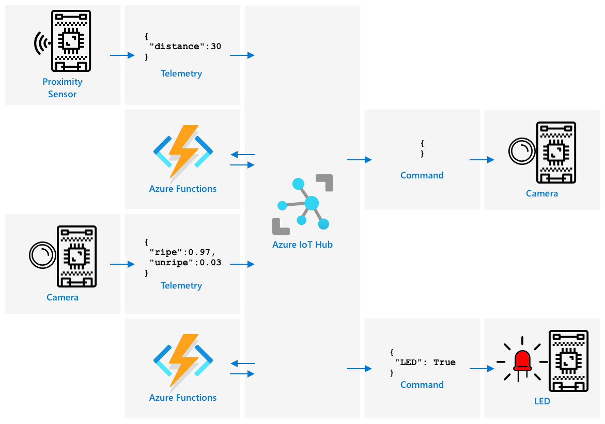

<!--
CO_OP_TRANSLATOR_METADATA:
{
  "original_hash": "f74f4ccb61f00e5f7e9f49c3ed416e36",
  "translation_date": "2025-08-24T21:48:17+00:00",
  "source_file": "4-manufacturing/lessons/4-trigger-fruit-detector/README.md",
  "language_code": "zh"
}
-->
# 从传感器触发水果质量检测


> 手绘笔记由 [Nitya Narasimhan](https://github.com/nitya) 提供。点击图片查看更大版本。

## 课前测验

[课前测验](https://black-meadow-040d15503.1.azurestaticapps.net/quiz/35)

## 简介

一个物联网应用不仅仅是单个设备捕获数据并发送到云端，通常是多个设备协同工作，通过传感器从物理世界捕获数据，根据这些数据做出决策，并通过执行器或可视化与物理世界进行交互。

在本课中，您将学习如何设计复杂的物联网应用，包括整合多个传感器、多个云服务来分析和存储数据，以及通过执行器展示响应。您将学习如何设计一个水果质量控制系统原型，包括使用接近传感器触发物联网应用，以及该原型的架构。

本课内容包括：

* [设计复杂的物联网应用](../../../../../4-manufacturing/lessons/4-trigger-fruit-detector)
* [设计水果质量控制系统](../../../../../4-manufacturing/lessons/4-trigger-fruit-detector)
* [从传感器触发水果质量检测](../../../../../4-manufacturing/lessons/4-trigger-fruit-detector)
* [水果质量检测器使用的数据](../../../../../4-manufacturing/lessons/4-trigger-fruit-detector)
* [使用开发设备模拟多个物联网设备](../../../../../4-manufacturing/lessons/4-trigger-fruit-detector)
* [进入生产阶段](../../../../../4-manufacturing/lessons/4-trigger-fruit-detector)

> 🗑 这是本项目的最后一课，因此在完成本课和作业后，请记得清理您的云服务。您需要这些服务来完成作业，因此请确保先完成作业。
>
> 如果需要，请参考 [清理项目指南](../../../clean-up.md) 了解如何操作。

## 设计复杂的物联网应用

物联网应用由许多组件组成。这包括各种设备和互联网服务。

物联网应用可以描述为 *设备* 发送数据生成 *洞察*，这些 *洞察* 生成 *行动* 来改善业务或流程。例如，一个引擎（设备）发送温度数据。这些数据用于评估引擎是否表现正常（洞察）。洞察用于主动优先安排引擎的维护计划（行动）。

* 不同的设备收集不同的数据。
* 物联网服务对这些数据进行分析，有时还会结合其他来源的数据。
* 这些洞察驱动行动，包括控制设备中的执行器或可视化数据。

### 参考物联网架构


上图展示了一个参考物联网架构。

> 🎓 *参考架构* 是一个示例架构，您可以在设计新系统时作为参考。在这种情况下，如果您正在构建一个新的物联网系统，可以遵循参考架构，并根据需要替换自己的设备和服务。

* **设备** 是通过传感器收集数据的设备，可能与边缘服务交互以解释数据，例如使用图像分类器解释图像数据。设备的数据被发送到物联网服务。
* **洞察** 来自无服务器应用程序，或存储数据上的分析。
* **行动** 可以是发送给设备的命令，或数据的可视化以帮助人类做出决策。


上图展示了这些课程中涉及的一些组件和服务，以及它们如何在参考物联网架构中链接在一起。

* **设备** - 您已经编写了设备代码来捕获传感器数据，并使用 Custom Vision 在云端和边缘设备上分析图像。这些数据被发送到 IoT Hub。
* **洞察** - 您已经使用 Azure Functions 响应发送到 IoT Hub 的消息，并将数据存储在 Azure Storage 中以供后续分析。
* **行动** - 您已经根据云端的决策控制执行器，并通过发送命令到设备控制它们，同时使用 Azure Maps 可视化数据。

✅ 想一想您使用过的其他物联网设备，例如智能家居设备。该设备及其软件涉及哪些设备、洞察和行动？

这种模式可以根据需要扩展到任意大小，添加更多设备和服务。

### 数据和安全

在定义系统架构时，您需要不断考虑数据和安全性。

* 您的设备发送和接收什么数据？
* 如何保护和加密这些数据？
* 如何控制对设备和云服务的访问？

✅ 想一想您拥有的任何物联网设备的数据安全性。这些数据中有多少是个人数据，需要在传输和存储时保持私密？哪些数据不应该被存储？

## 设计水果质量控制系统

现在让我们将设备、洞察和行动的概念应用到水果质量检测器上，设计一个更大的端到端应用。

假设您被要求构建一个水果质量检测器，用于加工厂。水果通过传送带系统运输，目前员工需要手动检查水果并移除任何未成熟的水果。为了降低成本，工厂老板希望实现自动化。

✅ 随着物联网（以及技术总体发展）的兴起，许多手动工作正在被机器取代。做一些研究：预计有多少工作会因物联网而消失？又会创造多少新的工作来构建物联网设备？

您需要构建一个系统，水果到达传送带时被检测到，然后拍照并使用运行在边缘的 AI 模型进行检查。结果被发送到云端存储，如果水果未成熟，则发出通知以便移除未成熟的水果。

|   |   |
| - | - |
| **设备** | 检测水果到达传送带<br>拍照并分类水果<br>运行分类器的边缘设备<br>通知未成熟水果的设备 |
| **洞察** | 决定检查水果的成熟度<br>存储成熟度分类的结果<br>确定是否需要发出未成熟水果的警报 |
| **行动** | 发送命令到设备拍摄水果照片并使用图像分类器检查<br>发送命令到设备发出未成熟水果的警报 |

### 应用原型设计


上图展示了该原型应用的参考架构。

* 带有接近传感器的物联网设备检测到水果到达。它向云端发送消息，表示检测到水果。
* 云端的无服务器应用向另一设备发送命令，拍摄照片并进行分类。
* 带有摄像头的物联网设备拍摄照片并将其发送到运行在边缘的图像分类器。结果随后发送到云端。
* 云端的无服务器应用存储这些信息，以便稍后分析未成熟水果的百分比。如果水果未成熟，它会向另一个带有 LED 的物联网设备发送命令，通知工厂工人有未成熟水果。

> 💁 整个物联网应用可以作为单个设备实现，所有启动图像分类和控制 LED 的逻辑都内置其中。它可以使用 IoT Hub 仅跟踪检测到的未成熟水果数量并配置设备。在本课中，它被扩展以展示大规模物联网应用的概念。

对于原型，您将在单个设备上实现所有这些功能。如果您使用的是微控制器，则需要使用单独的边缘设备运行图像分类器。您已经学习了构建这些功能所需的大部分内容。

## 从传感器触发水果质量检测

物联网设备需要某种触发器来指示水果准备好进行分类。一个触发器可以是通过测量传感器到水果的距离来判断水果是否在传送带上的正确位置。


接近传感器可以用来测量传感器到物体的距离。它们通常发射电磁辐射束，例如激光束或红外光，然后检测从物体反射回来的辐射。发送激光束和信号反射回来的时间间隔可以用来计算到传感器的距离。

> 💁 您可能已经使用过接近传感器而没有意识到它的存在。大多数智能手机在您将它们贴近耳朵时会关闭屏幕，以防止您用耳垂意外结束通话。这是通过接近传感器实现的，它在通话期间检测到屏幕附近的物体并禁用触摸功能，直到手机离开一定距离。

### 任务 - 使用距离传感器触发水果质量检测

按照相关指南，使用接近传感器检测物体并触发您的物联网设备：

* [Arduino - Wio Terminal](wio-terminal-proximity.md)
* [单板计算机 - Raspberry Pi](pi-proximity.md)
* [单板计算机 - 虚拟设备](virtual-device-proximity.md)

## 水果质量检测器使用的数据

原型水果检测器有多个组件相互通信。



* 接近传感器测量到水果的距离并将数据发送到 IoT Hub
* 控制摄像头的命令从 IoT Hub 发送到摄像头设备
* 图像分类的结果被发送到 IoT Hub
* 控制 LED 的命令从 IoT Hub 发送到带有 LED 的设备，以警告未成熟水果

在构建应用之前，最好提前定义这些消息的结构。

> 💁 几乎每个有经验的开发者都曾在职业生涯中花费数小时、数天甚至数周追踪由于发送的数据与预期不一致而导致的错误。

例如 - 如果您发送温度信息，如何定义 JSON？您可以有一个字段叫 `temperature`，或者使用常见的缩写 `temp`。

```json
{
    "temperature": 20.7
}
```

与：

```json
{
    "temp": 20.7
}
```

您还需要考虑单位 - 温度是以 °C 还是 °F 表示？如果您使用的是消费者设备，并且他们更改了显示单位，您需要确保发送到云端的单位保持一致。

✅ 做一些研究：单位问题如何导致价值 1.25 亿美元的火星气候探测器坠毁？

思考水果质量检测器发送的数据。您如何定义每条消息？在哪里分析数据并决定发送哪些数据？

例如 - 使用接近传感器触发图像分类。物联网设备测量距离，但决策在哪里做出？设备是否决定水果足够接近并发送消息告诉 IoT Hub 触发分类？还是发送距离测量数据并让 IoT Hub 决定？

这些问题的答案是 - 视情况而定。每个用例都不同，这就是为什么作为物联网开发者，您需要了解您正在构建的系统、它的使用方式以及检测到的数据。

* 如果决策由 IoT Hub 做出，您需要发送多个距离测量数据。
* 如果发送过多消息，会增加 IoT Hub 的成本，以及物联网设备所需的带宽（尤其是在拥有数百万设备的工厂中）。这也可能会减慢设备的速度。
* 如果在设备上做出决策，您需要提供一种配置设备的方法以微调机器。

## 使用开发设备模拟多个物联网设备

为了构建您的原型，您需要让您的物联网开发套件像多个设备一样工作，发送遥测数据并响应命令。

### 在 Raspberry Pi 或虚拟物联网硬件上模拟多个物联网设备

使用单板计算机（如 Raspberry Pi）时，您可以同时运行多个应用程序。这意味着您可以通过创建多个应用程序来模拟多个物联网设备，每个应用程序代表一个“物联网设备”。例如，您可以将每个设备实现为一个单独的 Python 文件，并在不同的终端会话中运行它们。
💁 请注意，当多个应用程序同时运行并访问某些硬件时，可能会导致硬件无法正常工作。
### 在微控制器上模拟多个设备

在微控制器上模拟多个设备会更复杂一些。与单板计算机不同，微控制器无法同时运行多个应用程序，必须将所有独立物联网设备的逻辑整合到一个应用程序中。

以下是一些简化此过程的建议：

* 为每个物联网设备创建一个或多个类，例如名为 `DistanceSensor`、`ClassifierCamera`、`LEDController` 的类。每个类可以有自己的 `setup` 和 `loop` 方法，由主程序的 `setup` 和 `loop` 函数调用。
* 在一个地方处理所有命令，并根据需要将命令分发到相关的设备类。
* 在主 `loop` 函数中，需要考虑每个设备的时间安排。例如，如果有一个设备类需要每 10 秒处理一次，另一个需要每 1 秒处理一次，那么在主 `loop` 函数中使用 1 秒的延迟。每次 `loop` 调用都会触发需要每秒处理的设备的相关代码，并使用一个计数器记录循环次数，当计数器达到 10 时处理另一个设备（然后重置计数器）。

## 进入生产阶段

原型将成为最终生产系统的基础。在进入生产阶段时，一些不同之处包括：

* 工业级组件 - 使用能够承受工厂中的噪音、热量、振动和压力的硬件。
* 使用内部通信 - 一些组件会直接通信，避免通过云端中转，仅将数据发送到云端存储。这取决于工厂的设置，可以通过直接通信实现，或者通过使用网关设备在边缘运行部分物联网服务实现。
* 配置选项 - 每个工厂和使用场景都不同，因此硬件需要具备可配置性。例如，接近传感器可能需要在不同距离检测不同的水果。与其将触发分类的距离硬编码，不如通过云端（例如使用设备孪生）使其可配置。
* 自动化水果移除 - 不再使用 LED 提示水果未成熟，而是使用自动化设备将其移除。

✅ 做些研究：生产设备与开发套件还有哪些其他不同之处？

---

## 🚀 挑战

在本课中，你学习了一些关于如何设计物联网系统的概念。回想之前的项目，它们如何适配上面展示的参考架构？

选择一个之前的项目，思考如何设计一个更复杂的解决方案，将多个功能结合在一起，超越项目中所涵盖的内容。绘制架构图，并思考所需的所有设备和服务。

例如 - 一个车辆追踪设备，结合 GPS 和传感器来监控冷藏卡车的温度、发动机启停时间以及驾驶员身份。涉及哪些设备、服务、传输的数据以及安全和隐私的考虑？

## 课后测验

[课后测验](https://black-meadow-040d15503.1.azurestaticapps.net/quiz/36)

## 复习与自学

* 阅读更多关于物联网架构的内容，请参阅 [Microsoft Docs 上的 Azure IoT 参考架构文档](https://docs.microsoft.com/azure/architecture/reference-architectures/iot?WT.mc_id=academic-17441-jabenn)
* 阅读更多关于设备孪生的内容，请参阅 [Microsoft Docs 上的 IoT Hub 设备孪生文档](https://docs.microsoft.com/azure/iot-hub/iot-hub-devguide-device-twins?WT.mc_id=academic-17441-jabenn)
* 了解 OPC-UA，这是一种用于工业自动化的机器间通信协议，请参阅 [Wikipedia 上的 OPC-UA 页面](https://wikipedia.org/wiki/OPC_Unified_Architecture)

## 作业

[构建一个水果质量检测器](assignment.md)

**免责声明**：  
本文档使用AI翻译服务[Co-op Translator](https://github.com/Azure/co-op-translator)进行翻译。尽管我们努力确保翻译的准确性，但请注意，自动翻译可能包含错误或不准确之处。应以原文档的原始语言版本为权威来源。对于关键信息，建议使用专业人工翻译。我们对因使用本翻译而引起的任何误解或误读不承担责任。