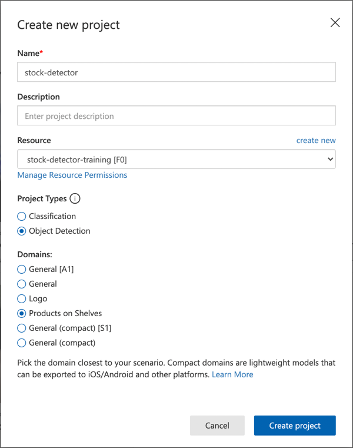

<!--
CO_OP_TRANSLATOR_METADATA:
{
  "original_hash": "8df310a42f902139a01417dacb1ffbef",
  "translation_date": "2025-08-24T21:14:49+00:00",
  "source_file": "5-retail/lessons/1-train-stock-detector/README.md",
  "language_code": "zh"
}
-->
# 训练库存检测器

> 手绘笔记由 [Nitya Narasimhan](https://github.com/nitya) 提供。点击图片查看大图。

这段视频概述了 Azure Custom Vision 服务中的对象检测功能，这是本课将要介绍的服务。

> 🎥 点击上方图片观看视频

## 课前测验

[课前测验](https://black-meadow-040d15503.1.azurestaticapps.net/quiz/37)

## 简介

在之前的项目中，你使用了人工智能训练了一个图像分类器——一个可以判断图像中是否包含某些内容（例如成熟水果或未成熟水果）的模型。另一种可以用于图像的人工智能模型是对象检测。这些模型不是通过标签对图像进行分类，而是被训练来识别对象，并能够在图像中找到它们，不仅检测图像中是否存在对象，还能检测对象在图像中的位置。这使得你可以统计图像中的对象数量。

在本课中，你将学习对象检测，包括它在零售中的应用。你还将学习如何在云端训练一个对象检测器。

本课内容包括：

* [对象检测](../../../../../5-retail/lessons/1-train-stock-detector)
* [在零售中使用对象检测](../../../../../5-retail/lessons/1-train-stock-detector)
* [训练对象检测器](../../../../../5-retail/lessons/1-train-stock-detector)
* [测试你的对象检测器](../../../../../5-retail/lessons/1-train-stock-detector)
* [重新训练你的对象检测器](../../../../../5-retail/lessons/1-train-stock-detector)

## 对象检测

对象检测是通过人工智能检测图像中的对象。与上一项目中训练的图像分类器不同，对象检测不是预测整个图像的最佳标签，而是寻找图像中的一个或多个对象。

### 对象检测与图像分类的区别

图像分类是对整个图像进行分类——判断整个图像与每个标签匹配的概率。你会得到模型训练时使用的每个标签的概率。

在上面的例子中，两个图像使用一个训练过的模型进行分类，该模型可以分类腰果罐或番茄酱罐。第一个图像是一个腰果罐，图像分类器的结果如下：

| 标签            | 概率       |
| -------------- | ----------: |
| `腰果`         | 98.4%       |
| `番茄酱`       | 1.6%        |

第二个图像是一个番茄酱罐，结果如下：

| 标签            | 概率       |
| -------------- | ----------: |
| `腰果`         | 0.7%        |
| `番茄酱`       | 99.3%       |

你可以使用一个阈值百分比来预测图像中是什么。但如果图像中包含多个番茄酱罐，或者同时包含腰果罐和番茄酱罐呢？结果可能无法满足你的需求。这时对象检测就派上用场了。

对象检测是训练一个模型来识别对象。与其给模型提供包含对象的图像并告诉它每张图像是一个标签或另一个标签，不如突出图像中包含特定对象的部分并标记它。你可以在图像中标记单个对象或多个对象。这样模型就能学习对象本身的样子，而不仅仅是包含对象的图像的样子。

当你使用它来预测图像时，你不会得到标签和百分比的列表，而是得到检测到的对象的列表，包括它们的边界框和该对象与分配标签匹配的概率。

> 🎓 *边界框* 是围绕对象的框。

上图中包含一个腰果罐和三个番茄酱罐。对象检测器检测到了腰果罐，返回了包含腰果罐的边界框以及该边界框包含该对象的概率（此处为97.6%）。对象检测器还检测到了三个番茄酱罐，并提供了三个单独的边界框，每个检测到的罐子都有一个概率，表示该边界框包含一个番茄酱罐。

✅ 想一想你可能会用基于图像的人工智能模型来处理哪些不同场景。哪些场景需要分类，哪些需要对象检测？

### 对象检测的工作原理

对象检测使用复杂的机器学习模型。这些模型通过将图像划分为多个单元格，然后检查边界框的中心是否是与训练模型时使用的图像匹配的图像中心。你可以将其想象为在图像的不同部分运行图像分类器以寻找匹配。

> 💁 这是一个非常简化的描述。对象检测有许多技术，你可以在 [维基百科的对象检测页面](https://wikipedia.org/wiki/Object_detection) 上阅读更多相关内容。

有许多不同的模型可以进行对象检测。其中一个特别著名的模型是 [YOLO (You only look once)](https://pjreddie.com/darknet/yolo/)，它速度非常快，可以检测20种不同类别的对象，例如人、狗、瓶子和汽车。

✅ 阅读关于 YOLO 模型的内容：[pjreddie.com/darknet/yolo/](https://pjreddie.com/darknet/yolo/)

对象检测模型可以通过迁移学习重新训练以检测自定义对象。

## 在零售中使用对象检测

对象检测在零售中有多种用途，包括：

* **库存检查和计数** - 识别货架上的库存是否不足。如果库存过低，可以向员工或机器人发送通知以补货。
* **口罩检测** - 在公共卫生事件期间有口罩政策的商店中，对象检测可以识别佩戴口罩和未佩戴口罩的人。
* **自动结算** - 在自动化商店中检测从货架上取下的商品并正确结算给顾客。
* **危险检测** - 识别地板上的破损物品或洒落的液体，提醒清洁人员。

✅ 做一些研究：对象检测在零售中还有哪些其他应用场景？

## 训练对象检测器

你可以使用 Custom Vision 训练对象检测器，方法与训练图像分类器类似。

### 任务 - 创建对象检测器

1. 为此项目创建一个名为 `stock-detector` 的资源组。

1. 在 `stock-detector` 资源组中创建一个免费的 Custom Vision 训练资源和一个免费的 Custom Vision 预测资源。将它们命名为 `stock-detector-training` 和 `stock-detector-prediction`。

    > 💁 每个账户只能有一个免费的训练和预测资源，因此请确保清理了之前课程中的项目。

    > ⚠️ 如果需要，可以参考 [项目4，第1课中创建训练和预测资源的说明](../../../4-manufacturing/lessons/1-train-fruit-detector/README.md#task---create-a-cognitive-services-resource)。

1. 打开 [CustomVision.ai](https://customvision.ai) 的 Custom Vision 门户，并使用你的 Azure 账户关联的 Microsoft 账户登录。

1. 按照 Microsoft 文档中 [构建对象检测器快速入门的创建新项目部分](https://docs.microsoft.com/azure/cognitive-services/custom-vision-service/get-started-build-detector?WT.mc_id=academic-17441-jabenn#create-a-new-project) 的说明创建一个新的 Custom Vision 项目。用户界面可能会发生变化，这些文档始终是最新的参考。

    将你的项目命名为 `stock-detector`。

    创建项目时，请确保使用之前创建的 `stock-detector-training` 资源。选择 *对象检测* 项目类型，并选择 *货架上的商品* 域。

    

    ✅ *货架上的商品* 域专门用于检测货架上的库存。阅读更多关于不同域的信息，请参阅 [Microsoft Docs 中的选择域文档](https://docs.microsoft.com/azure/cognitive-services/custom-vision-service/select-domain?WT.mc_id=academic-17441-jabenn#object-detection)。

✅ 花些时间探索你的对象检测器的 Custom Vision 用户界面。

### 任务 - 训练你的对象检测器

要训练你的模型，你需要一组包含你想检测的对象的图像。

1. 收集包含要检测对象的图像。每个对象至少需要15张图像，这些图像需要从不同角度拍摄并在不同光线条件下拍摄，但越多越好。此对象检测器使用 *货架上的商品* 域，因此尽量将对象设置为货架上的样子。你还需要一些图像来测试模型。如果你要检测多个对象，你需要一些包含所有对象的测试图像。

    > 💁 包含多个不同对象的图像计入所有图像中对象的15张图像最低要求。

    图像应为 png 或 jpeg 格式，大小小于6MB。如果你使用 iPhone 创建图像，它们可能是高分辨率的 HEIC 图像，因此需要转换并可能缩小。图像越多越好，并且你应该有相似数量的成熟和未成熟对象。

    该模型专为货架上的商品设计，因此尽量在货架上拍摄对象的照片。

    你可以在 [images](../../../../../5-retail/lessons/1-train-stock-detector/images) 文件夹中找到一些腰果罐和番茄酱罐的示例图像供你使用。

1. 按照 Microsoft 文档中 [构建对象检测器快速入门的上传和标记图像部分](https://docs.microsoft.com/azure/cognitive-services/custom-vision-service/get-started-build-detector?WT.mc_id=academic-17441-jabenn#upload-and-tag-images) 的说明上传你的训练图像。根据你想检测的对象类型创建相关标签。

    

    绘制对象的边界框时，请尽量紧贴对象。标记所有图像可能需要一些时间，但工具会检测它认为是边界框的部分，从而加快速度。

    

    > 💁 如果你每个对象有超过15张图像，你可以在15张图像后进行训练，然后使用 **建议标签** 功能。此功能将使用训练过的模型检测未标记图像中的对象。你可以确认检测到的对象，或者拒绝并重新绘制边界框。这可以节省大量时间。

1. 按照 Microsoft 文档中 [构建对象检测器快速入门的训练检测器部分](https://docs.microsoft.com/azure/cognitive-services/custom-vision-service/get-started-build-detector?WT.mc_id=academic-17441-jabenn#train-the-detector) 的说明，使用标记的图像训练对象检测器。

    你将可以选择训练类型。选择 **快速训练**。

对象检测器将开始训练。训练完成需要几分钟时间。

## 测试你的对象检测器

一旦你的对象检测器训练完成，你可以通过提供新的图像来测试它是否能检测到对象。

### 任务 - 测试你的对象检测器

1. 使用 **快速测试** 按钮上传测试图像并验证对象是否被检测到。使用你之前创建的测试图像，而不是任何用于训练的图像。

    

1. 尝试所有你能获得的测试图像并观察概率。

## 重新训练你的对象检测器

当你测试你的对象检测器时，它可能不会给出你期望的结果，就像之前项目中的图像分类器一样。你可以通过使用错误的图像重新训练来改进你的对象检测器。

每次使用快速测试选项进行预测时，图像和结果都会被存储。你可以使用这些图像重新训练你的模型。

1. 使用 **预测** 标签找到你用于测试的图像。

1. 确认任何准确的检测，删除错误的检测并添加任何遗漏的对象。

1. 重新训练并重新测试模型。

---

## 🚀 挑战

如果你用对象检测器检测相似的物品，例如同品牌的番茄酱罐和切碎番茄罐，会发生什么？

如果你有任何相似的物品，尝试通过将它们的图像添加到你的对象检测器中进行测试。

## 课后测验
[课后测验](https://black-meadow-040d15503.1.azurestaticapps.net/quiz/38)

## 复习与自学

* 在训练目标检测器时，你会看到 *Precision*（精确率）、*Recall*（召回率）和 *mAP*（平均精度）等值，这些值用于评估所创建的模型。请阅读 [Microsoft 文档中“构建目标检测器快速入门”的评估检测器部分](https://docs.microsoft.com/azure/cognitive-services/custom-vision-service/get-started-build-detector?WT.mc_id=academic-17441-jabenn#evaluate-the-detector)，了解这些指标的含义。
* 在 [维基百科的目标检测页面](https://wikipedia.org/wiki/Object_detection) 上阅读更多关于目标检测的内容。

## 作业

[比较领域](assignment.md)

**免责声明**：  
本文档使用AI翻译服务 [Co-op Translator](https://github.com/Azure/co-op-translator) 进行翻译。虽然我们努力确保翻译的准确性，但请注意，自动翻译可能包含错误或不准确之处。原始语言的文档应被视为权威来源。对于重要信息，建议使用专业人工翻译。我们对因使用此翻译而产生的任何误解或误读不承担责任。